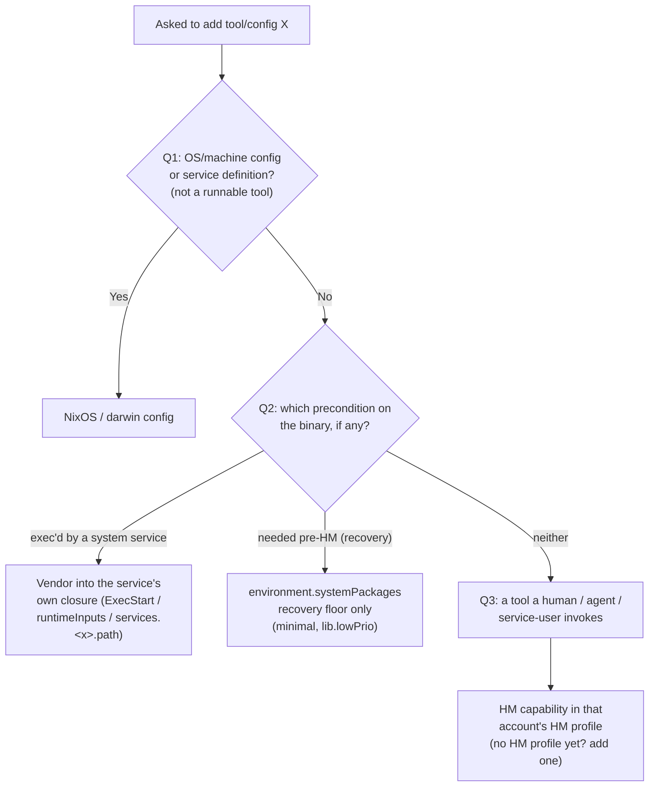

# System (NixOS/darwin) vs Home-Manager placement

The single source of truth for deciding whether a tool/package/config lives in the
**system layer** (NixOS/darwin) or in a **home-manager capability**. This is the
placement half of the Light capability model — see the `capability-model` skill for
the feature/capability/bundle layering this sits inside.

Answer the three questions in order and place accordingly. When auditing existing
config, anything beyond the recovery floor sitting in `environment.systemPackages` on
a host that has (or could have) an HM user is a violation to move.

Normative rules below use RFC-2119 keywords (MUST / SHOULD / MAY) because this is a
policy; the rationale for each is stated so the rule travels, not just the verdict.

## The premise: HM is the default for _every_ tool

Home-manager MUST be the default home for every runnable tool. There MUST be **no
host-level exceptions for tools** — including on headless, service-only nodes. Every
account a human or agent ever works as — interactively, in scripts, in pre-commit, as
a CI job step, or when maintaining/debugging/customizing the box — MUST get an HM
profile. `home-manager.users.<name>` manages _any_ user, including `isSystemUser`
service, operator, and CI users. "This host has no HM user" is a **fixable gap** and
MUST NOT be used to justify parking a tool in `environment.systemPackages`.

**Why — the single-definition (DRY) argument.** The reason is single definition, not
taste. Every homelab machine (headless k3s nodes included) gets maintained, debugged,
and customized, so its operator tooling MUST align with the CI and development machines
— and those use HM. Letting a node install tooling via system-nix directly forces the
same package + config to be defined **twice**: once in the node's system layer, once in
the HM profiles CI/dev share. The Light model already gives define-once: one HM module
imported into every account (service/operator/CI users included) is the single
definition that serves every consumer.

- **Escape valve (explicit):** system placement for a _tool_ is acceptable ONLY IF a
  single definition can serve both the system layer and HM. The HM module already does
  that for every account, so HM MUST win — there is no second, system-side copy to keep
  in sync.
- **Consequence:** `environment.systemPackages` for tools shrinks to exactly one set —
  the root/recovery floor (Q2). Everything else MUST be an HM capability. This is why
  there are essentially no host-level tool exceptions: only the recovery floor is
  system.

**Root is the one deliberate non-exception.** Root MUST stay a NixOS/darwin-defined
system identity with **NO HM profile**. Do not do tooling as root — use a named `sudo`
user. Root's only tools are the recovery floor. This costs nothing: `nixos-rebuild …
--sudo` builds/evaluates as the invoking (HM-equipped) user and escalates only
activation.

## The decision procedure — first YES wins

Asked to "add tool/config X", answer in order; the first YES decides:

- **Q1 — Is X OS/machine config or a service definition, not a runnable user tool?**
  Users/groups, networking, firewall, boot, kernel, filesystems, `services.*`; darwin
  system defaults, homebrew, dock, launchd _daemon definitions_. → X MUST be
  **NixOS/darwin config.** (Not an "exception" — X is not a tool.)

- **Q2 — Must the binary exist before any user's HM activates, or is it exec'd by a
  system service?**
  - _Exec'd by a system service_ → X MUST be vendored into the **service's own
    closure**: `${pkgs.X}` in `ExecStart`, `runtimeInputs`, or
    `systemd.services.<x>.path` (darwin: `phillipgreenii.system.launchdServices`). It
    MUST NOT go in root `environment.systemPackages`.
  - _Needed before HM activates (root recovery / bootstrap)_ → the ONE legitimate
    `environment.systemPackages` tool case: a MINIMAL, `lib.lowPrio` recovery floor. It
    MUST be kept deliberately tiny; HM versions win via `lowPrio`. Reality today:
    homelab's `twistcone.base` module
    (`homelab/common/nix/modules/twistcone/core/base.nix`, gated by
    `twistcone.base.enable`) applies `map lib.lowPrio` over `curl, git-minimal, killall,
openssh, vim`. This is the `twistcone.*` system namespace — distinct from the
    `phillipgreenii.*` capability model.

- **Q3 — Otherwise** (any tool a human / agent / service-user invokes: interactively,
  in their scripts, in pre-commit, in "developing tool X", as a CI job step, or to
  maintain/debug the host) → X MUST be an **HM capability** in that account's HM
  profile. If the account has no HM profile yet, one MUST be added — falling back to
  `environment.systemPackages` is forbidden. This holds on headless nodes too.

## Supporting rules

- **Dependency rule.** A tool pulled in only because another needs it MUST ride with
  that capability (`gcc` → `golang`); it MUST NOT be blanket-installed. The capability
  that needs it owns it, so it lands only where that work is enabled.
- **CI / build-runner.** The runner MUST be a dedicated non-root least-privilege user
  WITH its own HM profile carrying the CI toolchain. Dev-tool copies in the runner
  host's `environment.systemPackages` are violations and MUST be removed; anything the
  runner _service_ execs MUST go to the scoped `systemd.services.<x>.path`, not root's
  env.
- **No `/nix/store` duplication either way.** System vs HM is a difference of PATH
  visibility + activation context, not disk. "Same tool, two homes" means the same
  package in two accounts' HM profiles (e.g. `promtool` in a dev human's HM AND the CI
  user's HM) — NOT one-in-system-one-in-HM.
- **Daemon/HM split (validated — reuse it).** A tool with both a daemon and an
  interactive form (ollama, ccpool, pa-monitor) SHOULD embed `${pkgs.<tool>}` in its
  service unit so the SERVICE closure is self-contained; the on-PATH copy is the HM
  capability. Toggling the HM capability off then never breaks the daemon.
- **`sudo` nuance.** An HM-only tool for user `alice` is NOT on PATH under `sudo <tool>`
  (sudo switches to root's env). Escalate the **step**, not the toolchain: `nixos-rebuild
switch --flake …#{hostname} --sudo` resolves HM tools as the invoking user and
  escalates only activation. Root MUST NOT be given a toolchain to work around this.
- **`isHuman` axis (matters at Q3).** Within a capability, tools common to all accounts
  are `features`; human-only tools (interactive TUIs, aesthetic config) are
  `humanFeatures` and land ONLY on accounts with `isHuman = true`. Enabling a capability
  on a non-human (`isSystemUser`/agent) account delivers its `features` but NOT its
  `humanFeatures`, by design — see the worked example.

## Genuinely-system cases (these are Q1/Q2 outputs, not exceptions)

The procedure classifies these as system with no carve-out needed:

- `openiscsi` — Longhorn's service execs `iscsiadm` → Q2 (service-exec'd) → NixOS.
- `avahi` / `nssmdns` — mDNS services → Q1 (`services.*`) → NixOS.
- the recovery floor (`twistcone.base`) → Q2 (pre-HM) → the one system tool set.

Operator CLIs on those same hosts (`kubectl`, `ktop`), builder tools, and
`promtool`/`pint` are Q3 → the operator account's HM profile.

## Worked example

**Task:** "Add cluster-debugging tooling to kinfra0 (a headless k3s node) so I can
operate the cluster from the box."

- Q1? No — `kubectl` is a runnable tool, not machine config.
- Q2? No — nothing execs it before HM, and no system service depends on it.
- Q3? Yes → an HM capability in the node's operator account. kinfra0 has no HM operator
  profile yet, so **add one** (do not drop `kubectl` into `environment.systemPackages`).
  The `kubernetes` capability already carries `kubectl` as a plain `feature`, so enable
  that capability for the operator account. Result: kinfra0's operator tooling now comes
  from the _same_ capability definition CI and dev use — **one definition, three
  consumers** (CI runner, dev human, node operator), each an HM profile.
- `isHuman` subtlety: the same `kubernetes` capability also carries `k9s`, but as a
  `humanFeatures` entry — so `k9s` lands only if the operator account is human-purpose
  (`isHuman = true`). A non-human `isSystemUser` operator account gets `kubectl` but not
  the `k9s` TUI, by design. If a headless node's operator work genuinely needs `k9s` on a
  non-human account, promote `k9s` from `humanFeatures` to `features` in the capability
  (tracked under bead `tc-oqzb9.6`) rather than side-loading it into
  `environment.systemPackages`.

## When you hit a hard case

If placement feels ambiguous, walk Q1→Q3 literally and prefer HM (Q3) unless Q1 or Q2
gives a concrete YES. The failure mode this rule exists to prevent is a tool landing in
`environment.systemPackages` "because that host has no HM user" — the fix is to give
that account an HM profile, never to make an exception.

## Related

- Skill `capability-model` — the feature/capability/bundle model this placement rule is
  the placement half of; its overview points here for placement decisions.
- Skill `pn-workspace-rules` — build/validate/land conventions for these repos.
- Memory: `project-capabilities-cross-repo` (Light model), `feedback-pin-is-the-version`
  (coordinated cutover; the pin is the version), `feedback-useglobalpkgs-true` (HM
  modules never set `nixpkgs.config`/overlays), `feedback-grep-nested-and-dotted` (audit
  both dotted and nested option forms — needed when applying this rule fleet-wide).
- Beads: epic `tc-oqzb9`; `tc-oqzb9.6` executes the per-host fleet moves this rule
  dictates; `tc-oqzb9.8` is this codification (headless-node ruling: user, 2026-07-22).
