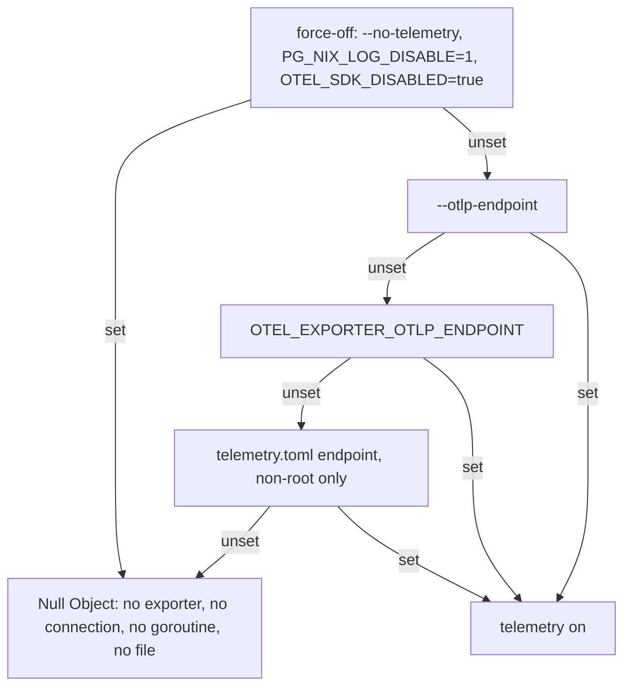

# ADR-0028: pn / nix build telemetry — spike findings, configuration precedence and escape hatches

**Date:** 2026-10-01
**Status:** Accepted
**Deciders:** phillipgreenii

## Context

Epic `pg2-kqrrs` plans a `pg-nix-log-wrapped` wrapper (a Proxy at process level with an Observer
that live-tails nix's `--json-log-path` file and an Adapter that turns nix activity events into OTel
spans and delta metrics) plus pn-side spans. The plan rests on facts F1-F14 and a wrapper contract
W-1..W-12. This ADR records (a) the Phase 1 spike (`pg2-kqrrs.2`) that verified the assumptions the
plan had not yet measured, so Phases 2b and 3 build on observed behavior, and (b) the pn-side
configuration, security and user-facing decisions finalized in Phase 2d (`pg2-kqrrs.6`). The
wrapper's own ADR is a separate document written in Phase 3 (number 0029 is already taken by the
commit-time hook shim experiment).

All measurements were taken on 2026-10-01, nix `2.34.8+1` (daemon mode), macOS (Darwin 25.6.0,
aarch64, 11 CPUs, `max-jobs = 11`). The scratch harness (a polling Python tailer that stamps each
complete line on read, a wrapper stub, a signal driver) lived in `/private/tmp/kqrrs2-spike`; the
stub wrapper and derivations are committed under `docs/adr/0028-fixtures/harness/` and the fixtures it produced under `docs/adr/0028-fixtures/` (see its README for the refresh
procedure). The spike harness is NOT product code.

Legend: VERIFIED means reproduced here with the quoted output. UNVERIFIED means it needs the
operator (root required); the exact command is given.

## Findings

### Item 0. sudo environment handling (operator, 2026-10-01) — DONE

Operator-supplied `sudo -l` and an env probe:

- sudoers grants `(ALL) ALL` with a password, so `sudo <absolute path> ...` is permitted; arbitrary
  absolute paths are allowed (`sudo /usr/bin/true` ran).
- `env_reset` is on; `env_keep` includes `HOME` but NOT `NIX_CONFIG`, `TRACEPARENT` or `OTEL_*`; no
  `SETENV` tag.
- The probe showed `NIX_CONFIG`, `TRACEPARENT` and `OTEL_EXPORTER_OTLP_ENDPOINT` set on the command
  line are all DROPPED under sudo; `HOME=/Users/phillipg` is KEPT (a root wrapper MUST NOT write under
  `$HOME`); `PATH` is NOT reset (no `secure_path`); `SUDO_USER/UID/GID/COMMAND` are set.

Consequence: flags are the only channel (W-1 stands). The W-3 `secure_path` concern does not apply on
this machine; keep the general rule for other machines.

### Item 1. Live tail latency, lag, and the sub-250 ms span decision — VERIFIED

Method: a Python tailer polls the file every 20 ms, buffers partial lines, and stamps each complete
line with the wall-clock at read. Lag = read time minus the file's mtime at read.

Local build (`sleep 1` builder): the `type:105` start was stamped 1790833926.804 and the stop
1790833927.944, a measured span of 1.140 s for a 1 s builder; lag at start 12.7 ms, at stop 2.2 ms.
Start and stop events are readable well inside 250 ms.

300-path fetch: `nixpkgs#texlive.combined.scheme-small`, which nix reported as `these 418 paths will
be fetched (42.5 MiB download, 281.6 MiB unpacked)` plus `these 6 derivations will be built`
(418 paths, i.e. larger than the 300-path target). Result: exit 0, 186,346 lines, 14,527,585 bytes,
204.1 s wall (dominated by one 177.6 s local build), maximum lag over the whole run 23.8 ms.

Lag by 10 s window of the run (lines in window, maximum lag): 0 s: 6,604 lines, 22.8 ms; 10 s: 1,293
lines, 17.7 ms; 20 s: 33 lines, 23.8 ms; 200 s: 6 lines, 3.4 ms. Lag does NOT grow during the fetch;
it stays at about one poll interval (20 ms). The tailer keeps up with a burst of about 6,600 lines in
10 s with no backlog.

Sub-250 ms spans, from the same fetch (start-to-stop as stamped): `type:108` (substitute) n = 418,
171 shorter than 250 ms (41%), median 0.298 s, p95 1.383 s, max 10.91 s. `type:101` (file transfer)
n = 418, 230 shorter than 250 ms, median 0.226 s. A trivial local build (`type:105`) took 0.067 s.
Measured lag (at most 25 ms) is at most 10% of the 250 ms threshold, so the threshold is resolvable.

Decision (proposed): count EVERYTHING in metrics (`nix.derivations` outcome built/substituted, no
duration threshold), emit `nix.build` (105) and `nix.build.wait` (111) spans unconditionally, and
emit `nix.substitute` (108) spans only when duration is at least 250 ms or the substitution failed.
Rationale: 41% of substitute spans are sub-250 ms noise in Tempo and would be about 170 extra spans
per large fetch; the count is preserved by the metric. The threshold SHOULD be a wrapper constant
with a flag override so Phase 8 can revisit it.

### Item 2. Failure attribution (F6) — VERIFIED, with two corrections to F6

Runs: `nix build -f b.nix fail1 fail2 slow ok --keep-going -j4` (two failing builders, exit codes 3
and 4, plus two good ones); the same without `--keep-going`; and a dependent derivation whose
dependency fails. Level-0 `msg` events, with the drv extracted by the regex
`Cannot build '(/nix/store/[^']+)'` after stripping ANSI:

```text
== --keep-going -j4 (parallel)
{"drv":"g9pnp1fk2dv1nb3b52mid5p91l3x4msa-kq2-fa","reason":"builder failed with exit code 3."}
{"drv":"z099x4wxwnr472isgisj8pz79lgn6ri7-kq2-fa","reason":"builder failed with exit code 4."}
== no --keep-going, -j4
{"drv":"cfwf3fxx5qly9ys2mayzf8ykajnipsqa-kq2-fa","reason":"builder failed with exit code 3."}
== dependency failure (--keep-going)
{"has_raw":false,"drv":"5yvsmyrgxi2pp0y7xjj3v91pg3drxl9v-kq2-fa","reason":"builder failed with exit code 3."}
{"has_raw":true, "drv":"6dv6kh137arqph65qcifhwixk3bh7fb0-kq2-de","reason":"1 dependency failed."}
```

Every failed build is named, including both under `--keep-going` with parallel builds. Findings the
wrapper MUST honor:

1. `raw_msg` is NOT always present. In the dependency-failure run the primary failure
   (`builder failed with exit code 3`) arrived as a plain `msg` (keys: action, level, msg) with no
   `raw_msg`; only the second message had `raw_msg`. The matcher MUST read `raw_msg` when present and
   fall back to `msg`.
2. Text is ANSI-coloured even when stdout is not a terminal (`\u001b[35;1m/nix/store/...drv\u001b[0m`
   in both fields). The matcher MUST strip `\x1b\[[0-9;]*m` before matching.
3. A drv whose dependency failed is reported as `Reason: 1 dependency failed.` and has NO `type:105`
   start at all; the dependent can only be attributed from the message. Mark it failed, not just
   absent.
4. Without `--keep-going`, a concurrent sibling (`fail2`) was started (`type:105`) but never named in
   an error message and never stopped cleanly; W-9 step (c) (close open activities with error) is
   required, not optional.
5. Errors arrive late: with `--keep-going` both messages were stamped together at the end of the run
   (5.3 s after start, after the slow sibling), not when each drv failed. Span status for a build
   MUST therefore be set when the message arrives (or at W-9 close), not at the `stop`.

### Item 3. Signals — VERIFIED (non-root); pn-under-sudo cancel UNVERIFIED

Wrapper stub (Python, mirroring W-6: child in the wrapper's process group, forward SIGTERM and
SIGHUP, log and never forward SIGINT). Fake nix counted signals it received; each run delivered
exactly one:

```text
=== TERM sent to the wrapper pid only
wrapper got TERM; forwarding
fakenix received SIGTERM (count 1)
=== INT sent to the whole process group (what a terminal Ctrl-C does)
wrapper got INT; NOT forwarding
fakenix received SIGINT (count 1)
=== HUP sent to the wrapper pid only
wrapper got HUP; forwarding
fakenix received SIGHUP (count 1)
```

So a terminal Ctrl-C reaches nix exactly once (via the group, not via a forward) and TERM/HUP reach
nix exactly once (via the forward). A Python `Popen` child needs no extra handling; NOTE a bash stub
does NOT reproduce this: bash starts background jobs with SIGINT ignored, so a shell-script wrapper
would silently swallow Ctrl-C. The Go wrapper MUST NOT be a shell script and MUST NOT leave SIGINT
ignored in the child.

Real nix, same stub, TERM sent 9 s in, once the `building` activity had started:

```text
wrapper rc 1 after 0.02 s
wrapper got TERM; forwarding
wrapper child exit=1
nix stderr: error: interrupted by the user
```

nix exits in 20 ms and the builder (`sleep 20`) did not survive (no orphan in `ps`). Nix locks: the
SAME derivation was rebuilt immediately after the cancel; it printed no `waiting for lock` message
and took the full 21.2 s build, so the cancelled build's lock was released. The JSONL of the killed
run ends with `msg` level 0 `interrupted by the user` and an unclosed `type:105` activity (fixture
`killed-mid-build.jsonl`). `darwin-rebuild` was not killed in this spike; it execs nix with the
inherited environment (item 4), so the same signal path applies, but see UNVERIFIED below.

pn-driven cancel under sudo (the EPERM case): the OS-level fact is VERIFIED without root:

```text
$ id -u
502
$ kill -0 1
bash: kill: (1) - Operation not permitted        # rc=1
```

A non-root process cannot signal a root-owned process, and a `sudo`-spawned wrapper and its nix are
root-owned. So a non-root pn that tries to cancel a root wrapper gets EPERM and the root nix keeps
running, still holding its store locks (and the build-user pool), until it finishes or someone with
root kills it. Design consequence: pn MUST either run the whole cancel path as root (e.g. spawn a
tiny `sudo` killer) or treat cancel of a root wrapper as best-effort and say so; it MUST NOT claim a
clean cancel it cannot confirm.

UNVERIFIED (needs the operator, root is required; NEVER run by this agent): that pn's actual cancel
reaches, or fails to reach, a root wrapper, and the lock effect when it fails. Command, in terminal A:

```sh
sudo /Users/phillipg/phillipg_mbp/phillipg-nix-repo-base/.worktrees/pg2-kqrrs.2/docs/adr/0028-fixtures/harness/stubwrap.py /private/tmp/root.log nix build --impure -f /Users/phillipg/phillipg_mbp/phillipg-nix-repo-base/.worktrees/pg2-kqrrs.2/docs/adr/0028-fixtures/harness/b.nix longfix --no-link
```

and in terminal B, as the normal user:

```sh
kill -TERM "$(pgrep -f 'stubwrap.py /private/tmp/root.log' | tail -1)"; echo rc=$?
```

Expected from the EPERM fact: `Operation not permitted`, A keeps running; then Ctrl-C in A (sudo
relays SIGINT) or `sudo kill -TERM <pid>` and re-run A to observe `waiting for lock`. Record the output
in a follow-up.

### Item 4. `darwin-rebuild build --flake` through the wrapper stub — VERIFIED

```text
$ NIX_CONFIG="json-log-path = /private/tmp/kqrrs2-spike/drb.jsonl" stubwrap.py drb.wrap.log \
    darwin-rebuild build --flake /Users/phillipg/phillipg_mbp/phillipg-nix-ziprecruiter#phillipg-mbp-02
...building '/nix/store/...-darwin-system-26.05.c3e90c8.drv'...
DONE exit=0                 # wrapper log: "wrapper child exit=0"
result -> /nix/store/ssjz4jvfbjwrll5xzyw851mjzc7cqgms-darwin-system-26.05.c3e90c8
```

The log file held 3,312 lines / 264,745 bytes: 13 `type:105` builds, 25 `type:109` queries, 4
`type:102` and 1,713 progress results. The build ran as the normal user with the inherited
`NIX_CONFIG`; `darwin-rebuild` does pass it through to nix (F12/F13 stand). `darwin-rebuild switch`
(root) is out of scope for the spike and was not run.

### Item 5. Chatty build volume and cheap dropping of type 101 — VERIFIED

A builder printing 20,000 lines (about 70 characters each):

```text
20123 lines, 2799592 bytes; nix exit 0; max lag 21 ms
(result,101): 20000 lines = 2,788,890 of 2,799,592 bytes (99.6%)
prefix/suffix drop of type 101/105: 0.0014 s for 20,124 lines (keeps 43)
full json.loads of every line:      0.0263 s
```

Each build-log line costs about 139 bytes in the JSONL (about 2x the line itself). Keys are emitted in
alphabetical order, so `"type":101}` is the line suffix and a byte check
(`HasPrefix {"action":"result"` and `HasSuffix "type":101}` or `"type":105}`) rejects them without
parsing: 19x cheaper than a full decode in this measurement (Python; Go will be faster in both).
Do not rely on key order alone: the wrapper MUST fall back to a full decode when the fast check is
inconclusive. W-12 cap: 256 MiB divided by about 140 B is about 1.9 million build-log lines before
`nix.log.truncated`; the largest real run measured (the 418-path fetch with a 177 s texlive build)
was 14.5 MB, about 5.5% of the cap. The cap is workable. Of the 14.5 MB, 13.7 MB (94.4%) was
`result 105` progress lines (178,363 of 186,346 lines), so dropping 105 is what keeps the tail cheap
during fetches; the stamped, filtered stream for that run was 745 KB.

Correction to the plan's estimate: about 18 MB per 300-path invocation was extrapolated; the measured
418-path fetch was 14.5 MB, consistent with the extrapolation.

### Item 6. Later `json-log-path` overrides earlier (W-5) — VERIFIED

```text
NIX_CONFIG=$'json-log-path = nc1.jsonl\njson-log-path = nc2.jsonl'
  -> nc1.jsonl: No such file ; nc2.jsonl: 124 lines                      (later line wins)
outer NIX_CONFIG=nc3, inner appends nc4, then nix build
  -> nc3.jsonl: No such file ; nc4.jsonl: 118 lines                      (nested wrapped run wins)
NIX_CONFIG=nc5 plus --json-log-path nc6
  -> nc5.jsonl: No such file ; nc6.jsonl: 128 lines                      (CLI flag beats NIX_CONFIG)
```

Confirmed: appending a `json-log-path` line to an ambient `NIX_CONFIG` is sufficient, and nested
wrapped runs each get their own file. The earlier file receives nothing (it is not even created).

### Item 7. max-jobs queueing and activity events (F7) — VERIFIED

Three builds, `-j1`, each `sleep 2`:

```text
105 start t=262.79  stop after 2.58 s
105 start t=265.74  stop after 2.39 s     (starts only after the previous one stops)
105 start t=268.58  stop after 2.14 s
msgs: "these 3 derivations will be built:" + 3 paths. No type 111, no other waiting event.
```

The cap queue is NOT observable: a job blocked by `max-jobs` has no activity until it starts
(no `type:111`, no message). `type:111` DOES appear for lock contention. With two clients building
the same derivation, the second emitted:

```text
{"action":"start","type":111,"text":"waiting for lock on \u001b[35;1m'/nix/store/0zibnzqdrbiy5yrfw2zcg0sfd37x4hh6-kq2-longfix-52121705'\u001b[0m","fields":null}
```

So the "waiting" panel means contention for the same output (and build-user contention), not
`max-jobs` queueing. Note the 111 text names the OUTPUT path (not the drv), is ANSI-coloured, and
has `fields: null`; the wrapper MUST parse the output path from `text`. Queue time can be derived only
indirectly (the `will be built` plan count versus concurrent 105 count).

### Item 8. Golden files — DONE

See `docs/adr/0028-fixtures/` and its README. Each file is raw nix JSONL (no timestamps; F4), from
nix `2.34.8+1`:

| File                            | Scenario                                               |
| ------------------------------- | ------------------------------------------------------ |
| `cached-fetch.jsonl`            | `nix build nixpkgs#ffmpeg` (4 paths fetched, 198 KB)   |
| `local-build.jsonl`             | one local derivation, 1 s builder                      |
| `failed-build-keep-going.jsonl` | two failures plus two successes, `--keep-going -j4`    |
| `failed-build-dependency.jsonl` | dependency failure (`1 dependency failed`)             |
| `wait-for-lock.jsonl`           | second client blocked (type 111)                       |
| `flake-check.jsonl`             | `nix flake check` on a two-check flake                 |
| `killed-mid-build.jsonl`        | SIGTERM to nix during a build                          |
| `chatty-build.trimmed.jsonl`    | 300 of 20,000 type-101 lines kept (full run is 2.8 MB) |

The 418-path fetch (14.5 MB) and the `darwin-rebuild` log are not committed (size); the refresh
procedure regenerates them.

## Decision

### Spike outcomes (Phase 1)

1. The findings above are the verified basis for W-1..W-12; the wrapper's design ADR is separate.
2. W-7/W-9 MUST be amended per the corrections in item 2 (ANSI stripping, `msg` fallback, dependency
   failures, late errors, close open activities on kill), item 3 (Go child with SIGINT not ignored),
   and item 7 (parse the output path from the 111 text; queueing is unobservable).
3. Sub-250 ms rule as in item 1.
4. A cancel of a root wrapper by non-root pn is best-effort (EPERM verified; effect on locks when it
   fails is UNVERIFIED pending the operator command in item 3).

### Configuration precedence (Phase 2d)

Telemetry is ON only when an OTLP endpoint resolves. For a non-root process the endpoint MUST be
resolved in this order, first match wins: the `--otlp-endpoint` flag, then
`OTEL_EXPORTER_OTLP_ENDPOINT`, then `endpoint` in `~/.config/pn/telemetry.toml`. A root process
MUST NOT read the toml. Any of `--no-telemetry`, `PG_NIX_LOG_DISABLE=1` or `OTEL_SDK_DISABLED=true`
MUST force telemetry off regardless of any endpoint.



The resolution is a pure decision in `modules/pn/internal/telemetrycfg` (Null Object rule: it opens
no connection and creates no file); it has no OpenTelemetry dependency. The decision MUST be made
before cobra runs, because telemetry is created and shut down outside the command tree; the
command-line flags are therefore pre-scanned from argv (`telemetrycfg.ScanArgs`), which stops at
`--` and at the `nix` verb of `pn workspace nix` (that verb forwards its arguments, including `-v`,
to nix). The cobra flags of the same names are registered so `--help` lists them.

### The home-manager module and the config file

`phillipgreenii.pn.telemetry.{enable, endpoint, wrapperPath}` in `home/pn/default.nix` render
`~/.config/pn/telemetry.toml` (keys `endpoint`, `wrapper_path`) through `pkgs.formats.toml`, like
`store.toml`. `enable` is a `mkEnableOption` (default false). When `enable = false` the module MUST
NOT write the file and MUST NOT add the wrapper package to `home.packages`. The `wrapperPath` default
is `lib.getExe pkgs.pg-nix-log-wrapped`; the consuming machine repo MUST apply this flake's
`overlays.default`, and the default is lazy so a machine with `enable = false` evaluates without it.
This layer is below support-apps and MUST NOT call `mkEmitterEnv`; the machine repo sets `endpoint`
from the observability module's http port option (never a literal) and leaves it null otherwise. The
flake check `pn-telemetry-hm-options` proves the default resolves, the file renders, and the
disabled case adds nothing.

### Security of the root path

pn MUST use `wrapper_path` under `sudo` only if its resolved real path (after `EvalSymlinks`) is under
`/nix/store/` (`telemetrycfg.ValidateSudoWrapper`); otherwise it MUST run the command unwrapped. There
MUST NOT be an environment override. A user-writable toml therefore cannot make `sudo` execute an
arbitrary binary. The root wrapper reads no user file (W-1) and writes only to its own root-owned
directory (W-4). No daemon is added, so the observability logSources/launchd registration assertion
does not apply, and there is no `pn-workspace.toml` schema change.

### Finding a run's trace without changing stdout

- pn MUST print `trace: <trace_id>` to stderr at the end of a run only under `-v` or
  `PN_TRACE_HINT=1`, and only if the run has a trace id. stdout MUST stay byte-identical.
- `pn workspace update` MUST add the same `trace_id` to its `run_start` and `run_end` records in
  `events.jsonl` (and to no other record kind), so a human can find the trace from Loki or the file.
- Under `-v`, when telemetry is enabled, pn MUST probe the collector with one TCP connect (bounded to
  750 ms). If it does not answer, pn MUST print the single line
  `telemetry disabled: collector unreachable (<endpoint>)` to stderr and MUST run with telemetry off,
  so the message is true. Without `-v` pn MUST NOT probe; the exporter fails open with a bounded flush.
- The trace id reaches the hint and the event log through a `RunState` carried in the command
  context (an Observer-style seam): the root `pn.verb` span setup calls `RunState.SetTraceID`.
- `pn workspace doctor` MUST include a `telemetry` check that runs `pg-nix-log-wrapped --check` when
  telemetry is on and reports a missing wrapper or a failing check as a warning (never an error); it
  MUST be silent when telemetry is off.

### Escape hatches

One table is authoritative; it appears in `modules/pn/README.md` and in `pn --help`.

| Control                                      | Effect                                                             |
| -------------------------------------------- | ------------------------------------------------------------------ |
| `phillipgreenii.pn.telemetry.enable = false` | Off permanently (no config file, no wrapper package); the rollback |
| `pn --no-telemetry`                          | Off for one pn run                                                 |
| `PG_NIX_LOG_DISABLE=1`                       | Off for pn; the wrapper execs its command unmodified               |
| `pg-nix-log-wrapped --check`                 | Prints resolved endpoint, reachability and log-dir writability     |
| `OTEL_SDK_DISABLED=true`                     | Both binaries off                                                  |
| `PG_NIX_LOG_DEBUG=1`                         | The wrapper prints diagnostics to stderr                           |

`-v`/`--verbose` is introduced as a global pn flag by this change; it replaces cobra's default `-v`
shorthand for `--version` (use `pn --version`).

### pn links to the wrapper: the Runner decorator (Phase 4a, `pg2-kqrrs.8`)

pn routes its long-running nix calls through `pg-nix-log-wrapped` with a second Decorator on
`exec.Runner`, `exec.WithNixWrapper`, stacked INSIDE the `pn.exec` tracing decorator
(`exec.NewRealRunner` is `WithTracing(WithNixWrapper(real))`). Because it sits inside, the span context
it reads is the `pn.exec` span, so the wrapper's `nix.invocation` becomes that span's child and one
trace reads `pn.verb > pn.repo > pn.exec > nix.invocation > nix.build / nix.substitute`.

**Selection is explicit, never by command name.** pn also runs `nix` as a short stdout-parsed probe
(`nix eval`, `nix flake metadata`-style reads in `edges.go`, `inputs.go`, `doctor_checks_*`,
`updatecache.go`) and `sudo nix-store --gc` / `sudo nix-env` in `store/`. A new
`exec.RunOptions.WrapNix` flag is set ONLY at build, apply, flake check, format, the `nix` verb,
propagate and tree's `nix flake lock`; the decorator rewrites nothing else. Tests assert the flag is
false on the probes and the store calls (FakeRunner call recording).

**Rewrite shape.** For a non-sudo call `name args...` the decorator runs

```text
<wrapper> --traceparent TP --otlp-endpoint URL --log-dir DIR -- <name> <args...>
```

and for the sudo form `sudo <cmd> args...` it runs

```text
sudo <wrapper-real-path> --traceparent TP --otlp-endpoint URL -- <cmd> <args...>
```

Details that are decisions rather than restatements of W-1:

- Only the exact forms pn emits are rewritten: `name` in `{darwin-rebuild, nixos-rebuild, nix}`, or
  `name == "sudo"` with `args[0]` in that set. Any sudo option (`-E`, `-u x`, `-n`, `--`), `sudo env`,
  `sudo nix-store`, an absolute-path command, and any `build_command`/`apply_command` whose argv[0] is
  something else (`sh -c ...`, a script) run unwrapped. These are table tests, negative cases included.
- `--log-dir` is passed to a user wrapper only (`${XDG_STATE_HOME:-$HOME/.local/state}/pn/nix-logs`,
  the wrapper's own default); a root wrapper ignores it and logs to `/var/log/pg-nix-log-wrapped`
  (ADR 0030), so pn omits it under sudo. `--traceparent` is the `pn.exec` span of the call.
- The decorator never touches the command's own arguments. `--override-input` pairs are appended by
  `build.go`/`apply.go`/`nix.go` BEFORE the Runner, and the wrapper forwards everything after `--`
  verbatim. A test runs real processes (a fake wrapper that applies the real contract and a fake
  command recording its argv NUL-separated) and asserts the argv is byte-for-byte equal with and
  without the wrapper, including `--traceparent`, `--log-dir`, `--otlp-endpoint`, a literal `--`, an
  empty argument and arguments containing spaces.
- Fail open. The call runs unwrapped, with the original name, args and options, when telemetry is not
  enabled (no `RunState`, `--no-telemetry`, `PG_NIX_LOG_DISABLE=1`, no endpoint, exporter init failed),
  when `wrapper_path` is empty, relative, or not an executable regular file, and, under sudo, when its
  real path (`telemetrycfg.ValidateSudoWrapper`) is not under `/nix/store`. Under sudo the RESOLVED real
  path is what is executed, so the path validated is the path run.
- A failing wrapped command's `CommandError` is rewritten to name the command pn asked for
  (`nix exited 1: ...`), not the wrapper argv; Result buffering and the live tee are the inner runner's.
- `--show-nix-commands-only` returns before the Runner and prints the unwrapped command. The wrapper is
  below `ensureExecTrusted()`, so the trust gate is unaffected.
- Not done here: hooks and `update-locks.sh` do not get `TRACEPARENT` from this decorator (they are not
  rewritten); that remains outside this phase.

**Concurrency check (acceptance; TraceQL).** Tempo has no native concurrency aggregate, so the "no more
than 3 overlapping `nix.build` spans per machine" check is a TraceQL search for the spans plus a
sweep over their intervals. UNVERIFIED until the machine wiring (Phase 4b) is applied and a multi-derivation
build has run. The search (time-bounded by `start`/`end`, wrapper spans carry `service.name`
`pg-nix-log-wrapped`):

```text
{ resource.service.name = "pg-nix-log-wrapped" && name = "nix.build" } | select(span:startTime, span:duration)
```

and the maximum overlap over the returned intervals (a sweep: +1 at each start, -1 at each end, ends
sorted before starts at the same instant), which MUST print 3 or less:

```sh
curl -sG "$TEMPO/api/search" \
  --data-urlencode 'q={ resource.service.name = "pg-nix-log-wrapped" && name = "nix.build" } | select(span:startTime, span:duration)' \
  --data-urlencode "start=$START_EPOCH_S" --data-urlencode "end=$END_EPOCH_S" \
  --data-urlencode limit=5000 --data-urlencode spss=1000 |
  jq '[.traces[].spanSets[].spans[]
       | {s: (.startTimeUnixNano | tonumber), d: (.durationNanos | tonumber)}
       | ({t: .s, v: 1}, {t: (.s + .d), v: -1})]
      | sort_by(.t, .v)
      | reduce .[] as $e ({c: 0, m: 0}; .c += $e.v | .m = ([.m, .c] | max))
      | .m'
```

Group by machine by running it against that machine's Tempo or by adding the resource attribute that
identifies the host once the collector sets one. The trace-shape acceptance for `pn workspace build` is:

```text
{ name = "pn.verb" } >> { name = "pn.repo" } >> { name = "pn.exec" } >> { name = "nix.invocation" } >> { name = "nix.build" || name = "nix.substitute" }
```

## Consequences

- Phases 2b and 3 may start; the golden files give the activity state machine real input.
- Open (UNVERIFIED, operator, root): the pn-driven cancel under sudo and its lock effect (item 3).
- Not measured: a real `sudo darwin-rebuild switch` through the wrapper; `darwin-rebuild` cancel by
  signal (build-only run only).
- Alternatives rejected earlier (socket, timestamps from nix) stay as in the plan (F4, F10).
