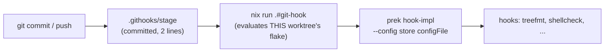

# ADR-0029: Commit-time hook shim — a labelled experiment against HK-2

**Date:** 2026-10-01
**Status:** Superseded by [ADR-0032](0032-per-clone-hook-bundle-replaces-generated-config-and-shim.md) (experiment abandoned; HK-2 unchanged)
**Deciders:** phillipgreenii
**Bead:** `pg2-z19ad` (umbrella), `pg2-bvldq`, `pg2-ff0i`

## Context

Every repo here installs hooks through `cachix/git-hooks.nix`: a gitignored
`.pre-commit-config.yaml` symlink into `/nix/store`, written per checkout by an installer, with
every hook entry a hard-coded store path (`language: system`). Because the config holds
machine-specific store paths it cannot be committed, so it is generated per checkout. That one
choice produced a recurring failure family (about 28 beads, ADR-0016 and six patches in
`flake-modules/pre-commit.nix`):

- the installer writes a **relative** `core.hooksPath` that silently ungates every linked worktree;
- the config symlink is **absent** in fresh worktrees, so commits abort with "config file not found";
- the store path is **garbage-collected** out from under the hook shim;
- two different store configs are live in one repo at once, and the last install wins;
- cross-repo drift and install cost.

The operator mandated (2026-08-24) a real design instead of stacked patches. HK-2 (amended, see
`flake-modules/pre-commit.nix`) forbids a git hook from invoking nix. The design below does exactly
that, so on 2026-10-01 the operator ruled: _"leave HK-2 as is, but continue with this proposed
design. we will use it as a research experiment to see if HK-2 should be changed or an exception is
to be added"_.

## Decision

Add an **opt-in** option `phillipgreenii.pre-commit.commitTimeShim.enable` (default `false`). When
enabled in a repo:

- the flake exposes `packages.git-hook`, which runs
  `prek hook-impl --config <store configFile> --hook-type <stage>`;
- committed static shims `.githooks/<stage>` run `nix run --quiet .#git-hook -- <stage> "$@"`;
- `packages.install-pre-commit-hooks` (never the devShell) sets `core.hooksPath` to the relative
  `.githooks`;
- `.pre-commit-config.yaml` is still regenerated as a symlink, because ff-merge-to-main FF-1b,
  drain/wtnew isolate linking, pn doctor checks and the `prek run` instructions read it;
- `prek install` and the `core.hooksPath` relativization (and their three patches) are not run;
- `checks.pre-commit-githooks-wired` fails on a missing, non-executable, altered or extra shim, and on
  shim stages that differ from the stages the generated config uses.

HK-2 is **not** amended. This is a labelled exception covering only the generated `.githooks` shims,
and no `extraHooks` entry may invoke nix.

**Pilot:** `phillipg-nix-repo-base` itself enables the option (committed `.githooks/pre-commit`).
Wiring `core.hooksPath` is performed by `nix run .#install-pre-commit-hooks`, run by the operator or
a `pn` hook, never by an agent. Consumers adopt in waves after the producer is pushed: overlay, then
personal and agent-support, then support-apps; ZR last, and only after its auto-commit daemon has
`nix` on its PATH.

## Evidence gathered (prototype, 2026-10-01)

- Real `git commit` / `git push` fire the hook in a canonical clone, a nested worktree, a sibling
  worktree and a subdirectory; bad commits are rejected with HEAD unchanged.
- A config edit takes effect on the next commit with no reinstall; deleting the `git-hook` store path
  self-heals on the next commit.
- Median per-commit overhead was about 1 s (OLD 0.66 s, NEW 1.72 s, nix eval 1.01 s; measured at
  load average 75-117, so the absolute values are inflated).
- A branch or worktree whose tree lacks `.githooks/` has **no enforcement** (confirmed in real git).

## Consequences

**Risks, accepted for the experiment:**

- the relative `core.hooksPath` makes the checked-out branch's tree supply the hooks; the guard check
  only runs at `nix flake check` / land time, so a branch without `.githooks/` commits ungated;
- the shim fails with exit 127 where `nix` is not on the hook's PATH (e.g. launchd daemons, some GUI
  git clients); the ZR auto-commit daemon is such a case, so ZR is excluded until its PATH is fixed;
- `core.hooksPath` bypasses non-prek hooks installed under `.git/hooks` (for example a bd-chained
  `post-merge`, or agent-support's `pre-rebase`); list such stages in `commitTimeShim.stages` or
  decide explicitly before opting in;
- `nix run` evaluates the dirty tree on every commit; an untracked new `.nix` file imported by the
  flake hard-fails until `git add`;
- a workforest set commits against the locked producer, not the set's worktree.

**Conclusion criteria:** the experiment ends with a bead for the operator to decide: change HK-2, add
a scoped exception, or abandon the shim. Until then ADR-0016's gitignore rule stays in force.

## Related

Full design, evidence, independent review, remaining work and operator commands:
[`docs/superpowers/plans/2026-10-01-commit-time-hook-shim-experiment.md`](../superpowers/plans/2026-10-01-commit-time-hook-shim-experiment.md).
HK-2 decision bead: `pg2-d1ngb`.

## Rollback

Set the option to `false`, re-run `nix run .#install-pre-commit-hooks` (restores the legacy installer
path), restore the previous `core.hooksPath` (`<repo>/.git/hooks` as an absolute path), and delete the
committed `.githooks/`.
