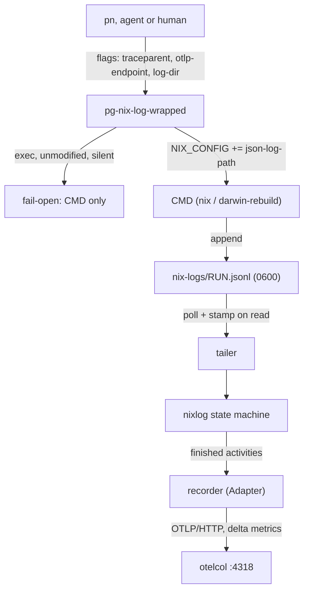

# ADR-0030: `pg-nix-log-wrapped` — a fail-open nix telemetry wrapper

**Date:** 2026-10-01
**Status:** Proposed
**Deciders:** phillipgreenii

## Context

Epic `pg2-kqrrs` wants nix build activity (what was built locally, what was substituted, what
failed, how long) visible in the local OTel stack, without changing what any nix command does.
ADR [0028](0028-pn-nix-telemetry.md) recorded the Phase 1 spike (facts F1-F14, golden files). This
ADR records the design of the wrapper that Phase 3 (`pg2-kqrrs.7`) implements, and the places where
the implementation had to decide something the plan left open or amend it.

The epic named this ADR "0029". `0029` was taken in the meantime by the commit-time hook shim
experiment, so the wrapper's ADR is `0030`.

## Decision

### Packaging (D1)

A new sibling Go module `modules/pg-nix-log-wrapped` (own `go.mod`, `go.sum`, `gomod2nix.toml`),
built with `mkGoBinary`, exposed as `packages.pg-nix-log-wrapped` and
`overlays.default.pg-nix-log-wrapped`. It is NOT a second `cmd/` in `modules/pn`: `pn`'s
`subPackages = ["cmd/pn"]` stays, `lib.getExe pkgs.pn` keeps working, and `pn` consumes only the
binary path (`phillipgreenii.pn.telemetry.wrapperPath`); there is no Go import between them. Both
import `otelsetup` from `phillipgreenii/x`.

Checks: `pg-nix-log-wrapped-go-tests` (`mkGoTest`, ADR 0021/0024: the package build runs no tests),
`pg-nix-log-wrapped-golangci` (`mkGoLint`), and `pg-nix-log-wrapped-overlay-entry` (the overlay must
expose the package, or `lib.getExe pkgs.pg-nix-log-wrapped` fails at eval in a consumer).

No `runtimeDeps`: `mkGoBinary` would wrap the binary in a shell script, which breaks the W-3
own-inode PATH check and adds a process hop in front of every nix call.

### tldr, man page, completions

The command is user-facing, so it SHIPS a tldr page (`share/tldr/pages.common`). No man page (a
`--help` of one screen) and no completions (there is no cobra `completion` subcommand to generate
them). Registering the page with `programs.tldr.customPages` is a home-manager concern that belongs
to the module installing the package (the `pn` telemetry option), not to this build.

### Fail open is the invariant

Everything before CMD starts (flag resolution, directory, file, exporter construction) either
succeeds or the wrapper `exec`s CMD with its environment untouched, replacing itself
(`syscall.Exec`), silently. Stderr is silent in that mode: the OTel SDK's default error handler logs
to stderr, so the wrapper installs its own handler and discards the `log` package output; export
errors surface only under `PG_NIX_LOG_DEBUG=1`. After CMD starts, a tailer panic is recovered and
cannot affect CMD. A dead collector costs at most the bounded flush
(`PG_NIX_LOG_FLUSH_TIMEOUT`, default 2 s; an undocumented-in-`--help` test knob) and never the exit
code.

### Signals and exit codes (W-6)

CMD stays in the wrapper's process group. SIGTERM and SIGHUP are forwarded, exactly once. SIGINT is
caught but never forwarded: a terminal Ctrl-C already reaches CMD through the group, so forwarding
would deliver it twice. SIGINT MUST be caught rather than ignored, because an ignored disposition is
inherited across `exec` and would make CMD immune to Ctrl-C. A child killed by signal `n` yields
`128+n`; a missing CMD yields 127 with Go's own `exec: "x": executable file not found in $PATH`
message (`fork/exec p: no such file or directory` for a path), a non-executable CMD yields 126.

### Root (F14)

As euid 0 the wrapper reads flags only (no env, no `~/.config`), ALWAYS logs to
`/var/log/pg-nix-log-wrapped` (a non-symlink directory owned by the effective uid, not group/other
writable, mode 0750; otherwise fail open), and ignores `--log-dir`. `HOME` survives `sudo`
(`env_keep`), so ignoring it is a deliberate choice, not a side effect.

### Activity state machine (amendments from ADR 0028)

- **Failure inference (F6).** A level-0 message naming `Cannot build '<drv>'`, from `raw_msg` else
  `msg`, ANSI stripped. A drv whose dependency failed never starts; it is emitted as a zero-length
  failed `nix.build` span (`error.type = dependency_failed`) from the message alone.
- **Stopped builds are held.** Failure messages can arrive long after the `stop`
  (`--keep-going`), and an ended OTel span cannot change status. So a stopped `105` build is held
  until a message names it or the run ends. Metrics and Tempo already only see data at export time,
  so this costs no liveness that exists today. Substitutions and waits are emitted at `stop`.
- **Sub-250 ms substitutions** keep their metric count but get no span (`--min-substitute-span`,
  default 250 ms; ADR 0028 item 1).
- **`type:111`** text names the output path, not the drv; parsed from the quoted path.
- **Open activities at the end** (W-9 c) are closed with error status, `error.type = aborted`, and
  are NOT counted in `nix.derivations` (they neither built nor failed).
- **Dropping.** Result types 101 and 105 are dropped by a byte prefix/suffix check before any JSON
  decode; a failed check falls back to a full decode that drops by type, so key order is never
  relied on for correctness.

### Signals added beyond the plan's table

`nix.derivations{outcome}` gains `failed` (build failures, including dependency failures) next to
`built` and `substituted`; `increase(...{outcome="built"})` is unaffected. `nix.build.duration` and
`nix.invocation.duration` carry only `status` (and `command` for the latter); derivation names are
span attributes only. Invocation span attributes: `command`, `process.exit.code`, `error.type` on
non-zero exit, `nix.tailer.lag` (max seconds), `nix.plan.build`, `nix.plan.fetch`,
`nix.log.truncated` (when true), `nix.log.file`.

### Polling only

The tailer polls every 20 ms (the spike measured lag of about one interval). The plan allowed kqueue
"only as a wake-up"; it is omitted because it adds a platform-specific code path to save an `fstat`
per 20 ms, which the spike showed is not needed.

### Config file schema

`~/.config/pn/telemetry.toml` is read by non-root runs. The wrapper reads two keys,
`endpoint = "http://127.0.0.1:4318"` (last resort) and `enabled` (boolean; `false` switches telemetry
off even when an env or file endpoint is set, but never overrides an explicit `--otlp-endpoint`; ADR
0028 "Amendment 2026-10-08" is authoritative for precedence). A malformed file, including a
wrongly typed key, is treated as absent. The home-manager module that renders it
(`phillipgreenii.pn.telemetry`) MUST emit both keys.

### `--check`

Prints the resolved endpoint and its source, whether a TCP connection to it succeeds, and whether the
log directory can be created and written. Exit 0 only when telemetry would actually run; 1 for
disabled, unresolved, unreachable or unwritable. It is the detector for a silent fail-open
misconfiguration.

## Consequences

- The wrapper is testable without OTel infrastructure: the test binary re-executes itself as the
  wrapper and as a fake nix (`internal/fakecmd`), collectors are loopback `httptest` servers, and
  the activity logic runs against the ADR 0028 golden files (copied to `internal/nixlog/testdata`,
  with a test that fails when they drift from `docs/adr/0028-fixtures`).
- A real-nix canary builds a unique derivation through the wrapper and asserts a `nix.build` span;
  it skips when `nix` is absent or inside a nix builder. A nix upgrade that changes the
  `json-log-path` shape fails it on a developer machine.
- Builds appear in Tempo only when the invocation ends (held builds, plus the invocation span
  itself). Live per-activity visibility is not provided; it would need a different export model.
- Root logs at `/var/log/pg-nix-log-wrapped` are readable only with sudo or as an admin-group
  member.

## Not verified here

- Behaviour under a real `sudo` (the root path is verified by injecting the euid, not by being root).
- A live collector, Tempo, Prometheus: the acceptance criteria that read those (`nix.invocation` and
  `nix.build` in Tempo, `increase(nix_derivations{outcome="built"})`, a killed collector mid-run)
  need the applied stack and are post-apply checks.
