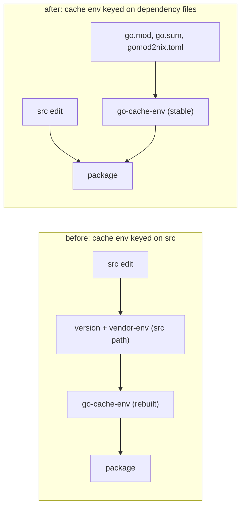

# ADR-0031: `mkGoApp`'s Go build cache is decoupled from `src`; `generate --with-deps` is required

**Date:** 2026-10-02
**Status:** Accepted (amends 0008)
**Deciders:** phillipgreenii
**Tracking:** pg2-t8807

## Context

`pn workspace apply` spent most of its time building Go packages from a cold compile cache
(bead `pg2-t8807`, root cause verified 2026-09-30). gomod2nix's `buildGoApplication` can restore a
pre-warmed Go build cache (`go-cache-env`, a `cache.tar.zst`) into `GOCACHE` before the build. The
tarball is populated **only** from a `cachePackages` list in `gomod2nix.toml`, and that list is
written **only** by `gomod2nix generate --with-deps`. No Go package in the workspace had
`cachePackages`, so every `go-cache-env` was a ~100 byte empty tarball and every build compiled the
whole dependency graph (hundreds of packages for `pg-desk`) from scratch.

Simply regenerating the tomls with `--with-deps` would not have helped, because `buildGoApplication`
makes the cache env a function of the package's **source**:

1. `mkGoApp` puts `-X <versionPath>=<baseVersion>-<src digest>` in the `ldflags` attribute
   (ADR [0006](0006-source-content-digest-versioning.md)), and `buildGoApplication` forwards the
   same `ldflags` to `mkGoCacheEnv`. The cache env was therefore a new derivation on every source
   edit.
2. For a Pattern B module (a local `replace => ../sibling`), `buildGoApplication`'s vendor env
   interpolates the whole `src` store path (it symlinks the replaced module into `pwd`), and the
   cache env depends on the vendor env. The cache env was therefore a new derivation on every edit
   of the package **or of its sibling**, even with the version moved out of `ldflags`.

A cache env that is rebuilt on every edit primes nothing: the build that needs it must first build
it, cold. The only way to reuse a cache is to make the cache env a function of the **dependency
set** alone.

The version is in `ldflags` for historical reasons only (ported mechanically from `buildGoModule`).
ADR 0006, 0008 and 0011 require that the version be a function of source content, visible in the
derivation `version` attribute (for `nvd`) and injected into the binary; no ADR requires it to be an
input of the cache derivation.

## Decision



1. **`mkGoApp` builds its own cache env.** It passes `disableGoCache = true` to
   `buildGoApplication` and attaches a cache env built with `pkgs.mkGoCacheEnv` through
   `overrideAttrs` (`goCacheDir` plus `passthru.goCacheEnv`). Its inputs are only:
   - `go.mod`, `go.sum` and `gomod2nix.toml`, filtered into a content-addressed `go-dep-files`
     source, so its store path is stable across source edits;
   - a **source-independent vendor env** built from that filtered source (the local-replace
     symlinks it creates dangle, which is harmless: the cache env never imports a local-replace
     package);
   - `cachePackages` from the toml **minus the roots that belong to local-replace modules**
     (detected from `go.mod` `replace` directives, single-line and block form);
   - the build-environment knobs `go`, `CGO_ENABLED`, `tags` and `allowGoReference`.

   The version ldflag and the caller's `ldflags` are **not** inputs. `ldflags` only affect the link
   step, never the compiled-package entries the cache holds, and `mkGoCacheEnv` never linked with
   them.

2. **ADR 0006 is preserved unchanged.** The package derivation keeps
   `version = "${baseVersion}-${srcDigest}"` and `-X ${versionPath}=${version}` in its own `ldflags`.
   Only the cache env stopped seeing them.

3. **`mkGoLint` and `mkGoTest` pass `disableGoCache = true`.** Both replace the build phase and
   re-export `GOCACHE` to a scratch directory (`mkGoTest` also strips `-trimpath` for its `-race`
   run), so a restored tarball can never be hit. Without this, populating `cachePackages` would make
   every lint and test derivation depend on a real cache env that is never used.

4. **The populate step fails loudly.** `mkGoCacheEnv` ends it with `go build ... cache.go || true`,
   so a stale root, an OS-specific package (the flake builds both `aarch64-darwin` and
   `x86_64-linux`) or a non-importable `package main` root silently yields an empty cache. The cache
   env gets a `postBuild` that re-runs the build without `|| true`; the packages are already
   compiled, so it is near-free on success.

5. **`gomod2nix generate --with-deps` is mandatory for Go modules built through `mkGoApp` /
   `mkGoBinary`.** A plain `generate` **removes** `cachePackages`, silently turning the cache off
   again, and the failure is invisible (the build still succeeds, cold). The documented command is
   therefore

   ```bash
   go mod tidy && nix run github:nix-community/gomod2nix/<locked rev> -- generate --with-deps
   ```

   where `<locked rev>` is the `gomod2nix` rev pinned in `flake.lock` (currently
   `1201ddd1279c35497754f016ef33d5e060f3da8d`), so the generator matches the builder that reads the
   toml.

## Consequences

### Positive

- The cache env changes iff the dependency set changes: a source edit in the package or in a
  local-replace sibling rebuilds the package (and, for Pattern B, its vendor env) but not
  `go-cache-env`. Several packages with identical dependency sets share one cache env.
- The checks `go-builders-cache-env` (eval-only: cache env drvPath invariant under a package edit
  and a sibling edit, `passthru.goCacheEnv == drvAttrs.goCacheDir`, local-replace root dropped,
  lint/test build none) and `go-builders-cache-env-tarball` (the fixture's tarball is larger than
  1 MiB) pin all of the above.

### Negative

- **One-time mass rebuild.** Every `mkGoApp` / `mkGoBinary` derivation changes hash (a new
  `goCacheDir`, plus `disableGoCache` in the environment), so every consumer rebuilds once when it
  bumps this repo.
- **Store cost.** A populated tarball is large: the base fixture's (one real dependency plus the
  standard library it pulls in) is 11,136,347 bytes, and the bead's estimate for agent-support's 16
  distinct cache envs is about 405 MiB compressed per system (424,505,442 bytes / 1,048,576). The
  estimate comes from the bead's research, not from a build of the final tomls.
- `--with-deps` is a convention enforced only by documentation and by consumers' wiring checks: a
  toml regenerated without it still builds, just cold.
- `tags` are not passed to the populate step (it never used them), so dependencies reachable only
  under a build tag are not primed. That is slow, not wrong.

### Neutral

- Packages whose toml has no `cachePackages` keep working: the cache env is the same empty tarball,
  now shared instead of rebuilt per source edit.
- The check phase is a separate cost. Package builds default to `doCheck = false` (ADR 0008
  amendment 2026-10-01, bead `pg2-pla9d.2`) because `goCheckHook` drops `-trimpath` and thereby
  invalidates every compile action a primed cache holds; a package that opts back into
  `doCheck = true` pays a cold compile in its check phase regardless of this ADR.
- Not verified here: `x86_64-linux` (no builder on the authoring machine), so an OS-specific root
  surfaces on first Linux build as a loud `cache.go` failure rather than a silent empty cache.

## Related Decisions

- [0006](0006-source-content-digest-versioning.md): per-source digest version (retained).
- [0008](0008-adopt-gomod2nix-for-go-packages.md): gomod2nix engine (amended: `--with-deps`).
- [0021](0021-subpackages-check-scoping-mkgotest.md): why the test gate is `mkGoTest`.
