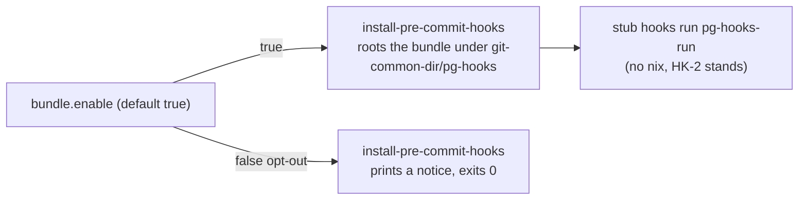

# ADR-0032: The per-clone hook bundle replaces the generated config symlink and the commit-time shim

**Date:** 2026-10-03
**Status:** Accepted (supersedes 0029; supersedes the generation mechanism of 0016)
**Deciders:** phillipgreenii
**Tracking:** `pg2-pla9d` (per-clone hook bundle), `pg2-pla9d.24` (T21 cleanup), `pg2-9o1ww` (this change)

## Context

Hooks in this workspace were installed through `cachix/git-hooks.nix`: a gitignored
`.pre-commit-config.yaml` symlink into `/nix/store`, written per checkout, with a relative
`core.hooksPath` and shims that name that file ([ADR-0016](0016-gitignore-generated-pre-commit-config.md)).
That produced a recurring failure family (about 28 beads and six patches in
`flake-modules/pre-commit.nix`): a relative `core.hooksPath` that silently ungates linked
worktrees, a config symlink that is absent in a fresh worktree, a store path that is garbage
collected under the shim, and several live store configs per repo.

[ADR-0029](0029-commit-time-hook-shim-experiment.md) tried one answer, opt-in commit-time
resolution through `nix run` in a committed `.githooks/` shim, as a labelled experiment against
HK-2 (a git hook MUST NOT invoke nix). The operator then chose a different design: the per-clone
hook bundle (`docs/superpowers/specs/2026-10-01-per-clone-hook-bundle-design.md`, reference page
`docs/hooks.md`). Every repo in the workspace has since enabled the bundle
(`phillipgreenii.pre-commit.bundle.enable = true`), so the legacy machinery has no remaining
caller in this repo's module.

## Decision

1. The per-clone hook bundle is the only hook mechanism. `phillipgreenii.pre-commit.bundle.enable`
   MUST default to `true`.
2. `bundle.enable = false` MAY be used as an opt-out and means no hooks are installed:
   `install-pre-commit-hooks` MUST print a notice on stderr and exit 0, the devShell MUST install
   nothing, and `packages.<system>.pg-hooks-bundle` MUST NOT be exposed. The derivation stays
   reachable as `legacyPackages.<system>.pgHooksBundle`.
3. The commit-time shim is abandoned. HK-2 stands unchanged: a git hook MUST NOT invoke nix. The
   `commitTimeShim` options, `packages.git-hook`, and the `bundle` plus shim mutual-exclusion
   assertion MUST be removed, and any flake that still sets `commitTimeShim.*` fails evaluation
   with an unknown-option error.
4. The legacy `git-hooks.nix` installer wrappers MUST be removed from `flake-modules/pre-commit.nix`
   (`neutralizeHigherScopeHooksPath`, `restoreHigherScopeHooksPath`, `correctRelativeHooksPath`,
   `hardenPrePushHook`, `absolutizeHookConfigPath`, `shimLinkConfig`, `shimWireHooksPath`,
   `gitHookPackage`), together with the checks that only exercised them:
   `pre-commit-hooks-path-worktree-safe`, `pre-commit-hooks-config-path-absolute`,
   `pre-commit-higher-scope-hookspath-install`, `pre-commit-higher-scope-hookspath-xdg-only` and
   `pre-commit-githooks-wired`.
5. A clone that has only the old symlink and no bundle MUST be treated as having no bundle
   (`missing`). The legacy `pg-hooks` state is removed by the follow-up work (`pg2-81ipk`).
6. A missing bundle, or an absent `pg-hooks`, MUST NOT block a land: the existing "continue with a
   notice" behavior is retained.

### What this ADR does not retire

The `.gitignore` rule of ADR-0016 (exact line `.pre-commit-config.yaml`) and its
`checks.pre-commit-config-gitignored` check MUST be kept for now. About 25 worktrees and every
canonical clone still hold the old symlink, and a tracked copy is still a hazard. Removing the rule
and the check is a separate, cross-repo follow-up that MUST run only after the repos have been pushed
and relocked and no clone has the symlink. Likewise, consumer flakes MUST NOT drop their now-redundant
`bundle.enable = true;` or their `.gitignore` lines until that relock has happened.

## Consequences

### Positive

- One hook path to reason about; the six-patch family is gone with its regression checks.
- Nothing is written into a working tree and `core.hooksPath` is never written by tooling.
- Evaluation fails loudly for a flake that still sets `commitTimeShim.*`.

### Negative

- A consumer that relocks onto this change loses `checks.pre-commit-hooks-path-worktree-safe`,
  `checks.pre-commit-hooks-config-path-absolute`, `checks.pre-commit-higher-scope-hookspath-install`
  and `checks.pre-commit-higher-scope-hookspath-xdg-only`; anything that names them breaks.
- A flake that sets `bundle.enable = false` now silently gets no hooks (with a notice at install
  time), where it previously got the legacy installer.

## Related Decisions

- Supersedes [ADR-0029](0029-commit-time-hook-shim-experiment.md) and the generation mechanism of
  [ADR-0016](0016-gitignore-generated-pre-commit-config.md); the gitignore rule of 0016 remains in
  force until the follow-up above.
- Design: `docs/superpowers/specs/2026-10-01-per-clone-hook-bundle-design.md` (section 7.5).
  Reference: `docs/hooks.md`.
