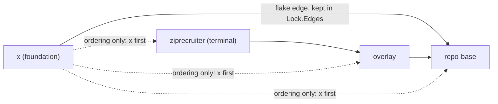

# ADR-0033: Foundation repos are ordered before every flake consumer

**Date:** 2026-10-07
**Status:** Accepted (amends [ADR-0002](0002-pn-workspace-toml-schema.md) and [ADR-0023](0023-workspace-push-owns-sibling-propagation.md))
**Deciders:** phillipgreenii (implemented by Claude)

## Context

`pn workspace` derives every dependency edge from **flake inputs** (`buildEdges`, consumer → alias →
target), and `Lock.Order` is the Kahn topological sort of those edges with alphabetical tie-breaks
(`topoSortByDeps`). `pn workspace push`, `rebase`, `flake-check`, `status` and the land order all
iterate `Lock.Order`.

The new workspace repo `phillipgreenii-x` (`github.com/phillipgreenii/x`, the shared Go library) is
consumed by other workspace repos as a **Go module**: each consumer's `go.mod` pins an `x`
pseudo-version. Those pins are invisible to `pn`. The requirement is that `x` is **published before
every other repo**, so a consumer's `go.mod` never pins a commit that is not yet on the remote.

Three facts make the existing machinery unable to express that:

- **Alphabetical tie-break alone fails.** `x` has a formatting-only `flake.nix` that imports
  `phillipg-nix-repo-base`'s treefmt module, so `pn` derives the edge `x -> repo-base` and `x` is
  ordered AFTER repo-base (and everything repo-base's consumers need). Only a repo with no edges would
  sort by name, and even then `phillipg-*` sorts before `phillipgreenii-x`.
- **Go consumers have no flake edge to `x`.** There is nothing to derive.
- **A per-consumer `after = ["x"]` edge would create a 2-cycle.** `x -> repo-base` (flake) plus
  `repo-base -> x` (declared) is a cycle, and `topoSortByDeps` does not report cycles: leftover nodes
  are appended **alphabetically** (the tail of `dag.go`). The result would be a silently wrong order.

Go-module edges are also unsuitable for `Lock.Edges`: `ParseLock` requires a `flake_path` per edge,
and the override logic turns every edge into `--override-input`, which is meaningless for a non-flake
dependency.

## Decision

Add an optional per-repo key, `foundation`, to `pn-workspace.toml`:

```toml
[repos.phillipgreenii-x]
url = "git@github.com:phillipgreenii/x.git"
foundation = true
```

The workspace applies the following, implemented as a **Specification-driven ordering rule** in a
new function `orderingDeps` (`internal/workspace/edges.go`) called only from `buildEdges`:

1. A foundation repo MUST be ordered before every non-foundation repo.
2. A foundation repo's own flake-input edges MUST remain in `Lock.Edges` (relock, `--override-input`
   and `flake-check` keep working) but MUST NOT constrain ordering against non-foundation repos.
   Ordering **among** foundation repos still follows their own edges.
3. The rule MUST NOT change the edge list. `edgesToDependsOn` stays a pure edge view (`tree` uses
   it), so `pn workspace tree` is unchanged.
4. With no foundation repos the output MUST be identical to the pure edge-derived order.
5. A foundation repo MUST NOT be the workspace terminal. This is enforced at `ParseConfig`, in
   `resolveTerminal` (the `--terminal` flag bypasses `ParseConfig`, and a config built without it
   must still be refused), in `requireTerminal`, and in Discover's `selectTerminal`. Terminal
   auto-detection (`autoDetectTerminal`, `detectTerminalCandidates`) skips foundation repos; the
   foundation set is passed as a parameter instead of changing the lock schema, so a subset
   workforest `{x, repo-base}` never auto-detects `x`.
6. `filterConfig` / `writeConfigTOMLTo` preserve the key, so subset workforest configs round-trip it.

Two adjacent behaviours follow from "x has no pre-commit bundle":

- `pn workspace pre-commit-check` MUST skip, with a one-line notice, any repo whose config declares no
  `install-pre-commit-hooks` hook (`installHookDeclared`, the predicate `doctor` already uses).
  Otherwise `pg-hooks run pre-commit --all-files` exits 13 (no bundle) there and the sweep fails.
- `pn workspace discover` computes its own display-only order from `buildGraph`/`topoSort`. It is
  made consistent by a stable foundation-first partition (`foundationFirst`); it does not feed the
  lock.

`buildDAG` (`dag.go`) is unused outside tests and is left unchanged.



The dotted edges exist only inside `orderingDeps`; they are never written to the lock.

## Consequences

### Positive

- `push` and land publish `x` first, so consumers' `go.mod` pins always refer to a pushed commit.
- No new edge kind, no schema change to `pn-workspace.lock.json`, no change to `tree`.
- Stored in the same place as every other repo attribute, and visible in `pn-workspace.toml`.

### Accepted behaviours (documented, not coded around)

- **(a) One-run lock lag.** With `x` ordered before repo-base, `x`'s `flake.lock` relocks repo-base to
  its pre-push remote tip, so `x`'s lock lags repo-base by one `push` run. `doctor flake-lock-fresh`
  MAY flag it, and the next `pn workspace push` converges it. [ADR-0023](0023-workspace-push-owns-sibling-propagation.md)
  invariant C1 (a consumer relocks only to a rev already on the remote) still holds; there is no loop.
- **(b) Toggling `foundation` leaves a stale lock.** `lockMatchesConfig` compares only the repo-key
  SET, so editing the key on an existing repo does not invalidate the disk `Lock.Order`. After
  editing it, the operator MUST run `pn workspace lock`. `doctor`'s `lock-current` check catches the
  drift.
- **(c) `wsplan` / land-plan sees only flake edges.** `modules/pnwf/wsplan.sh` reads `.edges` only,
  so it sees `x -> repo-base` as the sole edge involving `x` and treats `{x, other}` as order-free.
  The land order taken from `.order` is still correct.
- **(d) `pn workspace tree` never shows `x`.** It is not in the terminal's flake closure.
- **(e) Rollout order.** An older deployed `pn` ignores the unknown `foundation` key silently (the
  TOML decode is lenient) and would order `x` after repo-base. The rollout MUST therefore be: land and
  apply the new `pn` FIRST, then add the `foundation = true` entry to `pn-workspace.toml`. No two-step
  hook workaround is needed.
- **(f) `pre-commit-check` skips repos without the install hook.** Previously every repo ran
  `pg-hooks`; a workspace repo that has not opted into the bundle is now skipped with a notice rather
  than reported as an exit-13 failure.

### Negative

- Ordering is no longer purely a function of the edge list; a reader of `Lock.Order` must also read
  the `foundation` flags. The code comments on `Lock.Order`, `topoAlpha` and the per-command ordering
  docs point here.
- Discover's order and the lock's order are computed by two independent algorithms, kept consistent
  only by `foundationFirst`.

## Phase B: `foundation` is the tie-breaker primitive

`foundation` is deliberately the **minimal** primitive. A future Phase B MAY derive Go-module edges
from consumers' `go.mod` files and re-pin each consumer to `x`'s new commit after `x` is pushed. If
it does:

- `foundation` MUST remain the ordering tie-breaker for repos that are consumed outside the flake
  graph; derived Go edges SHOULD refine ordering among non-foundation repos only.
- Go-module edges MUST stay OUT of `Lock.Edges` (they have no flake alias or `flake_path`, and would
  be turned into `--override-input`). They SHOULD live in a separate structure that `orderingDeps`
  consumes.
- Re-pinning consumers is a **post-publish step** and is therefore a different concern from ordering.

## Related Decisions

- [ADR-0002](0002-pn-workspace-toml-schema.md): the `pn-workspace.toml` schema (gains `foundation`).
- [ADR-0023](0023-workspace-push-owns-sibling-propagation.md): `push` owns the interleaved
  push/relock loop and invariant C1.
- Design: `docs/superpowers/specs/2026-08-25-go-support-design.md` (§3 non-goal superseded by the
  2026-10-07 operator ruling that `x` joins the workspace).
