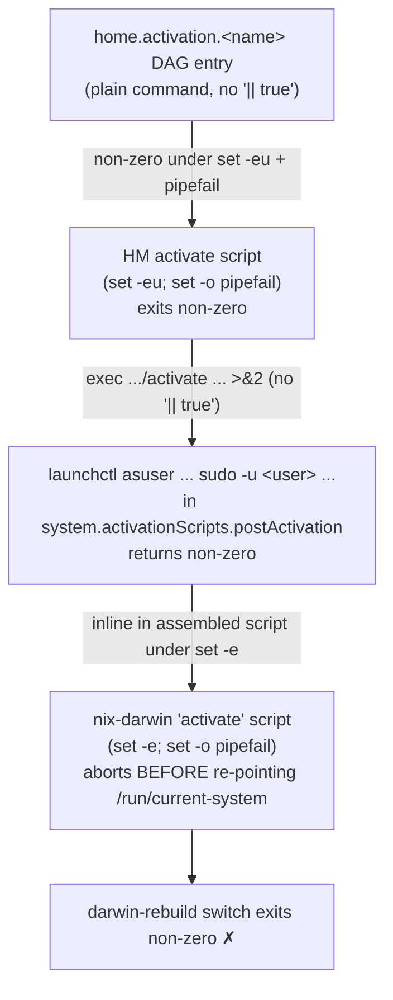

# Amendment to ADR 0049 — Home-Manager-scoped `launchdServices` userAgent variant

**Status**: Draft
**Date**: 2026-06-25
**Deciders**: Phillip Green II (pending)

> **LOCATION NOTE — read first.** This draft is committed in
> `phillipg-nix-repo-base` only because the spawning task pinned the commit
> location there. The premise that `launchdServices` and ADR 0049 live in
> `phillipg-nix-repo-base` is **incorrect**. Both actually live in
> **`phillipgreenii-nix-personal`**:
>
> - Option API: `phillipgreenii-nix-personal/lib/options/launchd-services.nix`
> - Implementation: `phillipgreenii-nix-personal/darwin/system/launchd-services.nix`
> - ADR: `phillipgreenii-nix-personal/docs/adr/0049-launchd-stable-path-indirection.md`
>
> The pa-monitor module that motivates this lives in
> **`phillipgreenii-nix-agent-support`**
> (`darwin/modules/pa-monitor/default.nix` + `home/programs/pa-monitor/default.nix`),
> not in `phillipg-nix-ziprecruiter` as the task assumed.
>
> If this amendment is **accepted**, it MUST be re-homed as a numbered ADR in
> `phillipgreenii-nix-personal/docs/adr/` (next free number) and indexed there,
> and ADR 0049's status updated to "Accepted (amended by NNNN)". It MUST NOT be
> filed into `phillipg-nix-repo-base`'s ADR sequence — that repo's ADRs are
> workspace/marketplace/Go-builder infrastructure and have no launchd surface.

## Context

ADR 0049 mandates that every auto-started LaunchAgent / LaunchDaemon go through
`phillipgreenii.system.launchdServices.{daemons,userAgents}`, which provides
three guarantees:

1. **Stable-path GC-root** — `ProgramArguments[0]` is
   `/nix/var/nix/profiles/system/sw/bin/<name>`, a symlink the system profile
   keeps as a GC root, so `nix-gc` cannot orphan the binary.
2. **Wrapper-hash restart** — `EnvironmentVariables.PG_LAUNCHD_WRAPPER =
wrapper.outPath` forces a plist-content change on every wrapper rebuild so
   nix-darwin bootout/bootstraps the job.
3. **Activation health check** — a `system.activationScripts.postActivation`
   block polls `launchctl print <domain>/<label>` per service and `exit 1`s
   (aborting `darwin-rebuild switch`) if any service does not reach
   `state = running`.

The helper already exposes a `userAgents` submodule that emits
`launchd.user.agents.<name>` and health-checks via `gui/<primary-uid>/<label>`.
But all three guarantees are wired at **darwin/system scope**: the wrapper is
installed into `environment.systemPackages`, the plist is emitted under
`launchd.user.agents`, and the health check is appended to the **system**
`postActivation`.

### The friction this amendment addresses

The pa-monitor daemon is a **per-user** service whose configuration is
per-user. Today it is split across two scopes:

- **darwin module** (`agent-support/darwin/modules/pa-monitor/default.nix`):
  registers the LaunchAgent via
  `phillipgreenii.system.launchdServices.userAgents.pa-monitor-daemon` and
  reads `daemon.enable` across `config.home-manager.users.<u>`.
- **HM module** (`agent-support/home/programs/pa-monitor/default.nix`): owns
  `enable` / `daemon.enable` / `settings`, and writes
  `~/.config/pa-monitor/config.toml`.

So the daemon's launchd registration sits in darwin while its config sits in
HM. The darwin module has to reach **across** scopes
(`config.home-manager.users.<u>.phillipgreenii.programs.pa-monitor.daemon.enable`)
and push the OTel config back into HM via `home-manager.sharedModules`. That
cross-scope round-trip is the mental-model cost a co-located HM variant would
remove.

### The decisive technical question

A per-user daemon belongs in HM. The only reason ADR 0049 keeps the launchd
registration at system scope is the **activation health check**: it must abort
`darwin-rebuild` when a daemon fails to start, exactly as the system-scope
helper does. The open risk recorded in `pg2-vbe9` was:

> Does a failing HM `home.activation` health check **reliably abort**
> `darwin-rebuild`, with the same reliability as the system-scope helper?

If it does not — if HM activation can fail "softly" — then moving the launchd
registration to HM would silently relax guarantee (3), reintroducing the
hours-of-silent-outage failure mode ADR 0049 exists to prevent.

## Findings — the HM-activation-abort chain (verified against pinned sources)

Verified end-to-end against the exact revisions pinned in
`phillipgreenii-nix-personal/flake.lock`:

- home-manager `release-26.05` @ `7bfff44b465909f69a442701293bc0badcf476dc`
- nix-darwin `nix-darwin-26.05` @ `adda04f0bf4819575b1978c2f8d78401b3c2be12`

The error-propagation chain is **four links, all of which preserve a non-zero
exit**:

Link-by-link evidence:

1. **HM `activate` runs strict.** `home-manager/modules/home-environment.nix`
   builds the activate script with `set -eu` / `set -o pipefail` as its first
   lines, and concatenates every `home.activation` DAG entry inline
   (`activationCmds`). A DAG entry whose command exits non-zero (and is **not**
   suffixed with `|| true`) therefore aborts the activate script.
   - Corroborated by existing entries in
     `phillipgreenii-nix-agent-support`: `gcBdImportBreaker` and the claude
     marketplace-update step both **explicitly** append `|| true` precisely to
     opt **out** of aborting. That the team writes `|| true` to suppress aborts
     confirms the default is to abort.
2. **HM nix-darwin module does not suppress the failure.**
   `home-manager/nix-darwin/default.nix` injects, per user, into
   `system.activationScripts.postActivation.text`:
   `launchctl asuser "$(id -u <user>)" sudo -u <user> --set-home ... <script>`,
   whose body ends with `exec ${activationPackage}/activate --driver-version 1 >&2`.
   There is **no** `|| true`, no `&` backgrounding, no error-swallowing subshell.
3. **nix-darwin assembles `postActivation` under `set -e`.**
   `nix-darwin/modules/system/activation-scripts.nix` builds the top-level
   `activate` script with `set -e` / `set -o pipefail` (lines 88-89) and
   concatenates `${cfg.activationScripts.postActivation.text}` inline (line 139)
   **before** the `ln -sfn ... /run/current-system` step. A non-zero return from
   the HM `launchctl asuser` line aborts the whole `activate` script.
4. **`/run/current-system` is repointed AFTER `postActivation`.** Because the
   abort happens before that `ln -sfn`, a failed HM activation leaves the system
   half-activated (new plist on disk, `/run/current-system` still on the prior
   gen) — **identical** to the documented failure/recovery posture of the
   system-scope helper in ADR 0049's Negative consequences.

### Answer

**Yes.** A failing HM `home.activation` health check (written as a plain
command under `set -eu`, i.e. without `|| true`) reliably aborts
`darwin-rebuild switch` with the **same reliability** as the current
system-scope `postActivation` health check. Both ride the same nix-darwin
top-level `activate` script (`set -e` + `pipefail`); the HM path simply adds two
extra strict links (`launchctl asuser … sudo` → HM `activate`), neither of which
suppresses the exit code.

### Caveats (must be designed for, not blockers)

- **Health-check entry must NOT use `|| true`.** The abort guarantee depends on
  the DAG entry propagating its non-zero exit. The helper-generated HM
  health-check snippet MUST end with a bare `exit 1` / non-zero return, never
  `|| true`. (This is a code invariant, easily unit-testable.)
- **Activation context differs.** HM activation runs as the **target user**
  via `launchctl asuser <uid> sudo -u <user>`, so an HM-scoped health check
  naturally targets that user's `gui/<uid>/<label>` domain. This is actually a
  **parity improvement** over the current system-scope `userAgents` check, which
  only covers `system.primaryUser` and silently `WARN`-skips if the uid cannot
  be resolved. A per-user HM check covers every daemon-enabled user.
- **Timing.** HM `home.activation` DAG entries run after `writeBoundary`
  (config files written) and after HM's own `launchd.agents` reload. The
  health-check entry must be ordered `entryAfter [ "...launchd reload..." ]` so
  the agent has actually been (re)bootstrapped before polling. The system-scope
  helper sidesteps this by running in `postActivation` via `lib.mkAfter`; the HM
  variant must replicate the ordering inside the HM DAG.
- **Wrapper-hash restart parity.** HM `launchd.agents` plists are
  `~/Library/LaunchAgents/<label>.plist` and HM bootout/bootstraps on content
  change just as nix-darwin does for `launchd.user.agents`. Embedding
  `PG_LAUNCHD_WRAPPER = wrapper.outPath` reproduces guarantee (2).
- **Stable-path GC-root — the one genuine divergence.** The system-scope helper
  installs the wrapper into `environment.systemPackages`, giving the stable
  `/nix/var/nix/profiles/system/sw/bin/<name>` path that is GC-rooted by the
  **system profile**. An HM-scoped wrapper would instead live under the
  **user's** HM profile (e.g. `~/.nix-profile/bin/<name>` /
  `/etc/profiles/per-user/<user>/bin/<name>` when `useUserPackages = true`).
  The per-user profile is **also** a GC root, so guarantee (1) holds in
  principle — BUT the path differs from the system-profile path, and the user
  profile generation is updated by HM activation rather than by nix-darwin
  before `activate`. The `/run/current-system`-vs-`/nix/var/...` race that ADR
  0049 documents (its "Why not `/run/current-system`" section) must be
  re-analyzed for the HM-profile path before relying on it. **This is the single
  guarantee that does not transfer for free** and is the main design risk for an
  implementation slice.

## Decision (proposed)

**PROCEED** to add a Home-Manager-scoped userAgent variant to the
`launchdServices` helper, contingent on the implementation slice resolving the
stable-path GC-root question (the one guarantee that does not transfer for
free). The abort guarantee — the decisive risk in `pg2-vbe9` — is **resolved**:
HM `home.activation` reliably aborts `darwin-rebuild`.

Proposed shape (to be refined in the implementation slice):

- Add `phillipgreenii.launchdServices.userAgents` (or
  `phillipgreenii.programs.launchdServices.userAgents`) declared in HM context,
  mirroring the system submodule's option surface.
- HM implementation emits `launchd.agents.<name>` (HM-native, not
  `launchd.user.agents`), with the `PG_LAUNCHD_WRAPPER` hash embed, and adds a
  `home.activation.<name>HealthCheck` DAG entry that polls
  `launchctl print gui/$(id -u)/<label>` and exits non-zero on failure (NO
  `|| true`).
- Resolve the wrapper stable-path: either accept the per-user HM-profile path as
  a GC root (after re-confirming no fresh-generation race) or keep the wrapper
  in `environment.systemPackages` via a small system-scope bridge while moving
  only the enable/config/health-check to HM.
- pa-monitor migrates to the HM variant, removing the cross-scope
  `home-manager.users.<u>` read and the `home-manager.sharedModules` push in
  `agent-support/darwin/modules/pa-monitor/default.nix`. The Grafana dashboard /
  alert registration stays in the darwin module (those options are declared at
  darwin/system scope by `phillipgreenii-nix-support-apps`).

## Consequences

### Positive

- **Co-location.** A per-user daemon and its per-user config live in one HM
  module; the darwin/HM split and the cross-scope `home-manager.users.<u>` read
  disappear.
- **Abort parity confirmed.** Activation health check still fails
  `darwin-rebuild` (guarantee 3), via a verified strict chain.
- **Multi-user health-check parity improvement.** The HM-scoped check covers
  every daemon-enabled user's `gui/<uid>`, not just `system.primaryUser`.

### Negative

- **Stable-path GC-root must be re-derived for the HM profile.** Guarantee (1)
  is the one property that does not transfer mechanically; an unresolved
  fresh-generation race (analogous to the `/run/current-system` race in ADR 0049) would reintroduce the orphaned-binary failure for the HM path.
- **Two health-check code paths.** The helper would maintain a system-scope
  `postActivation` check and an HM-scope `home.activation` check, each with its
  own ordering concerns. More surface to keep in parity.
- **`|| true` foot-gun.** The HM health-check entry's abort guarantee silently
  evaporates if anyone appends `|| true`. Must be enforced by the generator +
  a unit test, not by convention.

### Neutral

- HM `launchd.agents` (HM-native) and nix-darwin `launchd.user.agents` produce
  functionally equivalent per-user LaunchAgents; the plist location differs
  (`~/Library/LaunchAgents` vs the darwin-managed path) but both bootout/
  bootstrap on content change.

## Alternatives Considered

### Keep the status quo (daemon registered at darwin scope)

The prior `pg2-vbe9` recommendation. Rejected now that the abort risk is
resolved: the cross-scope split is real friction and the decisive blocker is
gone. Status quo remains a valid fallback if the stable-path GC-root question
proves intractable for the HM profile.

### Move only enable/config/health-check to HM; keep the wrapper in

`environment.systemPackages`

A hybrid that preserves the system-profile stable path (guarantee 1) verbatim
while co-locating the public option surface and the health check in HM. Lower
risk, but the wrapper derivation still has a system-scope tail, so co-location
is partial. A reasonable first implementation slice.

### Soft-mode HM health check (warn, do not fail)

Rejected for the same reason ADR 0049 rejected a soft system-scope check: a
warning nobody reads is the silent failure it replaces.

## Related Decisions

- Amends: `phillipgreenii-nix-personal` `docs/adr/0049-launchd-stable-path-indirection.md`
- See also: `phillipgreenii-nix-personal` `docs/adr/0029-launchd-service-activation-pattern-via-home-manager.md`
- See also: `phillipgreenii-nix-personal` `docs/adr/0047-phillipgreenii-option-namespace-and-platform-conventions.md`
- Motivating module: `phillipgreenii-nix-agent-support` `darwin/modules/pa-monitor/default.nix` + `home/programs/pa-monitor/default.nix`
- Bead: `pg2-vbe9`
