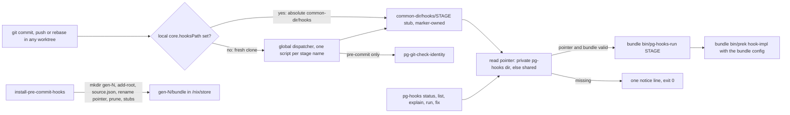
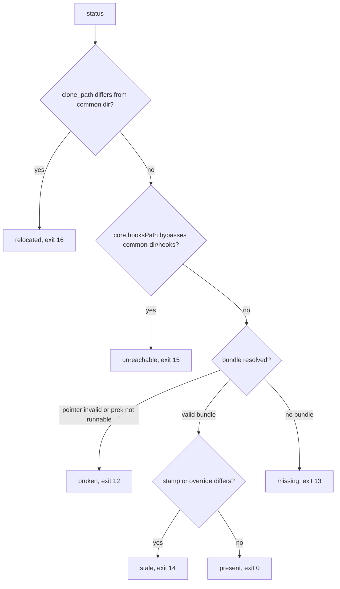

# Git hooks: the per-clone hook bundle and `pg-hooks`

This page is the canonical reference for how git hooks work in the repos that consume
`flakeModules.pre-commit`, and for the `pg-hooks` command. It documents behavior that exists in
`modules/pg-hooks/` and `flake-modules/pre-commit.nix`. The design and its rulings live in
`docs/superpowers/specs/2026-10-01-per-clone-hook-bundle-design.md`; the decision to make the bundle
the only mechanism is [ADR 0032](adr/0032-per-clone-hook-bundle-replaces-generated-config-and-shim.md).

Contents: [Overview](#overview), [Stages](#stages), [The `pg-hooks` command](#the-pg-hooks-command),
[Messages](#messages), [Exit codes](#exit-codes), [Bundle layout](#bundle-layout),
[Staleness](#staleness), [Old config symlinks](#old-config-symlinks), [Configuration](#configuration),
[Operator runbook](#operator-runbook), [Open follow-ups](#open-follow-ups).

## Overview

A hook bundle replaces the old per-worktree `.pre-commit-config.yaml` symlink and the commit-time
`nix run` shim. The repo's flake renders a bundle (prek, the prek config, the fixer list, the stage
list, a runner and a library). `install-pre-commit-hooks` roots that bundle against the clone's git
common directory and writes static stubs into `<git-common-dir>/hooks`. A stub finds the bundle through a
pointer file and runs it, so no nix runs at hook time and nothing is written into a working tree.

Policies that hold everywhere on this page:

- A git hook MUST NOT invoke nix (HK-2). Stubs and the runner need only `sh`, `git` and the bundle.
- Nothing MUST be written into a working tree to make hooks run.
- Agents MUST NOT write `core.hooksPath`, and MUST NOT push.
- A missing bundle at hook time is a notice and exit 0; it never blocks a commit.
- Every `pg-hooks:` message goes to stderr. stdout carries only the requested output of `status`,
  `list` and `explain`.



## Stages

`pg-hooks run <stage>` and `pg-hooks explain <stage>` accept exactly the stage names in the first
table (the `stages` vocabulary of `pg-hooks.sh`). The second table lists the workflow entry points
that are not git stages.

| Stage                | Triggered by                                      |
| -------------------- | ------------------------------------------------- |
| `pre-commit`         | `git commit`                                      |
| `pre-merge-commit`   | `git merge`, before the merge commit              |
| `pre-push`           | `git push`                                        |
| `pre-rebase`         | `git rebase`                                      |
| `commit-msg`         | `git commit`, message check                       |
| `prepare-commit-msg` | `git commit`, message preparation                 |
| `post-checkout`      | `git checkout`, `git switch`, `git worktree add`  |
| `post-commit`        | `git commit`, after the commit is made            |
| `post-merge`         | `git merge`, `git pull`                           |
| `post-rewrite`       | `git commit --amend`, `git rebase`, after rewrite |
| `manual`             | nothing automatic; only `pg-hooks run manual`     |
| `pre-land`           | `ff-merge-to-main` FF-1b, before a land           |

`pre-land` is a `pg-hooks` pseudo-stage, not a git hook: it runs the `pre-commit` hooks over the
branch diff. `manual` never gets a stub.

| Entry point      | Configured by                             | Used by                                               | Run directly   |
| ---------------- | ----------------------------------------- | ----------------------------------------------------- | -------------- |
| `pre-commit-fix` | `fixers`                                  | an agent or operator after `git add`, never by a hook | `pg-hooks fix` |
| `post-land`      | not available yet (deferred, `pg2-na2nr`) | nothing                                               | none           |

Which stages actually fire in a clone is decided by the bundle: a stub is written only for a stage
that has at least one configured prek hook (`stages.json`), restricted to real client-side hook
names. Hooks are configured per repo through `phillipgreenii.pre-commit.extraHooks`; each hook's own
`stages` decides where it runs. Nothing else configures hooks (no per-worktree file, no git config
key).

## The `pg-hooks` command

`pg-hooks` is on PATH after `pn workspace apply` (the `homeModules.pg-hooks` home module, built from
`modules/pg-hooks`). Run with no arguments it prints usage and the common-tasks block. `pre-commit-fix`
is a second name for `pg-hooks fix`, delivered as its own tiny wrapper because agents and tool
approvers match commands by exact name.

| Command                                                       | What it does                                                                             |
| ------------------------------------------------------------- | ---------------------------------------------------------------------------------------- |
| `pg-hooks status [--porcelain]`                               | Report the bundle state. The exit code carries the state.                                |
| `pg-hooks list`                                               | List the stages that have configured hooks, plus `pre-land` when `pre-commit` has hooks. |
| `pg-hooks explain <stage>`                                    | Show what triggers a stage, what it runs and which hooks it holds.                       |
| `pg-hooks run <stage> [files...\|--all-files] [-- prek-args]` | Run a stage's hooks now, over the staged files by default.                               |
| `pg-hooks fix`                                                | Apply the repo's fixers to the staged files and restage the files they changed.          |

Common tasks:

```text
before committing:  git add <files>; pg-hooks fix; git commit
before landing:     pg-hooks run pre-land
diagnose:           pg-hooks status
```

### `status`

`status` prints these lines to stdout (`--porcelain` prints `key=value`, the human form prints
`key:` with padding). Callers MUST parse `--porcelain` and MUST NOT parse prose:

```text
state=<present|stale|missing|broken|unreachable|relocated>
bundle=<path of the selected bundle, or empty>
generation=<gen-N, or empty>
stages=<comma list, or empty>
reinstall=<the exact command that rebuilds the bundle>
```

The human form also prints the matching message from the [messages](#messages) table to stderr.
`status` exits non-zero for most states by design, so a caller reads the `state=` line, not the exit
code.

| State         | Exit | Meaning                                                                                 |
| ------------- | ---- | --------------------------------------------------------------------------------------- |
| `present`     | 0    | A valid bundle whose stamp matches.                                                     |
| `broken`      | 12   | The pointer is invalid, or `bin/prek` or `bin/pg-hooks-run` is not executable.          |
| `missing`     | 13   | No bundle. A leftover `.pre-commit-config.yaml` does not count as one.                  |
| `stale`       | 14   | The bundle's stamp, or a recorded override, differs from now.                           |
| `unreachable` | 15   | git does not run hooks from `<common-dir>/hooks` (a `core.hooksPath` bypasses it).      |
| `relocated`   | 16   | The recorded `clone_path` differs from this clone's common dir (moved or copied clone). |

State precedence is `relocated`, then `unreachable`, then `broken`, then `stale`, then `present`.
With no bundle: `unreachable` if hooks are unreachable, else `missing`.



A `core.hooksPath` that resolves to `<common-dir>/hooks` is fine. A global or system value is fine
only when it names the dispatcher, meaning a directory that holds an executable `pre-commit` (the
dispatcher chains to `<common-dir>/hooks`).

### `list` and `explain`

Both read `stages.json` from the bundle, so they need a bundle. With no bundle they exit 13. A broken
bundle exits 12. `explain` of an unknown stage exits 2.

### `run`

`pg-hooks run <stage>` changes to the work-tree root and runs
`<bundle>/bin/prek -q run -c <bundle>/prek-config.json --hook-stage <stage> ...`.

- Bare arguments are file paths (made relative to the work-tree root). With no paths and no
  `--all-files`, prek runs over the staged files.
- `--all-files` passes through. Giving both file paths and `--all-files` exits 2.
- `--` forwards everything after it to prek unchanged. Any other `-option` before `--` exits 2.
- `run` needs a bundle. With none it prints the no-bundle notice and exits 13; a leftover
  `.pre-commit-config.yaml` is never read.
- A failing hook prints the hooks-failed hint after prek's output and exits 10.
- After `PG_HOOKS_PROGRESS_AFTER_S` seconds (default 3, `0` disables) one progress line is printed
  to stderr.
- `-q` is prek's global quiet flag. Verified on the pinned prek 0.3.11: it suppresses the per-hook
  "Passed" lines and the "Using config file" line on success, and still prints a failing hook's
  output in full. So a passing run is silent.

`pg-hooks run pre-land [<ref>]` runs the `pre-commit` stage over the branch diff, with
`--from-ref <primary> --to-ref <ref>`:

- `<ref>` defaults to `HEAD`. It MUST be the commit checked out in the current worktree, because prek
  reads working-tree files. Anything else exits 2 and names the commit that is checked out.
- `<primary>` resolves as git config `pgii-integrate-branch.primaryBranch`, then
  `git symbolic-ref refs/remotes/origin/HEAD`, then `main`. If it does not resolve to a commit, the
  run exits 2.
- `pre-land` does not take `--all-files` (exit 2).
- `ff-merge-to-main` FF-1b runs this command. On exit 13 it records the notice line in the land
  outcome and continues; on exit 10 it stops the land. When `pg-hooks` is not on PATH (exit 127) a
  caller MUST report `pg-hooks not installed on this machine; ask the operator to run pn workspace
apply` and continue.

### `fix`

`pg-hooks fix` (alias `pre-commit-fix`) runs the bundle's fixers over the STAGED files of this
checkout and restages only the files a fixer changed. It calls the fixer tools directly, never
`prek run`, because prek's hooks are check-mode. Run `git add` first.

- It takes no arguments. With nothing staged it exits 0.
- It operates on added, copied, modified and renamed staged files that still exist. It never stages
  an untracked or unstaged file.
- It exits 2 while a merge, rebase (including `git am`), cherry-pick or revert is in progress in this
  checkout, because fixers restage files.
- The repo's `exclude` (a prek regex from the prek config) is applied with `grep -E`. Fixer
  `includes` and `excludes` are shell globs, so `*` also crosses `/`.
- A file with both staged and unstaged changes is skipped untouched. After the run, `fix` prints one
  line per skipped file and exits 11:
  `pg-hooks: fix skipped <file>: it has staged and unstaged changes. Run: git add <file> && pg-hooks fix (or git restore --staged <file>)`.
- Fixers run in the order of the bundle's `fixers.json`. The default order is `treefmt`, `statix`
  (once per staged `*.nix` file, because `statix fix` takes one target), `treefmt` again,
  `trailing-whitespace`, `end-of-file-fixer`. A repo inserts more by anchor (see
  [Configuration](#configuration)).
- A fixer that exits non-zero is retried once on the same files, because some fixers exit 1 after
  fixing a file. A second failure is a real failure.
- `treefmt` runs to convergence: it repeats until the files stop changing, at most 5 passes. If it
  does not converge, `fix` prints `pg-hooks: fixer <name> did not converge in 5 passes; the files may change again on the next run.`
  and continues.
- File lists are batched at most 200 paths per invocation. ruff MUST NOT be given `--unsafe-fixes`.
- A fixer failure exits 10 after
  `pg-hooks: fixer <name> failed on <files> (exit <n>); its output follows:`, the tool's full
  output, and `Fix by hand, git add the file(s), then rerun pg-hooks fix.`
- `fix` appends one JSON line per fixer per run (`tool`, `files`, `seconds`, `exit`) to
  `${XDG_STATE_HOME:-$HOME/.local/state}/pg-hooks/timings.jsonl`. An unwritable state directory does
  not fail the run.
- `fix` needs a bundle: with no bundle it exits 13, and with an invalid `fixers.json` it exits 12.

A fixer MUST NOT be run from a git hook and MUST NOT be attached to a prek stage.

## Messages

Every message starts with `pg-hooks:` and goes to stderr. The texts are fixed, because callers and
tests match them.

| Situation                               | Text                                                                                                                                                                  |
| --------------------------------------- | --------------------------------------------------------------------------------------------------------------------------------------------------------------------- |
| no bundle, canonical clone              | `pg-hooks: no hook bundle for <repo>; <stage> hooks not run. Fix: (cd <canonical> && nix run .#install-pre-commit-hooks)`                                             |
| no bundle, plain worktree               | `pg-hooks: no hook bundle for <repo> (shared bundle lives in <canonical>); <stage> hooks not run. Fix: (cd <canonical> && nix run .#install-pre-commit-hooks)`        |
| no private bundle, set member           | the same text, with the private `reinstall` line as the fix                                                                                                           |
| broken bundle                           | `pg-hooks: hook bundle for <repo> is broken (<reason>). Rebuild: <reinstall>`                                                                                         |
| stale bundle                            | `pg-hooks: hook bundle is stale for <repo> (built <built_at>). Rebuild: <reinstall>`                                                                                  |
| stale, a recorded override changed      | the stale text with ` (override <name> changed)` after the built time                                                                                                 |
| worktree differs from the shared bundle | `pg-hooks: this worktree's hook definitions differ from the shared bundle; the old hooks ran. To test your hook changes: <private reinstall command>`                 |
| unreachable hooks                       | `pg-hooks: git does not run hooks from <common-dir>/hooks (core.hooksPath=<value> from <origin>). Operator: git -C <canonical> config --local --unset core.hooksPath` |
| relocated clone                         | `pg-hooks: this clone moved from <clone_path>; its bundle is no longer GC-rooted. Rebuild: <reinstall>`                                                               |
| hooks failed                            | `pg-hooks: <stage> hooks failed in <repo>. Auto-fixable formatting: run 'pg-hooks fix', then git add and commit again. Other failures: fix by hand.`                  |
| progress (after 3 s, once)              | `pg-hooks: running <stage> hooks in <repo>...`                                                                                                                        |

A rebuild is a nix build. Agents MUST run it through `bgrun` and check it with `bgcheck`. The
installer's own refusals are in [Installer](#installer).

## Exit codes

`1` is a generic failure and is never given a branchable meaning. Branch only on the codes below.

| Code | Meaning                                                                               |
| ---- | ------------------------------------------------------------------------------------- |
| `0`  | success or nothing to do                                                              |
| `1`  | generic failure, no branchable meaning                                                |
| `2`  | usage error, unknown stage, refused operation, or not in a git repository             |
| `10` | a hook or fixer failed                                                                |
| `11` | file(s) skipped because they have staged and unstaged changes                         |
| `12` | bundle broken (pointer invalid, or `bin/prek` not runnable)                           |
| `13` | no bundle (`run`, `fix`, `list`, `explain`)                                           |
| `14` | `status` only: bundle stale                                                           |
| `15` | `status` only: hooks unreachable (`core.hooksPath` does not resolve to the hooks dir) |
| `16` | `status` only: clone relocated                                                        |

Exit codes at the other seams:

- A git hook (the stub) exits 0 on "no bundle". With a bundle it returns prek's exit status
  unchanged. A bundle whose `bin/prek` is not executable prints the broken-bundle message and exits 12.
- `127` means `pg-hooks` is not on PATH. Stubs do not depend on PATH.
- `pg-hooks-install` (see [Installer](#installer)) exits 0, 2 for a refusal or usage error, and 1
  for anything unexpected.

## Bundle layout

The flake output `packages.<system>.pg-hooks-bundle` (present unless `bundle.enable = false`; also
exposed as `legacyPackages.<system>.pgHooksBundle`) is a store path holding:

```text
bin/prek                  the repo's locked prek
bin/pg-hooks-run          the stage runner
lib/pg-hooks-lib.bash     the library shared with the pg-hooks command
prek-config.json          the rendered prek config (embeds hook store paths, which roots their closure)
stages.json               stage -> [{ id, reason }]
fixers.json               the resolved, ordered fixer list
meta.json                 { repo, stampPaths, stages }
```

Per clone, in the git common directory:

```text
<common-dir>/pg-hooks/
  current                 regular file, one line matching ^gen-[0-9]+$
  reinstall               regular file, one line: the exact command that rebuilds this bundle
  stale-warned-<stamp>    marker for the once-per-stamp stale warning (under the checkout's own <git-dir>/pg-hooks)
  gen-7/bundle        ->  /nix/store/...-pg-hooks-bundle   (nix indirect GC root, never moved)
  gen-7/source.json       { stamp, overrides, clone_path, built_at }
  gen-6/...               previous generation
```

A private bundle (for a workforest set member) has the same layout under the worktree's own git
directory, `$(git rev-parse --absolute-git-dir)/pg-hooks`. A hook or `pg-hooks` command uses the
private directory when it holds a `current` file, else the shared one.

Rules:

- `current` MUST be a regular file replaced by `rename(2)` from a temp file in the same directory.
  A symlink swap is not atomic for concurrent readers on APFS, and BSD `mv -f` onto a
  symlink-to-directory silently fails, so a symlink pointer MUST NOT be used.
- A reader MUST read `current` once, validate it against `^gen-[0-9]+$`, and resolve everything
  under that one generation. A pointer that is empty, has path separators, or is a symlink is
  invalid (`broken`, 12).
- The installer claims generation N (1 plus the largest existing) with `mkdir gen-N`, which is
  atomic, and retries with N+1 if it exists. Concurrent installs each get their own generation and
  the last writer wins.
- A generation directory MUST NOT be moved after `nix-store --add-root --indirect`: the GC root
  names the out-link path.
- Pruning keeps the generation named by `current` and the highest complete generation below it. It
  never deletes `current`, `reinstall`, the stale-warned markers, generations above `current`, or a
  generation with no `source.json` (a concurrent install may own it).
- All git paths are requested with `--path-format=absolute`.

### Stubs

A stub at `<common-dir>/hooks/<stage>` is static POSIX sh with no store path. Its second line is
`# managed-by: pg-hooks`. It chooses the private bundle directory if it has `current`, else the
shared one; reads and validates `current`; and runs `gen-N/bundle/bin/pg-hooks-run <stage> "$@"`
with `PG_HOOKS_BUNDLE` set. If the pointer or the runner is missing, it prints the no-bundle notice
and exits 0.

`pg-hooks-run` warns about staleness (see below), runs
`<bundle>/bin/prek -q hook-impl --config <bundle>/prek-config.json --hook-type <stage> --hook-dir <common-dir>/hooks --script-version 4 -- "$@"`
as a child with stdin and arguments passed through, and returns prek's exit status. On a non-zero
status it prints the hooks-failed hint after prek's own output.

### Installer

`install-pre-commit-hooks` keeps its name. Unless `bundle.enable = false` it execs
`pg-hooks-install --bundle <store path> "$@"`; the script text embeds the bundle's store path, so
`nix run [--override-input ...] .#install-pre-commit-hooks` realises the bundle with the same
overrides, and the installer only roots it. It never calls `nix build`, never writes
`core.hooksPath`, and the devShell installs nothing.

| Flag                       | Meaning                                                                                                      |
| -------------------------- | ------------------------------------------------------------------------------------------------------------ |
| `--bundle <path>`          | The built bundle (supplied by the wrapper).                                                                  |
| `--private`                | In a linked worktree: install a worktree-only bundle. In the canonical clone it is a plain install.          |
| `--override <name>=<path>` | Repeatable. Records the path's HEAD and dirty state in `source.json`; pn passes its `--override-input` pins. |

- Canonical clone: claim `gen-N`, add the root, write `source.json`, swap `current`, write
  `reinstall`, prune, then write or refresh the stubs.
- Linked worktree without `--private`: refused with exit 2 and
  `pg-hooks: install refused in a linked worktree; the shared bundle belongs to <canonical>. Run there: (cd <canonical> && nix run .#install-pre-commit-hooks), or add --private for a worktree-only bundle.`
- `--private` writes only under the worktree's git directory. It MAY add a stub for a stage that has
  none, and MUST NOT rewrite or remove an existing stub.
- Stubs: a file carrying `# managed-by: pg-hooks` or the legacy prek marker `File generated by prek`
  is replaced. Own stubs for stages that no longer have hooks are removed. A foreign file at a
  needed stage refuses the install (exit 2) before anything changes:
  `pg-hooks: install refused: <path> is not managed by pg-hooks (first line: <line>). Move it aside or chain it yourself, then rerun: <reinstall>`.
- The `reinstall` line is `(cd <canonical> && nix run .#install-pre-commit-hooks)` for the canonical
  clone, and `(cd <worktree> && nix run <pins> .#install-pre-commit-hooks -- --private <overrides>)`
  for a private bundle.

## Staleness

The stamp is `git ls-files -s -- <inputs> | git hash-object --stdin`. It reads the index, so a staged
edit counts. The inputs are `flake.lock`, `flake.nix` and the repo's `stampPaths` (from
`meta.json`). The bundle reflects the working tree at install time while the stamp reflects the
index, so an unstaged edit at install time is in the bundle but not in the stamp; that is accepted.
With no tracked input the stamp is `unknown` and nothing warns.

`pg-hooks-run` warns only on `pre-commit` and `pre-push`, and at most once per (checkout, stamp): it
writes a marker `stale-warned-<stamp>` under the checkout's own `<git-dir>/pg-hooks`, so a rebase that
replays many commits prints one line. A recorded override whose HEAD differs, or whose dirty state
differs, adds ` (override <name> changed)`. A plain worktree on the shared bundle whose own stamp
inputs differ gets the worktree-differs message, which names the private reinstall command. Hooks
still run when the bundle is stale.

`ff-merge-to-main` FF-4a refreshes the canonical clone's bundle after a successful land that touches
a stamp input: it runs `<canonical>/.git/pg-hooks/reinstall` in the background through `bgrun`. A
failure is reported in the land outcome and never fails the land.

## Old config symlinks

The per-clone bundle is the only hook mechanism. A clone that still holds the old
`.pre-commit-config.yaml` symlink (ADR [0016](adr/0016-gitignore-generated-pre-commit-config.md)) but
no bundle reports `state=missing` and exits 13 from `run`, `fix`, `list` and `explain`; the file is
never read. Install the bundle to fix it.

- Tooling MUST NOT link, copy or regenerate a hook config to make hooks run, and MUST NOT read a
  leftover `.pre-commit-config.yaml`.
- The probe for "does this repo have hooks" is `pg-hooks status --porcelain`, never
  `test -f .pre-commit-config.yaml`: a bundle repo has no such file in its working tree yet its hooks
  are live.
- The `.gitignore` line for `.pre-commit-config.yaml` and the `pre-commit-config-gitignored` check
  stay until no clone holds the old symlink (see [Open follow-ups](#open-follow-ups)).

Workforest sets use the shared bundle by default. pn's set setup builds a private bundle with the
set's pins (`--private` plus the `--override` pins) after the worktree exists, so a set that changes
a producer tests that change in its own hooks. After the agent edits the producer, the private bundle
is stale and the stale line names the private reinstall command.

## Configuration

Each repo configures hooks in its `flake.nix` through `phillipgreenii.pre-commit`:

| Option          | Meaning                                                                                                                                                             |
| --------------- | ------------------------------------------------------------------------------------------------------------------------------------------------------------------- |
| `extraHooks`    | Extra prek hooks. Each hook's `stages` decides where it runs.                                                                                                       |
| `excludes`      | Path excludes (prek regexes).                                                                                                                                       |
| `fixers`        | Extra fixers for `pg-hooks fix`: `{ name, command, mode, includes, excludes, after, before }`.                                                                      |
| `stampPaths`    | Repo-relative paths hashed into the stamp in addition to `flake.lock` and `flake.nix`.                                                                              |
| `bundle.enable` | Render the bundle and make `install-pre-commit-hooks` install it. Default `true` (ADR 0032); `false` installs no hooks (the installer prints a notice and exits 0). |

`fixers`: an entry without `after` or `before` is appended after the default fixers; with an anchor
it is inserted directly after or before the named fixer (an anchor MAY name another added fixer).
`mode = "per-file"` runs the command once per file. Evaluation fails, when `bundle.enable` is set,
for: duplicate fixer names; an unknown or
unresolvable anchor, or both `after` and `before`; a fixer carrying a stage; and any enabled prek hook
whose `entry` invokes `pg-hooks fix` or `pre-commit-fix`. An unknown stage name is rejected by
git-hooks.nix's own stage type.

Hook definitions that arrive through `flake.lock` need no `stampPaths`; repo-base itself lists
`flake-modules/pre-commit.nix` and `modules/pg-git-check-identity` because its hooks live in the repo.

The global dispatcher (the personal repo's `home/programs/git`, one script registered under every
client-side hook name) exists so that a fresh clone with no local `core.hooksPath` still reaches
`<common-dir>/hooks`. It runs `pg-git-check-identity` first on `pre-commit`, then execs
`<common-dir>/hooks/<stage>` when that file is executable, else exits 0. A local `core.hooksPath`
shadows the dispatcher entirely; one equal to the absolute `<common-dir>/hooks` is correct, and any
other local value is reported as `unreachable`.

pn reads the bundle state for its install gate ("already installed" means the pointer is valid, the
bundle is live, the stamp matches and every recorded override is unchanged), runs
`pg-hooks run pre-commit --all-files` per clone for `pn workspace pre-commit-check`, and its doctor
check `pre-commit-hook-live` reports, for repos whose `pn-workspace.toml` entry runs
`install-pre-commit-hooks`: a missing pointer, a broken or dangling bundle, a relocated clone,
unreachable hooks, and missing or foreign stubs.

## Operator runbook

These steps are for the operator. Agents MUST NOT run them.

1. `pn workspace apply` puts `pg-hooks` and `pre-commit-fix` on PATH and ships the dispatcher.
   Afterwards, `command -v pg-hooks` succeeds.
2. For a repo that has set `bundle.enable = true`, install in its canonical clone:
   `(cd <canonical> && nix run .#install-pre-commit-hooks)`, then `pg-hooks status` and one real commit.
3. If `status` reports `unreachable`, remove the local `core.hooksPath` that bypasses the hooks
   directory, or point it at the absolute `<common-dir>/hooks`:
   `git -C <canonical> config --local --unset core.hooksPath` (the message names the exact command).
4. `pn workspace push` publishes a producer repo before its consumers relock onto it.

## Open follow-ups

Dated 2026-10-03. This section is the only part of the page that goes stale; the rest describes the
code.

- Retiring the ADR 0016 `.gitignore` line and `checks.pre-commit-config-gitignored` MUST wait until
  the repos are pushed and relocked and no clone holds the old symlink. Consumer flakes MUST NOT drop
  `bundle.enable = true` or their `.gitignore` lines before that relock.
- The pn Go cleanup (the githooks-shim doctor check and the remaining link code) is tracked as
  `pg2-o1fle`.
- Not available yet: the drift guard, and the `post-land` entry point (deferred, `pg2-na2nr`).
