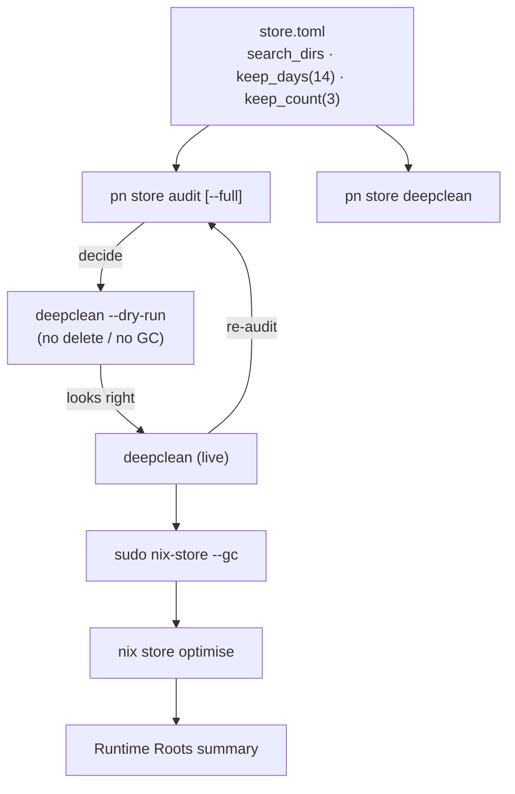
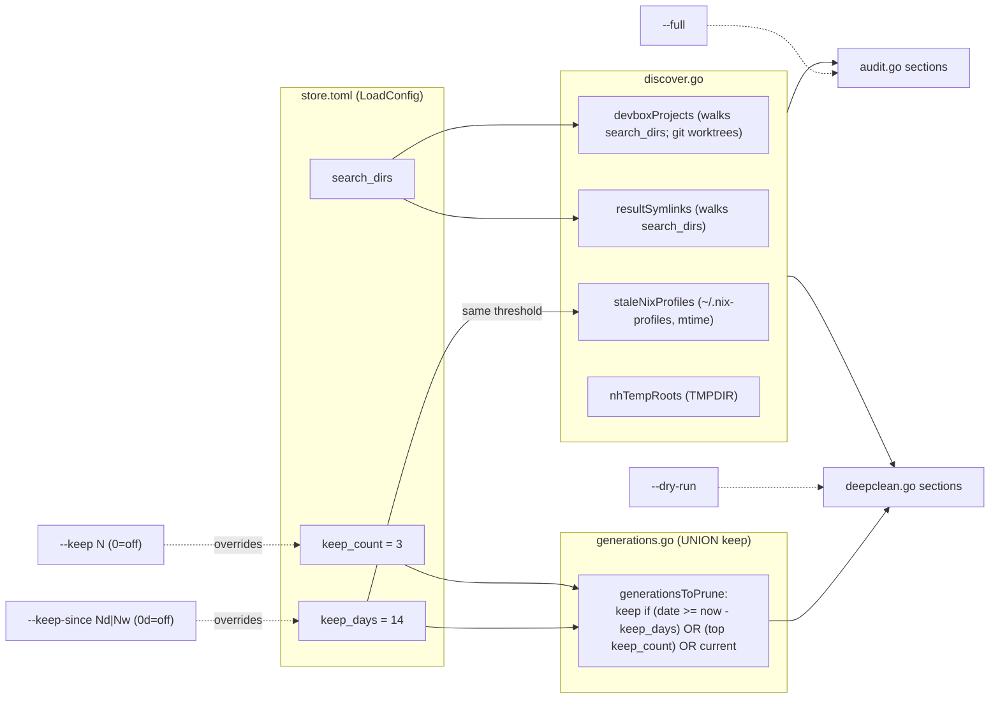

# pn store — Nix store maintenance

`pn store` audits and reclaims space in the local Nix store. It has two commands:

- `pn store audit` — read-only report of profile generations, closure sizes, and store volume usage.
- `pn store deepclean` — prunes old generations and stale GC roots, garbage-collects, then optimises (hard-links duplicate files in) the store.

> Versioning and `--help` are owned by cobra: use `pn --version` and `pn store <cmd> --help`.
> There are no per-subcommand version flags.

## Configuration — `~/.config/pn/store.toml`

| Key           | Type       | Default | Meaning                                                                              |
| ------------- | ---------- | ------- | ------------------------------------------------------------------------------------ |
| `search_dirs` | `[string]` | `[]`    | Roots scanned for devbox project profiles and `result` symlinks. Use absolute paths. |
| `keep_days`   | `int`      | `14`    | Time-based retention: generations newer than this are protected from pruning.        |
| `keep_count`  | `int`      | `3`     | Count-based retention: the N most recent generations are protected from pruning.     |

A missing file or missing key falls back to the defaults above. Example:

```toml
search_dirs = ["/Users/me/projects"]
keep_days = 7
keep_count = 5
```

The `keep_days` value is reused as the mtime threshold for stale `~/.nix-profiles/` entries.

## Retention semantics — UNION keep

A generation is **kept** if it satisfies **any** of:

1. It is the `(current)` generation (always kept).
2. Count protection: it is among the most recent `keep_count` generations (`keep_count = 0` disables this).
3. Time protection: its date is on or after `now - keep_days` days (`keep_days = 0` disables this).

Everything else is pruned. Because the rule is a **union**, raising either bound keeps more;
to prune aggressively you MUST lower **both** (`--keep-since 0d --keep 1`).

## `pn store audit`

```
pn store audit [--full]
```

Emits these sections, in order:

1. `System Profiles` — generations + closure size for `/nix/var/nix/profiles/system` (uses sudo to list).
2. `Home Manager` — the HM profile, or `(not installed)`.
3. `User Profiles` — each profile under `~/.local/state/nix/profiles/` (excluding `home-manager` and generation links).
4. `Devbox Global` — the devbox global profile, or `(not installed)`.
5. `Devbox Projects` — devbox profiles discovered under `search_dirs` (follows git worktrees), or `(no search dirs configured)`.
6. `Nix Store` — `Volume used: <size>` (the `/nix/store` APFS volume's own used bytes; macOS-only via `df`+`diskutil`).

`--full` adds `Reclaimable (dead paths): <size>` to the `Nix Store` section. This estimate runs
`sudo nix-store --gc --print-dead` and is slow.

> Audit has no `Devbox Util` section — that profile is only handled by `deepclean`.

## `pn store deepclean`

```
pn store deepclean [--dry-run] [--keep-since <Nd|Nw>] [--keep <N>]
```

| Flag                    | Default             | Meaning                                                                                |
| ----------------------- | ------------------- | -------------------------------------------------------------------------------------- |
| `--dry-run`             | off                 | Show what would be cleaned; perform no deletes and no GC.                              |
| `--keep-since <Nd\|Nw>` | config `keep_days`  | Time retention. `<N>d` days or `<N>w` weeks (×7). `0d` disables time protection.       |
| `--keep <N>`            | config `keep_count` | Count retention. `0` disables count protection. The current generation is always kept. |

It processes these sections, in order, pruning per the retention rule above:

1. `System Profiles` (sudo)
2. `Home Manager` — if an orphaned standalone HM profile is detected (the standalone profile coexists
   with a darwin-integrated `current-home`), it removes the profile symlink + generation links; otherwise prunes generations.
3. `User Profiles`
4. `Devbox Global`
5. `Devbox Util`
6. `Devbox Projects` (from `search_dirs`)
7. `Result Symlinks` — `result` / `result-*` symlinks pointing into `/nix/store` under `search_dirs`.
8. `Stale Nix Profiles` — symlinks under `~/.nix-profiles/` older than `keep_days`.
9. `NH Temp Roots` — `nh-darwin*/result` symlinks under `$TMPDIR`.

Then a `Summary`:

- **Dry run:** `DRY RUN — no changes made`, per-category `Would prune` counts, and a `Reclaimable estimate (dead paths)`.
- **Live:** `Store before:`, the live-streamed `sudo nix-store --gc` output, an
  `Optimising store (hard-linking duplicate files)...` line followed by the live-streamed
  `nix store optimise` output, `Store after:`, per-category `Pruned generations:` counts, and a
  `Runtime Roots` summary (store paths held only by running processes — restarting apps and
  re-running may free more). Optimise runs **after** GC so it never optimises soon-to-be-deleted
  paths, and is the batched replacement for `auto-optimise-store` (disabled so flake-update fetches
  stay fast).

## User journeys

### Disk is full — diagnose, preview, reclaim, confirm

1. `pn store audit --full` — see `Volume used` and `Reclaimable (dead paths)`.
2. `pn store deepclean --dry-run` — preview prune counts; nothing is deleted.
3. `pn store deepclean` — prune + GC (watch GC stream live).
4. `pn store audit` — confirm `Volume used` dropped.

### Routine maintenance with custom retention

1. Set `keep_days` / `keep_count` in `store.toml`.
2. `pn store deepclean --dry-run` to confirm, then `pn store deepclean`.

### Aggressive one-off reclaim

`pn store deepclean --dry-run --keep-since 0d --keep 1`, then drop `--dry-run`.
Keeps only the most recent + current generation everywhere.

### First run / no config

Works with built-in defaults (`keep_days=14`, `keep_count=3`, no `search_dirs`).
`Devbox Projects` / `Result Symlinks` report empty until you add `search_dirs`.



## How the parts link together



## Implementation

The commands are implemented in Go under `modules/pn/internal/store/` (ported from the original
`pn-store-audit.sh` / `pn-store-deepclean.sh` / `pn-lib.bash`). See
[`docs/superpowers/plans/2026-06-26-pn-store-parity.md`](superpowers/plans/2026-06-26-pn-store-parity.md)
for the parity port and per-helper behavior spec.
