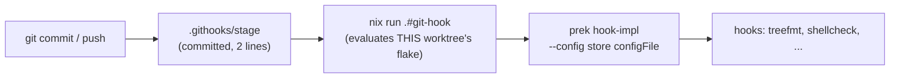
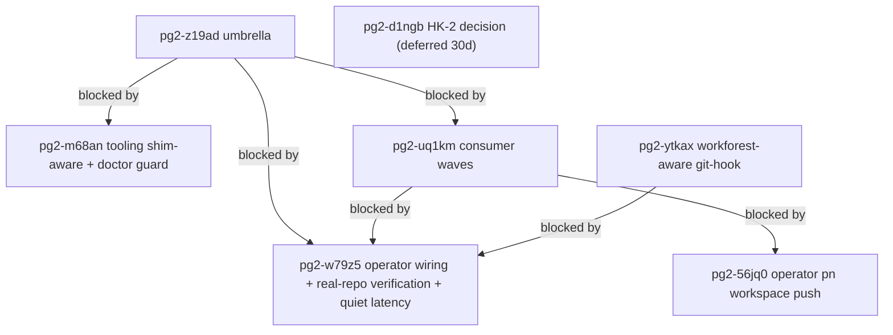

# Commit-time hook shim experiment — design, evidence, review, and handoff

**Date:** 2026-10-01
**Status:** In progress (pilot LANDED locally in repo-base, NOT wired, NOT pushed)
**Umbrella bead:** `pg2-z19ad` (siblings `pg2-bvldq`, `pg2-ff0i`). **Decision record:** ADR
[0029](../../adr/0029-commit-time-hook-shim-experiment.md). **HK-2 decision bead:** `pg2-d1ngb`
(deferred 30 days).

This document is the durable record of a long operator session. Everything an agent needs to
continue is here or in the beads linked below. Nothing in this session's `/tmp` scratch is
required; the useful parts are reproduced here.

## 1. Operator rulings (2026-10-01, Phillip)

1. **HK-2 stays as is.** Verbatim: _"leave HK-2 as is, but continue with this proposed design. we
   will use it as a research experiment to see if HK-2 should be changed or an exception is to be
   added"_. HK-2 (a git hook MUST NOT invoke nix, at any stage; see the AMENDED HK-2 comment in
   `flake-modules/pre-commit.nix`) is unchanged. The shim is a labelled, opt-in exception.
2. **`core.hooksPath` form: RELATIVE `.githooks`.** This was chosen against the independent
   reviewer's recommendation of an absolute canonical path. Consequence: a branch or worktree whose
   tree lacks `.githooks/` is silently ungated, and the checked-out branch supplies the hooks.
3. **Keep the generated `.pre-commit-config.yaml` symlink** in opted-in repos (tooling reads it).
4. **Scope of the first pass:** repo-base only, local only. Pushing is operator-only.
5. Earlier mandate (2026-08-24, verbatim, still the motivation): _"there has been too much turnover
   and toil when it comes to how best to handle the config of the hooks. sometimes it git sometimes
   its prek or pre-commit. i'm tired of seeing issues related to it. there needs to be a deep dive
   on how best to handle hooks and prek in our setup. no more quick wins or stacked patches. lets
   figure out the proper way things should be configured, do it and then document it and have a
   rule/skill to ensure it stays."_

## 2. Root cause (why the old setup keeps failing)

Every generated hook entry in `.pre-commit-config.yaml` is `language: system` with a hard-coded
absolute `/nix/store` path (for example `deadnix`, `statix`, `shellcheck`, `treefmt`, the
`run-unit-tests` and `check-git-identity` scripts). That config therefore cannot be committed, so
it is generated per checkout and symlinked in. That one choice produces the whole failure family:

- the installer (git-hooks.nix) writes a **relative** `core.hooksPath` (`.git/hooks`); in a linked
  worktree `.git` is a file, so git silently skips every hook (class 1);
- the symlink is **absent in a fresh worktree**, so commits abort with "config file not found",
  and some worktrees got self-referential symlinks (class 2);
- the store path is **garbage-collected** out from under the installed shim (class 3);
- two different store configs are live in one repo and the last install wins (class 4);
- cross-repo drift and install cost (class 5).

Origin: `mkPreCommitHooks` was extracted into repo-base on 2026-04-28 with no recorded rationale;
ADR-0016 (2026-07-01) gitignored the symlink and rejected committing a dereferenced config as
duplicating the source of truth. Since then six patches were stacked in `flake-modules/pre-commit.nix`
(`correctRelativeHooksPath`, `hardenPrePushHook`, `absolutizeHookConfigPath`, the neutralize/restore
fragments). Commit `3aef7a7` bakes the store path into the shim on purpose, which makes the GC failure
permanent.

## 3. The design (an opt-in experiment)



- `phillipgreenii.pre-commit.commitTimeShim.enable` (default `false`) and `.stages` (default
  `[ "pre-commit" ]`) in `flake-modules/pre-commit.nix`.
- `packages.git-hook`: `prek hook-impl --config <preCommit.config.configFile> --hook-type "$1"
--hook-dir "$PWD" -- "${@:2}"`. The handle is `preCommit.config.configFile`.
- Committed shims `.githooks/<stage>`: `exec nix run --quiet .#git-hook -- <stage> "$@"`.
- `packages.install-pre-commit-hooks` (never the devShell) sets `core.hooksPath` to `.githooks`.
  The devShell only refreshes the `.pre-commit-config.yaml` symlink (`ln -sfn`).
- `checks.pre-commit-githooks-wired`: fails on a missing, non-executable, altered or extra shim and
  when the shim stages differ from the stages the generated config uses. Mutation-tested (four
  mutations each fail; a correct tree passes).
- The hook definitions (`treefmt`, `shellcheck`, `statix`, `deadnix`, `extraHooks`, `excludes`,
  `stages`) are UNCHANGED, and `checks.pre-commit` is unchanged.

Landed state in repo-base `main` (local only): `489f7bd` (option + check + ADR 0029) and `b8448aa`
(pilot enablement: `flake.nix` option true, `.githooks/pre-commit`).

Why nix is invoked per commit: `nix run` evaluates the worktree's own flake, so a hook-definition
edit takes effect on the next commit with no reinstall, and nothing in the checkout holds a store
path to be collected, diverge, or be missing. The cost is HK-2: a hook invoking nix.

## 4. Evidence gathered

Prototype in a throwaway clone (`/tmp/hookproto-1790836410`, may be gone), then real git:

- Real `git commit` and `git push` fire the hook in a canonical clone, a nested worktree
  (`.worktrees/`), a sibling-path worktree, and from a subdirectory. 30 of 31 checks passed; the one
  failure was a bug in the test script (a relative pathspec committed from a subdirectory), not the
  design. Covered: good commit, bad commit (trailing whitespace; shellcheck), `commit <path>` with an
  unrelated dirty file, `commit -a`, `--amend`, push of a new branch, delete of a branch. Hook
  firing was proven with `GIT_TRACE` (`.githooks/pre-*` run), not hook output.
- A config edit takes effect with no reinstall: in that worktree only, then canonical after landing,
  then new worktrees, then older worktrees after rebase; removing a hook reverts cleanly.
- GC self-healing: deleting the unique `git-hook` store path, then committing, rebuilds and still
  enforces. The old design with a dangling config: `config file not found` (exit 1), or a SILENT skip
  on pre-push because of the baked-in `--skip-on-missing-config`.
- `GIT_INDEX_FILE` / `GIT_DIR` / `GIT_WORK_TREE` leaking into `nix run`: no breakage.
- Two worktrees committing concurrently: no lock errors.
- **Confirmed hazard:** a worktree on a branch whose tree lacks `.githooks/` commits with NO
  enforcement and no warning.
- An untracked new `.nix` file imported by the flake hard-fails until `git add`; `--quiet` does not
  suppress the dirty-tree warning; the shim exits 127 where `nix` is not on the hook's PATH.
- **Latency** (method: `time` around `prek hook-impl` direct vs `sh .githooks/pre-commit`, one good
  staged file, 5 interleaved runs, 1 warm-up discarded, load average 75-117 on 11 cores):
  OLD median 0.66 s, NEW median 1.72 s, nix evaluation alone median 1.01 s. Difference
  1.72 − 0.66 = 1.06 s, essentially all flake evaluation. NEW max 5.69 s; warm-up 8.9 s vs 1.1 s;
  a cold run after a config edit took 30-63 s under load. Real-workload per-commit times in the
  real-git run (5-22 s) are NOT comparable (they run the full hook set on real files at load 20-40).
  A quiet-machine measurement of old vs new on the SAME real workload is still missing.

The wired-state real-git verification matrix (14 of 14 PASS) and incident log are in
[the pilot verification evidence](2026-10-01-commit-time-hook-shim-pilot-verification.md); the
quiet-machine latency measurement remains deferred there for load.

## 5. Independent review of the rollout plan — verdict: approve with changes

Do not roll out to all repos at once. Findings (facts verified in code by the reviewer):

1. **Relocking requires a push.** Consumers import the module from the locked github rev
   (`pn-workspace-rules` SKILL: a `flake.lock` can only pin a rev already on a remote; only
   `pn workspace push` relocks and pushes). They cannot set the option or build `.#git-hook` until
   repo-base is pushed. If a consumer gets `.githooks` before the relock, every commit fails with "no
   attribute git-hook". Tracked by `pg2-56jq0`.
2. **ZR launchd auto-commit daemon breaks.** `claude-memory-autocommit`
   (`phillipg-nix-ziprecruiter/darwin/services/claude-memory-autocommit/default.nix:191-207`) builds
   PATH from an explicit list with no `nix`, so the shim exits 127 and every auto-commit fails (same
   class as `pg2-kftf9.6`). ZR CLAUDE.md also mandates `prek run --all-files`. Do ZR last.
3. **Stage coverage.** No repo has a pre-push hook; shipping a pre-push shim only adds ~4 s per push.
   agent-support has a `pre-rebase` hook `prevent-main-rebase` (flake.nix ~725-735) that would be
   silently dropped; support-apps has a bd-chained `.git/hooks/post-merge` that `core.hooksPath`
   bypasses. Hence `commitTimeShim.stages` and the wired check pin the stage set.
4. **The config symlink is load-bearing.** Read by ff-merge-to-main FF-1b (skips silently if absent),
   the drain isolate linking (`packages/pb/internal/drain/isolate.go:176-201`), `wtnew`, integrate-
   branch-support `precommit_state`, pn `linkPreCommitConfig` (`update_worktree.go:25-33`), the
   ruff-pin doctor check, the `pre-commit-hook-live` gate, and the `prek run` instructions. Hence it
   is kept.
5. **Trust boundary.** A relative `core.hooksPath` makes the branch's own tree supply the hooks, and
   the branch's `flake.nix` defines what `.#git-hook` builds. Today hooks are not branch-controlled.
   Realistic exposure here is low (single-author repos), but it is a regression.
6. Other findings: a seventh workspace repo, `phillipgreenii-nix-overlay`, also uses the module;
   `phillipgreenii-x` has no flake (excluded). Nothing greps entries for nix, so no existing check
   trips on HK-2 (it is comment-only). In a workforest set, `nix run .#git-hook` has no
   `--override-input`, so a producer change cannot be tested through hooks in a set (`pg2-ytkax`).
   `update-locks-lib.bash` `_ul_ensure_pre_commit_hooks` and doctor `pre-commit-hook-live` hardcode
   `.git/hooks/pre-commit` (`pg2-m68an`). `nix_hooks.go:~274` skips the install hook when the symlink
   is live. A dirty tree is evaluated and copied on every commit and has no eval cache.

Safe migration order: files on main -> every live branch/worktree contains `.githooks` -> wire. With
the relative form, wiring cannot be done "last across all repos at once".

## 6. What upstream and other projects do (web research, 2026-10-01)

Sourced facts (the subagent marked its own inferences):

- git-hooks.nix has `addGcRoot` (default true), which roots only the symlink in the worktree where the
  install ran; a fresh worktree has no root, and a replaced or self-referential symlink silently drops
  it. Issue `cachix/git-hooks.nix#688` (open) covers the `core.hooksPath` calculation breaking in
  worktrees (proposed fix `realpath --relative-to`, PR `#690` unconfirmed); `#754` (open) install is
  non-convergent. Nothing upstream covers GC of the config path. noamsto/dispatcher `#628` documents
  the exact silent-skip downstream.
- prek PR `#1892` (v0.3.9, 2026-04-13) made installs worktree-safe (`git rev-parse --git-path hooks`,
  honours repo-local and `--worktree` `core.hooksPath`). It does not fix the config symlink or GC.
  hk (jdx) v1.41.0 added per-worktree hooks via `extensions.worktreeConfig`. lefthook skips sync when
  a local `core.hooksPath` is set. Claude Code issue `anthropics/claude-code#88747`: worktree creation
  writes an ABSOLUTE `core.hooksPath` into `config.worktree`, so worktrees run the main checkout's
  hooks.
- Candidate patterns (not chosen, kept as fallbacks): unset `core.hooksPath` plus a stable shim in the
  common hooks dir; a shim with a GC-rooted config copy in the common `.git` (no nix at commit time,
  so HK-2-clean); bootstrap on worktree creation; per-worktree config scope; CI and flake `checks` as
  the real gate with local hooks advisory.

## 7. Remaining work (beads; wired as real `bd dep` edges)



| Bead                              | What                                                                                           | Who                            |
| --------------------------------- | ---------------------------------------------------------------------------------------------- | ------------------------------ |
| `pg2-w79z5` (P1, human)           | Operator wiring of the pilot, real-repo verification, quiet-machine latency, incident tracking | operator, then agent           |
| `pg2-m68an` (P2)                  | `update-locks-lib`, `pre-commit-hook-live`, new doctor guard, `nix_hooks.go` idempotency       | agent, can start now           |
| `pg2-56jq0` (P2, human)           | `pn workspace push` of repo-base so consumers can relock                                       | operator only                  |
| `pg2-uq1km` (P2)                  | Consumer waves: overlay, then personal + agent-support, then support-apps, ZR last             | agent, after the two above     |
| `pg2-ytkax` (P3)                  | Workforest-set aware `git-hook` (override-input)                                               | agent, after wiring            |
| `pg2-d1ngb` (P2, human, deferred) | Decide HK-2: change, scoped exception, or abandon                                              | operator, after evidence       |
| `pg2-bvldq`, `pg2-ff0i`           | Upstream report; `pn init` offering hook setup                                                 | re-triage after the experiment |

Not tracked as a bead (the ZR tracker may be separate; confirm before filing): the ZR daemon needs
`nix` on its PATH (`default.nix:191-207`) before ZR opts in.

## 8. Operator commands (the pilot is landed but NOT wired)

Do NOT run a raw `git config core.hooksPath .githooks` in the real repo before the wiring order
below: until `.githooks/` exists on the checked-out tree it silently skips every hook.

Dry run, changes nothing (expect `rc=0`):

```bash
cd /Users/phillipg/phillipg_mbp/phillipg-nix-repo-base && sh .githooks/pre-commit; echo "rc=$?"
```

Wire (sets `core.hooksPath` to `.githooks`, refreshes the config symlink):

```bash
cd /Users/phillipg/phillipg_mbp/phillipg-nix-repo-base && nix run .#install-pre-commit-hooks
```

Verify (expect `.githooks`, hook output, `rc=0`):

```bash
cd /Users/phillipg/phillipg_mbp/phillipg-nix-repo-base && git config --get core.hooksPath && git hook run pre-commit; echo "rc=$?"
```

Rollback (restores the old absolute hooks path):

```bash
git -C /Users/phillipg/phillipg_mbp/phillipg-nix-repo-base config core.hooksPath /Users/phillipg/phillipg_mbp/phillipg-nix-repo-base/.git/hooks
```

Agents cannot write `core.hooksPath` (harness block, `pg2-szadj`); do not work around it. The `pn`
post-clone, post-rebase, post-update hooks also run `install-pre-commit-hooks`, so a later `pn` event
sets it here too.

## 9. Coordination with the check/test tiering session (phillipg-mbp-c0)

Another session designs a check/test tiering plan (`/tmp/pg-c0-check-tiering-plan.*.md`, may be gone).
Agreed boundaries: it MUST NOT edit `commitTimeShim`, `.githooks/`, the HK-2 comment, ADR 0029 or the
repo-base `flake.nix` enable line; it adds a separate `hookpoints` option section to
`flake-modules/pre-commit.nix` after the pilot (it announces before editing); `pre-commit-fix` is a
plain command, never from a hook; its pre-land step reads the generated `.pre-commit-config.yaml`
(this experiment keeps regenerating it; tell that session if that ever changes) and must link or halt
loudly rather than skip silently in a fresh worktree; its deferred pre-push work is blocked by
`pg2-d1ngb`. Its proposed pre-push `nix flake check` hook would violate HK-2 and needs an explicit
operator ruling. Any new hook stage must be added to `commitTimeShim.stages` and `.githooks/<stage>`
in the same change in every opted-in repo, or the wired check fails.

## 10. Rollback

Set the option to `false`, re-run `nix run .#install-pre-commit-hooks` (restores the legacy installer
path), restore `core.hooksPath` to the absolute `<repo>/.git/hooks`, delete `.githooks/`.

## 11. Environment and process notes for the next agent

- A guard blocks `nix eval` strings, `$( … )` with shell functions, and `git -C <path>` redirects to the
  canonical clone from inside an `EnterWorktree` session. Use plain separate commands; leave the
  worktree session (`ExitWorktree` with `keep`) to merge in the canonical clone.
- `EnterWorktree` branches from `origin/main`; run `git merge --ff-only main` first (local `main` is
  ahead of `origin/main`).
- Landing repo-base needs a manual full `nix flake check` (repo-base is not an FF-2a repo). Do not infer
  success from the launcher exit code when piping through `tail`; read nix's own "all checks passed!".
- The machine load average was 75-140 from concurrent sessions during this work; wall-clock numbers
  are inflated and `nix flake check` can take over an hour.
