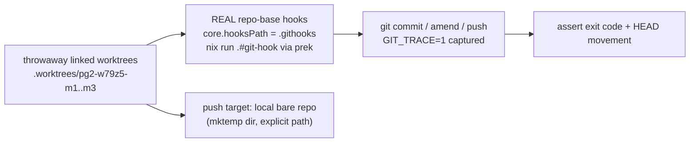

# Commit-time hook shim pilot — real-repo verification evidence

**Date:** 2026-10-01
**Bead:** `pg2-w79z5`. **Umbrella:** `pg2-z19ad`. **HK-2 decision bead that cites this:** `pg2-d1ngb`.
**Parent record:** [experiment plan](2026-10-01-commit-time-hook-shim-experiment.md), ADR
[0029](../../adr/0029-commit-time-hook-shim-experiment.md).

This is the evidence record for the agent half of `pg2-w79z5` (the operator wiring was already done:
`git config --show-origin --get-all core.hooksPath` in the repo-base canonical clone prints the global
`/nix/store/...-git-hooks` followed by the repo-local `file:.git/config .githooks`, and the repo-local
value wins). It is an observation record; it does not change policy. HK-2 remains unchanged and the
shim remains a labelled opt-in experiment.

## 1. Method



- Every row ran against the REAL repo-base hooks (`.githooks/pre-commit` ->
  `nix run --quiet .#git-hook -- pre-commit`, config `.../pre-commit-config.json` from the store).
  Hook firing was proven from `GIT_TRACE=1` output (`run_command: ... .githooks/pre-commit`) and prek
  output (`Using config file`, per-hook `Passed`/`Failed`), not from exit code alone.
- Rows ran in throwaway linked worktrees created from `main` on throwaway branches
  (`tmp/pg2-w79z5-m1`, `-m2`, `-m3`). Nothing ran on `main` or in the canonical clone. No git config
  was modified. All three worktrees, their branches, the local bare push target, and the scratch
  directory were removed afterwards (`git worktree list` and `git branch --list 'tmp/*'` clean).
- Each worktree had the `.pre-commit-config.yaml` symlink copied from the canonical clone (gitignored,
  per the workspace "prek in fresh worktrees" rule). The drain worktree itself has `.githooks/pre-commit`
  tracked and present; the worktrees saw the repo-local relative `core.hooksPath` = `.githooks`.
- Pass criteria: a "bad" row MUST exit non-zero AND leave `HEAD` unchanged; a "good" row MUST exit 0
  AND move `HEAD`.
- The only commit made with a setup purpose (R4 seed of an unrelated clean file) went through the hook
  like every other commit; `--no-verify` was never used.

## 2. Verification matrix

Load during the run: 1-minute load average 108-123 on 11 cores (see section 3), so the per-row
seconds below are inflated and MUST NOT be read as latency.

| Row | Result | Command                                                                                                        | Observation                                                                                                                                                                            |
| --- | ------ | -------------------------------------------------------------------------------------------------------------- | -------------------------------------------------------------------------------------------------------------------------------------------------------------------------------------- |
| R1  | PASS   | `git commit -m ...` with a staged file containing trailing whitespace                                          | rc=1, `trailing-whitespace` Failed, HEAD unchanged, hook fired (trace shows `.githooks/pre-commit`)                                                                                    |
| R1b | PASS   | `git commit -m ...` with a staged shell script with a shellcheck violation (SC2164/SC2086)                     | rc=1, `shellcheck` and `treefmt` Failed, HEAD unchanged                                                                                                                                |
| R2  | PASS   | `git commit -m ...` with a clean staged file                                                                   | rc=0, HEAD moved, all hooks Passed                                                                                                                                                     |
| R3a | PASS   | `git commit -a -m ...` with a tracked file modified to contain trailing whitespace                             | rc=1, HEAD unchanged                                                                                                                                                                   |
| R3b | PASS   | `git commit -a -m ...` with a tracked file modified cleanly                                                    | rc=0, HEAD moved                                                                                                                                                                       |
| R4a | PASS   | `git commit -m ... <path>` for a clean file while an unrelated tracked file was dirty with trailing whitespace | rc=0, HEAD moved, unrelated dirty file stayed uncommitted and unchecked                                                                                                                |
| R4b | PASS   | `git commit -m ... <path>` for a file with trailing whitespace                                                 | rc=1, HEAD unchanged                                                                                                                                                                   |
| R5a | PASS   | `git commit --amend --no-edit` with a clean staged change                                                      | rc=0, HEAD rewritten                                                                                                                                                                   |
| R5b | PASS   | `git commit --amend --no-edit` with a staged trailing-whitespace change                                        | rc=1, HEAD unchanged                                                                                                                                                                   |
| R6a | PASS   | `git commit -m ...` (bad file) in a second linked worktree (`.worktrees/pg2-w79z5-m2`)                         | rc=1, HEAD unchanged                                                                                                                                                                   |
| R6b | PASS   | `git commit -m ...` (good file) in the same second linked worktree                                             | rc=0, HEAD moved                                                                                                                                                                       |
| R7a | PASS   | `git push <local-bare-path> HEAD:refs/heads/matrix-push` (bare repo under a mktemp dir)                        | rc=0, remote ref equals local HEAD; no `pre-push` hook ran (0 trace lines), which is EXPECTED because `commitTimeShim.stages` is `[ "pre-commit" ]` and no `.githooks/pre-push` exists |
| R7b | PASS   | `git push <local-bare-path> --delete matrix-push`                                                              | rc=0, remote branch gone                                                                                                                                                               |
| R10 | PASS   | `git commit -m ...` (good file) with an unrelated untracked file in the tree                                   | rc=0, HEAD moved; an untracked file that is not imported by the flake does not fail the hook                                                                                           |

Note on R1: the first row also served as the cold-eval case; it took 92 s under load and every later
row took 14-29 s.

All 14 matrix rows PASSED. There are no hook bugs and no failures to file.

Observations, outside the required matrix (these are the incident probes of section 4):

| Row | Result           | Command                                                                                                          | Observation                                                                                                                                                                                    |
| --- | ---------------- | ---------------------------------------------------------------------------------------------------------------- | ---------------------------------------------------------------------------------------------------------------------------------------------------------------------------------------------- |
| R8  | CONFIRMED-HAZARD | worktree created at `b8448aa^` (a tree with no `.githooks/`), then `git commit` of a trailing-whitespace file    | rc=0 and HEAD moved: the commit succeeded with NO enforcement and NO warning. This is the documented consequence of the operator's relative `core.hooksPath` ruling, reproduced, not a new bug |
| R9  | INFO             | `env PATH=<git dir>:/usr/bin:/bin git commit -m ...` (`nix` absent from PATH, confirmed `command -v nix` = none) | commit BLOCKED (fail closed): rc=1 from git, stderr `.githooks/pre-commit: line 2: exec: nix: not found`. The shim's 127 is wrapped by git into exit 1; the message names `nix`                |

## 3. Latency (hot and cold, shim vs legacy prek) — DEFERRED

The acceptance criterion says to defer rather than record noisy numbers when load is high. Machine
load was high throughout, so no latency number is recorded here.

| Sample time (2026-10-01, local) | 1-min / 5-min / 15-min load average | Cores |
| ------------------------------- | ----------------------------------- | ----- |
| 16:32 (before the run)          | 165.33 / 105.85 / 89.76             | 11    |
| 16:36 (during the run)          | 108.71 / 123.07 / 103.56            | 11    |
| 16:43 (after the run)           | 54.45 / 84.55 / 93.21               | 11    |

The 16:43 value is still about five times the core count, so even the post-run machine was not quiet.
The per-row seconds in section 2 (14-29 s warm, 92 s cold) were taken at load 100+ and are not
comparable to the prototype's (0.66 s vs 1.72 s at load 75-117 on a single trivial staged file).

Method to use when the machine is quiet (to be run by a later session; this AC stays open):

1. Gate: `uptime` 1-minute load average MUST be below the core count (11) before starting; if not,
   defer again.
2. Pick ONE real workload and use it for both paths: stage the same real change (for example one
   edited `.nix` file plus one edited `.sh` file) in a throwaway worktree.
3. Legacy path: `prek hook-impl` driven directly against the generated `.pre-commit-config.yaml`
   (the old installed-shim path).
4. Shim path: `sh .githooks/pre-commit`, which adds the `nix run` flake evaluation.
5. Cold: after a trivial edit to `flake.nix` (forces re-evaluation) and again after deleting the
   `git-hook` store path. Hot: repeat immediately without edits.
6. Interleave the two paths, discard one warm-up per path, take at least 5 runs each, report the
   median and max, and record the load average before and after.

## 4. Incident log for the experiment window

Window: 2026-10-01 (wiring confirmed by the `core.hooksPath` read above) through 2026-10-01 16:43
local. The window is still open; the next session SHOULD extend this table rather than start a new one.

| Class                                                       | Organic count (observed in real use) | Synthetic reproduction | Notes                                                                                                                                                                                                                                                                                                                                                                                                                                                                                        |
| ----------------------------------------------------------- | ------------------------------------ | ---------------------- | -------------------------------------------------------------------------------------------------------------------------------------------------------------------------------------------------------------------------------------------------------------------------------------------------------------------------------------------------------------------------------------------------------------------------------------------------------------------------------------------- |
| Silent-ungated branch or worktree (tree lacks `.githooks/`) | 0                                    | 1 (R8)                 | Survey at 16:3x: all 4 local branches (`main`, `drain/pg2-w79z5`, `wf-pg2-pla9d.2-docheck`, `worktree-hook-shim-handoff-doc`) contain `.githooks/pre-commit`, and all 4 worktrees (canonical, `.worktrees/pg2-w79z5`, the workforest member, `.claude/worktrees/hook-shim-handoff-doc`) have it on disk. `b8448aa` (the commit that adds it) is an ancestor of `main`, so any branch cut from `main` after it is covered. A worktree on a tree older than `b8448aa` is silently ungated (R8) |
| Exit 127 / `nix` not on PATH                                | 0                                    | 1 (R9)                 | Fails closed with a clear message. The known exposure is the ZR `claude-memory-autocommit` launchd daemon (PATH without `nix`), not in scope for repo-base                                                                                                                                                                                                                                                                                                                                   |
| Dirty-tree / untracked-file failure                         | 0                                    | 0 (R10 passed)         | The earlier-noted hard failure is specific to an untracked `.nix` file imported by the flake; not hit here                                                                                                                                                                                                                                                                                                                                                                                   |
| **Total organic incidents**                                 | **0**                                |                        |                                                                                                                                                                                                                                                                                                                                                                                                                                                                                              |

"Organic" means: observed by this verification as a side effect of ordinary work, not provoked. This
agent saw no commit failures attributable to the shim outside the deliberate probes. This is a
snapshot, not a continuous log: other concurrent sessions' commit failures are not visible to it.
Re-run the survey with:

```bash
cd /Users/phillipg/phillipg_mbp/phillipg-nix-repo-base
git worktree list --porcelain | awk '/^worktree /{print $2}' | while read -r p; do [ -e "$p/.githooks/pre-commit" ] && echo "HAS   $p" || echo "LACKS $p"; done
git for-each-ref --format='%(refname:short)' refs/heads | while read -r b; do git cat-file -e "$b:.githooks/pre-commit" 2>/dev/null && echo "has   $b" || echo "lacks $b"; done
```

## 5. Status of the acceptance criteria

| Criterion                                                       | Status                                                                                                                                            |
| --------------------------------------------------------------- | ------------------------------------------------------------------------------------------------------------------------------------------------- |
| Real-git verification matrix with pass/fail and command per row | Done: section 2, 14 of 14 PASS                                                                                                                    |
| Any failure fixed or filed                                      | Vacuously met: no failures. R8 and R9 are the known, documented consequences of the relative-hooksPath ruling and the HK-2 exception, not defects |
| Quiet-machine latency, hot and cold                             | OPEN: deferred for load, method recorded in section 3                                                                                             |
| Incident log with count and window dates                        | Done: section 4 (0 organic; window still open)                                                                                                    |
| Evidence attached where `pg2-d1ngb` can cite it                 | This document, plus a pointer from section 4 of the experiment plan                                                                               |

The hazard in R8 is the most decision-relevant finding for `pg2-d1ngb`: with a relative
`core.hooksPath`, enforcement is a property of the branch's tree, and an older branch or worktree is
silently unenforced. Requirement for any consumer wave: every live branch and worktree MUST contain
`.githooks/` before the repo is wired (the experiment plan's migration order), and the survey command
in section 4 SHOULD be run before and after each wave.
