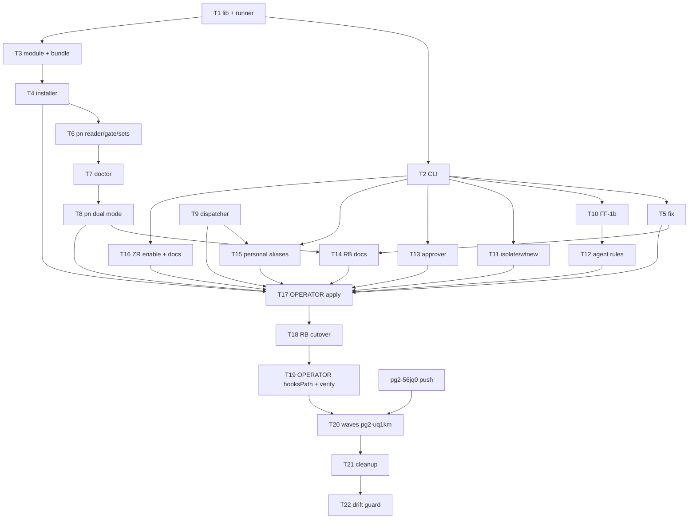

# Per-clone hook bundle and `pg-hooks` Implementation Plan

> **For agentic workers:** REQUIRED SUB-SKILL: Use superpowers:subagent-driven-development (recommended) or superpowers:executing-plans to implement this plan task-by-task. Steps use checkbox (`- [ ]`) syntax for tracking. In this workspace each task is ALSO a bead under `pg2-pla9d` (label `faster-checks`); claim the bead, work in a worktree or workforest set, land via `integrate-branch:integrate-branch`.

**Goal:** Replace the per-worktree `.pre-commit-config.yaml` symlink and the commit-time `nix run` shim with a GC-rooted per-clone hook bundle, static marker-owned stubs, a global dispatcher, and one `pg-hooks` command for every stage.

**Architecture:** The repo's flake renders a bundle (prek, prek config, fixers, stage list, runner, library). `install-pre-commit-hooks` roots it under `<git-common-dir>/pg-hooks/gen-N` and swaps a regular-file pointer; static stubs in `.git/hooks` read the pointer and exec the bundle's runner, so no nix runs at hook time and nothing lands in a working tree. Callers move to `pg-hooks` in dual mode (bundle or legacy config) until every repo is cut over, then legacy code is deleted.

**Tech Stack:** bash (mkBashScript, bats), nix (flake-parts module, git-hooks.nix, runCommand), Go (pn), home-manager, prek 0.3.x.

**Spec:** `docs/superpowers/specs/2026-10-01-per-clone-hook-bundle-design.md` (DRAFT 2, approved 2026-10-01 with decisions D1-D6). Executors read the spec section each task cites.

## Global Constraints

- HK-2: a git hook MUST NOT invoke nix. Stubs and the runner need only sh, git and the bundle.
- Nothing is ever written into a working tree; agents MUST NOT write `core.hooksPath`; agents MUST NOT push.
- Missing bundle at hook time and at land: one `pg-hooks:` notice line on stderr, exit 0. Explicit `pg-hooks run`/`fix`: same notice, exit 13.
- Exit codes: 0 ok, 1 generic (never branchable), 2 usage/refused/not-a-repo, 10 hook or fixer failed, 11 files skipped, 12 bundle broken, 13 no bundle, 14 stale (status), 15 unreachable (status), 16 relocated (status).
- Every message starts with `pg-hooks:` and goes to stderr; stdout carries only requested output. Message texts are fixed by spec section 5.4.
- Pointer `current` is a regular file matching `^gen-[0-9]+$`, replaced by `rename(2)` from a temp file in the same directory; never `mv -f` onto a symlink, never a symlink pointer.
- All git paths via `git rev-parse --path-format=absolute`.
- Stub marker line: `# managed-by: pg-hooks`. Legacy marker recognized for replacement: `File generated by prek`.
- Stamp: `git ls-files -s -- <stamp inputs> | git hash-object --stdin`.
- Progress line after `PG_HOOKS_PROGRESS_AFTER_S` seconds (default 3). Fake nix seam: `PG_HOOKS_NIX_STORE_BIN` (default `nix-store`).
- `bundle.enable` and `commitTimeShim.enable` MUST NOT both be true (eval assertion).
- Follow the `bash-scripting` skill for every bash script, bats test, completion and tldr page; follow the repo `CLAUDE.md` Beads Labels rules.
- Validation per task: the task's own tests plus the commit hooks; targeted `nix build .#checks.<sys>.<name>` in the background (timeout >= 600000 ms or bgrun). No whole `nix flake check` as a gate.

## Review Focus

1. Hook invoked with git's own env set (`GIT_DIR`, `GIT_WORK_TREE`, `GIT_INDEX_FILE` during `git commit <path>` and during rebase): bundle resolution and the stamp must still use the right repo and index. Test: Task 1 `runner honours GIT_INDEX_FILE and GIT_DIR from git`.
2. Paths with spaces and a symlinked prefix (`/tmp` -> `/private/tmp`, a clone under a dir with a space): every path quoted, pointer resolution still works. Test: Task 1 `stub works when the clone path has a space and a symlinked prefix`; Task 4 `installer works when the clone path has a space`.
3. A launchd job or GUI client with a minimal environment (`env -i PATH=/usr/bin:/bin`, no HOME): hooks still fire using the bundle's prek. Test: Task 1 `runner works under env -i with no HOME`.
4. Concurrent install while a hook runs: the hook resolves one generation and never sees a missing file. Test: Task 4 `swap race: readers never miss during 500 swaps` (darwin) plus the structural `current is a regular file` assertion everywhere.
5. Rebase replaying N commits with a stale bundle: bounded output (one stale line per checkout and stamp). Test: Task 1 `stale warning printed once across a 3-commit rebase`.

---

## File structure

repo-base (`/Users/phillipg/phillipg_mbp/phillipg-nix-repo-base`):

```
modules/pg-hooks/
  scripts.nix                      builds the three scripts below; exposes .packages .tldr .checks
  lib/pg-hooks-lib.bash            shared library (resolution, pointer, stamp, messages, exit codes)
  lib/tests/test-pg-hooks-lib.bats
  stub.sh.in                       stub template (@STAGE@ placeholder)
  pg-hooks-run/                    bundle runner: default.nix pg-hooks-run.sh tests/
  pg-hooks/                        CLI: default.nix pg-hooks.sh pg-hooks.md completions/ tests/
  pre-commit-fix/                  tiny wrapper: exec pg-hooks fix "$@"
  pg-hooks-install/                installer: default.nix pg-hooks-install.sh tests/
home/pg-hooks/default.nix          home-manager module (pg-test-runner pattern)
flake-modules/pre-commit.nix       options fixers/stampPaths/bundle.enable; bundle output; install wiring
lib/pg-hooks-bundle-tests.nix      eval tests
modules/pn/internal/workspace/hookbundle.go (+_test.go)   Go reader of bundle state
docs/hooks.md                      the canonical page
```

agent-support, personal, ZR, support-apps, overlay: only the caller and doc edits listed per task.

---

### Task 1: pg-hooks library, stub template and bundle runner (repo-base)

Spec: 4.2 (pointer rules), 4.3, 4.5, 5.3 (exit codes), 5.4 (messages).

**Files:**

- Create: `modules/pg-hooks/scripts.nix`, `modules/pg-hooks/lib/pg-hooks-lib.bash`, `modules/pg-hooks/lib/tests/test-pg-hooks-lib.bats`, `modules/pg-hooks/stub.sh.in`, `modules/pg-hooks/pg-hooks-run/{default.nix,pg-hooks-run.sh,tests/test-pg-hooks-run.bats}`
- Modify: `flake.nix` (import `modules/pg-hooks/scripts.nix`; add its `checks`)

**Interfaces (Produces):**

- Library functions (sourced; all print to stdout only what is documented; messages to stderr):
  - `pgh_shared_dir` → prints `<abs common-dir>/pg-hooks`
  - `pgh_private_dir` → prints `<abs git-dir>/pg-hooks`
  - `pgh_select_dir` → prints the private dir if it holds `current`, else the shared dir
  - `pgh_read_pointer <dir>` → prints `gen-N`; returns 13 if `current` absent, 12 if invalid
  - `pgh_bundle <dir> <gen>` → prints `<dir>/<gen>/bundle`; returns 12 if `bin/pg-hooks-run` or `bin/prek` missing/not executable
  - `pgh_stamp <input>...` → prints the stamp; prints `unknown` when no input is tracked
  - `pgh_stale_check <dir> <gen> <stage>` → prints at most one warning per (checkout, stamp) for stages `pre-commit`/`pre-push`; marker `stale-warned-<stamp>` in `pgh_private_dir`
  - `pgh_msg_no_bundle <repo> <stage>`, `pgh_msg_broken <repo> <reason>`, `pgh_msg_stale <repo> <built_at> <reinstall>`, `pgh_msg_worktree_differs <private reinstall>`, `pgh_msg_hooks_failed <stage> <repo>` → exact texts of spec 5.4 / 4.3 / 4.5
  - `pgh_reinstall <dir>` → prints the `reinstall` file line, else `(cd <canonical> && nix run .#install-pre-commit-hooks)`
  - constants `PGH_OK=0 PGH_USAGE=2 PGH_FAILED=10 PGH_SKIPPED=11 PGH_BROKEN=12 PGH_NO_BUNDLE=13 PGH_STALE=14 PGH_UNREACHABLE=15 PGH_RELOCATED=16`
- Bundle files read: `meta.json` = `{ "repo": str, "stampPaths": [str], "stages": [str] }`, `prek-config.json`, `stages.json`, `fixers.json`; per-generation `source.json` = `{ "stamp": str, "overrides": [{ "name", "path", "head", "dirty" }], "clone_path": str, "built_at": str }`.
- `pg-hooks-run <stage> [args...]` (store script, placed in the bundle by Task 3).
- `stub.sh.in`: POSIX sh, second line `# managed-by: pg-hooks`, no store path; `@STAGE@` substituted by the installer.
- `scripts.nix` exposes `pg-hooks-run`, `libDir` (for the bundle), `stubTemplate`, and `checks.test-pg-hooks-lib`, `checks.test-pg-hooks-run`.

- [ ] **Step 1: Write failing bats** (`test-pg-hooks-lib.bats`, `test-pg-hooks-run.bats`), using `lib/scripts/git-fixture-harness.bash`; after `gfh_setup`, unset the local `core.hooksPath` and point it at the fixture's `.git/hooks` per test. Stand-ins: a fake bundle dir with `bin/prek` that logs argv, env and stdin to a file.
  - `pointer: valid gen-N resolves`, `pointer: absent -> 13`, `pointer: '../x', empty, 'gen-' and a symlink current -> 12`
  - `select_dir prefers private dir with current over shared`
  - `stamp equals git ls-files -s | git hash-object --stdin over the inputs`; `stamp counts a staged edit`; `stamp is unknown with no tracked inputs`
  - `stale warning printed once across 3 commits`, `stale warning printed once across a 3-commit rebase`, `no stale warning for an edit outside stamp inputs`, `stale warning only on pre-commit and pre-push`, `override head change adds (override <name> changed)`
  - `stub: no bundle prints exact notice on stderr, nothing on stdout, exit 0`; `stub text contains no /nix/store path and the marker line`; `stub notice text equals pgh_msg_no_bundle output`
  - `runner passes exact prek argv: hook-impl --config <B>/prek-config.json --hook-type <stage> --hook-dir <common-dir>/hooks -- args`
  - `runner forwards stdin and args for pre-push (ref lines, remote name, url), pre-rebase ($1 $2), commit-msg, prepare-commit-msg`
  - `runner returns prek status unchanged; prints hooks-failed hint only on nonzero`
  - `runner uses bundle prek even with a decoy prek first on PATH`
  - `runner works under env -i with no HOME`
  - `runner honours GIT_INDEX_FILE and GIT_DIR from git`
  - `runner calls git at most twice` (PATH git shim counting invocations)
  - `broken bundle (prek not executable) exits 12 with the broken message`
  - `stub works when the clone path has a space and a symlinked prefix`
  - `fires at root, subdir and linked worktree` (marker file written by the stand-in shows which tree)
- [ ] **Step 2: Run** `bats modules/pg-hooks/lib/tests modules/pg-hooks/pg-hooks-run/tests` → FAIL (missing files).
- [ ] **Step 3: Implement** the library, the stub template and `pg-hooks-run.sh` with the interfaces above. The runner runs prek as a child (not `exec`), passes prek's quiet option if prek 0.3.x `hook-impl` has one that hides "Passed" lines (check `prek hook-impl --help`; record the finding in the commit message), and matches any `--script-version` the existing prek-generated stub in `/Users/phillipg/phillipg_mbp/phillipgreenii-nix-agent-support/.git/hooks/pre-commit` passes.
- [ ] **Step 4: Run** the bats → PASS; then `nix build .#checks.aarch64-darwin.test-pg-hooks-lib .#checks.aarch64-darwin.test-pg-hooks-run` in the background → success.
- [ ] **Step 5: Commit** `feat(pg-hooks): library, stub template and bundle runner (pg2-pla9d)`.

### Task 2: `pg-hooks` CLI: status, list, explain, run (repo-base)

Spec: 5.1 (run semantics, pre-land), 5.3, 5.4, 7.1 (legacy fallback, D1).

**Files:**

- Create: `modules/pg-hooks/pg-hooks/{default.nix,pg-hooks.sh,pg-hooks.md,completions/_pg-hooks,completions/pg-hooks.bash,tests/test-pg-hooks.bats}`, `home/pg-hooks/default.nix`
- Modify: `modules/pg-hooks/scripts.nix` (add `pg-hooks`), `flake.nix` (`packages.pg-hooks`, `overlays.default` entry `pg-hooks`, `homeModules.pg-hooks`, checks)

**Interfaces:**

- Consumes: Task 1 library.
- Produces: `pg-hooks status [--porcelain]` with porcelain lines `state=<present|stale|missing|broken|unreachable|relocated|legacy>`, `bundle=<path|>`, `generation=<gen-N|>`, `stages=<comma list>`, `reinstall=<command>`; exit 0/14/13/12/15/16 (legacy → 0). `pg-hooks list`, `pg-hooks explain <stage>`, `pg-hooks run <stage> [files...|--all-files] [-- prek-args]`, `pg-hooks run pre-land [<ref>]`. Home module `phillipgreenii.pg-hooks.{enable,package}`.

- [ ] **Step 1: Write failing bats** (`test-pg-hooks.bats`):
  - `no args prints usage and the common-tasks block`
  - `status --porcelain` for each state with its exit code: present 0, stale 14, missing 13, broken 12, unreachable 15 (local `core.hooksPath=.githooks`), relocated 16 (`clone_path` differs), legacy 0 (no bundle, usable `.pre-commit-config.yaml` in worktree or canonical)
  - `legacy fallback reads the canonical config in place and creates no file in the worktree`
  - `list` and `explain pre-commit` output from `stages.json`
  - `run pre-commit with no args runs prek run -c <B>/prek-config.json --hook-stage pre-commit on staged files`; `run --all-files passes through`; `run -- <flags> forwards raw flags`; `run cds to the toplevel from a subdirectory`
  - `run pre-land refuses a ref not checked out here (exit 2)`; `run pre-land passes --from-ref <primary> --to-ref <ref>`; `primary resolution order: pgii-integrate-branch.primaryBranch, origin/HEAD, main`
  - `run with no bundle prints the notice and exits 13`; `outside a repo exits 2`; `unknown stage exits 2`
  - `messages go to stderr; stdout carries only status/list/explain output`
  - `paths with spaces and a symlinked prefix`
- [ ] **Step 2: Run** → FAIL.
- [ ] **Step 3: Implement** `pg-hooks.sh` (subcommand dispatch; `fix` returns 2 "not yet" until Task 5), tldr page with the exit-code table, completions, home module mirroring `home/pg-test-runner/default.nix` (no config option; enable + package).
- [ ] **Step 4: Run** bats → PASS; build `checks.<sys>.test-pg-hooks` in the background → success.
- [ ] **Step 5: Commit** `feat(pg-hooks): status/list/explain/run CLI and home module (pg2-pla9d)`.

### Task 3: pre-commit module: options, bundle output, eval tests (repo-base)

Spec: 4.2 (bundle contents), 5.1 (options, assertions), 5.2 (fixers schema).

**Files:**

- Modify: `flake-modules/pre-commit.nix` (new options in `options.phillipgreenii.pre-commit`; new `pgHooksBundle` in `perSystem`; `packages.pg-hooks-bundle` when `bundle.enable`). Do NOT touch the commitTimeShim code paths except the mutual-exclusion assertion.
- Create: `lib/pg-hooks-bundle-tests.nix`; register it like the other `lib/*-tests.nix`.

**Interfaces:**

- Consumes: Task 1 `scripts.nix` (`pg-hooks-run`, `libDir`), built SELF-CONTAINED inside the module the way `pgGitCheckIdentityScripts` is (own `mkBashBuilders` instantiation; consumers' `pkgs` lack this repo's overlay).
- Produces: options `fixers` (list of `{ name; command; mode ? "files" | "per-file"; includes ? [glob]; excludes ? [glob]; after ? name; before ? name; }`), `stampPaths` (list of str; default `[]`, repo-base sets `[ "flake-modules/pre-commit.nix" "modules/pg-git-check-identity" ]` in its own `flake.nix`), `bundle.enable` (bool, default false). `packages.<system>.pg-hooks-bundle` with `bin/prek` (→ `pkgs.prek`), `bin/pg-hooks-run`, `lib/pg-hooks-lib.bash`, `prek-config.json` (copy of `preCommit.config.configFile`), `fixers.json` (anchors resolved to a flat ordered list at eval time; default list: treefmt (`config.treefmt.build.wrapper`, mode files), statix (`statix fix`, mode per-file, includes `*.nix`), treefmt again, trailing-whitespace and end-of-file-fixer (the base hooks' own entries)), `stages.json` (`default_stages` ∪ per-hook `stages`, ids, `description` or id), `meta.json`.

- [ ] **Step 1: Write failing eval tests** in `lib/pg-hooks-bundle-tests.nix` (`builtins.tryEval` on assertion-bearing evaluations, existing `lib/*-tests.nix` style):
  - `bundle disabled renders no pg-hooks-bundle and no new files`
  - `bundle and commitTimeShim both enabled fails evaluation`
  - `a fixer attached to a prek stage fails evaluation`; `a prek hook whose entry runs pg-hooks fix fails evaluation`; `an unknown stage fails evaluation`
  - `fixers anchors: an after=statix insert lands right after statix`
  - `stages.json is the union of default_stages and per-hook stages`
  - `meta.json stampPaths equals the option`
  - `devShell shellHook performs no install when bundle.enable`
- [ ] **Step 2: Run** `nix build .#checks.aarch64-darwin.pg-hooks-bundle-tests` (background) → FAIL.
- [ ] **Step 3: Implement** the options, assertions and `pgHooksBundle` runCommand.
- [ ] **Step 4: Run** → PASS. Also `nix build .#checks.aarch64-darwin.pre-commit` still passes (unchanged hooks).
- [ ] **Step 5: Commit** `feat(pre-commit): bundle options and pg-hooks-bundle output (pg2-pla9d)`.

### Task 4: installer (repo-base)

Spec: 4.2 (generations, pruning), 4.4, 6.

**Files:**

- Create: `modules/pg-hooks/pg-hooks-install/{default.nix,pg-hooks-install.sh,tests/test-pg-hooks-install.bats}`
- Modify: `modules/pg-hooks/scripts.nix`; `flake-modules/pre-commit.nix` (when `bundle.enable`, `packages.install-pre-commit-hooks` = a script that execs `pg-hooks-install --bundle ${pgHooksBundle} "$@"`; skip `shimWireHooksPath`, the shim `ln -sfn`, the legacy fragments and every `core.hooksPath` write; devShell installs nothing)

**Interfaces:**

- Consumes: Task 1 library and `stubTemplate`; Task 3 `pgHooksBundle`.
- Produces: `pg-hooks-install --bundle <store path> [--private] [--override <name>=<path>]...`; layout and `reinstall`/`source.json` contents per spec 4.2/4.4; exit 0, 2 (refused), 1 (unexpected). Uses `${PG_HOOKS_NIX_STORE_BIN:-nix-store} --add-root <gen-N>/bundle --indirect --realise <bundle>`.

- [ ] **Step 1: Write failing bats** with a fake `nix-store` (records argv, creates the out-link to a temp "store" dir):
  - `canonical install writes current, reinstall, gen-1/bundle and gen-1/source.json`
  - `add-root argv is --add-root <gen-N>/bundle --indirect --realise <bundle>`
  - `current is a regular file, not a symlink, and is replaced by rename`
  - `generation claim retries on EEXIST`; `two concurrent installs leave a valid current and intact generations`
  - `pruning keeps current and the previous generation only`
  - `linked worktree without --private is refused with the canonical path in the message (exit 2)`
  - `--private writes only under the worktree git dir; may add a missing stub; never rewrites an existing stub`
  - `--override name=path records head and dirty in source.json` (jq)
  - `own and legacy-marked stubs are replaced; stale own stubs removed`
  - `foreign file at a needed stage refuses with its path; foreign file at another stage (bd post-merge) untouched`
  - `repo with zero hooks writes a bundle and no stubs`
  - `never writes core.hooksPath` (compare `.git/config` bytes before/after)
  - `installer works when the clone path has a space`
  - `git worktree remove deletes the private dir and leaves the shared dir`
  - `swap race: readers never miss during 500 swaps` (skip unless darwin; 2 readers)
- [ ] **Step 2: Run** → FAIL.
- [ ] **Step 3: Implement** `pg-hooks-install.sh`; generation claim via `mkdir`; pointer via temp file + `mv` of a regular file (rename(2)); stubs rendered from `stubTemplate`.
- [ ] **Step 4: Run** bats → PASS; build its check in the background.
- [ ] **Step 5: Commit** `feat(pg-hooks): bundle installer with generations and private bundles (pg2-pla9d)`.

### Task 5: `pg-hooks fix` and `pre-commit-fix` (repo-base)

Spec: 5.2, 5.4.

**Files:**

- Modify: `modules/pg-hooks/pg-hooks/pg-hooks.sh`, its bats, `pg-hooks.md`, completions
- Create: `modules/pg-hooks/pre-commit-fix/{default.nix,pre-commit-fix.sh}`; add to `scripts.nix`, `home/pg-hooks/default.nix` (installs both names)

**Interfaces:**

- Consumes: Task 3 `fixers.json` (ordered `[{ name, command: [argv], mode, includes, excludes }]`); Task 1 library.
- Produces: `pg-hooks fix` exit 0/10/11/13/2; `pre-commit-fix` (`exec pg-hooks fix "$@"`).

- [ ] **Step 1: Write failing bats** with stand-in fixers in a fake `fixers.json`:
  - `fixes and restages only staged files`; `untracked and unstaged files untouched`
  - `file with staged and unstaged changes is skipped, every skipped file listed, exit 11`
  - `refuses during merge, rebase or cherry-pick (exit 2)`
  - `runs fixers in fixers.json order`; `per-file mode calls statix once per staged .nix`
  - `never passes --unsafe-fixes to ruff`
  - `treefmt converges within 5 passes; second run is a no-op`
  - `repo excludes applied as grep -E regex; fixer includes/excludes as globs`
  - `batches at most 200 paths per invocation`
  - `fixer failure prints name, files, full output and next step; exit 10`
  - `appends one timings.jsonl line per fixer (jq schema tool,files,seconds,exit); unwritable state dir tolerated`
  - `progress line printed with PG_HOOKS_PROGRESS_AFTER_S=0 and not with 99`
  - `no bundle prints the notice and exits 13`
  - `pre-commit-fix forwards to pg-hooks fix`
- [ ] **Step 2: Run** → FAIL. **Step 3: Implement.** **Step 4: Run** → PASS; build checks in the background.
- [ ] **Step 5: Commit** `feat(pg-hooks): fix subcommand and pre-commit-fix (pg2-pla9d)`.
- [ ] **Step 6:** add one repo-base flake check `pg-hooks-fix-real-tools` that runs the REAL bundle's fixers on a fixture with an unformatted `.nix` and `.md` and asserts idempotency.

### Task 6: pn Go changes: bundle state reader, install gate, sets (repo-base)

Spec: 4.4 (pn changes), 4.6.

**Files:**

- Create: `modules/pn/internal/workspace/hookbundle.go`, `hookbundle_test.go`
- Modify: `nix_hooks.go` (~95-116, ~279, 310-316), `workforest.go` (~112-150, ~355), their tests

**Interfaces:**

- Produces: `type HookBundleState string` with values `present stale missing broken unreachable relocated legacy`; `func ReadHookBundleState(repoDir string) (HookBundleState, HookBundleInfo, error)` reading `current`, `source.json`, `meta.json` directly (no dependency on `pg-hooks` on PATH); stamp computed with two git invocations per spec 4.5.
- Gate: skip the install hook when state is `present` AND every recorded override's HEAD and dirty state equal now. Sets: append `--private` and one `--override <alias>=<path>` per pinned input whenever the hook directory is a linked worktree.

- [ ] **Step 1: Write failing Go tests:** each state from a fixture tree; gate skips for present+matching overrides, runs for stale, missing, override HEAD changed, override dirty; `installSetHooks` passes `--private` and the pins in a linked worktree, and not in a canonical clone.
- [ ] **Step 2: Run** `go test ./internal/workspace/...` (in `modules/pn`) → FAIL. **Step 3: Implement.** **Step 4:** PASS; build `checks.<sys>.pn-go-tests` in the background.
- [ ] **Step 5: Commit** `feat(pn): read hook bundle state; rekey install gate; private set bundles (pg2-pla9d)`.

### Task 7: pn doctor checks (repo-base)

Spec: 4.1 (doctor), 7.4 (doctor rows).

**Files:** Modify `doctor_checks_precommithook.go` (57-62, 70, 80-100), `doctor_checks_ruffpin.go` (136, ~152), tests. Move `resolvedHooksDir` and `symlinkLiveInNixStore` from `doctor_checks_githooksshim.go` into a shared file (deletion of that check is Task 16).

**Interfaces:** Consumes Task 6 `ReadHookBundleState`. "Declared" = the repo's `pn-workspace.toml` entry runs `install-pre-commit-hooks`.

- [ ] **Step 1: Failing Go tests:** declared repo with missing pointer, foreign stub, missing marker, dangling bundle, unreachable `core.hooksPath` (relative, nonexistent) each → error with the fix line; undeclared repo → no finding; legacy repo → existing checks unchanged; `ruff-pin` reads `<bundle>/prek-config.json` when present.
- [ ] **Step 2-4:** FAIL → implement → PASS (`go test`, then `pn-go-tests` in the background).
- [ ] **Step 5: Commit** `feat(pn): doctor checks for hook bundles (pg2-pla9d)`.

### Task 8: pn pre-commit-check, worktree link and update-locks in dual mode (repo-base)

Spec: 7.1 (dual mode), 7.4 rows.

**Files:** Modify `pre_commit_check.go` (~46), `update_worktree.go` (16-33, 305), `propagate.go` (189), `lib/scripts/update-locks-lib.bash` (395-500), their tests.

- [ ] **Step 1: Failing tests:** `pre-commit-check` runs `pg-hooks run pre-commit --all-files` per clone (and the legacy `prek run --all-files` when state is `legacy`; never `pre-commit`); worktree updates link the config ONLY when state is `legacy`; update-locks reports bundle state from `pg-hooks status --porcelain` and keeps its legacy check for `legacy`.
- [ ] **Step 2-4:** FAIL → implement → PASS.
- [ ] **Step 5: Commit** `feat(pn): pre-commit-check, worktree updates and update-locks use pg-hooks in dual mode (pg2-pla9d)`.

### Task 9: global dispatcher (personal)

Spec: 4.1. Repo: `/Users/phillipg/phillipg_mbp/phillipgreenii-nix-personal`.

**Files:** Modify `home/programs/git/default.nix` (~66-80; today `programs.git.hooks.pre-commit = pg-git-check-identity`). Create `home/programs/git/pg-hook-dispatch.sh` and `home/programs/git/tests/test-pg-hook-dispatch.bats` (vendor or import the git fixture harness; set `GIT_CONFIG_GLOBAL` after setup, no local `core.hooksPath`).

**Interfaces:** one script installed under every name from `git help githooks` except `fsmonitor-watchman`, `push-to-checkout`, `sendemail-validate`, `reference-transaction`, `pre-auto-gc`; stage = `basename "$0"`; git called as `${pkgs.git}/bin/git`.

- [ ] **Step 1: Failing bats:** `every listed stage name is installed` (compare with `git help githooks`); `identity check runs first and only on pre-commit, and its failure stops the commit`; `chains to .git/hooks/<stage> with stdin and args`; `exit 0 when no stub, in a bare repo, outside a repo, in a submodule, during git worktree add post-checkout`; `a bd-style post-merge hook is chained`.
- [ ] **Step 2-4:** FAIL → implement → PASS (build the personal check in the background).
- [ ] **Step 5:** Before landing, list executable non-sample files under `.git/hooks` of every repo on the machine and paste the list into the bead (spec 4.1).
- [ ] **Step 6: Commit** `feat(git): global hook dispatcher chaining to .git/hooks (pg2-pla9d)`.

### Task 10: FF-1b, integrate-branch-support and FF-4 refresh (agent-support)

Spec: 4.5 (FF-4 refresh, D5), 5.3 (127 handling), 7.4 rows FF-1b and integrate-branch-support. Repo: `/Users/phillipg/phillipg_mbp/phillipgreenii-nix-agent-support`.

**Files:** `packages/integrate-branch-support/integrate-branch-support/{integrate-branch-support.bash (222-254), integrate-branch-support.sh (71-90), integrate-branch-support.md, tests/test-integrate-branch-support.bats}`; `claude-marketplace/integrate-branch/skills/ff-merge-to-main/SKILL.md` (FF-1b 281-330, 457, 521-525; facts table 62-66; FF-4); the grep checks in `flake.nix` that assert the FF-1b text.

**Interfaces:** `--prek-branch-diff` delegates to `pg-hooks run pre-land "$FB"`; exit 10 → `stopped:precommit-branch-diff-failed`; 13 and 127 → record the notice verbatim, continue; legacy repos still run prek (via `pg-hooks` legacy fallback). Facts key `PRECOMMIT` values become `bundle|stale|legacy|missing|broken`. FF-4: when the landed diff touches a stamp input, run `<canonical>/.git/pg-hooks/reinstall` through `bgrun`; a failure is reported, never fails the land.

- [ ] **Step 1: Failing bats + grep checks** for each mapping above (stub `pg-hooks` on PATH returning 0, 10, 13, 127).
- [ ] **Step 2-4:** FAIL → implement → PASS (build `checks.<sys>.test-integrate-branch-support` and the grep checks in the background).
- [ ] **Step 5: Commit** `feat(integrate-branch): FF-1b via pg-hooks pre-land; FF-4 bundle refresh (pg2-pla9d)`.

### Task 11: drain isolate and wtnew in dual mode (agent-support)

Spec: 7.1, 7.4 rows.

**Files:** `packages/pb/internal/drain/isolate.go` (113, 176-201), `packages/pb/cmd/pb/drain_isolate.go:31`, `packages/pb/README.md:152`, `isolate_test.go`; `packages/wtnew/wtnew/{wtnew.bash (47-110), wtnew.sh}`, bats.

- [ ] **Step 1: Failing tests:** link only when `pg-hooks status --porcelain` says `legacy`; with a bundle, no file written and the result reports the bundle state; `pg-hooks` absent (127) → today's behavior.
- [ ] **Step 2-4:** FAIL → implement → PASS.
- [ ] **Step 5: Commit** `feat(pb,wtnew): link prek config only for legacy repos (pg2-pla9d)`.

### Task 12: agent rules, drain-beads and docs (agent-support)

Spec: 5.3 (127 fallback), 7.4 rows agent rules / drain-beads / docs.

**Files:** `home/programs/agent-rules/pgii-agent-rules.md:64`, `nix-how-to.md` 26-90, `claude-marketplace/pb/commands/drain-beads.md` 572-592, `CLAUDE.md` 141, 306, `packages/pg-router/internal/config/config.go:582` (comment); any grep allowlists the land-gate-rule-docs guard needs.

- [ ] **Step 1:** rewrite: before committing `git add` then `pg-hooks fix` (or `pre-commit-fix`); probe with `pg-hooks status`, never `test -f .pre-commit-config.yaml`; `127` means ask the operator to apply; legacy repos behave as before until cutover. Add the three-line snippet pointing to repo-base `docs/hooks.md`.
- [ ] **Step 2:** run the agent-support markdown grep checks and the rendered-rules check in the background → PASS.
- [ ] **Step 3: Commit** `docs(agent-rules): pg-hooks usage in dual mode (pg2-pla9d)`.

### Task 13: tool-approver rules for `pg-hooks` (agent-support)

**Files:** `packages/claude-extended-tool-approver` rule sources and tests (follow its own conventions; `ceta-spec-gen` skill if it applies).

- [ ] **Step 1: Failing test:** `pg-hooks status|list|explain|run|fix` and `pre-commit-fix` are approved without prompting; nothing else changes.
- [ ] **Step 2-4:** FAIL → implement → PASS. **Step 5: Commit** `feat(ceta): approve pg-hooks and pre-commit-fix (pg2-pla9d)`.

### Task 14: repo-base docs (repo-base)

**Files:** Create `docs/hooks.md` (stages table, `pg-hooks` usage, messages, exit codes, bundle layout, dual mode, operator runbook from spec 7.3). Modify `CLAUDE.md` "Pre-commit hooks" section, `README.md`, `modules/pn/internal/cli/workspace.go:89` help text, `testdata/pn-workspace-reference.toml` comments, `pn-workspace-rules/commands/pn-workspace-update.md:192`, `modules/pn/internal/workspace/push.go:234` (comment).

- [ ] **Step 1:** write; **Step 2:** a grep check `docs-hooks-names-in-sync`: every stage and subcommand in `docs/hooks.md` exists in `pg-hooks.sh` and `stages` vocabulary; **Step 3:** PASS; **Step 4: Commit** `docs: hooks.md and pg-hooks references (pg2-pla9d)`.

### Task 15: personal aliases and docs (personal)

**Files:** `home/programs/pre-commit/default.nix` 19-30 (`pc` → `pg-hooks run pre-commit --all-files`, `pcr` → `pg-hooks run pre-commit`, remove `pci`, `pcu` kept only if it does not run `prek install`), `CLAUDE.md`, `.claude/rules.md`, `CONTRIBUTING.md`, `README.md`.

- [ ] Steps: edit → personal checks in the background → commit `feat(pre-commit): pg-hooks aliases; drop pci (pg2-pla9d)`.

### Task 16: ZR enablement and docs (phillipg-nix-ziprecruiter)

**Files:** `darwin/system/default.nix` (~82; import `inputs.phillipgreenii-nix-base.homeModules.pg-hooks`), `machines/phillipg-mbp-02/default.nix` (~840; `pg-hooks.enable = true;`), `modules/workspace.nix:162`, `modules/workspace-root-CLAUDE.md.txt` (source of the workspace `CLAUDE.md` "prek / pre-commit in Fresh Worktrees" section: rewrite for dual mode), `CLAUDE.md`, `home/ziprecruiter/config/claude-memory/**` files that describe the symlink fix; also support-apps and overlay `CLAUDE.md` mentions.

- [ ] Steps: edit → ZR eval check that `pg-hooks` is enabled for `phillipg-mbp-02` → commit. The ZR lock still pins the old repo-base rev; `pn workspace apply` builds with local overrides, and the relock follows the push (workspace practice: defer sibling relock).

### Task 17: OPERATOR — apply

`human` bead. After Tasks 1-16 land: `pn workspace apply`; confirm `command -v pg-hooks` and `pg-hooks status` in each repo prints `legacy` (or `present` for none yet).

### Task 18: repo-base cutover (repo-base, agent part)

Spec: 7.2 steps 2-3.

- [ ] One commit: `phillipgreenii.pre-commit.bundle.enable = true;`, `commitTimeShim.enable = false;`, `stampPaths` as in Task 3, delete `.githooks/`. Land it.
- [ ] In the canonical clone: `nix run .#install-pre-commit-hooks` (background); `pg-hooks status --porcelain` shows `state=present`.

### Task 19: OPERATOR — repo-base hooksPath and verification

`human` bead. Spec 7.2 steps 4-5: `git -C /Users/phillipg/phillipg_mbp/phillipg-nix-repo-base config --local core.hooksPath /Users/phillipg/phillipg_mbp/phillipg-nix-repo-base/.git/hooks`; `pg-hooks status`; a real commit in the canonical clone and in a worktree; the latency run (spec 8, not hermetic): pass if hook overhead is within 0.2 s of `prek hook-impl` run directly; record numbers and load on the bead.

### Task 20: consumer waves (existing bead `pg2-uq1km`)

Blocked by Task 19 and `pg2-56jq0` (push). Per repo, in order overlay, personal + agent-support, support-apps, ZR: relock repo-base; `bundle.enable = true`; agent-support lists `pre-rebase` in its hooks' stages (already); install in the canonical clone; `pg-hooks status` = `present`; one real commit. Split into one bead per repo when the wave starts.

### Task 21: cleanup (repo-base + agent-support + personal)

Spec: 7.5. Blocked by Task 20. Delete everything in spec 7.5, the dual-mode legacy branches (Tasks 2, 8, 10, 11), drain/wtnew/pn link code, `doctor_checks_githooksshim.go`, the workspace `CLAUDE.md` symlink section (via ZR `workspace-root-CLAUDE.md.txt`); `bundle.enable` default true; new ADR (next free number) superseding 0029 and 0016. Split per repo; wire same-file edges.

### Task 22: drift guard

Spec: 7.1 step 6, 8 (drift guard row). Blocked by Task 21. Grep checks per repo (no `.githooks`, relative `core.hooksPath`, link code or text outside an allowlist) and a `pn workspace doctor` check that runs `ReadHookBundleState` for every declared repo.

### Acceptance matrix (with Task 6)

A pn Go smoke scenario under `modules/pn/internal/workspace/smoke/scenarios/`: canonical clone, plain worktree and workforest set with a producer change; each commits with stand-in hooks; the set uses its private bundle; nothing is written into any working tree.

---

## Dependency graph (for the beads)



Same-file edges are already implied: T1→T2→T5 (shared `modules/pg-hooks`), T3→T4 (`pre-commit.nix`), T6→T7→T8 (`modules/pn/internal/workspace`), T10→T12 (agent-support `flake.nix` grep checks), T14 after T8 (pn help text), T21 after everything it deletes.

Existing beads: `pg2-ytkax` closes as superseded by T4/T6; `pg2-d1ngb` is blocked by T21 and then closes (shim abandoned, HK-2 stands); `pg2-z19ad` is absorbed into `pg2-pla9d`.
