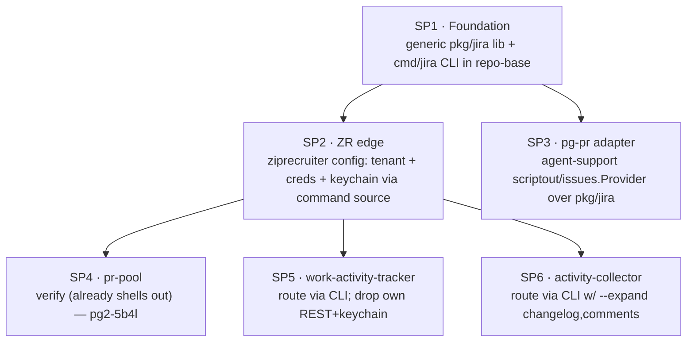
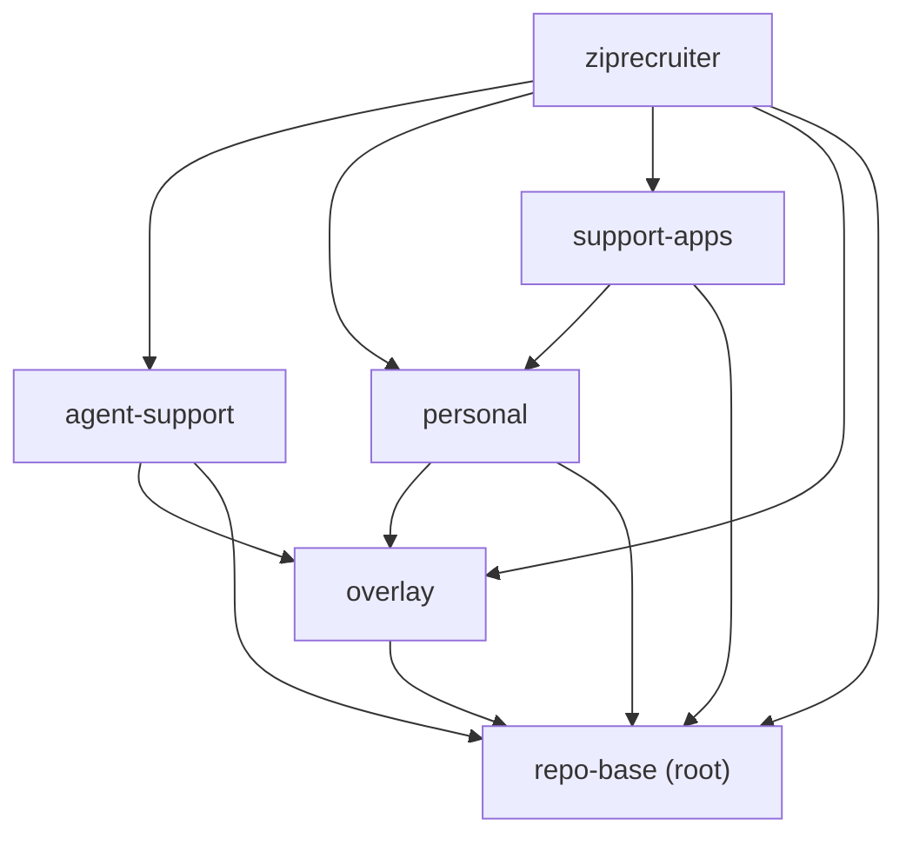

# Generic Jira Access Tool — Design

**Beads**: pg2-2x2d (implementation epic), supersedes the ZR-bound design in pg2-3z8j
**Status**: Draft (design only)
**Date**: 2026-06-26
**Deciders**: phillipg

## 1. Problem

Four-to-five workspace tools each integrate ZipRecruiter's Atlassian Jira
(`https://ziprecruiter.atlassian.net`) independently. They re-implement the same
HTTP/REST plumbing, diverge on which REST endpoint they call, and diverge on
where the API token is stored. This is the **shotgun-surgery** smell: one
external change (an endpoint deprecation, a token rotation, a tenant rename)
forces edits in N unrelated codebases across two languages.

Concrete divergence found in this workspace (see §3 inventory):

- **Endpoint drift**: `work-activity-tracker` still posts to the **deprecated**
  `POST /rest/api/3/search` (Atlassian returns **HTTP 410**), while
  `activity-collector` and `pg-pr-issues-jira-zr` use the current
  `POST /rest/api/3/search/jql`.
- **Credential drift**: the pg-pr binary reads `JIRA_API_TOKEN` from a runtime
  token file via a nix wrapper; `work-activity-tracker` and `activity-collector`
  each shell out to the macOS Keychain under **different** service names
  (`work-activity-tracker-jira` vs `activity-collector-jira`).
- **Mapping drift**: each consumer re-declares structs for the subset of
  Atlassian JSON it parses, and each re-derives the `…/browse/<key>` URL.

### 1.1 The two governing constraints

This design is shaped by two constraints established with the user that the prior
design (pg2-3z8j) did not satisfy:

1. **The common code MUST be generic** — it MUST NOT hard-code any
   ZipRecruiter-specific value (tenant URL, credential location, project keys),
   and MUST NOT hard-code any OS-specific behavior. ZR (or any other tenant)
   specifics are injected at the edge as configuration.
2. **The code MUST sit high enough in the flake-input hierarchy that every
   consumer can reference it without adding a new flake input, and MUST NOT
   introduce a dependency cycle.**

The prior pg2-3z8j design explicitly kept the tool ZR-bound in
`phillipg-nix-ziprecruiter` and (its §7 open question 3) recommended _against_
extracting a generic facade. This design **reverses that decision** in light of
the two constraints above.

This is the **Facade** pattern (one stable interface hiding the Atlassian
subsystem) plus per-consumer **Adapter**s, packaged as a standalone process so it
works across the Go / Python / Bash polyglot workspace, and additionally exposed
as an importable Go library for the Go consumers.

## 2. Goals / Non-Goals

**Goals**

- One generic place that owns: REST endpoint selection, retry/410 handling,
  Atlassian→normalized JSON mapping, basic-auth construction, and pluggable
  credential resolution.
- A polyglot-friendly invocation contract (Go, Python, Bash consumers) plus a Go
  library for in-process Go use.
- A migration path that lets each consumer move independently, with no flag day.
- Zero ZR strings and zero OS-specific commands in the generic core.

**Non-Goals**

- Replacing the **interactive** Atlassian MCP server used by Claude Code /
  agents. MCP is OAuth-scoped per session and is the right tool for interactive
  agent use; this tool targets **non-interactive, scripted** access. The two
  coexist.
- Non-basic auth (Bearer/PAT for Jira Data Center). No consumer exists; it is
  explicitly deferred (see §10).
- Implementing `transition` / `add_comment` now. `transition`'s interface shape
  is reserved (a live consumer is planned, UJ-8); `add_comment` is dropped (no
  consumer).

## 3. Use-Case / User-Journey Inventory

Every workspace tool that touches Jira, and exactly how. This drives the
capability set (§6) and auth stories (§8). "Scripted" = calls the Jira API
non-interactively; "reference-only" = merely recognizes a ticket-key string.

### 3.1 Consumers in scope (scripted, non-interactive)

| #    | Journey                                                            | Repo / lang             | Operation        | Fields consumed                                                                             | Auth today                                  | Invocation           | Status                        |
| ---- | ------------------------------------------------------------------ | ----------------------- | ---------------- | ------------------------------------------------------------------------------------------- | ------------------------------------------- | -------------------- | ----------------------------- |
| UJ-1 | `pg-pr issue show <KEY>` — operator inspects one ticket            | agent-support / Go      | get_issue        | `id, title, state, url`                                                                     | provider's own (ZR binary)                  | scriptout subprocess | CLI live; jira provider stub  |
| UJ-2 | pg-pr dashboard — each PR's linked ticket(s)                       | agent-support / Go      | get_issue        | `id, title, state, url`                                                                     | same                                        | scriptout            | struct live; population empty |
| UJ-3 | pg-pr urgency (pg2-4c5i.26) — ticket priority + prod-incident flag | agent-support / Go      | get_issue (rich) | `priority`, incident signal (from `issuetype`/`labels`)                                     | config-driven, no ZR in public code         | scriptout            | planned; blocked on linkage   |
| UJ-4 | pg-pr auth check                                                   | agent-support / Go      | auth_status      | validity only                                                                               | provider's own                              | scriptout meta-op    | op exists                     |
| UJ-5 | pr-pool jira-issues — worklist of unresolved tickets               | agent-support / Go      | search (JQL)     | `key`(req), `summary, status, issuetype, labels, url`                                       | inherits from binary on PATH                | shell-out `search`   | live (pg2-5b4l verifies)      |
| UJ-6 | work-activity-tracker — issues updated in a window → activities    | support-apps / Py async | search (JQL)     | `summary, status, issuetype, priority, project, created, updated, reporter{…}, assignee{…}` | macOS keychain `work-activity-tracker-jira` | in-proc → shell-out  | **LIVE ON 410'd endpoint**    |
| UJ-7 | activity-collector — user's created/commented/transitioned issues  | support-apps / Go       | search + expand  | `summary, status, created, comment`(ADF) + **changelog** (`from/to/author/created`)         | macOS keychain `activity-collector-jira`    | in-proc → shell-out  | live (correct endpoint)       |
| UJ-8 | workflow cleanup hook — transition linked ticket on bead close     | ziprecruiter / Bash     | transition       | key + target state                                                                          | TBD (edge)                                  | shell-out            | stub ("not implemented yet")  |

`add_comment` was considered (design §2.2 of pg2-3z8j) and **dropped** — no
consumer.

### 3.2 Explicitly out of scope

| Journey                                                   | Why excluded                                                                   |
| --------------------------------------------------------- | ------------------------------------------------------------------------------ |
| `pg-pr-review-jira-alignment` agent                       | Uses the Atlassian **MCP** server (OAuth, per-session) — the interactive path. |
| `cx-resolve-id-jira-issue`, `cx-resolve-path-zr-worktree` | Regex-recognize `^[A-Z]+-\d+$` only; **no API call**.                          |

## 4. Decomposition

The full effort spans multiple repos and is too large for one spec/plan. It
decomposes into sub-projects, each independently testable, in dependency order.
**This spec details SP1 only**; SP2–SP6 get their own spec→plan cycles.



SP1 has no internal dependency and ships a working, testable CLI on its own. Its
acceptance is **unit/contract-level only** (no live tenant — SP1 has only generic
defaults); first live validation against real Jira occurs in SP2/SP4.

## 5. SP1 — Location and dependency rationale

### 5.1 The flake-input DAG

Workspace-internal flake-input edges (X → Y = "X has Y as a flake input"):



Consumers live in **agent-support** (pg-pr, pr-pool), **support-apps**
(work-activity-tracker, activity-collector), and **ziprecruiter** (workflow
hook). For a repo to be referenceable by all of them with **no new inputs**, it
MUST already be a transitive input of each. Intersecting the input sets:

- agent-support already has `{overlay, repo-base}`
- support-apps already has `{personal, overlay, repo-base}`
- ziprecruiter has everything

**Intersection = `{repo-base, overlay}`.** `agent-support` is **ruled out** —
`support-apps` does not import it (verified), so placing the tool there would
force `support-apps` to add a new input and newly depend on the agent-tooling
repo.

### 5.2 Decision: repo-base, tagged for future extraction

The tool's pure generic library + CLI MUST live in **`phillipg-nix-repo-base`**:

- **No new inputs**: it is already a transitive input of every consumer repo.
- **No cycles, by construction**: repo-base is the DAG root (depends on nothing
  internal), so anything below it can be referenced downward and nothing can
  force a back-edge. The `scriptout`/`issues.Provider` coupling to `pg-pr` (in
  agent-support) is kept **out** of repo-base entirely (see §5.3), so no
  `repo-base → agent-support` edge is ever needed.
- **Idiomatic**: repo-base already ships a first-party Go app (`pn`, at
  `modules/pn/`, built with `mkGoBinary`); `modules/jira/` mirrors that layout.

`overlay` is the only DAG-permitted alternative and is rejected: it exists for
nixpkgs package overrides, not first-party Go apps.

The user's preference is a _dedicated repo_ to keep repo-base slim, deferred to
avoid new-repo overhead now. Therefore repo-base placement MUST be **explicitly
tagged for future extraction**: a note in `modules/jira/README.md` and a
tracking bead. The library MUST NOT take on any repo-base-specific coupling that
would impede a later lift-and-shift.

### 5.3 Decoupling that dissolves the cycle

- **repo-base** holds the _pure generic_ library + CLI: `net/http`, the
  normalized model, ADF/changelog parsing, config, and credential resolution.
  It MUST NOT import any `pg-pr` package — this is an **enforced invariant**
  (the §9.3 import gate), because a `repo-base → agent-support` import is the
  one edge that would create a cycle. The library MUST define its own result
  types; the SP3 adapter owns the `jira.Issue → api.Issue` translation.
- **agent-support** holds the _pg-pr adapter_ (SP3): it imports `pkg/jira`
  downward and wraps it in pg-pr's `scriptout.ServeIssues` /
  `issues.Provider`. This is the only correct dependency direction
  (agent-support → repo-base).

## 6. SP1 — Common capability set

All in-scope journeys reduce to **four operations**, exposed through _two front
doors over one core_ (Facade): the plain **CLI** (this spec) for Bash / Python /
Go shell-out, and the **scriptout** protocol (SP3, agent-support) for pg-pr.

| Capability                   | Serves           | CLI subcommand                                                    | Notes                                                                                                                                                                                                     |
| ---------------------------- | ---------------- | ----------------------------------------------------------------- | --------------------------------------------------------------------------------------------------------------------------------------------------------------------------------------------------------- |
| `get_issue(key)`             | UJ-1, UJ-2, UJ-3 | `jira issue <KEY>`                                                | returns the unified Issue (§7)                                                                                                                                                                            |
| `search(jql, limit, expand)` | UJ-5, UJ-6, UJ-7 | `jira search --jql … [--limit N] [--expand changelog[,comments]]` | `{items, truncated}`; truncation via `nextPageToken`/`isLast`. `--expand` is a CLI convenience: `changelog`→Jira `expand=changelog`; `comments`→add the `comment` **field** (NOT a Jira expand). See §9.2 |
| `auth_status`                | UJ-4 (+ Py/Bash) | `jira auth-status`                                                | `MISSING` pre-flight, else **live** `GET /rest/api/3/myself` → `OK`(200)/`FORBIDDEN`(403)/`UNAUTHENTICATED`(401)/`ERROR`(other). See §8.5                                                                 |
| `transition(key, to)`        | UJ-8 (deferred)  | reserved; not wired                                               | interface shape **to be defined** when UJ-8 graduates; no code now                                                                                                                                        |

The CLI MUST use exit codes (`0` ok, non-zero error) and MUST write exactly one
JSON envelope to stdout on success and **never** a partial envelope on error
(this preserves the contract `pr-pool` already relies on).

## 7. SP1 — Normalized data model

`get_issue` and a `search` item collapse into a **single `Issue` type** carrying
the union of consumer needs. All fields beyond pr-pool's subset are **additive**;
Go's `encoding/json` ignores unknown fields, so pr-pool (UJ-5) is unaffected.

```go
// Package jira: normalized, tenant-agnostic Atlassian model.
package jira

// User is a normalized Atlassian user (reporter, assignee, comment/changelog author).
type User struct {
	Email       string `json:"email,omitempty"`
	AccountID   string `json:"account_id,omitempty"`
	DisplayName string `json:"display_name,omitempty"`
}

// ChangelogEntry is one status transition extracted from a Jira changelog.
type ChangelogEntry struct {
	Field  string `json:"field"`            // e.g. "status"
	From   string `json:"from"`
	To     string `json:"to"`
	Author User   `json:"author"`
	At     string `json:"at"`               // RFC3339
}

// Comment is one issue comment with its body flattened from ADF to plain text.
type Comment struct {
	Author  User   `json:"author"`
	Body    string `json:"body"`            // ADF flattened to text
	Created string `json:"created"`         // RFC3339
}

// Issue is the unified normalized issue returned by get_issue and search.
// Optional fields are omitted when absent or not expanded.
type Issue struct {
	Key       string           `json:"key"`
	Summary   string           `json:"summary"`
	Status    string           `json:"status"`
	IssueType string           `json:"issuetype"`
	Labels    []string         `json:"labels"`
	URL       string           `json:"url"`
	Priority  string           `json:"priority,omitempty"`
	Project   string           `json:"project,omitempty"`
	Created   string           `json:"created,omitempty"`
	Updated   string           `json:"updated,omitempty"`
	Reporter  *User            `json:"reporter,omitempty"`
	Assignee  *User            `json:"assignee,omitempty"`
	Changelog []ChangelogEntry `json:"changelog,omitempty"`
	Comments  []Comment        `json:"comments,omitempty"`
}

// SearchResult is the search envelope: mapped items plus an authoritative
// truncation flag.
type SearchResult struct {
	Items     []Issue `json:"items"`
	Truncated bool    `json:"truncated"`
}
```

The single-issue CLI envelope (`jira issue <KEY>`) MUST marshal one `Issue`.
pg-pr's own `api.Issue` (`{id,title,state,url}`) stays a strict subset; the SP3
adapter maps `Issue`→`api.Issue` and (for UJ-3) extends `api.Issue` with
`priority`/incident on the pg-pr side. The generic core MUST NOT know about
`api.Issue`.

**Resolution deliberately excluded:** no consumer _reads_ `resolution` /
`resolutiondate` (work-activity-tracker requests `resolutiondate` but never reads
it; pr-pool uses `resolution` only as a JQL filter clause). The additive model
lets it be added later if a consumer appears.

**ADF flattening contract:** comment/description bodies are flattened
**best-effort** to plain text: `text` nodes concatenated; `paragraph` / `heading`
/ `bulletList` / `orderedList` introduce newlines; `mention` → display name;
`link` / `inlineCard` → URL or link text; unknown nodes recurse into children and
drop unrenderable leaves. SP1 SHOULD reuse and extend the existing walker in
`activity-collector/internal/collector/jira` rather than re-deriving it.

## 8. SP1 — Configuration and authentication

### 8.1 Auth scheme

The tool MUST implement **HTTP basic auth only** (email + API token, base64),
the scheme every in-scope consumer uses against Atlassian Cloud. Bearer/PAT is
**not** implemented and **not** reserved as an abstraction (no consumer; YAGNI —
see §10).

### 8.2 Configuration (non-secret) via cobra + go-toml/v2

Configuration MUST be loaded with **`spf13/cobra`** (CLI/flags) +
**`pelletier/go-toml/v2`** (config file), with a small hand-rolled resolver
applying precedence **flags → env → config file → built-in defaults**. This
matches `pn`'s stack (cobra + go-toml/v2, **no viper**) and keeps repo-base's
dependency footprint slim. The config schema (all non-secret) is:

```toml
# generic config — NO ZR values, NO secret token. Generated by the edge (SP2).
base_url = "https://example.atlassian.net"   # default empty → required at runtime
email    = "you@example.com"

default_limit = 100

[secret]
source = "env"          # one of: env | file | command   (default: env)
# env source:
env_var = "JIRA_API_TOKEN"
# file source:
# path = "/run/secrets/jira-token"
# command source (argv; the tool execs it and reads the secret from stdout):
# command = ["security", "find-generic-password", "-s", "zr-jira", "-a", "you@example.com", "-w"]
```

- Env bindings MUST cover `JIRA_BASE_URL`, `JIRA_EMAIL` (and a documented env
  var per config key), preserving today's pg-pr env path.
- The config file is discovered at an XDG path (e.g.
  `$XDG_CONFIG_HOME/jira/config.toml`) and/or an explicit `--config` flag.
- The tool MUST ship only **generic defaults** (`secret.source = env`); it MUST
  contain **no ZR string** anywhere.

**Config trust model:** config files are trusted, user-or-edge-owned input. The
`command` secret source (§8.3) is exec'd **directly, never through a shell**, so
there is no shell-injection vector; nonetheless a writable config equals code
execution as the user, so the config file MUST have user-only permissions.

### 8.3 Secret resolution (pluggable `SecretSource`)

The secret **value** MUST NOT live in config files or the nix store; it is
resolved at runtime by a configured source. The interface and the three impls
that have consumers today:

```go
// SecretSource resolves the API token at runtime. The selected source comes
// from config; the value never touches config or the nix store.
type SecretSource interface {
	Token(ctx context.Context) (string, error)
}
```

- **`env`** — read a named environment variable. Consumer: pg-pr ecosystem
  (UJ-1…5), where the existing nix wrapper exports `JIRA_API_TOKEN`.
- **`file`** — read a file path and trim trailing whitespace. Consumer: the
  edge's existing token-file mechanism, used directly.
- **`command`** — exec a **config-provided** argv via an injectable
  `exec.Runner` and use trimmed stdout as the token. Consumer: the two activity
  trackers' keychain access (UJ-6, UJ-7). The `command` source MUST: exec the
  argv **directly (no shell)**; treat a **non-zero exit as an error** (never an
  empty token); read the token from **stdout only** (stderr MUST NOT contaminate
  it and SHOULD be folded into the error); **trim trailing whitespace/newline**
  (keychain `-w` appends a newline); and apply a **default timeout** so a hung
  credential prompt cannot block indefinitely. These mirror the proven impl in
  `activity-collector/internal/collector/jira`.

**Keychain access is a configured use of `command`, not a built-in.** The tool
MUST NOT hard-code `security`, `secret-tool`, or any OS-specific command; the
**edge** supplies the argv (`security …` on macOS, `secret-tool …` on Linux).
This keeps the core OS-agnostic, avoids CGO and build tags entirely, and moves
all platform-specificity into config — exactly where "generic" requires it. The
unified `zr-jira` keychain entry that resolves the prior design's two divergent
service names lives entirely in the edge's `command` argv (SP2).

### 8.4 The three credential stories, unified

| Story (today)                                           | Becomes                               |
| ------------------------------------------------------- | ------------------------------------- |
| env-provided token (pg-pr via wrapper)                  | `secret.source = env`                 |
| OS keychain (the two trackers, divergent service names) | `secret.source = command` (edge argv) |
| token file at runtime (the wrapper's `tokenFile`)       | `secret.source = file`                |

### 8.5 `auth_status` taxonomy

`auth-status` MUST resolve as follows, each value mapped to a stable exit code:

- `MISSING` (exit 3) — no secret could be resolved by the configured source;
  reported **pre-flight**, before any HTTP call.
- otherwise call `GET /rest/api/3/myself` and map the response:
  - `OK` (exit 0) — HTTP 200.
  - `FORBIDDEN` (exit 4) — HTTP 403.
  - `UNAUTHENTICATED` (exit 5) — HTTP 401. Atlassian returns 401 for both
    invalid and expired tokens with no way to distinguish them, so there is
    deliberately **no `EXPIRED` state**.
  - `ERROR` (exit 1) — any other non-2xx, or a transport/timeout error.

## 9. SP1 — Components, packaging, and validation

### 9.1 Component layout (mirrors `modules/pn/`)

```text
modules/jira/
  go.mod                     # cobra + pelletier/go-toml/v2 (no viper — matches pn)
  README.md                  # docs + "TAG: extract to dedicated repo" note
  default.nix                # built via repo-base mkGoBinary (as pn is)
  pkg/jira/                  # importable generic library (NO pg-pr, NO ZR, NO OS code)
    model.go                 # Issue, SearchResult, User, ChangelogEntry, Comment
    client.go                # net/http basic-auth client: GetIssue, Search, AuthStatus
    adf.go                   # ADF → plain-text flattening
    config.go                # config schema + precedence loader (cobra flags + env + go-toml/v2)
    secret.go                # SecretSource interface + env/file/command impls
  cmd/jira/                  # cobra CLI over pkg/jira
    main.go                  # issue / search / auth-status subcommands
```

A `homeModules.jira` MUST install the CLI on PATH (as `pn` is installed), so
shell-out consumers find `jira` at runtime.

### 9.2 Endpoints (owned in one place)

- `get_issue`: `GET /rest/api/3/issue/<key>` (fields incl. `summary,status,
issuetype,labels,priority,project,created,updated,reporter,assignee`).
- `search`: `POST /rest/api/3/search/jql` (never the 410'd `/search`). Base
  `fields` always include `summary,status,issuetype,labels,priority,project,
created,updated,reporter,assignee`. `--expand changelog` maps to Atlassian
  `expand=changelog`. `--expand comments` is a **CLI convenience that adds
  `comment` to the requested `fields`** — it is NOT a Jira `expand` (sending
  `expand=comments` returns nothing). Truncation is authoritative via
  `nextPageToken`/`isLast`, never a count.
- `auth_status`: `GET /rest/api/3/myself`.

### 9.3 Validation

Per workspace rules, before SP1 is complete:

- Go unit tests MUST cover: client mapping (via `httptest.Server`), config
  precedence (flags/env/file/defaults), each `SecretSource` (the `command`
  source via an injected fake `exec.Runner`, mirroring `pn`'s pattern —
  asserting trailing-newline trim, non-zero-exit→error, and stderr-not-in-token),
  ADF flattening, the `auth-status` HTTP→status/exit-code mapping (§8.5), and the
  CLI envelope/exit-code contract.
- A test or pre-commit **grep/import gate** MUST assert the core contains **no ZR
  string** (e.g. `ziprecruiter`, `zr-jira`) and **no OS-specific command name**
  (`security`, `secret-tool`), and that **`pkg/jira` imports no `pg-pr` package**
  (the invariant that keeps repo-base off an `agent-support` back-edge).
- repo-base pre-commit / `nix flake check` MUST pass. repo-base's `treefmt`
  includes a Go formatter (`gofumpt`), so Go formatting is enforced by the
  existing gate (`nix flake check` fails on unformatted Go). Go tests run via
  `mkGoBinary` `doCheck` (the `jira-go-tests` flake check).
- `nix flake check` and `pn workspace build` MUST be green.

## 10. Migration path (SP2–SP6, outline)

Each consumer migrates on its own schedule; the tool is additive (no flag day).

1. **SP2 — ZR edge** (ziprecruiter): generate the nix-managed `config.toml`
   (`base_url`, `email`, `secret.source = command` with the `security … zr-jira
…` argv), install/alias the generic `jira` on PATH, and preserve the
   `pg-pr-issues-jira-zr` name (back-compat for pr-pool) as an alias or wrapper.
2. **SP3 — pg-pr adapter** (agent-support): import `pkg/jira`, serve
   `scriptout` / implement `issues.Provider`, mapping `Issue`→`api.Issue`.
   Replaces the Phase-0 stub.
3. **SP4 — pr-pool** (agent-support): already shells out to `… search --jql …`;
   verify end-to-end against the additively-widened envelope (pg2-5b4l). No code
   change expected. **Precondition**: SP2's alias preserves the exact
   `search --jql … --limit` flag names AND the widened envelope is a strict
   superset (keys `items`/`truncated` + per-item `key/summary/status/issuetype/
labels/url`) — both MUST be verified byte-compatible with the current
   `pg-pr-issues-jira-zr` contract before SP4.
4. **SP5 — work-activity-tracker** (support-apps, Python): replace the `aiohttp`
   call to the deprecated `/search` with a `subprocess` call to `jira search`;
   delete its own REST + keychain code. Removes the HTTP 410 bug and de-ZRs
   support-apps. Preserve the activity/entity-mapping layer.
5. **SP6 — activity-collector** (support-apps, Go): replace its REST + ADF +
   keychain code with a shell-out to `jira search --expand changelog,comments`.

Backward compatibility: the `pg-pr-issues-jira-zr` name and the existing
`search --jql … --limit` contract are preserved through SP2's alias.

## 11. Alternatives Considered

- **Adopt an off-the-shelf CLI** (`ankitpokhrel/jira-cli`). Rejected: it carries
  its own config/auth/init model and does not emit the normalized envelope
  pr-pool already parses; falling back to `--raw` re-introduces per-consumer
  Atlassian-JSON parsing. No off-the-shelf tool unifies _our_ envelope + _our_
  credential sources across Go/Python/Bash.
- **Greenfield vs. lift-and-generalize.** SP1 is **not** greenfield. It MUST
  start by lifting the existing
  `phillipg-nix-ziprecruiter/modules/pg-pr-zr/cmd/pg-pr-issues-jira-zr/main.go`
  core — which already implements the `{items,truncated}` envelope,
  `POST /rest/api/3/search/jql`, authoritative truncation via
  `nextPageToken`/`isLast`, basic auth, and `GET /rest/api/3/issue/<id>` — then
  extract the ZR strings and widen the model. Per the workspace Reuse-First rule
  the proven endpoint/truncation/mapping code is reused, not rewritten; this
  de-risks SP1 and makes SP2 a same-code relocation rather than a new-tool alias.
- **Build on a Jira client library** (`andygrunwald/go-jira`). Viable but the
  existing hand-rolled `net/http` core is small and already tested; reuse-first
  favors keeping it. May be revisited if the surface grows.
- **Keep the tool in `phillipg-nix-ziprecruiter`, de-ZR'd.** Rejected: the
  "generic" tool would live in the ZR-specific repo, and the Go consumers in
  agent-support could not import it as a library without reversing ADR 0040's
  dependency direction.
- **Place it in `agent-support`.** Rejected: `support-apps` does not import
  agent-support, so this violates the "no new inputs" constraint and makes the
  not-ZR-aware repo newly depend on the agent-tooling repo.
- **A new dedicated flake/repo now.** The user's preferred _end state_, deferred:
  too much new-repo/packaging/workspace-wiring overhead for now. repo-base is the
  interim home, tagged for extraction.
- **Native CGO keychain access** (`keybase/go-keychain`, `99designs/keyring`).
  Rejected: would be the first CGO in repo-base (complicating the
  `mkGoApp`/gomod2nix build), adds a heavier dep, and `keybase/go-keychain` has
  no Linux support. The generic `command` source reaches the keychain with **no
  CGO, no OS code, and no build tags**, and is already proven in production by
  the two trackers.
- **viper** for layered config. Rejected for consistency + slim repo-base: `pn`
  (repo-base's only Go app) already does the same 4-source precedence with
  cobra + `pelletier/go-toml/v2` and no viper, which viper's large transitive
  tree (fsnotify, hcl, multiple parsers, mapstructure) would bloat. A small
  precedence helper over cobra + go-toml/v2 covers the modest need. (viper would
  have been a reasonable choice — arguably a better one for `pn` originally — but
  the established workspace pattern wins here.)

## 12. Open Questions / Future

- **`transition` implementation** (UJ-8): interface shape reserved now; built
  when the workflow cleanup hook graduates from its stub.
- **Bearer/PAT auth**: deferred until a Jira Data Center (or other non-basic)
  tenant appears; planned then.
- **`file` config-source delivery**: go-toml/v2 supplies config-file parsing;
  the edge MAY use a file or env to deliver non-secret config. The concrete edge
  delivery is decided in SP2.
- **Extraction to a dedicated repo**: tracked as a follow-up bead; the library
  is built to lift-and-shift cleanly.

## 13. Related Decisions

- See also: phillipg-nix-ziprecruiter docs/adr/0040-consume-agent-support-thin-zr-extensions.md
- Refs (beads): pg2-2x2d (implementation epic), pg2-3z8j (superseded ZR-bound
  design), pg2-5b4l (pr-pool jira-issues), pg2-4c5i.26 (pg-pr Jira urgency).
