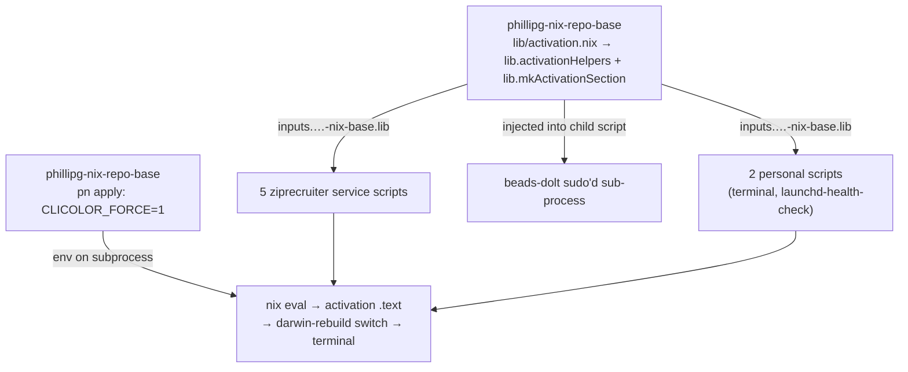
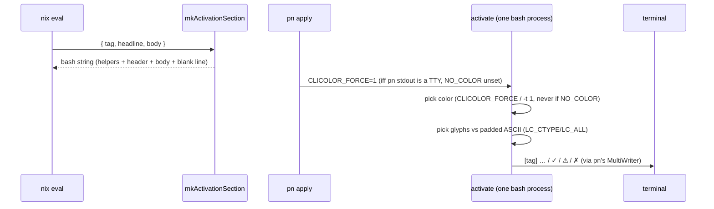

# Activation-Script Output Consistency — Design

- **Date:** 2026-06-29
- **Status:** Draft (reviewed; adjustments folded in)
- **Scope:** `phillipg-nix-repo-base` (canonical helper + `pn` force-color),
  `phillipg-nix-ziprecruiter` (5 scripts), `phillipgreenii-nix-personal` (2 scripts)

## Problem

`pn workspace apply` (→ `sudo darwin-rebuild switch`) prints a large volume of
output. Most of it comes from nix/darwin and is **out of scope** — we do not
control it and MUST NOT attempt to filter or rewrite it.

The output we _do_ control — the `system.activationScripts` we author — is
inconsistent and easy to miss:

- **Headers** differ in verb and casing: `"Ensuring Colima config..."`,
  `"setting up local-proxy TLS..."`, `"Configuring Terminal.app..."`,
  `"beads-dolt-pg2: initialising..."`. Only `launchd-health-check` uses a
  grep-friendly `[launchd-health-check]` tag.
- **Status signals** vary: `launchd-health-check` uses `  ok` / `  FAIL` /
  `  WARN`; others print `WARNING:` or `WARNING`; several (sleepwatcher,
  local-proxy, searxng, terminal) emit **no** success/fail marker at all. No
  script uses any symbol or color.
- **Spacing** is absent — sections run together with no blank line between them.
- **Streams** are mixed — mostly stdout, but colima warns to stderr.

### Confirmed constraints

- **No nix/darwin option exists** to enable here. nix-darwin composes all
  `system.activationScripts.<name>.text` fragments into a **single** activation
  script run in **one** shell process under `set -e`/`set -o pipefail` (one
  `#!/usr/bin/env -i ${stdenv.shell}` wrapper; `LANG=C` and `LC_CTYPE=UTF-8` are
  exported after `env -i`). No per-section prefix/wrapper is injected.
  Consistency is therefore entirely ours to author.
- A glyph/color vocabulary already exists in the workspace (`zr-lib.bash`:
  `✓`/`⚠`/`✗` + GREEN/YELLOW/RED; `github-nix-auth.sh`: an inline
  `log_ok`/`log_warning` pattern that writes to **stderr**). The house style
  reuses these glyphs, but deliberately routes to **stdout** (see Decisions).

## Goal

Establish a single **consistency convention** — a reusable helper plus a
retrofit of the 7 scripts we control — such that consistency is _structural_
(produced by the helper) rather than dependent on each author remembering it,
**and** such that color actually renders on the `pn workspace apply` path.

This change is **cosmetic to the output only**. The operational commands inside
each activation script MUST remain byte-for-byte unchanged.

## Section style (decided)

A grep-friendly `[tag]` header, then 2-space-indented status lines led by a
colored glyph, then a trailing blank line:

```text
[colima] ensuring config
  ✓ mount type already nfs
  ⚠ added mount /data (writable)

[beads-dolt] initialising projects
  ✓ created dolt database: pg2
  ✓ metadata.json up to date

[launchd-health-check] verifying 12 daemons
  ✓ all services running
```

When the locale is not UTF-8 the glyphs degrade to **width-padded** ASCII
markers so message text still aligns in a column:

```text
[colima] ensuring config
  [OK]   mount type already nfs
  [WARN] added mount /data (writable)
  [FAIL] could not reach daemon
```

Markers are padded to the widest (`[WARN]`/`[FAIL]` = 6 chars) plus one
trailing space before the message (`[OK]` → `[OK]  ` + space).

This extends the one convention already present (`launchd-health-check`'s
`[tag]` prefix) and reuses `zr-lib`'s glyph vocabulary.

## Architecture

One canonical helper in the base repo; the 7 scripts wrap their bodies with it.
A small `pn` change forwards color intent across the apply pipe.



`mkActivationSection` is a **pure string-builder**, added to base's flake `lib`
alongside the existing `mkGitHash` / `mkBashBuilders` / `mkVersion` /
`mkGoBuilders`. It is accessed via the established idiom
`inputs.phillipgreenii-nix-base.lib.mkActivationSection`.

### Why this approach (rejected alternatives)

- **Approach 2 — a darwin module that defines the helper bash functions once
  via an early `mkBefore`** was rejected. It is _technically_ possible (all
  `postActivation` fragments share one shell process, so functions defined in an
  early fragment **do** leak into later ones — `launchd-health-check` already
  relies on this for its `_check_*` functions). But it depends on `mkBefore`
  ordering always winning across modules, and the separately-named
  `terminalProfile` script is a different process that would need its own
  definitions anyway. Re-emitting per section is simpler and more robust.
- **Approach 3 — convention + copy-paste, no lib** was rejected: it duplicates
  the helper literally and drifts again on the next script. It fails the
  structural-consistency goal.

## Components

### Unit 1 — `lib.activationHelpers` + `lib.mkActivationSection`

**Location:** `phillipg-nix-repo-base/lib/activation.nix`, wired into the flake
`lib` attribute in `phillipg-nix-repo-base/flake.nix`. Pure: needs at most
`lib` (for `lib.escapeShellArg` if used); MUST NOT require `pkgs`.

**`lib.activationHelpers`** — a standalone bash string that defines the four
logging functions and the runtime detection. Exposed separately so it can be
injected into child scripts that run in their own process (see beads-dolt).

**`lib.mkActivationSection { tag, headline ? null, body }`** → a bash string
that emits `activationHelpers`, prints the `[tag] headline` header, runs `body`,
and prints a trailing blank line.

**Functions provided to `body` (and to any script that sources
`activationHelpers`):**

- `act_ok   "msg"` → `  ✓ msg` (green)
- `act_warn "msg"` → `  ⚠ msg` (yellow)
- `act_fail "msg"` → `  ✗ msg` (red) — **logs only; MUST NOT exit.** Each script
  keeps its own existing exit/return control flow. (The activate script runs
  under `set -e`; a helper that called `exit` would abort _all_ later sections.)
- `act_info "msg"` → `    msg` (plain indented progress, no glyph)

**Re-emission is deliberate.** Each section re-emits the helper definitions so
every `lib.mkAfter` fragment is self-sufficient regardless of merge order; the
`act_` prefix namespaces them so the 6 identical redefinitions in the shared
process are harmless (last definition wins) and do not collide with existing
locals (`state`, `label`, `rc`, …) or `launchd-health-check`'s `_check_*`.

**Escaping (required):** every helper MUST print via `printf '%s\n' "  ✓ $msg"`
form — i.e. the glyph/color/indent are literal, and `$msg` is NEVER used as a
`printf` format string. This makes messages containing `%`, `\`, or `$` safe.

**Two runtime guards (evaluated at activation time, in the emitted bash):**

- **Color** is emitted when `CLICOLOR_FORCE` is non-empty **OR** stdout is a TTY
  (`[ -t 1 ]`), and NEVER when `NO_COLOR` is non-empty (`NO_COLOR` wins).
  `CLICOLOR_FORCE` is what makes color work on the `pn workspace apply` path,
  where the subprocess stdout is a pipe (see Unit 3).
- **Glyphs vs ASCII** is chosen from `LC_ALL` / `LC_CTYPE` (NOT `LANG` —
  nix-darwin hardcodes `LANG=C`, `LC_CTYPE=UTF-8`): a `*UTF-8*`/`*utf8*` ctype
  uses `✓`/`⚠`/`✗`; otherwise the width-padded `[OK]`/`[WARN]`/`[FAIL]`. Since
  nix-darwin already forces `LC_CTYPE=UTF-8`, the ASCII path is cheap insurance,
  not the common case. The two guards are independent.

### Unit 2 — per-script retrofit

Each script is converted independently to wrap its body with
`mkActivationSection` and replace its ad-hoc echo lines with the helper
functions. Tags are lowercase-kebab and match the service:

| Script (file)                                             | Tag                    |
| --------------------------------------------------------- | ---------------------- |
| `…-ziprecruiter/darwin/services/colima/default.nix`       | `colima`               |
| `…-ziprecruiter/darwin/services/beads-dolt-projects/…`    | `beads-dolt`           |
| `…-ziprecruiter/darwin/services/sleepwatcher/default.nix` | `sleepwatcher`         |
| `…-ziprecruiter/darwin/services/local-proxy/default.nix`  | `local-proxy`          |
| `…-ziprecruiter/darwin/services/searxng/default.nix`      | `searxng`              |
| `…-personal/darwin/terminal/default.nix`                  | `terminal`             |
| `…-personal/darwin/system/launchd-services.nix`           | `launchd-health-check` |

Mapping rules:

- `echo "WARNING: … failed"` → `act_warn` (recoverable) or `act_fail` (hard).
- `launchd-health-check`'s `  ok` / `  FAIL` / `  WARN` → `act_ok` / `act_fail`
  / `act_warn` (it already has the structure; this unifies it).
- Scripts with **no** current signal (sleepwatcher, local-proxy, searxng,
  terminal) gain a closing `act_ok` so every section ends with a clear status.
- **`beads-dolt-projects` is special:** its per-project status echoes live
  inside a `pkgs.writeShellScript "beads-dolt-init-${name}"` that runs as a
  **separate** process via `sudo -H -u "$BEADS_USER"`. That child does NOT see
  functions defined in the parent `postActivation` shell. The retrofit MUST
  inject `${lib.activationHelpers}` at the top of that child script (and pass
  `CLICOLOR_FORCE` through the `sudo` invocation, e.g. `sudo -H
CLICOLOR_FORCE="${CLICOLOR_FORCE:-}" -u …`) so `act_*` and color work there.
  The tag stays `beads-dolt` and the project name moves into the message
  (e.g. `act_ok "pg2: created dolt database"`). This is its own work item.
- **Operational lines MUST NOT change** — only the echo/printf lines. In
  particular, local-proxy's `__BUILD_TIME__` sed substitution and its heredoc
  bodies are operational and stay byte-identical.

### Unit 3 — `inputs` plumbing + `pn` force-color

**`inputs` plumbing.** In the real `apply` path, personal's 2 scripts evaluate
inside ziprecruiter's host config, whose `darwinSystem` already passes `inputs`
via `specialArgs` (`…-ziprecruiter/machines/default.nix`). But personal also
builds a standalone `darwinConfigurations.ci-test` for `nix flake check`, and
**that one has no `specialArgs`** (`…-personal/flake.nix` ~line 183) — so
referencing `inputs` there would break personal's flake-check. Fix (one line):
add `specialArgs = { inherit inputs; };` to `ci-test`. personal's `inputs`
already carries the `phillipgreenii-nix-base` alias, so the helper resolves in
both eval contexts. The 5 ziprecruiter scripts only add `inputs` to their args.

**`pn` force-color.** `pn workspace apply` runs `sudo darwin-rebuild switch` via
`pn`'s exec runner, which wires `cmd.Stdout = io.MultiWriter(&buf, os.Stdout)`
(`modules/pn/internal/exec/exec.go:74-77`) — a **pipe**, not a TTY. So `[ -t 1 ]`
is false in the activate script and color would self-suppress. The bytes still
reach the terminal verbatim (pn copies the pipe to its own stdout), so forcing
color makes ANSI render correctly. Change: in
`modules/pn/internal/workspace/apply.go` (the `exec.RunOptions` at ~line 87),
when `colorEnabled(os.Stdout)` is true — the existing same-package helper at
`tree.go:191` (terminal + `NO_COLOR` unset) — add
`Env: map[string]string{"CLICOLOR_FORCE": "1"}` (`exec.RunOptions.Env` exists,
`exec.go:29`). Because pn sets it only when pn's own stdout is a TTY and
`NO_COLOR` is unset, redirecting `pn workspace apply > file` stays clean.

## Data flow



## Error handling

- Color/glyph detection is defensive: non-TTY + no `CLICOLOR_FORCE`, `NO_COLOR`,
  or non-UTF-8 ctype each degrade gracefully (no color and/or ASCII) — never an
  error.
- `act_fail` is a logger only; it MUST NOT call `exit`. Each script retains its
  existing control flow and exit/return semantics, so darwin's nonzero-exit
  handling is unchanged.
- **Section ordering caveat:** order across modules is `mkAfter` + import-order
  dependent and not guaranteed. `launchd-health-check` does `exit 1` on failure;
  any section ordered after it is skipped on that failure. The trailing blank
  line is therefore not a guaranteed terminator — it is a separator, not a
  sentinel. This is pre-existing behavior the retrofit does not change.

## Testing & validation

- **Unit (pure string shape)** — `phillipg-nix-repo-base/lib/activation-tests.nix`
  via the existing `pkgs.lib.runTests` harness (same pattern as `version-lib` /
  `claude-marketplace-lib`): assert the header line, that the four `act_*`
  function names are defined, the `printf '%s\n'` safe form is used, both glyph
  and ASCII marker sets appear in the emitted text, and the trailing newline.
- **Unit (executing behavior)** — a `pkgs.runCommand` that actually _runs_ the
  emitted bash and greps output, because `runTests` cannot verify runtime
  conditionals. Cases: fd1→pipe + no `CLICOLOR_FORCE` ⇒ no `\033[`;
  `CLICOLOR_FORCE=1` ⇒ `\033[` present; `LC_CTYPE=C` ⇒ `[OK]`/`[WARN]`/`[FAIL]`;
  `LC_CTYPE=en_US.UTF-8` ⇒ `✓`/`⚠`/`✗`; a `%`/`\`-containing `msg` ⇒ printed
  literally; ASCII markers are column-aligned.
- **`pn` Go test** — using the fake exec runner, assert apply adds
  `CLICOLOR_FORCE=1` to `Env` when `colorEnabled` is true and omits it otherwise.
- **Lint:** emitted bash MUST pass shellcheck (base already runs shellcheck).
- **Workspace gates:** `pn workspace flake-check` (exercises personal's
  `ci-test`, covers the `inputs` plumbing) + `pn workspace build` (completion
  gate; catches consumer-side breakage). The user runs the final
  `pn workspace apply` to eyeball the rendered, colored output.
- **CI regression check (verified):** existing checks (`nix/checks.nix`
  dashboard `<li>` count / footer hash / Caddy header block; `test-colima`)
  assert on operational artifacts, NOT on activation header echoes. Keeping the
  operational lines byte-identical keeps them green.

## Execution vehicle

The change spans 3 repos (base produces new lib + `pn` output consumed by the
other two), so it MUST build together. The recommended vehicle is a
**coordinated worktree set** (`pn workspace worktree add
activation-output-consistency`) rather than editing the canonical checkouts
independently, preserving the P1 guarantee on the primary checkouts.

Whether to record the activation-output convention as an **ADR** (per the base
repo's `CLAUDE.md`) is decided in the implementation plan.

## Out of scope

- Any nix/darwin-generated output (the bulk of `pn workspace apply`).
- The expected, benign `warning: not writing modified lock file` lines.
- Changing what any activation script _does_ operationally.
