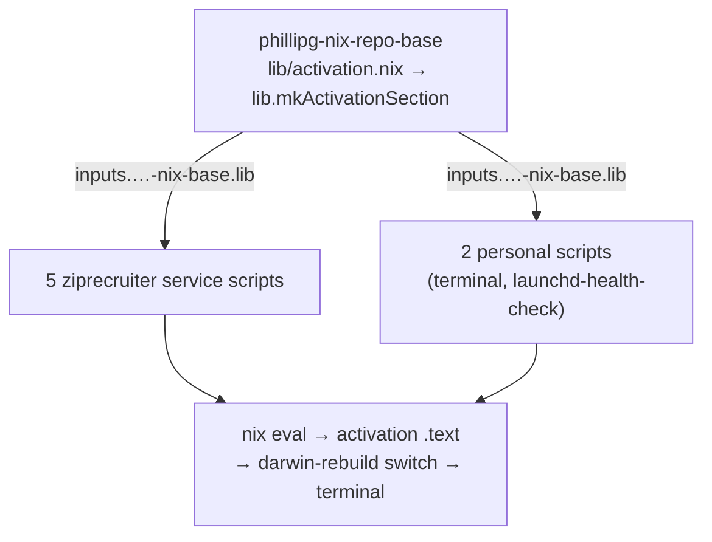
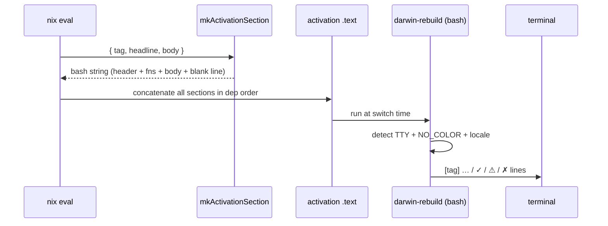

# Activation-Script Output Consistency — Design

- **Date:** 2026-06-29
- **Status:** Draft (awaiting review)
- **Scope:** `phillipg-nix-repo-base` (canonical helper), `phillipg-nix-ziprecruiter` (5 scripts), `phillipgreenii-nix-personal` (2 scripts)

## Problem

`pn workspace apply` (→ `sudo darwin-rebuild switch`) prints a large volume of
output. Most of it comes from nix/darwin and is **out of scope** — we do not
control it and MUST NOT attempt to filter or rewrite it.

The output we _do_ control — the `system.activationScripts` we author — is
inconsistent and easy to miss:

- **Headers** differ in verb and casing: `"Ensuring Colima config..."`,
  `"setting up local-proxy TLS..."`, `"Configuring Terminal.app..."`,
  `"beads-dolt-pg2: initialising..."`. Only `launchd-health-check` uses a
  grep-friendly `[launchd-health-check]` tag.
- **Status signals** vary: `launchd-health-check` uses `  ok` / `  FAIL` /
  `  WARN`; others print `WARNING:` or `WARNING`; several (sleepwatcher,
  local-proxy, searxng, terminal) emit **no** success/fail marker at all. No
  script uses any symbol or color.
- **Spacing** is absent — sections run together with no blank line between them.
- **Streams** are mixed — mostly stdout, but colima warns to stderr.

### Confirmed constraints

- **No nix/darwin option exists** to enable here. nix-darwin concatenates each
  `system.activationScripts.<name>.text` verbatim into the activation script
  with no injected prefix, timestamp, or wrapper. Consistency is therefore
  entirely ours to author.
- A glyph/color helper already exists but is **unused** by activation scripts
  (`zr-lib.bash`: `✓`/`⚠`/`✗` + GREEN/YELLOW/RED; `github-nix-auth.sh`:
  inline `log_ok`/`log_warn`). The house style builds on these rather than
  inventing new symbols.

## Goal

Establish a single **consistency convention** — a reusable helper plus a
retrofit of the 7 scripts we control — such that consistency is _structural_
(produced by the helper) rather than dependent on each author remembering it.

This change is **cosmetic to the output only**. The operational commands inside
each activation script MUST remain byte-for-byte unchanged.

## Section style (decided)

A grep-friendly `[tag]` header, then 2-space-indented status lines led by a
colored glyph, then a trailing blank line:

```text
[colima] ensuring config
  ✓ mount type already nfs
  ⚠ added mount /data (writable)

[beads-dolt] initialising projects
  ✓ created dolt database: pg2
  ✓ metadata.json up to date

[launchd-health-check] verifying 12 daemons
  ✓ all services running
```

This extends the one convention already present (`launchd-health-check`'s
`[tag]` prefix) and reuses `zr-lib`'s glyph vocabulary (`✓`/`⚠`/`✗`).

## Architecture

One canonical helper in the base repo; the 7 scripts wrap their bodies with it.



`mkActivationSection` is a **pure string-builder**, added to base's flake `lib`
alongside the existing `mkGitHash` / `mkBashBuilders` / `mkVersion` /
`mkGoBuilders`. It is accessed via the established idiom
`inputs.phillipgreenii-nix-base.lib.mkActivationSection`.

### Why this approach (rejected alternatives)

- **Approach 2 — a darwin module that defines the helper bash functions once
  via an early `mkBefore`** was rejected: it depends on all activation blocks
  sharing one shell process _and_ on `mkBefore` ordering always winning, and it
  needs extra wiring for the separately-named `terminalProfile` script. Marginal
  DRY benefit, more fragile.
- **Approach 3 — convention + copy-paste, no lib** was rejected: it duplicates
  the helper literally 7× and drifts again on the next script. It fails the
  structural-consistency goal.

## Components

### Unit 1 — `mkActivationSection` (pure function)

**Location:** `phillipg-nix-repo-base/lib/activation.nix`, wired into the flake
`lib` attribute in `phillipg-nix-repo-base/flake.nix`.

**Signature:**

```nix
lib.mkActivationSection {
  tag,              # required string, e.g. "colima"
  headline ? null,  # optional one-line description printed after the tag
  body,             # required bash string; may call act_ok/act_warn/act_fail/act_info
}
# → bash string
```

**Behavior of the emitted bash:**

1. Print the header `[tag] headline` (just `[tag]` when `headline` is null).
2. Define four logging functions in scope for `body`:
   - `act_ok  "msg"` → `  ✓ msg` (green)
   - `act_warn "msg"` → `  ⚠ msg` (yellow)
   - `act_fail "msg"` → `  ✗ msg` (red) — **logs only; MUST NOT exit.** Each
     script keeps its own existing exit/return control flow.
   - `act_info "msg"` → `    msg` (plain indented progress, no glyph)
3. Run `body`.
4. Print a trailing blank line so sections never run together.

**Two runtime guards (evaluated at activation time, in the emitted bash — not at
nix-eval time):**

- **Color** MUST be emitted only when stdout is a TTY (`[ -t 1 ]`) AND `NO_COLOR`
  is unset. This keeps `pn workspace apply | tee log` / piped output clean.
- **Glyphs** MUST fall back to ASCII (`[OK]` / `[WARN]` / `[FAIL]`) when the
  locale is not UTF-8. Activation runs under `sudo darwin-rebuild`, and sudo can
  scrub `LANG`/`LC_*`; without this guard `✓⚠✗` could render as mojibake. The
  glyph set is chosen by locale; the color is chosen by TTY+`NO_COLOR`. The two
  guards are independent.

**Stream:** all output (header, ok, warn, fail, info) MUST go to **stdout**.
Rationale: activation output is log, not data; a single stream gives
deterministic ordering interleaved with nix's own stdout messages. The ⚠/✗
glyph + color is the visual signal; genuine failures are still conveyed by exit
status, which darwin already surfaces. (This deliberately reverses the
stderr-for-warnings pattern in the survey; it is trivially flippable if a
future need arises to route `act_fail` to stderr.)

### Unit 2 — per-script retrofit

Each of the 7 scripts is converted independently to wrap its body with
`mkActivationSection` and replace its ad-hoc echo lines with the helper
functions. Tags are lowercase-kebab and match the service:

| Script (file)                                             | Tag                    |
| --------------------------------------------------------- | ---------------------- |
| `…-ziprecruiter/darwin/services/colima/default.nix`       | `colima`               |
| `…-ziprecruiter/darwin/services/beads-dolt-projects/…`    | `beads-dolt`           |
| `…-ziprecruiter/darwin/services/sleepwatcher/default.nix` | `sleepwatcher`         |
| `…-ziprecruiter/darwin/services/local-proxy/default.nix`  | `local-proxy`          |
| `…-ziprecruiter/darwin/services/searxng/default.nix`      | `searxng`              |
| `…-personal/darwin/terminal/default.nix`                  | `terminal`             |
| `…-personal/darwin/system/launchd-services.nix`           | `launchd-health-check` |

Mapping rules:

- `echo "WARNING: … failed"` → `act_warn` (recoverable) or `act_fail` (hard).
- `launchd-health-check`'s `  ok` / `  FAIL` / `  WARN` → `act_ok` / `act_fail`
  / `act_warn` (it already has the structure; this unifies it).
- Scripts with **no** current signal (sleepwatcher, local-proxy, searxng,
  terminal) gain a closing `act_ok` so every section ends with a clear status.
- `beads-dolt-projects` emits per-project; the tag stays `beads-dolt` and the
  project name moves into the message (e.g. `act_ok "pg2: created dolt database"`).
- Operational commands MUST NOT change — only the echo/printf lines.

### Unit 3 — `inputs` plumbing for personal's standalone eval

In the real `apply` path, personal's 2 scripts evaluate inside ziprecruiter's
host config, whose `darwinSystem` already passes `inputs` via `specialArgs`. But
personal _also_ builds a standalone `darwinConfigurations.ci-test` for
`nix flake check`, and **that one has no `specialArgs` today** — so referencing
`inputs` there would break personal's flake-check.

**Fix (one line):** add `specialArgs = { inherit inputs; };` to
`darwinConfigurations.ci-test` in `phillipgreenii-nix-personal/flake.nix`.
personal's `inputs` already carries the `phillipgreenii-nix-base` alias, so
`inputs.phillipgreenii-nix-base.lib.mkActivationSection` resolves in both eval
contexts. The 5 ziprecruiter scripts need no infra change — they just add
`inputs` to their module arg set.

## Data flow



## Error handling

- Color/glyph detection is defensive: a non-TTY, `NO_COLOR`, or non-UTF-8 locale
  degrades gracefully (no color and/or ASCII markers) — it never errors.
- `act_fail` is a logger only; it MUST NOT call `exit`. Each script retains its
  existing control flow and exit/return semantics, so darwin's own
  nonzero-exit handling is unchanged.
- If `body` itself fails, behavior is identical to today (the helper adds no
  `set -e` of its own beyond what each script already has).

## Testing & validation

- **Unit:** add `phillipg-nix-repo-base/lib/activation-tests.nix` using the
  existing `pkgs.lib.runTests` harness (same pattern as `version-lib` and
  `claude-marketplace-lib` checks). Assert: header line present; each glyph
  line; the color-off branch; the ASCII-fallback branch; the trailing newline.
- **Lint:** the emitted bash MUST pass shellcheck (base already runs shellcheck
  checks over its bash).
- **Workspace gates:**
  - `pn workspace flake-check` — exercises personal's `ci-test` (covers Unit 3).
  - `pn workspace build` — the workspace completion gate; catches consumer-side
    breakage in ziprecruiter.
- **Manual:** the user runs the final `pn workspace apply` to eyeball the
  rendered output.

## Execution vehicle

The change spans 3 repos (base produces a new lib output consumed by the other
two), so it MUST build together. The recommended vehicle is a **coordinated
worktree set** (`pn workspace worktree add activation-output-consistency`)
rather than editing the canonical checkouts independently, preserving the P1
guarantee on the primary checkouts.

## Out of scope

- Any nix/darwin-generated output (the bulk of `pn workspace apply`).
- The expected, benign `warning: not writing modified lock file` lines.
- Changing what any activation script _does_ operationally.
