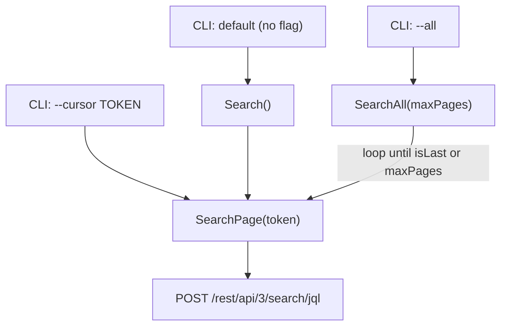

# Generic Jira `search` Pagination — Design

**Beads**: pg2-2x2d.7 (child of epic pg2-2x2d, the generic Jira access tool)
**Status**: Draft (design only)
**Date**: 2026-06-29
**Deciders**: phillipg

## 1. Problem

SP1 shipped `jira search` as a **single-page** operation. `Client.Search` issues one
`POST /rest/api/3/search/jql` with `maxResults = limit`, then distills Atlassian's
`nextPageToken`/`isLast` response fields into a single boolean `Truncated`. It **never sends
`nextPageToken` back**, so there is no way to reach page 2, and it does not surface the token to
the caller.

Consequently every windowed collector caps at one page (effectively ≤100 issues — Atlassian's
per-page ceiling for `/search/jql`) and can only _warn_ on `truncated:true`:

- **UJ-6 / SP5 — work-activity-tracker** (Python): issues updated in a time window. A busy day can
  exceed 100 updated issues; the tail is silently dropped today.
- **UJ-7 / SP6 — activity-collector** (Go): a user's created/commented/transitioned issues. Same
  truncation risk.

The cross-cutting decision (settled 2026-06-29, bd memory `jira-tool-cross-cutting-decisions`) is
to **build cursor pagination first** so SP5/SP6 can collect to completeness rather than cap-and-warn.
This makes pg2-2x2d.7 a prerequisite that **blocks SP5 and SP6**.

## 2. Goals / Non-Goals

**Goals**

- Let `jira search` return **complete** results across all pages for a JQL query.
- Expose pagination through **two front doors over one core** (the settled hybrid decision): a raw
  `--cursor <token>` primitive _and_ an `--all` convenience that loops internally.
- Keep the page-following loop in **one place** (the generic tool), so neither the Python (SP5) nor
  the Go (SP6) consumer re-implements paging — the DRY thesis of the whole epic.
- Preserve the existing single-page `{items, truncated}` contract **byte-compatibly** (pr-pool /
  SP4 relies on it; the change MUST be strictly additive).

**Non-Goals**

- **Parallel / concurrent** page fetching. Pages are inherently sequential under cursor pagination
  (each response yields the next token); YAGNI for windowed queries.
- **Streaming** output. The full result set is buffered in memory before the envelope is emitted —
  acceptable because every consumer query is window-bounded.
- **Persisted cursors** across process invocations. The `--cursor` primitive is stateless per call.
- Changing `get_issue` or `auth-status`. This SP touches `search` only.

## 3. Decision — hybrid: `--cursor` primitive + `--all` convenience

The flag interface was chosen from three candidates:

| Option                              | Loop lives in                      | Consumer cost                          | Verdict                      |
| ----------------------------------- | ---------------------------------- | -------------------------------------- | ---------------------------- |
| `--all` only (tool loops)           | the tool                           | trivial (`--all`)                      | simple, but no raw primitive |
| `--cursor` only (consumer drives)   | **each** consumer                  | re-implement loop in Py **and** Go     | re-spreads the plumbing      |
| **Hybrid: `--cursor` + `--all`** ✅ | tool (`--all`) + exposed primitive | trivial (`--all`); primitive available | **chosen**                   |

The hybrid keeps the consumers trivial (`--all`) while exposing the cursor for any future
streaming/early-exit need, at the cost of a slightly larger but well-bounded surface. It is layered
so the loop is built _on_ the primitive, not duplicated.

## 4. Client API (`pkg/jira`)

Three layers, smallest owns the HTTP. `SearchResult` gains one additive field; the new public
methods wrap a shared private `searchPage`.

```go
// model.go — additive field only; existing fields unchanged.
type SearchResult struct {
	Items         []Issue `json:"items"`
	Truncated     bool    `json:"truncated"`
	NextPageToken string  `json:"next_page_token,omitempty"` // token to fetch the NEXT page; empty when last/complete
}
```

```go
// client.go

// SearchPage fetches ONE page. When pageToken != "", it is sent as the request body's
// "nextPageToken" to fetch that page. The returned SearchResult.NextPageToken is the token for the
// NEXT page ("" when this is the last page). Truncated retains SP1's computation —
// nextPageToken != "" || (isLast != nil && !*isLast) — while NextPageToken is the authoritative
// loop driver (SearchAll continues iff NextPageToken != "").
func (c *Client) SearchPage(ctx context.Context, jql string, limit int, exp ExpandOpts, pageToken string) (*SearchResult, error)

// Search preserves SP1 behavior exactly: a single first page. It MUST delegate to
// SearchPage(ctx, jql, limit, exp, "") so the {items,truncated} contract is byte-identical.
func (c *Client) Search(ctx context.Context, jql string, limit int, exp ExpandOpts) (*SearchResult, error)

// SearchAll follows NextPageToken until isLast/empty, concatenating Items across pages. It stops at
// maxPages as a runaway safety cap. On completion: Truncated=false, NextPageToken="". On cap-hit:
// Truncated=true and NextPageToken = the next unfetched token (partial result).
func (c *Client) SearchAll(ctx context.Context, jql string, limit int, exp ExpandOpts, maxPages int) (*SearchResult, error)
```

- `SearchPage` is the refactor target: the body-building + mapping logic currently inside `Search`
  moves here, gaining the `pageToken` input and surfacing `NextPageToken` in the result.
- `Search` becomes a one-line delegate (no behavior change).
- `SearchAll` owns the loop and the cap; it MUST NOT mutate per-page `exp`/`limit` between calls.



## 5. CLI (`cmd/jira` — `search` subcommand)

Additive to today's `--jql` (required), `--limit`, `--expand`:

- `--cursor <token>` — fetch the single page at `<token>` (calls `SearchPage`).
- `--all` — fetch every page (calls `SearchAll`).
- `--cursor` together with `--all` MUST be a usage **error** (exit non-zero, no envelope).

**`--limit` semantics (sub-decision A):** `--limit` remains **per-page `maxResults`** in _all_
modes (`0` → config default, as today). Under `--all` each page request uses that size; the total
is bounded only by exhaustion or the safety cap. (Rejected alternative: `--limit` as a grand-total
cap under `--all` — a less direct mental model and it conflates "page size" with "result budget".)

## 6. Output envelope

One shape across all modes — `{items, truncated, next_page_token?}`:

| Mode                                     | `truncated` | `next_page_token`           |
| ---------------------------------------- | ----------- | --------------------------- |
| default / `--cursor` (more pages remain) | `true`      | set (the next token)        |
| default / `--cursor` (last page)         | `false`     | omitted                     |
| `--all` (ran to completion)              | `false`     | omitted                     |
| `--all` (hit safety cap)                 | `true`      | set (first unfetched token) |

`next_page_token` is `omitempty`, so the last-page/complete envelope is **byte-identical** to SP1's
`{items, truncated}`. The new key is strictly additive; pr-pool (SP4) reads only `items`/`truncated`
and Go's `encoding/json` ignores the rest, so SP4 is unaffected. The CLI MUST continue to write
exactly one complete envelope on success and **never** a partial envelope on error (spec §6 of the
parent design).

## 7. Safety cap & error handling

**Safety cap (sub-decision B):** `--all` is bounded by a **constant** `maxSearchPages` (no
user-facing flag — YAGNI), set high enough that real windowed queries never reach it
(`maxSearchPages = 100`; at the 100-item per-page ceiling that is up to 10,000 issues). On cap-hit
the tool MUST: emit the **partial** envelope with `truncated:true` (and the next token), write a
**one-line warning to stderr**, and exit **0**. Rationale: a windowed collector should ingest what
it got and act on `truncated:true` (exactly what SP5/SP6 already plan to do) rather than lose the
whole batch to a hard error. (Rejected alternative: hard-error / non-zero on cap-hit.)

**Error handling:**

- `--cursor` + `--all` together → usage error, exit non-zero, no envelope.
- Any per-page HTTP / transport error mid-loop → propagate the error, exit non-zero, **no partial
  envelope** (preserves the "one complete envelope or nothing" contract).
- An empty/whitespace `--cursor` value is treated as "no token" (i.e., the first page).

## 8. Consumer impact (re-plans SP5 / SP6)

Both consumers switch from `--limit 100` + warn-on-truncate to **`--all`** for completeness:

- **SP5 (work-activity-tracker, Python):** `subprocess` call gains `--all`; drop the
  truncation-warning-only handling. The plan's "Open Design Decision: pagination — defer + warn" is
  **superseded** by this design.
- **SP6 (activity-collector, Go):** shell-out gains `--all`; ODD-6 ("warn on truncate") is
  **superseded**.

The `--cursor` primitive stays available but is **unused** by SP5/SP6 (kept for future
streaming/early-exit consumers). Both SHOULD still treat a returned `truncated:true` (cap-hit) as a
logged warning — the residual safety net.

## 9. Testing (TDD, per workspace rules)

Unit tests MUST cover, via an `httptest.Server` serving a multi-page `nextPageToken` chain
(e.g. page1→token "p2", page2→token "p3", page3→`isLast:true`):

- `SearchPage` sends the inbound `pageToken` in the request body and surfaces the response's
  `NextPageToken`; `Truncated == (NextPageToken != "")`.
- `Search` (back-compat) issues exactly one page with **no** `nextPageToken` in the request and
  returns the SP1-identical envelope.
- `SearchAll` concatenates items across all pages, stops on `isLast`, and returns
  `Truncated:false`/empty token on completion.
- `SearchAll` honors the page cap: with `maxPages` smaller than the chain, it returns
  `Truncated:true` and the next unfetched token, having fetched exactly `maxPages` pages.
- CLI: `--all` aggregates; `--cursor <token>` emits a single page with `next_page_token` set;
  `--cursor` + `--all` exits non-zero with no envelope; the JSON envelope shape matches §6.
- The SP1 guardrail test (no ZR / no OS command / no `pg-pr` import in `pkg/jira`) MUST stay green.

Validation gate (mirrors SP1, per workspace rules): `go test ./...`, `go vet ./...`,
`gofmt -l modules/jira` clean (run manually — repo-base `treefmt` has no Go formatter yet, tracked
by pg2-2uat), `nix build .#jira` passes, repo-base `nix flake check` passes.

## 10. Alternatives Considered

- **`--all` only** — simplest consumer contract, but no raw cursor for future streaming/early-exit
  consumers. Rejected per the settled hybrid decision.
- **`--cursor` only** — exposes the primitive but forces both the Python and Go consumers to each
  re-implement the page loop, re-spreading the plumbing this epic consolidates. Rejected.
- **`--limit` as a grand-total cap under `--all`** — conflates page size with a result budget and
  reintroduces application-level truncation. Rejected in favor of per-page semantics (§5).
- **User-configurable `--max-pages`** — speculative; no consumer needs to tune it. A constant cap
  with a generous default suffices (§7); promote to a flag/config key only if a real need appears.
- **Hard-error on cap-hit** — loses the whole batch for a windowed collector. Rejected in favor of
  partial + `truncated:true` + stderr warning + exit 0 (§7).

## 11. Open Questions / Future

- **`--max-pages` as a flag/config key** — deferred (YAGNI) until a consumer needs to tune the cap.
- **Streaming output** (NDJSON per item) — deferred; would let `--all` avoid buffering, but no
  consumer needs it for window-bounded queries.

## 12. Related

- Parent design: `docs/superpowers/specs/2026-06-26-generic-jira-access-tool-design.md` (§6, §9.2).
- bd: pg2-2x2d.7 (this), pg2-2x2d (epic), pg2-2x2d.5 / pg2-2x2d.6 (SP5/SP6, blocked by this),
  pg2-2uat (add a Go formatter to repo-base `treefmt`).
- bd memory: `jira-tool-cross-cutting-decisions` (the settled pagination-first decision).
