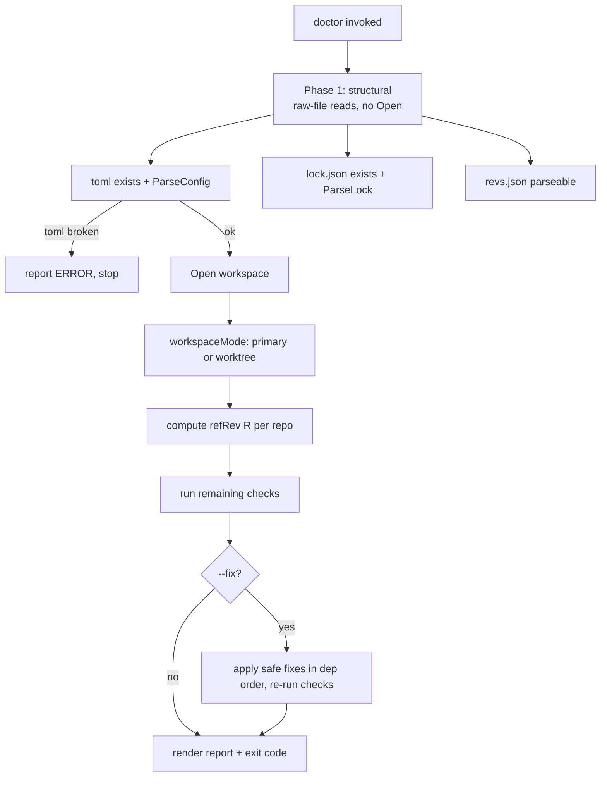

# pn workspace doctor — Design

**Status:** Draft — pending review
**Date:** 2026-06-30
**Repos affected:** `phillipg-nix-repo-base` (`modules/pn`, docs)
**Related:** ADR 0002 (pn-workspace.toml schema); 2026-06-16 coordinated-worktrees design (the _set_ model); 2026-06-24 update-worktree-isolation design (rev-capture + propagation paths reused here)

## Problem

Confidence in changes made across the workspace erodes when small things drift
out of place — a repo left on a feature branch, a stale `flake.lock`, a
`pn-workspace.revs.json` that no longer matches reality. None of these are loud
failures; they silently make a local `apply`/`build` produce a different result
than a clean remote build. There is no single command that audits the workspace
for these drifts and, where safe, repairs them.

`pn workspace doctor` is that command: it checks the workspace artifacts and
repo state against a single, precise invariant, classifies each finding as an
**error** or **warning**, reports whether each is auto-fixable, and (with
`--fix`) repairs the safe ones by delegating to existing `pn` command logic.

## The invariant (the organizing principle)

> If `doctor` reports **no errors**, then a local rebuild (with workspace-local
> repos injected as `--override-input`) and a pure-remote rebuild (using only
> `flake.lock` / `pn-workspace.revs.json`, no local overrides) produce the
> **same** output.

Severity is **derived** from this invariant, never hand-assigned:

- **Error** — the finding would make a local `apply`/`build` either _fail_ or
  _differ from the pure-remote result_.
- **Warning** — everything else (drift worth surfacing that does not change
  build output or break the build).

This is grounded in how overrides actually work:
`overrideInputArgsFor` emits `--override-input <alias> git+file://<dir>` for each
workspace edge whose target clone exists on disk (`internal/workspace/helpers.go:55`).
Two consequences drive several severities:

1. `git+file://` is git-aware but Nix's git fetcher **incorporates uncommitted
   tracked modifications** (marking the tree dirty, changing the narHash). A
   dirty primary clone therefore diverges from the clean remote build →
   `tree-clean` is an **error** (primary mode).
2. A target clone that is **missing on disk is silently skipped**
   (`helpers.go:86`); the build falls back to that input's `flake.lock` rev,
   which equals the pure-remote result. A missing non-terminal repo therefore
   does **not** cause divergence → it is a **warning** (the missing _terminal_
   clone is the exception — `apply` cannot target it → **error**).

## Goals

- One command that audits every workspace artifact and repo for drift.
- Severity derived from the invariant above; per-finding `fixable` flag.
- `--fix` repairs the **safe** findings; `--dry-run` shows the plan without
  applying; destructive repairs are never automatic.
- Support running inside a coordinated worktree set with relaxed, self-consistency
  semantics.
- Own as little logic as possible: delegate every check to an existing read
  primitive and every fix to an existing command method.

## Non-Goals

- No new git/nix workflow. `doctor` orchestrates existing `pn` operations.
- No destructive auto-repair (no `reset --hard`, no force-push, no deleting
  on-disk repos, no discarding uncommitted work).
- Not a replacement for `status` / `info`; it is additive.
- Hooks (`[hooks.doctor]`) are out of scope for v1.

## Decisions (resolved with Phillip, 2026-06-30)

1. **Fix model:** report-only by default; `--fix` applies safe fixes only;
   unsafe findings are reported with the manual command. `--dry-run` prints the
   fix plan and applies nothing.
2. **Remote state:** `git ls-remote` (read-only; no ref/working-tree mutation).
   `--offline` skips remote-dependent checks (reported as _skipped_, not _ok_).
3. **`revs.json` inaccuracy is an error** (it drives the remote-inputs override
   path).
4. **`tree-clean`:** error in primary mode; **warning in worktree mode** (dirty
   is the normal state mid-development; no remote baseline applies).
5. **`repos-extra`:** warning, and **fixable by adding the repo to the config**
   using `init`'s reconciliation logic.
6. **`repos-present`/`repos-extra` severity is derived** (see invariant): a
   missing non-terminal repo and an extra on-disk repo are warnings; a missing
   terminal clone is an error.
7. **`lock-present`/`lock-current`:** warning, because the DAG is derived
   dynamically by `effectiveLock`. **Exception (error):** the on-disk lock's
   repo-set matches config (so `effectiveLock` consumes it as-is) **but** its
   edges/order differ from a fresh derive — that stale lock would actually be
   used and could change build sequencing/propagation.
8. **Mode detection is behind a function** so it can change later; for now the
   signal is "member checkouts whose `.git` is a _file_" (a linked worktree) ⇒
   worktree mode.
9. **Never auto-resolve branch divergence:** ff-pull only when strictly behind;
   diverged/ahead → report.

## Design

### Two modes, auto-detected

A worktree set dir is itself a resolvable workspace root (it holds its own
`pn-workspace.toml` / `.lock.json` / `.revs.json`, written by
`writeSetMembership`, `internal/workspace/worktree.go:150`). `doctor` therefore
supports both roots and detects which via `workspaceMode(ws)` (the named seam
from decision 8).

| Concern                           | Primary mode                                                                   | Worktree mode                                        |
| --------------------------------- | ------------------------------------------------------------------------------ | ---------------------------------------------------- |
| Reference rev `refRev(R)`         | remote default-branch HEAD (`git ls-remote`)                                   | member worktree's committed HEAD (local; no network) |
| Branch check                      | each primary clone on its default branch (`RepoConfig.Branch`, default `main`) | all members on the **same branch name** (uniform)    |
| `branch-synced` (local == remote) | enforced                                                                       | **dropped**                                          |
| Network                           | `ls-remote`, or `--offline` → skip                                             | none                                                 |
| Self-consistency target           | local == revs.json == flake.lock == remote                                     | revs.json == flake.lock == member HEADs              |
| `tree-clean`                      | error                                                                          | warning                                              |

In both modes the doctor checks the **primary checkouts of the resolved root**
(the sibling dirs), never recursing into `.worktrees/`.

### Two-phase execution

`Open()` itself runs `ParseConfig` and `ReadLock` (with invariant checks) and
**fails** when the toml or lock is malformed (`internal/workspace/workspace.go:33`).
A broken toml/lock must still be diagnosable, so `doctor` runs in two phases:



Phase 1 runs at the CLI layer **without** `openWorkspace()` so a broken toml is
reported rather than aborting opaquely. Phase 2 requires a successfully opened
`Workspace`.

### Core types

```go
// internal/workspace/doctor.go
type Severity int // Warning, Error

type Finding struct {
    CheckID  string
    Repo     string // "" for workspace-level findings
    Severity Severity
    Message  string
    Fixable  bool
    fix      func(ctx context.Context) error // nil unless safely auto-fixable
}

type DoctorReport struct {
    Findings []Finding
    // HasErrors(), bySeverity(), byRepo()
}

type DoctorOptions struct {
    Fix      bool
    DryRun   bool
    Offline  bool
    JSON     bool
    Terminal string
}
```

A `check` is a function `func(ctx, *doctorEnv) []Finding`, where `doctorEnv`
carries the opened workspace, the detected mode, and the memoized `refRev(R)`
map (computed once, reused by the branch/revs/flake-lock checks).

### Check catalog

Severity below is **primary mode**; worktree-mode deltas are in the notes.

| ID                                                       | Severity                                                                                                                                       | Why (invariant)                                                                      | Fix → existing code                                               |
| -------------------------------------------------------- | ---------------------------------------------------------------------------------------------------------------------------------------------- | ------------------------------------------------------------------------------------ | ----------------------------------------------------------------- |
| `toml-present` / `toml-valid`                            | Error                                                                                                                                          | nothing builds                                                                       | — (stop; Phase 1)                                                 |
| `repos-present` (non-terminal missing)                   | Warning                                                                                                                                        | missing clone is skipped → falls back to flake.lock rev = pure-remote                | `Clone` (`clone.go:29`)                                           |
| `repos-present` (**terminal** missing)                   | Error                                                                                                                                          | `apply` cannot target the terminal flake                                             | `Clone`                                                           |
| `repos-extra`                                            | Warning                                                                                                                                        | not in config ⇒ never an override ⇒ ignored by apply                                 | `reconcileFromFilesystem` (`init.go:301`)                         |
| `repo-identity` (origin ≠ toml url)                      | Error                                                                                                                                          | override would inject a different repo than remote expects                           | — (report; reuse `checkRemoteAgreement`/`urlsAgree`, `sanity.go`) |
| `branch-current` (primary) / `branch-uniform` (worktree) | Error                                                                                                                                          | wrong branch ⇒ override uses wrong tree                                              | `git switch` when clean (extracted helper)                        |
| `branch-synced` _(primary only)_                         | Error                                                                                                                                          | local HEAD ≠ remote ⇒ override ≠ remote build                                        | ff-pull only when strictly behind; else report                    |
| `tree-clean`                                             | Error (primary) / **Warning (worktree)**                                                                                                       | `git+file://` incorporates dirty tracked changes                                     | — (never auto-discard)                                            |
| `revs-valid`                                             | Error                                                                                                                                          | corrupt revs breaks the remote-inputs pin path                                       | rewrite                                                           |
| `revs-accurate`                                          | Error                                                                                                                                          | drives `--override-input` pinning on the remote-inputs path                          | extracted `WriteRevLockFromHeads` (shared with `update`)          |
| `lock-present`                                           | Warning                                                                                                                                        | `effectiveLock` derives it dynamically                                               | `WriteDerivedLock` (`derive_lock.go:139`)                         |
| `lock-current`                                           | Warning, **except Error** when repo-set matches config but edges/order differ from a fresh derive (so `effectiveLock` consumes the stale lock) | —                                                                                    | `WriteDerivedLock`                                                |
| `flake-lock-fresh`                                       | Error                                                                                                                                          | stale workspace input ⇒ remote build fetches a different rev than the local override | `propagateWorkspaceEdges` (`propagate.go:119`)                    |

`refRev(R)`:

- **Primary:** `git ls-remote <origin> <branch>` → the remote default-branch
  HEAD. `--offline` ⇒ `branch-synced`, `revs-accurate`, and `flake-lock-fresh`
  report _skipped_.
- **Worktree:** the member worktree's committed HEAD (`captureHead`,
  `update.go:238`). No network.

`flake-lock-fresh` reads the locked rev per edge alias via `readAliasRevs` +
`workspaceAliasesFromLock` (`propagate.go`) — a **pure file read**, no nix — and
compares to `refRev(target)`.

### Fix engine (`--fix`, `--dry-run`)

`--fix` applies only findings with a non-nil `fix`, in dependency order so each
fix observes a consistent world:

1. clone missing repos (`Clone`)
2. reconcile extra repos into config (`reconcileFromFilesystem`)
3. `git switch` to the default/uniform branch (clean trees only)
4. ff-pull repos that are strictly behind
5. regenerate `lock.json` (`WriteDerivedLock`)
6. propagate workspace edges into each `flake.lock` (`propagateWorkspaceEdges`)
7. rewrite `revs.json` from the now-synced HEADs (`WriteRevLockFromHeads`) — last

Then re-run all checks and report residual findings.

`--dry-run` prints this ordered plan — each action and the exact existing method
it delegates to — and applies nothing. It is meaningful with `--fix`; passed
alone it behaves as `--fix --dry-run`.

Destructive situations are **never** auto-fixed and are reported with the manual
command: diverged/ahead branch, dirty tree, `repo-identity` mismatch.

### Reuse / refactor plan

Net-new code is limited to: `workspaceMode` detection, the `Finding`/`check`
registry, the orchestrator, output rendering, and exit codes. Logic is reused
from existing methods; where a command holds the logic **inline**, it is
**extracted** into a shared `Workspace` method (called by both the command and
`doctor`) rather than duplicated:

- Extract `update.go`'s inline rev-capture → `(*Workspace).WriteRevLockFromHeads(ctx)`;
  `update` and the `revs` fix both call it.
- Extract a `switchToDefaultBranch` + `fastForwardIfBehind` helper from the
  `rebase` / `update` pull paths; the branch fixes call it.

### CLI surface

```
pn workspace doctor [--fix] [--dry-run] [--offline] [--json] [--terminal <repo>]
```

Registered in `internal/cli/workspace.go` as `workspaceDoctorCmd`. Phase-1
structural checks run there **before** `openWorkspace()` so a broken toml is
diagnosable.

### Output & exit codes

- Default: human report grouped by repo, errors before warnings, each line
  tagged `[fix]` (auto-fixable now), `[fix --fix]` (will fix on `--fix`), or
  `[manual]`.
- `--json`: a stable contract (array of findings), mirroring `info`'s JSON
  contract pattern, for `pb gate` / CI consumption.
- Exit codes: `0` no errors (warnings allowed); `1` errors present; `2` doctor
  itself failed (e.g. `ls-remote` unreachable without `--offline`). This lets
  `doctor` act as a pre-`apply` gate.

## Edge cases

- **Broken toml/lock:** diagnosed in Phase 1; `doctor` does not abort opaquely.
- **`--offline`:** remote-dependent checks report _skipped_, never silently _ok_.
- **Worktree subset set:** the set's filtered config/lock are the source of
  truth for that set; edges to excluded deps are not errors (they resolve
  against the consumer's locked input, matching `noticeExcludedDeps`).
- **Missing upstream/no `origin`:** `branch-synced` reports _skipped_ (cannot
  determine `refRev`); not an error.
- **Detached HEAD:** treated as "not on branch" → `branch-current` error.
- **Fix that errors:** reported; the run continues to the next fix.

## Tests

**Primary strategy — state-transition tests, not mirror-mocks.** Each test
builds a **known starting state** in a temp dir using _real_ `git init` repos
plus real artifact files, runs the check (and `--fix`) through a **real git
runner**, then asserts the **end state** (branches, file contents, findings).
No mocks that mirror git call-by-call. (Satisfies the workspace rule that
file-modifying tests generate their scenario in a temp dir.)

This is viable because most checks/fixes are git+file operations, and
`flake-lock-fresh` _detection_ is a pure file read (no nix).

**Nix seam → smoke/integration.** The only true nix dependencies are
`gatherInputURLs` (edge derivation behind `lock-current` detection) and
`propagateWorkspaceEdges` (the `flake.lock` _fix_). These are exercised by a
smoke test that performs a genuine detect → `--fix` → verify cycle on a fixture
workspace with real nix, reusing the existing `internal/workspace/smoke`
harness — so the nix-touching fix is never mocked.

`exec.FakeRunner` is used only where a real call is impractical, never as a
line-by-line mirror of the implementation.

Coverage:

- Per-check state tests: each finding's detection and (where applicable) its fix,
  asserting end state.
- Mode detection (`workspaceMode`): primary vs linked-worktree.
- Orchestrator: severity rollup, exit codes (0/1/2), `--offline` skip behavior,
  fix ordering, `--dry-run` plan (no mutation).
- Smoke: end-to-end detect→fix→verify including `flake.lock` propagation.

## Follow-up implementation beads (proposed — to create on approval, via `bd`)

1. Extract shared helpers (`WriteRevLockFromHeads`; `switchToDefaultBranch` +
   `fastForwardIfBehind`).
2. `workspaceMode` detection + `doctorEnv` + `refRev` memoization.
3. `Finding`/`check` registry + orchestrator + Phase-1 structural checks.
4. Implement the check catalog (group by reuse target).
5. Fix engine (`--fix`, `--dry-run`, dependency ordering, re-run).
6. CLI wiring, output rendering, exit codes, `--json`.
7. State-transition unit tests + smoke test.
8. Docs (`pn workspace doctor` help, README/agent-rules touch points).

## Open items

- JSON contract field names (finalize during implementation; mirror `info`).
- Whether `branch-uniform` should additionally assert the member branch matches
  the set dir name (currently: uniformity only).
