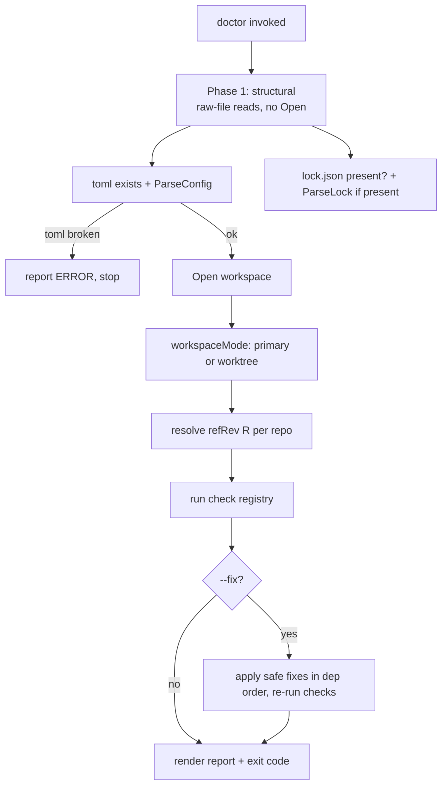

# pn workspace doctor — Design

**Status:** Draft — revised after 4-reviewer critique (completeness / correctness / UX / test plan), 2026-06-30
**Date:** 2026-06-30
**Repos affected:** `phillipg-nix-repo-base` (`modules/pn`, docs)
**Related:** ADR 0002 (pn-workspace.toml schema); 2026-06-16 coordinated-worktrees design; 2026-06-24 update-worktree-isolation design (the relock→commit→push flow reused here); bead `pg2-f1k1` (remove write-only `RevLock`)

## Problem

Confidence in changes made across the workspace erodes when small things drift
out of place — a repo left on a feature branch, a stale `flake.lock`, a primary
clone behind its remote. None of these are loud failures; they silently make a
local `apply`/`build` produce a different result than a clean remote build.
There is no single command that audits the workspace for these drifts and,
where safe, repairs them.

`pn workspace doctor` is that command: it checks the workspace artifacts and
repo state against a single, precise invariant, classifies each finding as an
**error** or **warning**, reports whether each is auto-fixable, and (with
`--fix`) repairs the safe ones by delegating to existing `pn` command logic.

## The invariant (the organizing principle)

> If `doctor` reports **no errors**, then a local override build
> (`darwin-rebuild --flake <terminal> --override-input <dep> git+file://<clone>`
> for each workspace dep) and a pure-remote build (a plain nix build that uses
> each repo's **committed `flake.lock`**, no local overrides) produce the
> **same** output.

Severity is **derived** from this invariant, never hand-assigned:

- **Error** — the finding would make the local override build either _fail_ or
  _differ from the pure-remote result_.
- **Warning** — drift worth surfacing that does not change build output or break
  the build.

Grounded in how overrides actually work — `overrideInputArgsFor` emits
`--override-input <alias> git+file://<dir>` for each lock edge whose target
clone exists on disk (`internal/workspace/helpers.go:55`, emit at `:89`, skip at
`:86`). The "pure-remote inputs" build is simply the normal nix build from
committed `flake.lock`s; nothing reads `pn-workspace.revs.json` (see
[Removed: revs.json](#removed-revsjson)).

For repo R, define the **reference rev** `refRev(R)`:

- **Primary mode:** R's default-branch HEAD **on the remote**, obtained by
  `git ls-remote <canonical-url> <branch>` — the canonical URL via `displayURL`
  / the push-remote resolution chain (`canonical_url.go`, `push.go:55`), **not**
  a hardcoded remote literally named `origin` (the `[[repos.X.remotes]]` form may
  have no `origin`).
- **Worktree mode:** the member worktree's committed HEAD (`captureHead`,
  `update.go:239`); no network.

The invariant holds iff, for every repo, the local clone HEAD, the consumers'
`flake.lock` pins for edges into R, and (primary mode) the remote HEAD all equal
`refRev(R)`, the clone is clean and on the right branch, and the terminal is
resolvable and `follows`-correct.

## Goals

- One command that audits every workspace artifact and repo for drift.
- Severity derived from the invariant; per-finding `fixable` flag.
- `--fix` repairs the **safe** findings; `--dry-run` shows the plan without
  applying; destructive repairs are never automatic.
- Runs inside a coordinated worktree set with relaxed, self-consistency
  semantics.
- Owns as little logic as possible: every check delegates to an existing read
  primitive, every fix to an existing command method.

## Non-Goals

- No new git/nix workflow. `doctor` orchestrates existing `pn` operations.
- No destructive auto-repair (no `reset --hard`, no force-push, no deleting
  on-disk repos, no discarding uncommitted work).
- Not a replacement for `status` / `info`; it is additive.
- `[hooks.doctor]` is out of scope for v1; wiring doctor into `[hooks.pre.apply]`
  is deferred (see [Gate use](#gate-use)).
- Removing `RevLock`/`revs.json` is tracked separately (bead `pg2-f1k1`), not
  done here.

## Decisions

1. **Fix model:** report-only by default; `--fix` applies safe fixes only;
   unsafe findings are reported with a concrete manual command. `--dry-run`
   prints the fix plan and applies nothing; `--dry-run` **requires** `--fix`.
2. **Remote state:** `git ls-remote` against the repo's canonical URL
   (read-only; no ref/working-tree mutation). `--offline` skips remote-dependent
   checks, reported as _skipped_, never _ok_. The skip set is **mode-dependent**:
   in worktree mode `refRev` is local, so those checks are not skipped offline.
3. **`tree-clean`:** error in primary mode; **warning in worktree mode** (dirty
   is normal mid-development; no remote baseline applies). "Dirty" = `isDirty`
   (`update.go:228`) — **tracked** changes only. Untracked files are correctly
   ignored: Nix's flake git-fetcher only sees git-tracked files, so an untracked
   file is not in the build either.
4. **`repos-extra`:** warning, fixable by adding the repo to the config via
   `init`'s reconciliation logic — **best-effort**: `reconcileFromFilesystem`
   only adds a dir that is a git repo with a resolvable origin; an origin-less
   dir is reported, not silently skipped.
5. **`repos-present` severity is derived:** a missing non-terminal repo is a
   warning (its override is skipped → `flake.lock` fallback = pure-remote); a
   missing **terminal** clone is an error (the terminal is the build-target
   directory — `requireTerminal` does no existence check, so the build command
   runs against a non-existent path and fails: `apply.go:34`,
   `terminal_guard.go:83`).
6. **`lock-present`/`lock-current`:** warning, because the DAG is derived
   dynamically by `effectiveLock`. **Exception (error):** the on-disk lock's
   repo-set matches config (so `effectiveLock` and the disk-lock-reading
   `overrideInputArgsFor` consume it **as-is**) **but** its edges/order differ
   from a fresh derive (`lockMatchesConfig` compares only the repo key set:
   `derive_lock.go:117`). That stale lock would actually be used and could change
   build sequencing / override emission.
7. **Mode detection is behind a `workspaceMode()` function** so it can change
   later. Signal: a member checkout whose git-common-dir differs from its
   git-dir (`git rev-parse --git-common-dir` ≠ `--git-dir`) is a linked worktree.
   (Preferred over a bare "`.git` is a file" stat, which a **submodule** also
   satisfies — `isGitRepo` already treats `.git`-as-file as valid for that
   reason, `init.go:198`.)
8. **Never auto-resolve branch divergence:** ff-pull only when strictly behind;
   diverged/ahead → report with a manual command. `doctor` does not push, with
   the single documented exception of the `flake-lock-fresh` fix (next).
9. **`flake-lock-fresh` fix delegates to `pn workspace update`** (relock →
   commit → push, topo-ordered). An in-place `propagateWorkspaceEdges` commits
   without pushing, leaving the repo ahead of remote — non-convergent (the next
   `doctor` run would flag `branch-synced`). `update` is the proven convergent
   flow. **Consequence:** this is the one fix that pushes; it is gated behind
   `--fix`, shown in `--dry-run`, and called out in the report. **Resolved
   (2026-06-30): a push is acceptable when required to make the workspace
   consistent.**
10. **`revs.json` is removed** (bead `pg2-f1k1`): it is write-only dead code, no
    build path reads it. The doctor therefore has **no** `revs` checks.

## Design

### Two modes, auto-detected

A worktree set dir is itself a resolvable workspace root (it holds its own
`pn-workspace.toml` / `.lock.json`, written by `writeSetMembership`,
`worktree.go:150`). `doctor` supports both and detects which via
`workspaceMode(ws)` (decision 7).

| Concern                           | Primary mode                                                           | Worktree mode                                        |
| --------------------------------- | ---------------------------------------------------------------------- | ---------------------------------------------------- |
| `refRev(R)`                       | remote default-branch HEAD (`git ls-remote <canonical-url>`)           | member worktree's committed HEAD (local; no network) |
| Branch check                      | each clone on its default branch (`RepoConfig.Branch`, default `main`) | all members on the **same branch name** (uniform)    |
| `branch-synced` (local == remote) | enforced                                                               | **dropped**                                          |
| Network                           | `ls-remote`, or `--offline` → skip remote-dependent checks             | none                                                 |
| `tree-clean`                      | error                                                                  | warning                                              |
| `--offline` skip set              | `branch-synced`, `flake-lock-fresh`                                    | none (refRev is local)                               |

`doctor` checks the **primary checkouts of the resolved root** (the sibling
dirs), never recursing into `.worktrees/`. "Default branch" = `RepoConfig.Branch`
(the source of truth); doctor does **not** cross-check it against the remote's
`HEAD` symref.

### Two-phase execution

`Open()` runs `ParseConfig` and `ReadLock` (with `ParseLock` invariant checks)
and **fails** when the toml or lock is malformed (`workspace.go:33`,
`lock.go:143`). A missing lock does _not_ fail Open (`ReadLock` returns an empty
lock, `lock.go:115`), consistent with `lock-present` being a warning. So the
structural checks must run before `Open()`:



Phase 1 runs at the CLI layer **without** `openWorkspace()` so a broken toml is
diagnosable rather than aborting opaquely.

### Core types

```go
// internal/workspace/doctor.go
type Severity int // Warning, Error

type Finding struct {
    CheckID  string
    Repo     string // "" for workspace-level findings
    Severity Severity
    Message  string
    Manual   string // copy-pasteable command shown for non-auto-fixable findings
    Fixable  bool
    fix      func(ctx context.Context) error // nil unless safely auto-fixable
}

type DoctorReport struct {
    Mode     string // "primary" | "worktree" — surfaced in header and --json
    Findings []Finding
    Skipped  []string // check IDs skipped (e.g. --offline)
}

type DoctorOptions struct {
    Fix      bool
    DryRun   bool
    Offline  bool
    JSON     bool
    Strict   bool   // treat warnings as errors for exit code
    Terminal string
}
```

A `check` is `func(ctx, *doctorEnv) []Finding`, where `doctorEnv` carries the
opened workspace, the detected mode, the resolved terminal (honoring
`--terminal`), and the memoized `refRev(R)` map. `refRev` is **injectable** in
tests so orchestrator-level tests need no network/nix.

### Check catalog

Severity is **primary mode**; worktree deltas noted. "Fix" names the existing
code each fix delegates to.

| ID                                                       | Severity                                 | Why (invariant)                                                                                                                   | Fix → existing code                                                                                                                              |
| -------------------------------------------------------- | ---------------------------------------- | --------------------------------------------------------------------------------------------------------------------------------- | ------------------------------------------------------------------------------------------------------------------------------------------------ |
| `toml-present` / `toml-valid`                            | Error                                    | nothing builds                                                                                                                    | — (stop; Phase 1)                                                                                                                                |
| `lock-present`                                           | Warning                                  | `effectiveLock` derives it dynamically                                                                                            | `WriteDerivedLock`                                                                                                                               |
| `lock-current`                                           | Warning, **except Error** per decision 6 | —                                                                                                                                 | `WriteDerivedLock`                                                                                                                               |
| `lock-legacy` _(nice-to-have)_                           | Warning                                  | legacy `pn-workspace.lock` present                                                                                                | `WriteDerivedLock` (removes it)                                                                                                                  |
| `repos-present` (non-terminal)                           | Warning                                  | override skipped → `flake.lock` fallback = pure-remote                                                                            | `Clone`                                                                                                                                          |
| `repos-present` (**terminal**)                           | Error                                    | terminal is build-target dir; build fails                                                                                         | `Clone`                                                                                                                                          |
| `repo-is-git` (present, not git)                         | Error                                    | `git+file://` needs a git tree; build fails; `Clone` won't repair an existing dir                                                 | — (manual re-clone)                                                                                                                              |
| `repos-extra`                                            | Warning                                  | not in config ⇒ never an override                                                                                                 | `reconcileFromFilesystem` (best-effort, decision 4)                                                                                              |
| `repo-identity`                                          | Error                                    | override injects a different repo than remote expects                                                                             | — (delegate to `checkRemoteAgreement`)                                                                                                           |
| `terminal-resolvable`                                    | Error                                    | terminal must resolve, be a graph sink, and have a `flake.nix`, or apply fails                                                    | — (surface `deriveLock` validation errors)                                                                                                       |
| `follows-correct`                                        | Error                                    | a terminal workspace input not `follows`-ing its sibling ⇒ override silently dropped ⇒ build diverges; `apply`/`build` also abort | — (`checkFollows` + `workspaceInputNamesFromEdges`; not auto-fixable — needs a `flake.nix` edit; report the message `follows.go` already builds) |
| `flake-path-resolves`                                    | Error                                    | lock `FlakePath` ≠ on-disk reality ⇒ wrong flake evaluated                                                                        | `WriteDerivedLock` (if a re-derive corrects it) else report                                                                                      |
| `branch-current` (primary) / `branch-uniform` (worktree) | Error                                    | wrong branch ⇒ override uses wrong tree                                                                                           | `switchToDefaultBranch` (clean trees only)                                                                                                       |
| `branch-synced` _(primary only)_                         | Error                                    | local HEAD ≠ remote ⇒ override ≠ pure-remote                                                                                      | `fastForwardIfBehind` (behind only); ahead/diverged → manual                                                                                     |
| `tree-clean`                                             | Error (primary) / **Warning (worktree)** | `git+file://` includes dirty _tracked_ mods                                                                                       | — (never auto-discard)                                                                                                                           |
| `flake-lock-fresh`                                       | Error                                    | a consumer's `flake.lock` pin for an edge ≠ `refRev(target)` ⇒ pure-remote fetches a different rev                                | **`pn workspace update`** (decision 9; the only pushing fix)                                                                                     |

`branch-uniform` (worktree): if the uniform branch name differs from the set-dir
name, that is a **warning** (naming-hygiene drift, not a build-equivalence
break) — resolves the prior open item.

`flake-lock-fresh` detail: the per-alias locked rev is a **pure file read**
(`readAliasRevs` + `workspaceAliasesFromLock`, `propagate.go` — no nix). But the
**edge set** must come from a current lock; if the on-disk lock is stale/empty,
the check derives edges via `effectiveLock` → `gatherInputURLs`, which **does**
invoke `nix eval`. So `flake-lock-fresh` (and `lock-current`'s "fresh derive"
comparison) are nix-touching on a stale/empty lock; only the rev comparison
itself is nix-free. Doctor runs `lock-current` first so a stale lock surfaces
explicitly rather than silently weakening `flake-lock-fresh`.

### Fix engine (`--fix`, `--dry-run`)

`--fix` applies only findings with a non-nil `fix`, in dependency order so each
fix observes a consistent world:

1. clone missing repos (`Clone`)
2. reconcile extra repos into the toml (`reconcileFromFilesystem`, best-effort)
3. `git switch` to the default/uniform branch (clean trees only,
   `switchToDefaultBranch`)
4. ff-pull repos strictly behind (`fastForwardIfBehind`)
5. regenerate `lock.json` (`WriteDerivedLock`)
6. `flake-lock-fresh` → `pn workspace update` for the affected repos
   (relock → commit → **push**, topo-ordered; the only pushing step)

Then re-run all checks and report residual findings. `lock.json`/`toml` live at
the workspace root (not a git repo), so steps 2 & 5 are local-only writes with
no commit/push.

`--dry-run` prints this ordered plan — each action and the exact existing method
it delegates to — and applies nothing. It requires `--fix`.

Destructive situations are **never** auto-fixed and are reported with a
copy-pasteable `Manual` command (`<abs>` = repo path; numbers reuse `status.go`'s
`ahead X, behind Y` phrasing):

- diverged/ahead: `nix-foo: local 'feature' diverged from origin/main (ahead 2, behind 5). Resolve by hand:  git -C <abs> rebase origin/main`
- dirty tree: `nix-foo: 3 tracked files modified — local build will differ from remote. Commit or stash:  git -C <abs> stash`
- identity: `nix-foo: origin '<got>' ≠ config url '<want>'. Fix:  git -C <abs> remote set-url origin <want>`
- not-a-git-repo: `nix-foo: present but not a git repo. Re-clone:  rm -rf <abs> && pn workspace clone`
- follows: the `follows.go` message naming the input and the `inputs.<name>.follows` edit needed.

### Output & exit codes

- Header announces the mode and its consequence:
  `workspace doctor — primary checkouts (origin/<branch> is the baseline)` /
  `workspace doctor — worktree set 'feature-x' (relaxed: dirty=warning, remote-sync not checked)`.
- Findings grouped by repo under `=== <repo> ===` (verbatim from `status.go:46`);
  workspace-level findings under `=== workspace ===`. Errors before warnings.
- Each finding line carries a text severity token `ERROR` / `WARN` / `SKIP`
  (colorized only via the existing `colorEnabled(w)` seam, `tree.go:188`; the
  word is the signal under `NO_COLOR`/pipes), and a state tag:
  `[fixable]` (auto-fixable, not yet applied) · `[fixed]` (applied this run) ·
  `[would fix]` (shown in `--dry-run`) · `[manual]` (followed by the command).
- Clean run ties back to the invariant:
  `workspace doctor: no errors (N warnings). local and remote builds will match.`
- `--offline` honesty: when any invariant-relevant check was skipped, the summary
  says `… M checks SKIPPED (--offline). remote equivalence NOT verified.` so
  offline never masquerades as a green gate.
- `--json`: emits **only** `{"mode": …, "findings": [...], "skipped": [...]}` on
  stdout — no tags, banner, or progress (mirrors `info`'s return-before-print
  pattern, `info.go`). For `pb gate` / CI / `jq`.
- Exit codes: `0` no errors (and, under `--strict`, no warnings); `1` errors
  present (or any finding under `--strict`); `2` doctor itself failed (e.g.
  `ls-remote` unreachable without `--offline`).
  **Deliverable:** `cmd/pn/main.go:18` currently maps _any_ error to exit 1.
  The 0/1/2 contract needs a typed sentinel error (e.g. `type exitError struct{ code int }`)
  returned by doctor's `RunE` and a switch in `main()`. This is shared
  entrypoint plumbing, tracked as its own task.

<a name="gate-use"></a>**Gate use.** v1 ships doctor as a **manually/CI-invoked** pre-apply check; its
exit code makes that possible. It is orthogonal to the existing `pb gate check`
**post-apply** hook. Wiring doctor into `[hooks.pre.apply]` (which _does_ abort
apply on failure, `hooks.go:18`) is deferred — hooks are a Non-Goal for v1.

### Reuse / refactor plan

**Net-new** (orchestration + seams only): `workspaceMode` (via
`git rev-parse --git-common-dir`); the `refRev` resolver (canonical URL +
`ls-remote`, or `captureHead` in worktree mode); `switchToDefaultBranch` and
`fastForwardIfBehind` (extracted from the `rebase`/`update` pull paths — they do
**not** exist today); the `Finding`/`check` registry, orchestrator, and output
renderer; the typed exit-code error + `main.go` switch.

**Reused** (delegated to, not duplicated): `Clone` (`clone.go:29`),
`reconcileFromFilesystem` (`init.go:301`), `WriteDerivedLock` (`derive_lock.go:139`),
`effectiveLock`/`lockMatchesConfig`/`deriveLock`, `Update` for the flake-lock fix
(`update.go`), `checkFollows`+`workspaceInputNamesFromEdges` (`follows.go`,
`helpers.go:97`), `checkRemoteAgreement`/`urlsAgree` (`sanity.go`),
`branchInfo`/`aheadBehind` (`status.go:89`), `isDirty` (`update.go:228`),
`resolveFlakePath`, `displayURL` (`canonical_url.go`), `colorEnabled`
(`tree.go:188`), `terminalWarningMessage` (emit when no terminal is configured
and none passed, matching `status.go:34`).

## Edge cases

- **Broken toml:** Phase 1 reports and stops. **Missing lock:** warning, not a
  stop.
- **`--offline`:** remote-dependent checks report _skipped_ (and surface in the
  summary), never silently _ok_; skip set is mode-dependent.
- **No `origin` / multi-remote:** `refRev` resolves via the canonical URL
  (`displayURL`), not a remote named `origin`; only a genuinely unresolvable
  remote → `branch-synced` _skipped_.
- **Worktree subset set:** the set's filtered config/lock are the source of
  truth; edges to excluded deps are not errors (they resolve against the
  consumer's locked input, matching `noticeExcludedDeps`).
- **Detached HEAD:** `branch-current` error.
- **Present-but-not-git dir:** `repo-is-git` error (Clone won't repair it).
- **Fix that errors:** reported; the run continues to the next fix.

## Tests

**Primary strategy — state-transition tests, not mirror-mocks.** Each test builds
a **known starting state** in a temp dir using _real_ `git init` repos + real
artifact files, runs the check (and `--fix`) through a **real git runner**, then
asserts the **end state**. This matches the house gold-standard
`propagate_test.go` (real `git init` in `t.TempDir()`, assert `commitCount` /
`headSubject` / `assertCleanTree`).

- **Shared real-git test helper (net-new):** extract `initRealRepo`, `addCommit`,
  `setupLocalBareRemote`, `dirtyTree` into a shared (non-`smoke`) helper, since
  today the real-git helpers live local to `propagate_test.go` and the
  bare-remote helpers sit behind the `smoke` build tag.
- **`refRev` / `branch-synced` without network:** a local `file://` **bare repo**
  as the "remote" (reuse `smoke/smoke_bare_remote.go`'s `setupBareRemote` /
  `addCommitInClone` / `gitResetHard`), covering in-sync / strictly-behind
  (ff-pull fixes) / ahead / diverged (report-only) + `--offline` → _skipped_.
- **Nix-touching paths (`fsNixRunner`, decision/Q3):** the lock derive
  (`WriteDerivedLock`) and the `flake-lock-fresh` fix (`update`) are covered by
  the `propagate_test.go` pattern — real git + intercept `nix` to apply its file
  effect — which runs under normal `nix flake check` CI. (The `//go:build smoke`
  real-nix suite is **not** in CI; treat it as an opt-in extra, not the only
  coverage.)
- **Orchestrator (pure, via injected `refRev`):** severity rollup, exit codes
  0/1/2, `--strict`, `--offline` skip + summary honesty, `--dry-run` no-mutation
  (hash all artifacts + git HEAD/branch/status before, assert identical after —
  the `captureFileHashes` pattern), mode detection.
- **Convergence/idempotence (highest-value):** build a state with multiple
  simultaneous drifts (missing repo + wrong branch + behind remote + stale lock +
  stale `flake.lock`), run `--fix` once, assert a second `doctor` run reports
  **zero** findings.

`exec.FakeRunner` is used only where a real call is impractical, never as a
line-by-line mirror of the implementation.

## Follow-up implementation beads (proposed — to create on approval, via `bd`)

1. Typed exit-code error + `main.go` switch (shared entrypoint plumbing).
2. Net-new helpers: `workspaceMode`, the `refRev` resolver, `switchToDefaultBranch`
   - `fastForwardIfBehind`; shared real-git test helper.
3. `doctorEnv` (+ injectable `refRev`) + Phase-1 structural checks + orchestrator.
4. Check catalog — structural (toml/lock/legacy, terminal-resolvable,
   flake-path-resolves).
5. Check catalog — repo state (repos-present/extra/is-git, repo-identity,
   branch-current/uniform/synced, tree-clean, follows-correct).
6. Check catalog — `flake-lock-fresh` (+ its `update`-delegating fix).
7. Fix engine (`--fix`, `--dry-run`, dependency ordering, re-run/convergence).
8. CLI wiring, output rendering, `ERROR/WARN/SKIP` + tags, `--json`, `--strict`,
   exit codes, mode/offline summaries, manual-command templates.
9. State-transition + `fsNixRunner` + convergence tests.
10. Docs (`pn workspace doctor` help, README/agent-rules touch points).

(Independent: bead `pg2-f1k1` removes `RevLock`/`revs.json`; doctor already
omits any revs check, so the two do not block each other.)

## Open items

- Exact `--json` field names (finalize during implementation; mirror `info`).

<a name="removed-revsjson"></a>## Removed: revs.json

`pn-workspace.revs.json` / `RevLock` is **write-only dead code**: written by
`update`/`update_worktree`/`worktree`, read into `ws.revLock` by `Open()`, but
**never consumed by any build/override path** (`overrideInputArgsFor` uses
`git+file://` local clones from the lock edges, ignoring `RevLock`). Introduced
(commit `21ddac6`) as the foundation for a remote-inputs pin feature that was
never built; no bead tracked it; no external consumer reads it. Per the
2026-06-30 decision it is being **removed** (bead `pg2-f1k1`), and this design
omits all `revs` checks accordingly. The earlier framing of the invariant around
a "remote-inputs override path" was incorrect — that path does not exist; the
pure-remote build is the plain `flake.lock`-based build.
