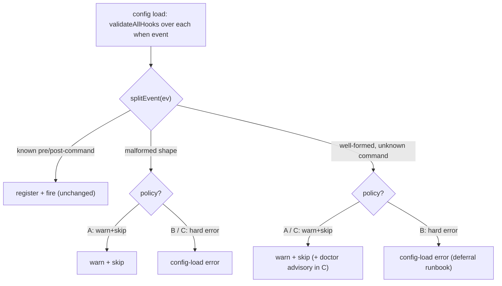

# Design: unknown hook `when` events — hard-fail vs warn+skip (forward-compat)

**Date:** 2026-07-15
**Status:** Decided: **Option B** (ratified 2026-07-17, phillipgreenii) — keep the hard-error; document the two-step adoption runbook (landed in ADR-0019 + `pn-workspace-rules` SKILL.md). See [Decision](#decision-ratified-2026-07-17). bead pg2-mbi5 closed once the runbook landed.
**Bead:** pg2-mbi5 (P2 bug). Discovered from pg2-5yq5.
**Touches policy in:** [ADR-0019](../../adr/0019-per-repo-event-hooks.md) §Decision, line "An unknown event MUST be a config-load error."

## Decision (ratified 2026-07-17)

**Option B — keep the hard-error; do not warn+skip unknown hook events.** The version deadlock is
real, but its workaround (adopt a new-command hook in two applies) is cheap and already unavoidable
for the current cutover, so it is documented rather than engineered around. Warn+skip (A/C) was
rejected because it reopens a silent-gate-failure mode in the per-repo resync hooks
(`when=['post-clone','post-rebase','post-update']`), which have **no** backstop — the pg2-5yq5 class.

**CORRECTION to the Option-A "Con" and Recommendation prose below.** The flagship risk example in
this doc — a mistyped `post-apply` **gate** hook (`pb gate check`) silently not firing — is
**inaccurate**. That enforced gate is _self-healing_: `EnforceKeys`
(`internal/workspace/enforce_keys.go:99-102`) re-creates a correct `post-apply`/`post-upgrade` gate
entry on every activation whenever no matching one is found, so a typo there is a dead no-op
_alongside_ the auto-injected correct gate, not a permanently disabled gate (worst case: a one-apply
gap that self-corrects). The genuinely un-backstopped silent-skip risk under warn+skip is the
**per-repo resync hooks** above (no EnforceKeys backstop; the doctor `hook-never-fires` check
short-circuits on unknown events). This _strengthens_ Option B and further weakens C.

**Landed as part of ratifying B:** the two-step "adopting a new hookable command" runbook now lives
normatively in [ADR-0019](../../adr/0019-per-repo-event-hooks.md) §"Amendment: forward-compat of
unknown hook events" and operationally in `pn-workspace-rules` SKILL.md §"Adopting a new hookable
command". Warn+skip (A) / hybrid (C) remain available as a follow-up iff forward-declaration friction
is later demonstrated. The Options/Findings below are retained as the analysis of record.

## Why this needs a decision (not a straight fix)

Bead pg2-mbi5 asks that an unknown hook command **warn and skip** at config load
instead of hard-failing, for forward-compatibility. ADR-0019 (Accepted, 2026-07-07)
explicitly decided the **opposite**, in RFC-2119 language:

> `when` is a list of events `<phase>-<command>` where … command is any hookable
> pn-workspace command (…). **An unknown event MUST be a config-load error.**

So the bead's request directly overturns an accepted ADR decision. Per the workspace
DESIGN+HUMAN rule, this MUST NOT be silently resolved by an autonomous agent.

## Findings (verified against `modules/pn` @ current main)

1. **The bead's literal target is obsolete.** The pre-ADR-0019 `[hooks.<command>]`
   table schema no longer has a functional code path. `ParseConfig`
   (`internal/workspace/config.go`) only _detects_ it (`legacyHooksConfig`) to emit a
   hard-error migration message pointing at the `[[hooks]] when=[…]` list schema. There
   is no longer any "unknown command **within** `[hooks.<cmd>]`" concept — the whole
   table schema is rejected wholesale. The bead's exact wording ("unknown `[hooks.<cmd>]`
   should warn+skip") therefore cannot be implemented as written.

2. **The underlying deadlock is REAL and PERSISTS under the new schema.**
   `validateAllHooks` → `splitEvent` (`internal/workspace/nix_hooks.go`) checks every
   `when` event's command against `hookableCommands`; an unknown one returns
   `fmt.Errorf("hook: unknown event %q …")` at config load. Because config load runs on
   **every** `pn workspace` subcommand — including `apply`, the command that deploys a
   newer `pn` — forward-declaring `[[hooks]] when=['post-<newcmd>']` for a command a
   newer `pn` will add bricks the current `pn` and blocks the very `apply` that would
   upgrade it. This is the identical version-deadlock the bead describes, now expressed
   via `when` events rather than `[hooks.<cmd>]` table names.

3. **Two distinct "unknown event" sub-cases** are currently conflated by `splitEvent`:
   - **(mal) malformed shape** — no `pre-`/`post-` prefix (e.g. `when=['apply']`,
     `when=['pre_apply']`). Never valid in any `pn` version; a structural mistake.
   - **(fwd) well-formed, unknown command** — `<pre|post>-<x>` where `x` is not (yet) a
     hookable command (e.g. `when=['post-teleport']`). This is the forward-compat case,
     and also the typo case (`when=['post-aply']`).

## Options

### Option A — Warn+skip ALL unknown events; amend ADR-0019

At config load, an unknown `when` event emits a warning to stderr and that hook is
**not registered/fired**; known events validate and fire as before. `{nix_run}`
placement/count and malformed-token checks stay hard errors (structural, not
forward-compat). ADR-0019 line 31-32 flips from MUST-error to SHOULD-warn+skip.

- **Pro:** eliminates the version deadlock permanently for all future
  new-hookable-command adoptions; mirrors the warn+skip pattern the hook **trust** gate
  already uses on the post-phase; matches the common "ignore unknown keys" forward-compat
  convention.
- **Con:** a **typo** in an event name (`post-aply`, `post-appply`) silently becomes a
  no-op. For a `post-apply` **gate** hook (the `pb gate check` enforced by
  ADR-0017/0019), that is a _silently disabled security/quality gate_ — precisely the
  "gates that don't gate" failure class this workspace has repeatedly been burned by
  (pg2-5yq5, pg2-2cdt, pg2-ic7x). Trades loud safety for forward-compat.

### Option B — Keep hard-error (ADR-0019 as-is); document a deferral workflow

No validation change. Document — in ADR-0019 and/or the `pn-workspace-rules` skill — the
two-step adoption for a new hookable command: (1) land + `apply` the new `pn` **without**
the new `[[hooks]] when=[…]` entry; (2) add the forward-declared hook in a second
commit/apply, once the new `pn` is deployed. This is the same two-step the bead's own
NOTE concedes is unavoidable for the _current_ transition anyway (the fix can't be in the
already-installed old `pn`).

- **Pro:** preserves the loud-typo detection ADR-0019 deliberately chose; zero
  behavior/schema change; an unknown/mistyped event stays a definitive error; a
  disabled-gate-by-typo is impossible. Lowest risk in a workspace whose recurring theme
  is silent-gate failures.
- **Con:** every future new-hookable-command adoption pays the two-step dance; the
  deadlock is documented, not eliminated. Friction is low for a single-operator
  workspace but nonzero.

### Option C — Hybrid: warn+skip only (fwd); keep hard-error for (mal); add doctor advisory

Split `splitEvent`'s failure: malformed shape (mal) stays a hard config-load error;
well-formed-but-unknown-command (fwd) warns+skips. Add a `pn workspace doctor` advisory
that surfaces skipped unknown-command events, so "did my hook actually register?" is
answerable. NOTE: the existing `hook-never-fires` advisory (ADR-0019 line 50-52) does
**not** cover this as-is — `hookNeverFires` (`internal/workspace/doctor_checks_hooks.go`)
short-circuits on unknown events (`if !ok { return false }`, "rejected at load; don't
second-guess"), so under (fwd)-warn-skip it would suppress exactly the events we want
surfaced. Option C must therefore **modify** `hookNeverFires` (or add a new advisory), not
merely reuse it. ADR-0019 amended to state the (mal)/(fwd) split.

- **Pro:** unblocks forward-declaration (fwd) while keeping structural typos (mal) loud;
  narrows — but does **not** close — the silent-typo blast radius; doctor gives an opt-in
  check.
- **Con:** a command-name typo (`post-aply`) is still silently skipped (it is a valid
  (fwd) shape), so the disabled-gate risk remains for the most likely typo; more code than
  B; still amends the ADR.

## Recommendation

**Option B.** Rationale:

- The deadlock's workaround is cheap, already required for the current transition, and
  easily documented; the bead's own NOTE already accepts the two-step for this cutover.
- Options A and C reintroduce a **silent-gate-failure** mode (a mistyped `post-apply`
  gate hook that does not fire) into a workspace whose repeated pain (and several of the
  beads this one was discovered alongside) is exactly gates that silently fail to gate.
  Overturning ADR-0019's loud-error decision to save a documented two-step is a poor
  trade here.
- B does not overturn an accepted ADR; it strengthens it with a runbook. If
  forward-declaration friction later proves painful in practice, A/C remain available as a
  follow-up — the reverse (retrofitting loud errors after silent skips have hidden a bad
  gate) is worse.

If the human prefers forward-compat over loud safety, **Option C** is preferred over A
(keep malformed-shape errors loud, lean on the doctor advisory).

## Decision flow

## If a decision is reached

- **A/C:** amend ADR-0019 §Decision line 31-32 (state the warn+skip, and for C the
  (mal)/(fwd) split); change `validateAllHooks`/`splitEvent` accordingly; add a regression
  test that a config with a bogus/forward `when` command loads with a warning and all other
  `pn workspace` commands still run, while a known hook still validates/fires; for C, keep
  the malformed-shape hard-error test.
- **B:** add a "Adopting a new hookable command" runbook to ADR-0019 (or the
  `pn-workspace-rules` skill) documenting the two-step; close pg2-mbi5 as
  wont-fix-by-design with the runbook link; optionally file a follow-up to revisit A/C if
  friction recurs.
