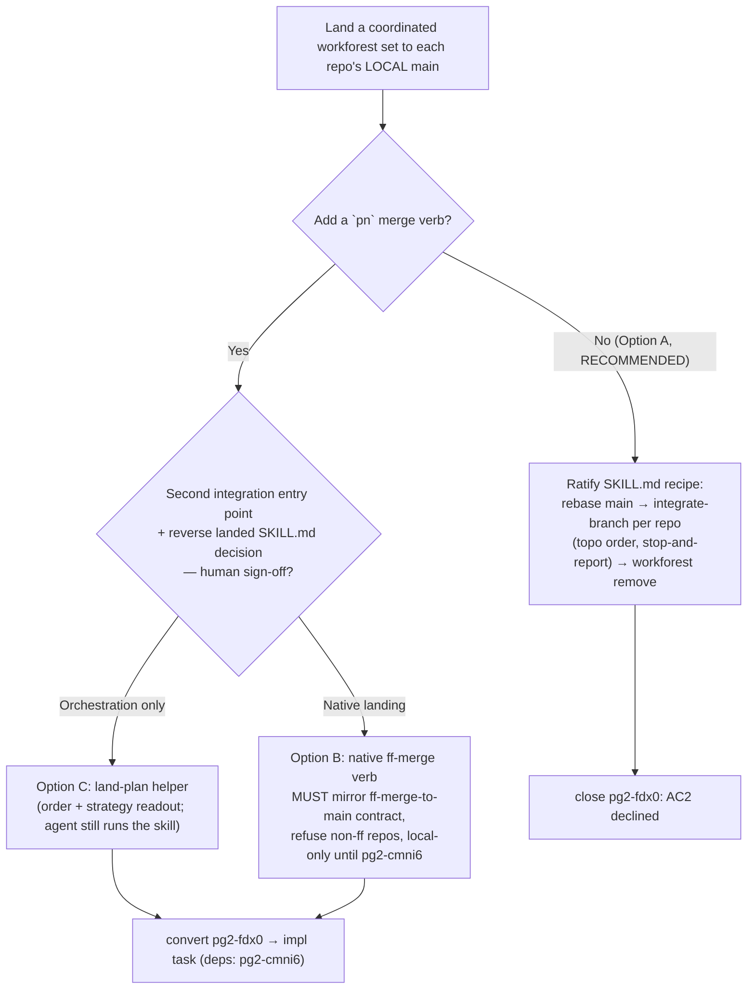

# Design: `pn workspace workforest merge` — build a native local merge verb, or ratify the integrate-branch-per-repo recipe?

**Date:** 2026-07-15
**Status:** Decided: **Option A** (ratified 2026-07-17, phillipg) — `pn` grows no merge verb; the integrate-branch-per-repo recipe (`pn-workspace-rules` SKILL.md §"Landing a set onto `main` via `integrate-branch`") is the sanctioned local-landing path. See [Decision](#decision-ratified-2026-07-17) below. bead pg2-fdx0 closed with AC2 declined.
**Bead:** pg2-fdx0 (P2 task). Discovered from pg2-rns7.
**Related:** [ADR-0009](../../adr/0009-pn-workspace-update-worktree-isolation.md) (worktree-isolated landing);
[2026-06-16 coordinated-worktrees design](2026-06-16-pn-workspace-coordinated-worktrees-design.md);
pg2-cmni6 (CLOSED 2026-07-16 — push-to-origin decision resolved; irrelevant to Option A, which adds no code/push surface); pg2-qgai (worktree→workforest rename).
**Touches:** `pn-workspace-rules` SKILL.md §"Landing a set onto `main` via `integrate-branch`";
would add `modules/pn/internal/cli/workspace.go` + `internal/workspace/`.

## Decision (ratified 2026-07-17)

**Option A — no merge verb.** `pn` grows no `workforest merge` verb; landing a coordinated set to
each repo's local `main` is the SKILL.md integrate-branch-per-repo recipe. Rationale (all verified
against `main`, and confirmed empirically by landing a real 2-repo set via the recipe — including a
stop-and-report on a dirty canonical): R-9 makes the `integrate-branch` skill the single integration
entry point and a Go binary cannot invoke it (a verb would be a second entry point with a
hand-synced copy of the landing/strategy logic); `pn` is strategy-blind, so an ff-across-the-set
verb would mis-land a `pull-request`-strategy repo; the recipe already covers strategy divergence,
topological ordering, and stop-and-report, which AC2's blunt "ff across the set" omits. The
`updateRepoViaWorktree` code Option B superficially resembles is **not** liftable (it advances local
`main` while off-primary — the opposite of the FF-0 halt a verb needs), so B is more cost than its
"building blocks exist" framing suggests. pg2-cmni6 (push decision) is **closed** and, being
code/push-only, never bore on Option A. bead pg2-fdx0 closed with AC2 declined; the recipe's
cross-repo obligations (topo order + stop-and-report) were promoted to RFC-2119 in SKILL.md as part
of this ratification. A future read-only Option-C `land-plan` helper (order + strategy readout,
agent still runs the skill) remains available if the per-repo loop proves to be real friction — it
does not reopen this policy question. The Options/Findings below are retained as the analysis of
record.

## Why this needs a decision (not a straight implementation)

Bead pg2-fdx0's acceptance criteria (AC2) ask for a new one-shot verb
`pn workspace workforest merge <branch>` that, per repo in the set, rebases the feature
branch onto `main` then `git merge --ff-only` into local `main`, refuses on divergence/non-ff,
deletes the branch, removes the set worktrees, and holds P1 until the explicit merge.

Three facts discovered against current `main` make this a scope decision the agent MUST NOT
resolve unilaterally:

1. **The workspace's own docs already decided the opposite of AC2.** SKILL.md:340-341 now states:
   _"`pn workspace` has **no** local merge/integrate verb (pg2-fdx0), and landing a set does not
   add one: **`integrate-branch` is a skill**, invoked per repo."_ A prior session updated the
   documented workflow to the integrate-branch-per-repo recipe and cited THIS bead as its
   authority — but the bead itself was never ratified/closed with that decision, and its AC2
   still asks for the verb. So the doc and the acceptance criteria contradict each other; only
   the human who owns the bead can reconcile them.

2. **The verb is buildable, but it is a policy change, not just code.** A correct verb is a
   _bounded_ change (see Findings — topo order, a `git config` strategy read, and the ff-merge
   mechanic all already exist in `pn`). The blocker is not feasibility; it is that the verb would
   (a) become a **second sanctioned integration entry point** for landing work, alongside the
   `integrate-branch` skill that R-9 designates as _the_ entry point — and `pn`, being a Go binary,
   **cannot delegate** to that skill, so the verb would carry its own copy of the landing/strategy
   logic rather than reusing the skill's authoritative contract (strategy resolution, off-primary
   halt); and (b) **reverse a decision already live on `main`** (finding 1). Both are human calls.

3. **`pn` is entirely strategy-blind.** Verified: the Go source has zero references to
   `pgii-integrate-branch.strategy`, `integrate-branch`, or `symbolic-ref`/`origin/HEAD` primary
   resolution — the integration strategy is a skill-level concept invisible to `pn`, and primary
   branch is effectively the hardcoded string `"main"` (`RepoConfig.Branch` default,
   `config.go:237`; landing path hardcodes `"main"` in `update_worktree.go`). AC2's "per-repo
   ff-merge across the whole set" silently assumes every repo is `ff-merge-to-main`; a set
   containing a `pull-request`-strategy repo would be mis-landed.

The prior handoff on the bead is explicit: _"this needs a brainstorm/Plan on scope before coding
— surfacing to the user rather than auto-deciding."_ This document is that brainstorm.

## Findings (verified against `modules/pn` @ current `main`)

- **The gap AC2 targets is real and narrow.** `workforest remove` mirrors `git worktree remove`
  and **explicitly does not delete the branch or land anything** (`workforest.go:455`,
  SKILL.md:327). So after committing in a set there is no `pn` verb that advances local `main`.
- **The "meanwhile" AC (document the recipe) is DONE and then some.** the SKILL.md §"Landing a set onto `main` via `integrate-branch`" recipe documents
  landing a set as a **best-effort ordered transaction**: `pn workspace rebase main` in the set,
  then invoke `integrate-branch` per repo in **topological (dependency) order**, **stop-and-report**
  on the first blocked repo, keep the set until every repo lands, then `workforest remove`. This
  recipe already handles two cases AC2's blunt "ff-merge across the set" does **not**: per-repo
  **strategy divergence** (ff vs PR) and **dependency ordering** (a consumer must not land before
  the sibling it pins).
- **The ff-only-local-merge mechanic already exists in `pn`** — in `updateRepoViaWorktree`
  (`update_worktree.go:200-378`, for the _update_ use-case): worktree-add → rebase → **push (a
  mandatory step that hard-fails the flow)** → advance local `main` → `worktree remove` +
  `branch -D`. So a merge verb would be the _third_ copy of the ff mechanic (skill handler +
  this function + the verb), not the first fork. But that existing subset is **not** liftable as-is:
  its off-primary case (`primaryOnOtherBranch`) **advances local `main` anyway** via
  `git fetch . <branch>:main` — the exact _opposite_ of the FF-0 "halt if canonical off-primary"
  (R-3/R-8) that Option B's contract requires. A correct verb would therefore have to be
  **stricter** than the code it superficially resembles. Net: Option B is a _bounded, buildable_
  change (the hard part is policy, below), not a free reuse.
- **Reusable plumbing** (if Option B/C is chosen): `readSetMembers(setDir)` (`workforest.go:393`)
  enumerates the set; `isDirty` (`update.go:276`) and `primaryMainState` (`update_worktree.go:52`)
  gate a clean-main landing; `merge --ff-only` shape at `branch_sync.go:32`; real-git TDD fixtures
  at `realgit_test.go` (`initRealRepo`, `setupLocalBareRemote`). A new verb wires at
  `cli/workspace.go:584` alongside the other workforest subcommands.
- **Push is a separate decision (pg2-cmni6, resolved/closed 2026-07-16).** The current
  `ff-merge-to-main` strategy lands to LOCAL `main` and pushes nothing. This only ever bore on a
  build option (B/C, a verb that might `--push`); Option A adds no push surface, so it is moot here.

## Options

### Option A — No verb; ratify the integrate-branch-per-repo recipe (status quo in docs). RECOMMENDED

Adopt the already-documented decision: `pn` grows **no** merge verb. Landing a set is the
SKILL.md §"Landing a set onto `main` via `integrate-branch`" recipe — `pn workspace rebase main`,
then the agent invokes `integrate-branch` per repo in topological order (stop-and-report), then
`workforest remove`.

- **MUST**: mark AC2 as intentionally-declined in the bead; keep the recipe as the sanctioned path.
- **Pros:** honors R-9 (integrate-branch stays the single integration entry point; no forked
  landing logic); `pn` stays strategy-blind, which is correct — it never has to know ff-vs-PR;
  already handles strategy divergence + dependency order + stop-and-report, which AC2 omits; zero
  new code, zero divergence risk; nothing to keep in sync with the skill.
- **Cons:** no single one-shot command — the agent loops the skill per repo. (This "loop" is the
  ordered-transaction behavior, so it is a feature, not merely a missing convenience.)

### Option B — Build the native verb AC2 describes

Add `pn workspace workforest merge <branch>`: enumerate via `readSetMembers`; per repo (topo
order) rebase the set worktree onto `main`, `git merge --ff-only <branch>` into the canonical
local `main`, refuse on non-ff, then `worktree remove` + `branch -d`; hold the set on any failure.

- **MUST (if chosen)**: mirror the `ff-merge-to-main` handler contract exactly — FF-0 (halt if
  canonical off-primary/dirty, R-3/R-8), FF-1 rebase-first (never a plain non-ff merge), FF-3
  bounded ff-race retry, pre-flight ALL repos' ff-ability and land nothing if any would fail
  (set-level all-or-nothing at pre-flight granularity, since cross-repo git is not atomic), and
  **refuse — not silently skip —** any repo whose `git config pgii-integrate-branch.strategy` is
  not `ff-merge-to-main`. Local-only (no push) until pg2-cmni6 resolves.
- **Pros:** one-shot convenience; the building blocks exist in `pn` (topo order, `merge --ff-only`
  shape, `readSetMembers`) so it is bounded, not speculative.
- **Cons:** adds a **second sanctioned integration entry point** beside the `integrate-branch`
  skill R-9 designates as _the_ one; puts a **third copy of the ff mechanic** in the tree whose
  _authoritative_ safety contract (strategy resolution, off-primary halt) lives in the skill, to be
  kept in lockstep by hand; forces `pn` to grow the strategy-awareness it deliberately lacks;
  **contradicts the SKILL.md decision already on `main`**; and is entangled with the open push
  decision (pg2-cmni6). The `updateRepoViaWorktree` subset it resembles is **not** liftable as-is
  (it advances main while off-primary — see Findings), so the verb must be written stricter, not
  copied.

### Option C — Orchestration-only helper (no integration logic in `pn`)

Add a helper that does only `pn`'s wheelhouse — e.g. `pn workspace workforest land-plan <branch>`
prints the topological land order and each repo's declared strategy (read from git config), and
the agent still runs `integrate-branch` per repo; a follow-up `workforest remove` tears down.

- **Pros:** R-9-compatible (no landing logic in `pn`); removes the "which order / which strategy"
  lookup friction without forking the handler.
- **Cons:** marginal value over `pn workspace tree` + the recipe; another verb to maintain.

## Decision flow

## Recommendation

**Option A.** A correct verb is _buildable_ — so this recommendation is a policy judgment, not a
"can't be done." The decision the docs already encode is the right one and should be _ratified_
rather than reversed: R-9 designates `integrate-branch` as the single integration entry point, a Go
verb cannot call it, and a native verb would add a second entry point plus a hand-synced copy of the
skill's landing/strategy logic — to replace a recipe that is already ordered, strategy-aware, and
stop-and-report. (A well-built verb _could_ also do topo order and a strategy guard; those are
faults of AC2's blunt wording, not reasons a verb is impossible — the reason to decline is the
policy cost, above.) Whichever way the human decides, the choice reverses or ratifies a live-on-main
decision, which is theirs to make.

If the human still wants one-shot ergonomics, prefer **Option C** (orchestration only) over
Option B; reserve Option B for an explicit decision to accept a second landing implementation in
`pn`, and only after pg2-cmni6 settles the push question.

**Concretely, on sign-off:** if Option A → close pg2-fdx0 recording "AC2 declined: no merge verb;
integrate-branch-per-repo recipe (the SKILL.md §"Landing a set onto `main` via `integrate-branch`" recipe) is the sanctioned path." If Option B/C →
convert pg2-fdx0 (or a child bead) into an implementation task carrying the MUST-list above and a
dependency on pg2-cmni6.

## RFC-2119 requirements common to any build option (B or C)

- The verb **MUST** land to LOCAL `main` only and **MUST NOT** push to origin unless/until
  pg2-cmni6 resolves in favor of pushing (then behind an explicit `--push`).
- The verb **MUST** enumerate the set from `<setDir>/pn-workspace.toml` (`readSetMembers`), operate
  on repos in topological order, and **MUST** stop-and-report on the first repo it cannot land,
  leaving the set intact (P1 holds until every repo has landed).
- Any native landing (Option B) **MUST** rebase before a fast-forward-only merge, **MUST NOT** fall
  back to a plain non-ff merge, **MUST** halt if the canonical clone is off-primary or dirty
  (R-3/R-8), and **MUST** refuse — not silently skip — a repo whose declared strategy is not
  `ff-merge-to-main`.
