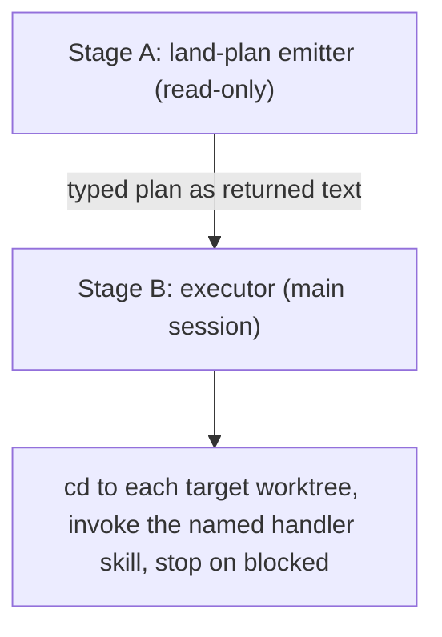
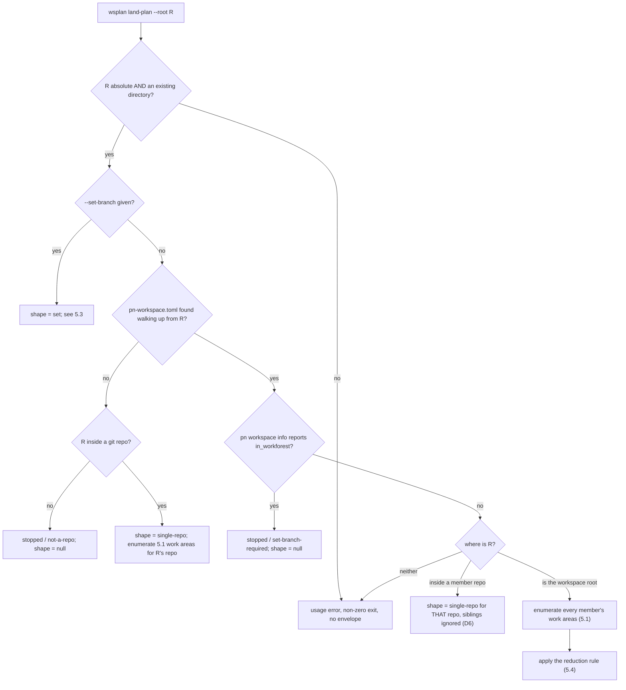

# `wsplan` — the land-plan emitter (WORKSPACE interface, slice 2)

**Bead**: `pg2-wjt8k` (WORKSPACE interface epic) — slice 2 of the sequence recorded in that
epic's design field §E ("Sequencing after slice 1"). Slice 1 shipped as `pg2-wjt8k.2`.

**Status**: Design approved by the operator 2026-08-12 in an interactive session, then revised
twice against independent adversarial review (round 1 returned REVISE on 4 blockers; round 2
closed 3 of them and found 1 new blocker plus 4 majors, all folded in here). Build-ready.
This document is the build input; the implementation plan is not written here.

**Reference convention**: `parent §X` cites the epic's design field. A bare `§X` cites a section
of THIS document.

**Authority**: This spec settles the three open items parent §E left for slice 2. Where it
disagrees with the epic's design field, this document wins and §10 records the correction to fold
back.

---

## 1. Context

`land` is a two-stage operation (parent §4.1):



Stage A is read-only and runs as a **forked Explore subagent**; Stage B mutates and MUST run in
the main session, because subagent `Bash` calls do not persist `cwd` between calls.

The plan therefore crosses an **agent boundary as returned text** — it is not a pipe between two
processes. That single fact drives the input contract (§4), the wire format (§6), and the trust
boundary (§6.3).

### 1.1 What exists today

`pnwf land-plan <branch>` (`modules/pnwf/pnwf/pnwf.sh:426`). Its help states it prints "the
topo-ordered member repos of `<branch>`'s set that still need landing, one per line".

Three structural limits:

- It serves **only a coordinated workforest set inside a `pn`-workspace**.
- It emits **bare member names**, not paths and not a typed plan.
- Its resolution is **`cwd`-driven and cannot be pinned by environment**: `_pnwf_info_json` runs
  `env -u PN_WORKSPACE_ROOT pn workspace info --json` (`pnwf.sh:91-93`), deliberately stripping
  `PN_WORKSPACE_ROOT`.

It has a live consumer: the `land-workforest` skill drives its per-repo loop off that
line-per-repo output (`pn-workspace-rules/skills/land-workforest/SKILL.md:64`). Its contract is
therefore load-bearing and MUST NOT change.

### 1.2 The gap, as corrected

The epic's park comment listed three gaps for this slice. Only two are real:

| #   | gap                                                                             | disposition                                                                                                                                                                                                                                                                |
| --- | ------------------------------------------------------------------------------- | -------------------------------------------------------------------------------------------------------------------------------------------------------------------------------------------------------------------------------------------------------------------------- |
| 1   | emitter cannot reach single-repo / non-workspace shapes                         | REAL — §5                                                                                                                                                                                                                                                                  |
| 2   | plan wire-format and non-set input contract undefined                           | REAL — §4, §6                                                                                                                                                                                                                                                              |
| 3   | continuation-handle schema is "only prose; no schema, storage, stale-detection" | **ALREADY RESOLVED** by parent §B.2, which records a confirmed decision of _no bespoke stored handle_: the tracker item plus re-derivation IS the handle, and stale cases are ordinary checks. Parent §A.3 fixes the field set. Only a trivial loose end survives — §10.2. |

---

## 2. Operator decisions (settled — MUST NOT be re-litigated)

| #   | decision                                                                                                                                                                                                                                                                                                                                                                                                                                                                   |
| --- | -------------------------------------------------------------------------------------------------------------------------------------------------------------------------------------------------------------------------------------------------------------------------------------------------------------------------------------------------------------------------------------------------------------------------------------------------------------------------- |
| D1  | Implement **all five** of parent §4.1's routing rows, including the edge-disjoint case.                                                                                                                                                                                                                                                                                                                                                                                    |
| D2  | The emitter is a **separate command**, not a `pnwf` subcommand. `pnwf` is NOT modified.                                                                                                                                                                                                                                                                                                                                                                                    |
| D3  | The plan is a **single JSON envelope** with an `outcome` discriminator.                                                                                                                                                                                                                                                                                                                                                                                                    |
| D4  | The emitter takes an **explicit absolute `--root`** and never depends on its own inherited `cwd`.                                                                                                                                                                                                                                                                                                                                                                          |
| D5  | Package it **inside `modules/pnwf`** as a second script, rather than as its own module. NOTE: this decision was originally offered as "requiring no `flake.nix` wiring" — **that rationale was wrong** and is corrected here. Two `flake.nix` edits ARE required (§3.3): threading `pn` into `pnwfScripts`, and exporting `packages.wsplan` so a public command actually reaches `PATH`. The decision itself stands on its own terms; only its stated cost was overstated. |
| D6  | **Pointed repo wins**: absent `--set-branch`, when `--root` resolves inside a member repo the plan is single-repo for that repo and siblings are ignored. Workspace-wide enumeration happens only when `--root` is the workspace root. `--set-branch` overrides D6 (§5.2 tests it first).                                                                                                                                                                                  |
| D7  | **Ambiguity refuses, never guesses**: if any repo the emitter would land has more than one unlanded work area, the outcome is `refuse` / `ambiguous-target`. The caller disambiguates via D6 by pointing `--root` at the intended work area.                                                                                                                                                                                                                               |

---

## 3. Placement and packaging

`wsplan` is a public command in the existing `pnwf` module. Per D2 it is its OWN binary — the
shared module directory is a packaging choice only and MUST NOT become a `pnwf` subcommand.

```text
modules/pnwf/
├── lib/                          # existing pnwf-lib, reused unchanged
├── pnwf/                         # existing, UNCHANGED
├── wsplan/                       # NEW
│   ├── default.nix
│   ├── wsplan.sh                 # arg parsing, orchestration, help
│   ├── wsplan.bash               # detection + edge logic as testable functions
│   ├── wsplan.md                 # tldr page (required: public)
│   ├── completions/
│   │   ├── wsplan.bash
│   │   └── _wsplan
│   └── tests/
│       ├── test-wsplan.bats      # integration: run as subprocess
│       └── test-wsplan-lib.bats  # unit: source wsplan.bash, call functions
└── scripts.nix                   # + callPackage, + allScripts, + checks
```

The `.sh`/`.bash` split is REQUIRED here, not optional: shape detection, the reduction rule, and
the edge test are pure functions over inputs and MUST be unit-testable without going through
argument parsing.

```nix
# modules/pnwf/wsplan/default.nix
{
  mkBashScript,
  pkgs,
  pnwf-lib,
  pnwf,
  pn,
}:

mkBashScript {
  name = "wsplan";
  src = ./.;
  description = "Read-only land-plan emitter: detect workspace shape and emit a typed plan";
  public = true;
  libraries = [ pnwf-lib ];
  runtimeDeps = [
    pkgs.git
    pkgs.jq
    pnwf.script
    pn # REQUIRED: §5.3 shells `pn workspace info --json` for the set directory.
    # NOTE: pnwf-lib's pnwf_resolve_primary_branch also shells `integrate-branch-support`,
    # which lives in the phillipgreenii-nix-agent-support flake and is NOT declared by
    # `pnwf` either — both rely on ambient PATH today. See §3.1: this MUST be resolved
    # deliberately (declare it, or keep the ambient assumption) rather than inherited in
    # silence.
  ];
  batsJobs = 8;
  testDeps = [
    pkgs.git
    pkgs.jq
  ];
}
```

### 3.1 Transitive runtime dependencies — declare or mock, never assume

Reusing `pnwf-lib` (§3.2) and delegating to `pnwf` (§5.3) pulls in two binaries that are NOT nix
dependencies of `pnwf` today — it relies on ambient `PATH`:

| binary                     | why it is needed                                                                                     | where it lives                                                                           |
| -------------------------- | ---------------------------------------------------------------------------------------------------- | ---------------------------------------------------------------------------------------- |
| `pn`                       | `pnwf` resolves the workspace through `pn workspace info --json`; §5.3 also needs it for the set dir | the `pn` Go app in this repo (`modules/pn`)                                              |
| `integrate-branch-support` | `pnwf_resolve_primary_branch` shells it and parses `.primary_branch`                                 | a DIFFERENT flake: `phillipgreenii-nix-agent-support/packages/integrate-branch-support/` |

`pn` is declared above. For `integrate-branch-support` the implementer MUST make an explicit
choice — declare it, or keep the ambient-`PATH` assumption with the comment already present in
the snippet. What is NOT acceptable is inheriting the assumption silently; that is why the first
draft of this spec shipped an unbuildable test plan.

**Choice made (implementation, 2026-08-12): keep the ambient-`PATH` assumption.** Declaring it is
not merely undesirable but IMPOSSIBLE without inverting the workspace graph: `integrate-branch-support`
lives in `phillipgreenii-nix-agent-support`, which DEPENDS ON this flake (the workspace lock records
`phillipgreenii-nix-agent-support -> phillipg-nix-repo-base`, and this flake's `inputs` contain no
agent-support), so declaring it would require adding agent-support as an input here and turning that
edge into a cycle. `pnwf` already relies on ambient `PATH` for exactly this binary, and both commands
reach `PATH` through the same agent-support overlay that provides it — so on any machine where
`wsplan` is installed, `integrate-branch-support` is too. The rationale is recorded in
`modules/pnwf/wsplan/default.nix` beside the `runtimeDeps` list, where the next reader will look.

For tests, both MUST be mocked; the existing suite already does exactly this
(`modules/pnwf/pnwf/tests/test-pnwf.bats:164` copies `pn` and `integrate-branch-support` mocks
into `MOCK_BIN`). The bats check `PATH` is only
`[ bats bash ] ++ optional (batsJobs > 1) parallel ++ testDeps`
(`lib/bash-builders.nix:370-376`), so an unmocked, undeclared binary is simply absent.

### 3.2 Reuse obligation

Primary-branch resolution, the ancestor check, and worktree presence MUST come from `pnwf-lib`
and MUST NOT be reimplemented:

| helper                        | signature                     | returns                                                                 |
| ----------------------------- | ----------------------------- | ----------------------------------------------------------------------- |
| `pnwf_resolve_primary_branch` | `(repo_dir)`                  | prints the primary branch name; shells `integrate-branch-support`       |
| `pnwf_is_ancestor_of_primary` | `(repo_dir, branch, primary)` | prints `landed`, `not-landed`, or `absent`; never aborts under `set -e` |
| `pnwf_worktree_present`       | `(setdir, member)`            | tests `-e "$setdir/$member"`                                            |

`pnwf_is_ancestor_of_primary` requires an explicit `branch` argument and has a THIRD return value,
`absent` (rc 128 from `merge-base`). §5.5 specifies what `wsplan` passes and how each answer maps.

### 3.3 `scripts.nix` wiring

`wsplan`'s `callPackage` MUST receive the already-defined `pnwf`, so the two are declared in order
and the dependency runs one way only. A circular script dependency makes nix evaluation recurse
infinitely.

`pn` MUST be threaded in from `self.packages`, NOT taken off `pkgs`. `pkgs` here is
`import inputs.nixpkgs { overlays = [ self.overlays.gomod2nix ]; }` (`flake.nix:145-148`);
`overlays.default`, the only thing that surfaces `pn` as `pkgs.pn` (`flake.nix:747-753`), is
exported for CONSUMERS and never applied to this flake's own `pkgs`. Nixpkgs has no `pn` attribute,
so `inherit (pkgs) pn` fails to evaluate. The correct pattern is precedented by `ulScripts` a few
lines above `pnwfScripts` (`flake.nix:116-119`).

```nix
# flake.nix — thread pn in (mirrors ulScripts at :116-119)
  pnwfScripts = import ./modules/pnwf/scripts.nix {
    inherit pkgs bashBuilders;
    inherit (self.packages.${system}) pn;
  };
```

```nix
# flake.nix — export the public command, mirroring the existing pnwf export at :172
  packages.wsplan = pnwfScripts.wsplan.script;
```

```nix
# modules/pnwf/scripts.nix — additions only; existing bindings unchanged
{
  pkgs,
  bashBuilders,
  pn,                                    # NEW parameter
}:
  ...
  wsplan = pkgs.callPackage ./wsplan {
    inherit (bashBuilders) mkBashScript;
    inherit pkgs pnwf-lib pnwf pn;       # pnwf must already be bound above
  };

  allScripts = [ pnwf wsplan ];

  # in the returned attrset:
  inherit pnwf-lib pnwf wsplan;
  checks = {
    test-pnwf-lib = pnwf-lib.check;
    test-pnwf = pnwf.check;
    test-wsplan = wsplan.check;
  };
```

There is no recursion hazard: `packages.pn` does not depend on `pnwfScripts`, and nix attrset
values are lazy per attribute. Without the `packages.wsplan` export the command reaches nobody —
`flake.nix` consumes only `pnwfScripts.checks` plus explicit per-package attrs, never
`pnwfScripts.packages`, and `pnwf` itself reaches `PATH` downstream through
`inherit (basePkgs) pnwf` in the agent-support overlay.

### 3.4 Framework requirements (not style)

- `wsplan.sh` and `wsplan.bash` MUST begin with `# shellcheck shell=bash` and MUST NOT contain a
  shebang or `set -euo pipefail` — the builder injects both.
- `--version` MUST NOT be implemented or tested; the builder injects it.
- `excludeShellChecks` MUST NOT be passed; any suppression goes inline with a reason.

---

## 4. Input contract

```text
wsplan land-plan --root <absolute-path> [--set-branch <name>]
```

- `--root` is REQUIRED, MUST be absolute, and MUST name an existing directory. Violations are
  usage errors (§6.2), checked BEFORE any shape routing so they apply on the set path too.
- `--set-branch` is OPTIONAL. Its presence selects the set shape and overrides D6. Its value is
  sourced by the caller from the tracker item (parent §B.2) — the emitter MUST NOT read the
  tracker.

**The `cwd` rule, stated precisely.** `wsplan` MUST NOT derive any answer from its own inherited
`cwd`. It MUST, however, execute every delegated command (`pn`, `pnwf`) with `cwd` set to
`--root`:

```bash
( cd "$root" && pnwf land-plan "$branch" )
```

This is REQUIRED, not stylistic: `pnwf` resolves the workspace from `cwd` alone and strips
`PN_WORKSPACE_ROOT` (§1.1), so a delegated call inheriting the fork's `cwd` would either die
outside a workspace or silently resolve a DIFFERENT workspace. Pinning `cwd` to the explicit
`--root` is what makes the emitter deterministic. D4 forbids depending on inherited `cwd`, not
setting it deliberately. Verified: `pn workspace info --json` returns identical
`canonical_root`/`workforests_dir` from the workspace root, a member clone, a linked worktree, and
a deep subdirectory.

This preserves parent §3.4's "every method takes an optional target; absent ⇒ current shape" **one
layer up**, in the consumer the operator invokes: the consumer resolves the target, then hands the
emitter something explicit.

---

## 5. Detection

### 5.1 Where work actually lives

Enumeration MUST walk **linked worktrees**, not canonical clones. Tier R (R-3) keeps every
canonical clone on its primary branch and clean in steady state, so an enumeration that inspects
only canonical clones can never find anything: it would report `nothing-to-do` while branches
await landing, and rows 4-5 of §7 would be unreachable dead code. This was the primary defect of
the first draft.

A member repo's candidate **work areas** are:

1. every **linked** worktree from `git worktree list --porcelain` run in the member's canonical
   clone, subject to two mandatory filters:
   - the FIRST record is the main worktree (verified — it reports the canonical clone on its
     primary branch) and MUST be skipped here; item 2 owns the canonical.
   - any entry marked `prunable`, or whose path is not an existing directory (`-d`), MUST be
     discarded. `pnwf-lib.bash:50-55` documents exactly this hazard: admin entries under
     `.git/worktrees` linger until an explicit `git worktree prune`, so a list-based walk can
     report a stale "present" for a directory already removed from disk. Without this filter a
     stale entry would fail the §8 `symbolic-ref` probe and be misreported as
     `stopped:detached-head` for a nonexistent directory, halting the land.
2. the canonical clone itself, but ONLY when its `HEAD` is not its primary branch — an R-3 anomaly
   that MUST be surfaced rather than hidden.

### 5.2 Routing



The `in_workforest` test at Q2B is REQUIRED: a set directory carries its own `pn-workspace.toml`,
so without it a `--root` pointing inside a set (absent `--set-branch`) would be silently treated
as a workspace root. `pn workspace info --json` reports `in_workforest`, so the emitter MUST
consult it rather than infer.

"Inside a member repo" MUST be decided by path containment against the member canonical clone
paths, including their linked worktrees. Note the lock's `repos` entries carry only `flake_path`
and `remote_url` — no filesystem path — so the path source MUST be
`pn workspace info --json`'s per-repo path (override-aware) or `canonical_root/<name>`, not the
lock alone.

**The standalone (non-workspace) branch is NOT exempt from §5.1.** It MUST normalize `R` with
`git rev-parse --show-toplevel` and then enumerate that repo's work areas, for two reasons: a
standalone repo whose primary is landed but whose work sits in a linked worktree would otherwise
report `nothing-to-do` — the same silent miss §5.1 exists to prevent — and a deep `R` would
otherwise emit a subdirectory as `targetWorktree`. The §5.4 reduction then applies to that single
repo exactly as it does on the D6 path.

### 5.3 The set path

With `--set-branch BRANCH`:

1. Derive the **set directory**, because the envelope requires an absolute `targetWorktree` while
   `pnwf land-plan` supplies only member names. `pnwf resolve` does NOT expose `workforests_dir`
   and returns `set_dir` only when already inside a set, so the emitter MUST obtain it itself:

   ```bash
   info=$( cd "$root" && pn workspace info --json )
   canonical_root=$(printf '%s' "$info" | jq -r '.canonical_root')
   workforests_dir=$(printf '%s' "$info" | jq -r '.workforests_dir')
   case "$workforests_dir" in
     /*) # UNSUPPORTED — see below
         emit stopped / unsupported-layout ;;
      *) setdir="$canonical_root/$workforests_dir/$branch" ;;
   esac
   ```

   **An absolute `workforests_dir` MUST produce `stopped` / `unsupported-layout`, not a computed
   path.** `pn` permits it (`modules/pn/internal/workspace/info.go:67,81`), but `pnwf`'s own
   derivation is unconditionally `"$canonical_root/$workforests_dir/$branch"`
   (`pnwf.sh:112-119`), so with an absolute value step 2's delegation would build
   `/Users/…/mbp//srv/sets/BRANCH`, miss the lock, and die. Computing the correct path here while
   the delegate computes a broken one would produce an envelope whose steps cannot execute.
   Refusing honestly is correct; supporting it requires changing `pnwf`, which D2 forbids.

2. Delegate member enumeration to `pnwf land-plan` **unchanged**, with `cwd` pinned per §4.
3. Sweep the `HEAD` of each enumerated member's worktree (`"$setdir/$member"`) for the detached
   case (§8). `pnwf land-plan` never inspects `HEAD` — it only tests worktree presence and
   ancestry in the canonical dir (`pnwf.sh:466-477`) — so this sweep is the emitter's own
   responsibility, and it is what satisfies parent §D row 9 ("the emitter MUST `rev-parse` each
   member worktree's HEAD").
4. Zero members ⇒ `nothing-to-do`, `shape = set`. Otherwise the plan is the two set-level steps of
   §7, both with `targetWorktree` = the set directory.

### 5.4 The reduction rule — work areas to repos

Work areas are per-repo and plural; routing, the edge test, and `targetWorktree` are per-repo.
The reduction between them MUST be explicit, because leaving it implicit is what let the previous
draft emit two ff-merges of two different branches onto one `main` and call them "order-free":

1. For each member repo, compute its **unlanded work areas** — those whose `HEAD` is not landed
   per §5.5.
2. `TOUCHED` is the set of **repo names** with at least one unlanded work area. Both §5.6's edge
   test and §7's row selection operate on `TOUCHED`, never on work areas.
3. **Per D7**, if ANY repo in `TOUCHED` has more than one unlanded work area, the outcome is
   `refuse` / `ambiguous-target`. `display` MUST name the repo and its competing work areas. The
   emitter MUST NOT pick one, and MUST NOT emit a step per work area.
4. Otherwise each repo in `TOUCHED` contributes exactly one work area, and that path is its
   steps' `targetWorktree`.

On the D6 single-repo path the same rule applies to the pointed repo alone: `targetWorktree` is
the pointed work area when `--root` names one directly, else that repo's single unlanded work
area, else `refuse` / `ambiguous-target`.

### 5.5 What "landed" means, and the three answers

For non-set paths the emitter MUST compare each work area's **`HEAD`**, resolved AFTER the §8
symbolic-ref check so a detached `HEAD` is never compared. Resolve with
`git symbolic-ref --short -q HEAD`, then call
`pnwf_is_ancestor_of_primary "$work_area" "$branch" "$primary"`.

| helper result | meaning here                                                                                             |
| ------------- | -------------------------------------------------------------------------------------------------------- |
| `landed`      | not a target; skip                                                                                       |
| `not-landed`  | an unlanded work area                                                                                    |
| `absent`      | the branch ref does not exist ⇒ `stopped` / `absent-ref`, naming the repo. MUST NOT be silently skipped. |

**Unborn branch** (a fresh repo with no commits): `symbolic-ref` SUCCEEDS — `HEAD` is a symref to
an uncreated ref — so the detached test correctly passes, but the ancestry check then returns
`absent`. This case MUST be classified `nothing-to-do`, not `absent-ref`: an empty repo has
nothing to land. Detect it with `git rev-parse -q --verify HEAD` failing.

### 5.6 The edge test

**Which lock, and where.** The lock this section means is the CANONICAL workspace's own, at
`canonical_root/pn-workspace.lock.json` — the same file §6.1's `missing-lock` names. It is read
ONLY on the workspace-root path, and that path reads it TWICE OVER: `.order[]` is the member list
`incomplete-workspace` is defined against, and `.edges` is this test's graph. The SET path never
reads a lock at all: `pnwf land-plan` reads the SET's OWN
`canonical_root/<workforests_dir>/<branch>/pn-workspace.lock.json` itself (subset sets enumerate
only their own members), and the standalone path has no workspace and therefore no lock — so
`missing-lock` is unreachable on both. Because the workspace-root path cannot answer at all without
the graph, the lock MUST be read EAGERLY there, before enumeration: reporting `nothing-to-do` for a
workspace whose graph could not be read would be exactly the silent miss §5.1 exists to prevent, so
an unreadable lock stops the run whatever |TOUCHED| would have been.

`pn-workspace.lock.json` carries a top-level `edges` array of `{consumer, alias, target}`, plus
`order` (topological) and `terminal`. Verified against the live lock 2026-08-12: 12 edges over 6
repos.

Disjointness is a **direct**-edge test over `TOUCHED` (repo names, per §5.4):

```text
disjoint(TOUCHED)  ⇔  ¬∃ e ∈ .edges : e.consumer ∈ TOUCHED ∧ e.target ∈ TOUCHED
```

Direct edges only is not an approximation — it is exactly parent §4.1's rule that "transitive
edges through untouched repos don't count". If `A → B → C` and only `A` and `C` are touched, they
are disjoint. The emitter MUST NOT compute a transitive closure.

### 5.7 Measured consequence (for reviewers, not a requirement)

Every **other** repo consumes `phillipg-nix-repo-base`, and the terminal
(`phillipg-nix-ziprecruiter`) consumes all five others, so `refuse:edges-present` is the common
multi-repo outcome. Of all 15 unordered pairs only three have no direct edge:
`agent-support`+`personal`, `agent-support`+`support-apps`, `overlay`+`support-apps`. There is
**no disjoint triple** (`{A,P,S}` fails on `support-apps → personal`; `{A,O,S}` fails on
`agent-support → overlay`), so row 5 can only ever emit a two-repo plan, and is never reachable
when `repo-base` is in play. D1 mandates it regardless; this rarity is admitted, not hidden.

---

## 6. The plan envelope

On exit 0, exactly one JSON object MUST be written to stdout, and nothing else.

```json
{
  "version": 1,
  "outcome": "plan",
  "shape": "single-repo",
  "reason": null,
  "steps": [
    { "handler": "validate", "targetWorktree": "/abs/path/to/worktree" },
    { "handler": "integrate-branch", "targetWorktree": "/abs/path/to/worktree" }
  ],
  "display": "1 repo ahead of main"
}
```

| field     | rule                                                                                                                                                                                                   |
| --------- | ------------------------------------------------------------------------------------------------------------------------------------------------------------------------------------------------------ |
| `version` | MUST be present, integer, `1` for this spec.                                                                                                                                                           |
| `outcome` | MUST be one of `plan`, `nothing-to-do`, `refuse`, `stopped`. The ONLY discriminator Stage B needs.                                                                                                     |
| `shape`   | one of `single-repo`, `set`, `multi-repo`, `workspace`. MUST be populated whenever detection reached a conclusion, including for `nothing-to-do`. `null` ONLY when the run stopped before classifying. |
| `reason`  | MUST be `null` when `outcome` is `plan` or `nothing-to-do`; MUST be non-null for `refuse` and `stopped`.                                                                                               |
| `steps`   | ordered array. MUST be `[]` for every outcome other than `plan`.                                                                                                                                       |
| `display` | free text for humans. Display-only, and sanitized per §6.3.                                                                                                                                            |

`handler` MUST be one of `validate`, `integrate-branch`, `validate-workforest`,
`land-workforest`. Handlers take **no arguments** — they re-derive everything from git.
`targetWorktree` MUST be absolute and MUST pass the §6.3 charset check.

### 6.1 The `reason` enum

Each code names ONE condition, so Stage B can branch on it without parsing `display`. The `shape`
column resolves §6's rule "`null` ONLY when the run stopped before classifying" for every code, so
no reader has to infer it:

| code                   | condition                                                                           | `shape`                                          |
| ---------------------- | ----------------------------------------------------------------------------------- | ------------------------------------------------ |
| `edges-present`        | multi-repo with a direct edge among `TOUCHED` (§5.6)                                | `multi-repo`                                     |
| `ambiguous-target`     | a repo has >1 unlanded work area (D7, §5.4)                                         | the §7 mapping's — `single-repo` or `multi-repo` |
| `detached-head`        | a work area's `HEAD` is detached (§8)                                               | detected input shape                             |
| `absent-ref`           | a work area's branch ref does not exist (§5.5)                                      | detected input shape                             |
| `bad-path`             | an emitted path fails the §6.3 charset check                                        | detected input shape                             |
| `missing-lock`         | the lock (`canonical_root/pn-workspace.lock.json`) is missing or unreadable         | `workspace`, or `multi-repo` at the edge test    |
| `not-a-repo`           | `--root` is outside any git repo and any workspace                                  | `null`                                           |
| `set-branch-required`  | `--root` is inside a set but `--set-branch` was not given (§5.2 Q2B)                | `null`                                           |
| `incomplete-workspace` | a member named in the lock has no clone on disk, at the workspace root              | `workspace`                                      |
| `unsupported-layout`   | absolute `workforests_dir` (§5.3)                                                   | `set`                                            |
| `delegate-failed`      | a non-zero exit or unusable output from `pn`, `pnwf`, or `integrate-branch-support` | detected input shape, or `null` — see below      |

**"Detected input shape"** is the shape §5.2's routing settled when it picked a branch:
`workspace` (`--root` IS the workspace root), `single-repo` (the D6 pointed-repo path, or the
standalone path), `set` (Q1 took `--set-branch`). It is fixed the moment the branch is chosen, so
every `stopped` code above except the two explicit `null`s carries a shape — a `stopped` run
never reaches the |TOUCHED| refinement of §7, which is why refinement appears only for
`ambiguous-target` (a `refuse`, which does).

The two `null` rows are the only codes that stop BEFORE routing concludes: `not-a-repo` is Q2A's
dead end and `set-branch-required` is Q2B's. `delegate-failed` is `null` in exactly one further
case — when the `pn workspace info --json` at Q2B is itself what failed, so Q3 never ran — and
carries the detected input shape otherwise.

`delegate-failed` is scoped to actual delegate failures and MUST NOT be used as a catch-all. There
is deliberately no catch-all for **shape**, since D1 covers every row of parent §4.1. `display`
MUST carry the underlying diagnostic for `delegate-failed`.

Note what having no catch-all implies for a failure that is NOT one of these eleven conditions —
`git` is not among the three named delegates, so an unexpected `git` failure in a directory already
confirmed to be a repo has no honest code. It MUST therefore exit NON-ZERO with no envelope, which
is exactly the distinction §6.2 exists to preserve: the emitter DIED, rather than answered.

### 6.2 Exit-code contract

Stage B MUST be able to distinguish "an envelope arrived" from "the emitter died".

| condition                                                                                                                                    | exit     | stdout                            |
| -------------------------------------------------------------------------------------------------------------------------------------------- | -------- | --------------------------------- |
| any envelope, including `refuse` and `stopped`                                                                                               | `0`      | exactly one JSON object           |
| usage error: `--root` missing, relative, or not an existing directory; unknown flag; `--root` neither the workspace root nor inside a member | non-zero | NO envelope; diagnostic on stderr |

`refuse` and `stopped` are **honest answers, not failures** — parent §3.11 already establishes
that `refuse`/`stopped` are fine at the deterministic layer and that the agent layer adapts. They
exit 0. Because §4's preconditions are checked before shape routing, identical malformed input
yields the same usage error with or without `--set-branch`.

### 6.3 Trust boundary and sanitization

"Handlers take no arguments, so nothing injectable reaches a command line" is necessary but NOT
sufficient.

**`display` is consumed by a model, not a shell.** `jq --arg` guarantees valid JSON, not benign
text. A branch or repo name containing instruction-shaped text would land verbatim in the main
session's context, where Stage B holds mutating authority; "Stage B MUST NOT parse it" does not
bind an LLM. `display` MUST therefore be sanitized before emission: strip control characters,
collapse newlines, cap length at 256 characters.

**`targetWorktree` is attacker-influenceable and DOES reach a command line.** Stage B `cd`s to it,
and git permits shell metacharacters in branch names — verified:
`git check-ref-format 'refs/heads/x$(id)'` and `git check-ref-format 'refs/heads/a;b&c'` both exit 0. Every emitted path MUST match `^[A-Za-z0-9._/@+-]+$`; a path that fails MUST produce
`stopped` / `bad-path` rather than being emitted.

That charset deliberately excludes space, `~`, `:`, `,`, `=`, `#`, `(`, `)`. It is verified
sufficient for every real path this emitter produces on this machine — workspace root, member
clone, linked worktree, set dir, and a macOS `mktemp -d` fixture all pass. A legitimate path
containing a space is a DELIBERATE rejection, not an oversight; do not widen the charset without
replacing it with a stronger guarantee at the Stage B boundary. `bad-path` is added to the §6.1
enum.

The envelope MUST be emitted with `jq -n --arg` / `--argjson`. String concatenation into JSON is
forbidden.

---

## 7. Routing — all five rows of parent §4.1, plus the ambiguity refusal

| detected                                  | `outcome`                     | `shape`                                         | `steps`                                                                             |
| ----------------------------------------- | ----------------------------- | ----------------------------------------------- | ----------------------------------------------------------------------------------- |
| 0 targets                                 | `nothing-to-do`               | as detected (`workspace`, `set`, `single-repo`) | `[]`                                                                                |
| single repo / worktree                    | `plan`                        | `single-repo`                                   | `validate`, then `integrate-branch`, both at that work area                         |
| workforest set                            | `plan`                        | `set`                                           | `validate-workforest`, then `land-workforest`, both at the **set directory** (§5.3) |
| multi-repo, a direct edge among `TOUCHED` | `refuse` (`edges-present`)    | `multi-repo`                                    | `[]`                                                                                |
| multi-repo, disjoint                      | `plan`                        | `multi-repo`                                    | per repo: `validate`, then `integrate-branch`; order-free                           |
| any repo with >1 unlanded work area       | `refuse` (`ambiguous-target`) | as detected                                     | `[]`                                                                                |

### 7.1 Which row, from |TOUCHED|

Rows 1, 2, 4 and 5 are selected by the CARDINALITY of `TOUCHED` (§5.4 step 2 — repo names, never
work areas), so the mapping is stated once here rather than left to be inferred from the row
labels:

| \|TOUCHED\| | row    | `outcome`                            | `shape`                                                                    |
| ----------- | ------ | ------------------------------------ | -------------------------------------------------------------------------- |
| 0           | 1      | `nothing-to-do`                      | the DETECTED INPUT SHAPE (§6.1) — this is what row 1's "as detected" means |
| 1           | 2      | `plan`                               | `single-repo`                                                              |
| ≥ 2         | 4 or 5 | `refuse` (`edges-present`) or `plan` | `multi-repo`                                                               |

Two consequences are deliberate, not accidents of the table:

- |TOUCHED| = 1 is `single-repo` **whichever path reached it** — workspace-wide enumeration with
  exactly one touched member yields the same envelope as pointing `--root` at that member. There is
  nothing multi- about landing one repo, and Stage B needs no third case.
- `workspace` is therefore the shape of an ANSWER only via row 1. A workspace with work in it
  always refines to `single-repo` or `multi-repo`; `shape = workspace` on a `plan`/`refuse`/
  `nothing-to-do` envelope says "this was a workspace-wide question, and the answer is nothing to
  do". A `stopped` envelope also reports it (§6.1) precisely because such a run never reached this
  refinement.

D7's refusal (row 6) is checked BEFORE the edge test and before row selection, and reports the
shape this same mapping WOULD have given: `single-repo` when the one ambiguous repo is all of
`TOUCHED`, `multi-repo` when other repos are touched too. Checking it first is load-bearing — a
repo with two unlanded work areas must never reach row 5.

The `refuse` rows MUST explain the remedy in `display` — form a coordinated set for
`edges-present`, or re-point `--root` for `ambiguous-target`. The emitter MUST NOT fork a set: it
is read-only.

That requirement collides with §6.3's 256-character cap, and the collision is not theoretical:
measured against the live workspace, two real absolute work-area paths overflow the cap on their
own, and a single absolute canonical plus prose consumed the entire budget under a 155-character
fixture root — losing exactly the work-area names §5.4 step 3 requires. A refusal's `display`
MUST therefore (a) lead with the REMEDY, so the cap can never truncate it, and (b) carry NO absolute
path — name the repo, and each competing work area RELATIVE to that repo's canonical. Both halves
are needed: remedy-first alone just moves the truncation onto the evidence, and relativizing the
areas while still naming an absolute canonical leaves the message's length dependent on how deep the
tree happens to sit — silently correct in a shallow fixture and silently lossy in a real one. The
caller loses nothing: it supplied `--root`, so it can reconstruct every absolute path.

`cleanup` MUST NOT appear in any plan; it is `wrap-up`'s separate step (parent §4.1).

---

## 8. Failure handling, and the parent §D corrections this slice carries

- **Correction #9 (applied)**: a detached `HEAD` in any work area the emitter enumerates MUST
  produce `outcome = stopped`, `reason = detached-head`, naming the offending repo in `display`.
  It **halts**; it MUST NOT be treated as a non-target or silently skipped. Detect with
  `git symbolic-ref -q HEAD` per work area, before any ancestry comparison (§5.5). On the set path
  this is the emitter's own sweep (§5.3 step 3).
  _Known residual_: the set-path sweep covers the members `pnwf land-plan` enumerated, i.e. those
  not yet landed. A member whose branch already landed but whose worktree sits detached is not
  swept. Closing that would require the emitter to enumerate set members itself, which is more
  than this slice needs; it is recorded here rather than left as an inconsistency.
- **Correction #7 (applied)**: the Stage A skill wrapper MUST set `background: false` — an async
  default cannot drive Stage B in the same turn — and MUST set an explicit `model:`, because
  Explore is not guaranteed to be Haiku.
- An absent member directory **on the set path** MUST be skipped as already-landed, matching
  `pnwf land-plan`. This is scoped to the set path: at the workspace root an absent member clone
  means an incompletely cloned workspace, NOT landed work, and MUST produce
  `stopped` / `incomplete-workspace`.
- The emitter MUST NOT write to any repo, create worktrees, prune, or fetch. It is read-only by
  construction — note that the §5.1 `prunable` filter DISCARDS stale entries; it MUST NOT run
  `git worktree prune` to clean them.

---

## 9. Testing

Two suites, registered as flake checks through `scripts.nix`, runnable locally with `bats tests/`
without a nix build.

`test-wsplan-lib.bats` — unit, sourcing `wsplan.bash`:

- the edge test: direct edge present; disjoint pair; transitive-only (MUST be disjoint); empty set
- the §5.4 reduction: one work area per repo; **two unlanded work areas in ONE repo MUST yield
  `ambiguous-target`, never a two-step plan** (this is the regression test for the defect that
  would have ff-merged two branches onto one `main`)
- envelope construction per `outcome`, asserting every §6 field invariant
- `display` sanitization: control characters stripped, newlines collapsed, length capped at 256
- path charset rejection: `$(`, `;`, and a space each refused as `bad-path`
- handler / reason / shape enum values

`test-wsplan.bats` — integration, running the script as a subprocess:

- each row of §7, including both refusals
- D6: `--root` inside a member worktree ⇒ `single-repo` for that repo, siblings ignored, even when
  a sibling has unlanded work
- D6 override: `--set-branch` with `--root` inside a member ⇒ `shape = set`
- `--root` = workspace root, two touched members with an edge ⇒ `refuse:edges-present`
- **linked-worktree discovery**: a member whose work lives ONLY in a linked worktree MUST be found
  (regression test for the first draft's dead-enumeration blocker)
- **stale worktree**: an admin entry whose directory was deleted MUST be discarded, NOT reported as
  `detached-head`
- the main-worktree record is skipped by §5.1 item 1; a canonical off its primary is still
  reported via item 2
- detached `HEAD` ⇒ `stopped:detached-head`, on both the single-repo and set paths
- unborn branch (repo with no commits) ⇒ `nothing-to-do`, NOT `absent-ref`
- branch ref absent ⇒ `stopped:absent-ref`
- lock missing ⇒ `stopped:missing-lock`; `pnwf` non-zero ⇒ `stopped:delegate-failed`
- member named in the lock with no clone on disk ⇒ `stopped:incomplete-workspace`
- `--root` inside a set without `--set-branch` ⇒ `stopped:set-branch-required`
- absolute `workforests_dir` ⇒ `stopped:unsupported-layout`
- non-workspace single repo ⇒ `plan:single-repo`; `--root` outside any git repo ⇒
  `stopped:not-a-repo`
- **run with `cwd` set to `$HOME`** (outside any workspace) and assert identical output — pins the
  §4 `cwd` rule
- usage errors, all non-zero with NO envelope. The three §4 precondition failures — `--root`
  missing, relative, or nonexistent — MUST behave identically with AND without `--set-branch`,
  since §4 checks them before shape routing. The fourth case, `--root` inside the workspace but
  neither the root nor a member, is a usage error ONLY on the non-set path: with `--set-branch`,
  §5.2 tests Q1 first and §5.3 resolves the set dir from `pn workspace info`, which is `cwd`-stable
  anywhere in the workspace, so that input legitimately yields a set envelope. Do not assert a
  usage error there
- exit-code contract: `refuse` and `stopped` both exit 0 WITH an envelope
- stdout is exactly one JSON object and parses under `jq -e`

Isolation is mandatory: every test MUST build its git fixtures under its own `mktemp -d`, MUST
override `HOME`, and MUST clean up in `teardown`. Mocks MUST live outside the fixture git tree.
`pn` and `integrate-branch-support` MUST both be mocked (§3.1). The suite MUST be parallel-safe
(`batsJobs = 8`, matching `pnwf`).

The version output MUST NOT be tested — the builder injects it and it does not exist in source.

---

## 10. Corrections to fold back into the epic's design field

### 10.1 Parent §3.5's "extending `pnwf`" is wrong

Parent §3.5 describes the emitter as "a read-only CLI (the Factory + `land-plan` emitter, extending
`pnwf`)". Per D2 that phrasing MUST be corrected, on one ground:

`pnwf` is, by its own help, the "deterministic helper for the workforest work-cycle", and parent
§6's implementation matrix places it in the `pn-workspace` column. Making it the emitter's home
would put a workforest tool in charge of standalone repos that have no `pn`-workspace at all —
which IS the reach gap of §1.2.

An earlier draft of this correction also argued that housing the Factory in `pnwf` would "make the
abstraction a member of one of its own implementations". **That argument is withdrawn**: parent
§2.1 states only that "the action surface (abstraction) is decoupled from per-kind mechanics
(implementation), so both vary independently" — it never posits a Factory, and the Factory is not
the abstraction. Note also that D5 packages `wsplan` inside `modules/pnwf` sharing `pnwf-lib`, so
this correction concerns the **command surface**, not the module layout.

Record in parent §D's "Apply-to-PART-I" style.

### 10.2 Parent §B.2's set-branch storage is ambiguous

Parent §B.2 says the set-branch is stored on the tracker item "as a field/note", and parent §A.3's
minimum field-set table does not list it at all. One of the two MUST be chosen and §A.3 updated to
match. This does not block slice 2: the emitter receives the value via `--set-branch` and is
indifferent to where the caller read it.

### 10.3 An absolute `workforests_dir` is unsupported end-to-end

`pn` permits it; `pnwf` cannot consume it (§5.3). Parent §4.1's set path should record that this
layout is refused rather than silently mis-derived, and closing it is a `pnwf` change outside this
slice.

---

## 11. Explicitly out of scope

- The Stage B executor, beyond parsing this envelope.
- **The `validate` handler itself.** Parent §8 records that no `validate` handler skill exists —
  "today the gate command is discovered by convention inline in wrap-up" — yet §7 emits `validate`
  steps. This slice emits the step; it does NOT create the handler. The implementer MUST NOT assume
  `validate` is resolvable, and Stage B's behavior for an unimplemented handler is a later slice's
  problem.
- `cleanup`, and corrections #3 (SHA check before `-D`), #6 (naming-tier), #10 (cwd-return) —
  parent §E attaches these to later slices.
- Any WorkTracker adapter.
- Modifying `pnwf`, or changing `pnwf land-plan`'s line-per-repo output.
- Supporting an absolute `workforests_dir` (§10.3).
- The `/goal` driver and the ask-vs-park autonomy signal.

---

## 12. Provenance

Verified 2026-08-12 against the working tree at `/Users/phillipg/phillipg_mbp`, on
`phillipg-nix-repo-base` at `fb31cac` (`main`, clean), and independently re-verified across two
rounds of adversarial review:

| claim                                                                                                         | probe                                                                                    |
| ------------------------------------------------------------------------------------------------------------- | ---------------------------------------------------------------------------------------- |
| `pnwf land-plan` is set-only, line-per-repo, and never inspects `HEAD`                                        | `modules/pnwf/pnwf/pnwf.sh:426-478`                                                      |
| `land-workforest` consumes that output                                                                        | `pn-workspace-rules/skills/land-workforest/SKILL.md:64`                                  |
| `pnwf` resolution is `cwd`-only and strips `PN_WORKSPACE_ROOT`                                                | `modules/pnwf/pnwf/pnwf.sh:91-93`                                                        |
| `pn workspace info --json` emits `canonical_root` + `workforests_dir`, and is `cwd`-stable within a workspace | live probe; `modules/pn/internal/workspace/info.go:11-27`                                |
| `pnwf resolve` omits `workforests_dir`; `set_dir` only when in a set                                          | `modules/pnwf/pnwf/pnwf.sh:150-171`                                                      |
| `workforests_dir` MAY be absolute, and `pnwf` cannot consume it                                               | `modules/pn/internal/workspace/info.go:67,81`; `pnwf.sh:112-119`                         |
| lock carries `edges`/`order`/`terminal`; edges are `{consumer, alias, target}`                                | `jq -r 'keys' pn-workspace.lock.json`; `jq -r '.edges' …`                                |
| 12 edges over 6 repos; exactly three disjoint pairs; no disjoint triple                                       | `jq -r '.edges[] \| "\(.consumer) -> \(.target)"' \| sort -u`, recomputed in review      |
| real work lives in linked worktrees; canonicals sit clean on primary                                          | `git worktree list --porcelain` per member; Tier R / R-3                                 |
| `git worktree list --porcelain`'s first record is the main worktree                                           | live probe on `phillipg-nix-repo-base`                                                   |
| list-based worktree detection can report a stale "present" until `git worktree prune`                         | `modules/pnwf/lib/pnwf-lib.bash:50-55`                                                   |
| `pnwf-lib` helper signatures, and `absent` on rc 128                                                          | `modules/pnwf/lib/pnwf-lib.bash:32-40,56-59`                                             |
| `mkBashScript` accepts every argument used here; `pnwf.script` is the right attribute                         | `lib/bash-builders.nix:137`                                                              |
| bats check `PATH` excludes `pn` / `integrate-branch-support`; existing suite mocks both                       | `lib/bash-builders.nix:370-376`; `modules/pnwf/pnwf/tests/test-pnwf.bats:164`            |
| git permits shell metacharacters in branch names                                                              | `git check-ref-format 'refs/heads/x$(id)'` ⇒ exit 0                                      |
| the §6.3 charset accepts every real path this emitter emits                                                   | tested against workspace root, member clone, linked worktree, set dir, macOS `mktemp -d` |
| `pn workspace info --json` reports `in_workforest` as a top-level boolean                                     | live probe (`false` at `/Users/phillipg/phillipg_mbp`); `info.go:19`                     |
| its `.repos[]` carry `{name, path, applied_ref, dirty}`, `path` being the override-aware absolute clone path  | live probe (6 repos, each `path` = `<canonical_root>/<name>`); `info.go:29-34,51-52`     |
| git reports PHYSICAL paths, so `--root` MUST be normalized before any comparison                              | live probe: a `mktemp -d` under macOS's `/var` symlink lists as `/private/var/…`         |

The last three rows close cases the first two rounds left unstated. §5.2 depends on `in_workforest`
(Q2B) and on `.repos[].path` (member enumeration and the D6 containment test), yet the
`pn workspace info --json` row above records a probe only for `canonical_root` + `workforests_dir`.
The third is the one genuine implementation finding: `git worktree list` and `rev-parse
--show-toplevel` both report the PHYSICAL path, so an unresolved `--root` fails every containment
test SILENTLY — a wrong ROUTE rather than a visible error. Normalizing `--root` (and each member
path) with `cd … && pwd -P` is therefore REQUIRED, not hygiene.
