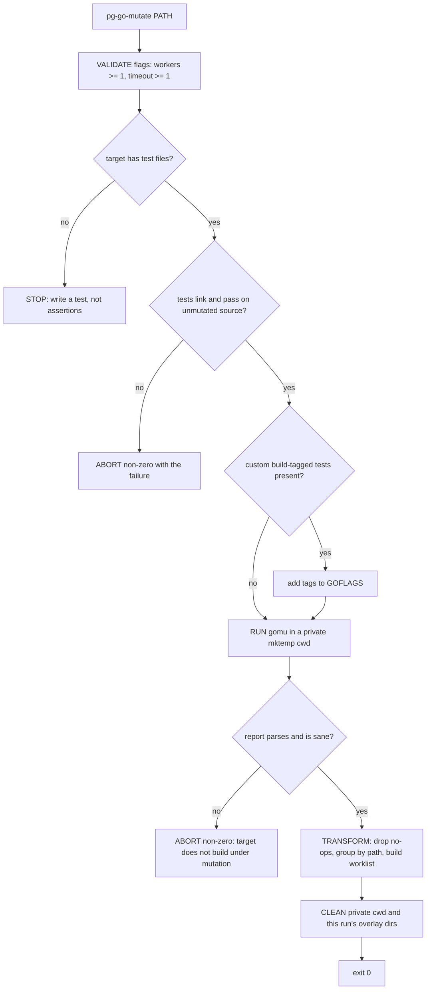
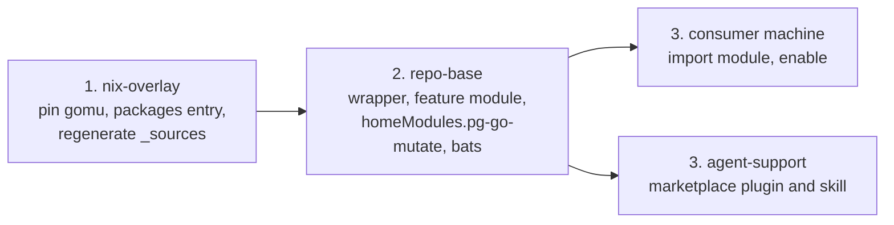

# pg-go-mutate — Go mutation-testing diagnostic

- **Date:** 2026-08-14
- **Status:** Draft rev 2 (rev 1 critiqued by two independent reviewers; all findings folded in)
- **Homes:** wrapper + feature module in `phillipg-nix-repo-base`; `gomu` pin in
  `phillipgreenii-nix-overlay`; agent skill in `phillipgreenii-nix-agent-support`

## 1. Problem

Test suites here cover happy paths well and failure paths barely at all. Line
coverage cannot see this: a test can execute an error branch without asserting
anything about it and the line still reports green.

A measured sweep over seven of the workspace's sixteen Go modules (2026-08-14)
found the gap concretely. Score below is gomu's own definition,
`killed / (killed + survived)`; `Total` includes non-viable mutants, so the score
column is deliberately not `killed / total`:

| Operator             | Total | Killed | Survived | Score |
| -------------------- | ----- | ------ | -------- | ----- |
| `conditional_binary` | 1106  | 585    | 373      | 61.1% |
| `branch_condition`   | 730   | 291    | 228      | 56.1% |
| `error_nilify`       | 56    | 4      | 44       | 8.3%  |
| `bitwise_binary`     | 13    | 1      | 12       | 7.7%  |

The sharpest single signal is inside `branch_condition`, not in its aggregate:
mutating `err != nil` to `false` **survived 70 times** across the sweep, and to
`true` a further 17. Together with `error_nilify` surviving 44 of 48 completed
cases, the finding is that **returned errors are almost never asserted on**.
Branch and conditional coverage overall is respectable, so this is not weak
testing in general — it is one specific, fixable gap.

`return_zero_value` is deliberately excluded from the table. 53 of its 63
mutants have `original == mutated` (42 × `"" → ""`, 11 × `0 → 0`) and 43 of its
45 survivors are those no-ops, so its apparent score is an artifact. See **O5**.

No tool in the workspace surfaces any of this.

## 2. Goals

- **G1** One command that reports, for a Go package, the assertions its tests are
  missing — a file/line worklist, not a score.
- **G2** Zero per-project enablement: no flake edit, no config file, no committed
  artifact in any analyzed project.
- **G3** Available to every repo in the workspace, wired exactly as the existing
  dev tools `pn` and `pjira` are: the consumer imports
  `homeModules.pg-go-mutate` and sets `enable = true`.
- **G4** Agents know the tool exists and how to use it.

> **G3 is deliberately not "zero per-machine change."** repo-base defines no
> capability leaves, and its two existing dev tools (`pn`, `pjira`) are each
> imported and enabled per machine. Matching that precedent is the goal; a
> capability leaf would be a novel mechanism for this repo.

## 3. Non-goals

Excluded by operator ruling (2026-08-14). The tool is a **diagnostic
instrument**, not a metric.

- **N1** No score tracking over time: no baseline file, no history, no trend.
- **N2** No regression detection and no threshold comparison.
- **N3** No `checks.*` entry that **performs a mutation run**, and no CI gate on
  mutation results. A hermetic, stub-driven `checks.*` entry for the wrapper's
  own bats suite is **required** and is not covered by this exclusion (**T6**).
- **N4** No scheduled or periodic execution.
- **N5** No `bd remember` or bead record of scores.

**N3's technical basis:** `nix flake check` already outruns the 10-minute command
ceiling here, and gomu's output is not reproducible — repeated runs over
identical source at one commit produced 21 and 22 killed of 95, with the
non-viable count also moving (19 vs 22). The instability is partly in
_compilation viability_, not merely test outcome. A nix derivation is
reproducible by contract, so a mutation run is category-mismatched to `checks.*`.

## 4. Chosen engine

`sivchari/gomu`, pinned. Selected over `go-gremlins/gremlins` and
`avito-tech/go-mutesting`; the decisive property is its execution model.

gomu is an **Adapter** over the Go toolchain's `-overlay` contract: it writes the
mutant to a temp dir with an `overlay.json`, then runs `go build -overlay` and
`go test -overlay`. The working tree is never written to.

Validated under hostile conditions during the sweep: six concurrent runs across
five repos, interrupted by six hard kills mid-mutation, left **zero tracked-file
modifications** in any repo. Every completed run's log ends `tracked: clean`, and
all five repos verified clean afterwards. The alternatives rewrite files in place
(`go-mutesting`, under a global lock) or clone the whole module per worker
(`gremlins`).

- **E1** The pinned version MUST be a tagged release built by the overlay recipe,
  and the wrapper MUST assert at startup that `gomu version` reports that exact
  string. **The sweep's numbers were produced by a binary reporting
  `gomu version dev`** — a `go install` build whose release ldflags never ran —
  so this spec's measurements are attributed to that build, not to a pinned
  release. The assertion in **E1** exists so this can never recur silently.

## 5. Architecture



- **`pg-go-mutate`** — a **Facade** over gomu that hides its traps behind guards
  and turns its output into something actionable. Internally a **Template
  Method**: a fixed validate → guard → run → transform → clean pipeline.
- **gomu** — the engine, never invoked directly by users.
- **Reporter** — the transform step, a **Presenter** over gomu's JSON report.

### 5.1 Why a wrapper rather than documenting gomu directly

Every guard traces to a specific verified defect. Bare gomu is not safe to hand
to a developer or an agent.

| Guard                                       | Defect it prevents                                                                                                                                                                                                                                                                                                                                    |
| ------------------------------------------- | ----------------------------------------------------------------------------------------------------------------------------------------------------------------------------------------------------------------------------------------------------------------------------------------------------------------------------------------------------- |
| Tests link **and pass** on unmutated source | gomu classifies **any** non-zero `go test` exit as `KILLED`. So a package whose tests fail to compile, or are already failing, reports every mutant killed — **100%, zero survivors, exit 0**. `go build ./...` cannot catch this: it never compiles `_test.go`. This reads as "your tests are perfect" and is more dangerous than a visible failure. |
| Target has test files                       | A package with no `_test.go` exits 0 from `go test`, so gomu marks every mutant `SURVIVED`. Measured: `cmd/swap-stats-exporter/main.go`, 33 mutants, 30 survived, in a directory with no test file. Without this guard the worklist tells a developer to add 30 assertions to a file that has no test.                                                |
| Report sanity, not exit code                | gomu `continue`s past per-file generate and execute errors and still exits 0. `pg-pr-zr` returned exit 0 with 270 of 280 mutants non-viable. Its top-level `killedMutants` is also **always 0** outside CI mode, so counts MUST come from `.statistics.*`.                                                                                            |
| Private cwd                                 | gomu writes `mutation-report.json` and `.gomu_history.json` relative to **cwd, not the target**, with no flag to relocate either. Run from a repo root, both land at the repo root.                                                                                                                                                                   |
| Flag validation                             | `--workers 0` creates an unbuffered semaphore and **deadlocks permanently** with no signal handler. `--timeout 0` marks every mutant timed out.                                                                                                                                                                                                       |
| Build-tag handling                          | gomu has no `--tags` (issue #94, open). Six of sixteen modules gate tests behind custom tags (`hostile`, `smoke`, `contract`).                                                                                                                                                                                                                        |
| Drop no-op mutants                          | 53 of 63 `return_zero_value` mutants have `original == mutated` and cannot be killed by any assertion.                                                                                                                                                                                                                                                |
| Scoping                                     | Cost is `mutants × the package's test-suite runtime`. Measured spread ≈17×: 0.916 s/mutant on `jira` (403 s ÷ 440) versus ≤15.6 s/mutant on `pg-pr` (≤996 s for ≥64 completed mutants; that run was killed, so this is a bound, not a measurement).                                                                                                   |

## 6. CLI contract

```
pg-go-mutate [PATH]

  PATH   A directory (walked RECURSIVELY, so nested packages are included) or a
         single .go file. Defaults to the current directory.
         Go package patterns such as ./... are NOT accepted — gomu errors on them.

  --tags <list>     Comma-separated build tags to enable, e.g. contract,smoke.
  --json            Emit the machine-readable worklist instead of the human one.
  --timeout <sec>   Per-mutant TEST timeout. Default 60. Does NOT bound the
                    compile phase, which gomu runs unbounded.
  --workers <n>     Parallel workers. Default 2.
```

- **C1** The command MUST accept a path and MUST default to the current directory.
- **C2** The command MUST exit `0` whenever it completed an analysis, regardless
  of how many mutants survived. It is a diagnostic and MUST NOT gate anything.
- **C3** The command MUST exit non-zero **only** for operational failure: a guard
  from §5.1 failing, `gomu` or `go` absent, a version mismatch (**E1**), invalid
  flags, an unreadable target, a missing or unparseable report, or a report
  failing the **C6** sanity gate. These are categorically distinct from
  "survivors found".
- **C4** `--workers` MUST default to 2, not gomu's 4. Six concurrent runs at 2
  workers each drove load average to 89 on an 11-core machine and exhausted swap.
- **C5** The wrapper MUST invoke `gomu run` explicitly, never bare `gomu` (whose
  root command runs the same function with the run flags unregistered, so
  `workers` reads 0 and deadlocks), and MUST pass `--incremental=false`
  literally.
- **C6** The report sanity gate: a missing report file, unparseable JSON,
  `.results == null`, `.totalMutants == 0`, or
  `(.statistics.notViable + .statistics.errors) / .totalMutants > 0.5` MUST be
  treated as operational failure. Symmetrically,
  `.statistics.survived == 0 && .statistics.killed == .totalMutants` MUST be
  reported as suspect, because it is the signature of the already-failing-tests
  defect in §5.1.
- **C7** `--changed` is deliberately absent. gomu accepts one path
  (`cobra.MaximumNArgs(1)`), its own incremental mode no-ops unless the target is
  literally the repo root, and it diffs committed history only — invisible to
  uncommitted work, which is the main case. Scope is expressed by which PATH you
  pass.
- **C8** The wrapper MUST report which `.gomuignore` was in effect, if any. gomu
  discovers it by walking from the target to the filesystem root, so a stray file
  in `$HOME` or at the workspace root silently changes which files are mutated —
  which would otherwise violate **G2** invisibly.

## 7. Output

The worklist is the product.

- **O1** Output MUST group survivors by **target-relative path derived from
  `.mutant.filePath`**, never by basename. gomu prints `filepath.Base`, which
  collides — one sweep log shows two different `main.go` entries.
- **O2** The first line MUST NOT contain a percentage and MUST NOT contain a
  killed count. Counts belong at the end of the worklist, alongside the
  build-tag note (**O3**). Stated this way so a bats case can assert it.
- **O3** When the build-tag guard fires, its note MUST appear adjacent to the
  worklist, not only at the top, so it is read with the findings it qualifies.
- **O4** `--json` MUST emit target-relative paths. gomu's JSON is absolute in
  `.mutant.filePath` **and** `.mutant.id`, and its `output`/`error` strings embed
  both the absolute source path and an absolute `$TMPDIR` overlay path. All of
  these MUST be normalized or omitted, not just `filePath`.
- **O5** The transform MUST drop mutants where `original == mutated` before
  building the worklist and before any count.
- **O6** The human-readable description MUST come from `.mutant.description`.
  `.mutant.original` is a bare sub-expression (`err`, `==`) and reads as noise
  alone. Note gomu's `error_nilify` direction is `err → nil`
  ("Replace return err with return nil"), not the reverse.
- **O7** Counts MUST cover all five statuses (killed, survived, not viable,
  timed out, errors) or state an explicit "N other". Two sweep modules have
  non-zero `timedOut`/`errors`, so a three-bucket summary does not sum.
- **O8** No example output appears in this spec. Rev 1's illustrative example was
  arithmetically inconsistent and showed mutations gomu does not emit. The
  implementation MUST generate the reference example from a real report and
  include it in the tldr page.

## 8. Cleanup contract

Rev 1's git-snapshot machinery is **removed**. Running gomu in a private cwd
makes it unnecessary for the two report artifacts, which is the bulk of it.

- **CL1** The wrapper MUST run gomu with cwd set to a private `mktemp -d`, and
  MUST remove that directory on exit. This is verified sufficient for
  `mutation-report.json` and `.gomu_history.json`: cwd affects only those two
  paths, because ignore discovery, incremental analysis, git integration, and
  both `go build`/`go test` working directories are all derived from the
  **absolute target path**, not cwd.
- **CL2** A fresh private cwd MUST be used for every run. This also removes a
  silent-truncation defect: `--incremental=false` does **not** disable
  history-based skipping — the history is consulted unconditionally — so a stale
  `.gomu_history.json` makes gomu skip files and, if all are skipped, return
  before writing any report at all, exit 0, with no output.
- **CL3** The wrapper MUST remove only overlay dirs from **its own** gomu
  process: the name is `gomu_overlay_<pid>_<unixnano>`, so removal MUST be
  scoped to `"$TMPDIR"/gomu_overlay_<captured-pid>_*`. A bare `gomu_overlay_*`
  glob would delete a concurrent run's live working directories. gomu does reap
  these on its normal exit path; it leaks on signal, on error return, and on its
  zero-files early return.
- **CL4** The wrapper MUST trap `EXIT`, `INT`, `TERM` and `HUP` so an interrupted
  run still cleans up. gomu installs no signal handler.
- **CL5** The wrapper MUST remove the compiled binary gomu's compile precheck
  writes into each `main` package directory. The expected path MUST be derived
  per package via `go list -f '{{if eq .Name "main"}}{{.Dir}}{{end}}'` →
  `<dir>/<basename of dir>`, and the file MUST be removed only if it did not
  exist before the run. The wrapper MUST NOT diff the whole tree, and MUST NOT
  blind-remove `mutation-report.html`/`.txt`, which `--output json` never writes
  and which could be a developer's own file.
- **CL6** Cleanup MUST NOT depend on the target being inside a git repository.
  The wrapper MUST work on a module outside any repo — which is exactly what the
  bats fixtures are (**T5**) — and MUST NOT abort over a failed `git` call.

## 9. Nix wiring

### 9.1 Pin the engine (nix-overlay)

```toml
# phillipgreenii-nix-overlay/nvfetcher.toml
# fetch.github takes rev $ver verbatim, so the leading "v" is kept (see [pint]).
[gomu]
src.github = "sivchari/gomu"
fetch.github = "sivchari/gomu"
```

```nix
# phillipgreenii-nix-overlay/packages/gomu/default.nix
# Third-party Go tool. buildGoModule + vendorHash, matching gh-stack/pint/glowm.
# gomod2nix is reserved for FIRST-PARTY modules and does not apply here.
{ lib, buildGoModule, sources }:
buildGoModule rec {
  pname = "gomu";
  version = lib.removePrefix "v" sources.gomu.version;
  src = sources.gomu.src;
  vendorHash = null; # replace with the computed hash
  subPackages = [ "cmd/gomu" ];
  # Load-bearing: without these the binary reports "gomu version dev" and the
  # pinned version is unattributable, defeating E1.
  ldflags = [ "-s" "-w" "-X main.version=${version}" ];
  doCheck = false;
  meta.mainProgram = "gomu";
}
```

- **W1** The new attribute MUST be `pkgs.phillipgreenii.gomu`. The flat
  top-level names in that overlay are a frozen back-compat bridge and MUST NOT
  be grown.
- **W2** `_sources/generated.{nix,json}` MUST be regenerated and committed; the
  toml edit alone leaves `sources.gomu` undefined.
- **W3** A `packages` output entry MUST be added, or gomu is never built by the
  overlay's CI. A README packages-table row and a `verify-provenance.sh`
  `METHODS` entry (`="git-source"`) MUST be added per convention.
- **W4** The implementation MUST verify whether `sivchari/gomu` publishes GitHub
  **releases**. `src.github` is nvchecker's `CheckGitHubRelease` and 404s on a
  tags-only repo; the documented fallback is `src.github_tag` +
  `src.include_regex`.

### 9.2 Wrapper and feature module (repo-base)

The wrapper is first-party bash, so it belongs in repo-base beside `pn` and
`pjira`, built through repo-base's existing `overlays.default` (which already
instantiates `bashBuilders` where `self` is in scope).

```nix
# phillipg-nix-repo-base/home/pg-go-mutate/default.nix
# Feature module. Mirrors home/pn and home/pjira: the package is sourced from
# pkgs.pg-go-mutate, which consuming flakes make available by adding this
# flake's overlays.default to nixpkgs.overlays.
#
# The engine is bound HERE, not at package build time, because repo-base's own
# pkgs applies only overlays.gomod2nix -- overlays.default is exported for
# consumers and never applied to this flake's own pkgs (see modules/pnwf/
# scripts.nix, which documents the same constraint for `pn`). So
# pkgs.phillipgreenii.gomu is resolvable only in a CONSUMER's pkgs, which is
# exactly where this module evaluates.
{ config, lib, pkgs, ... }:
let
  inherit (lib) mkEnableOption mkPackageOption mkIf getExe;
  cfg = config.phillipgreenii.pg-go-mutate;
  # --set, not --suffix: the pin must be authoritative. An ambient
  # ~/go/bin/gomu MUST NOT be able to substitute itself for the engine.
  wrapped = pkgs.symlinkJoin {
    name = "pg-go-mutate-wrapped";
    paths = [ cfg.package ];
    nativeBuildInputs = [ pkgs.makeWrapper ];
    postBuild = ''
      wrapProgram $out/bin/pg-go-mutate \
        --set PG_GO_MUTATE_GOMU ${getExe cfg.gomuPackage}
    '';
  };
in
{
  options.phillipgreenii.pg-go-mutate = {
    enable = mkEnableOption "pg-go-mutate, the Go mutation-testing diagnostic";
    package = mkPackageOption pkgs "pg-go-mutate" { };
    # Forced only under mkIf cfg.enable, so a consumer that never enables the
    # feature never evaluates this attribute and needs no overlay input.
    gomuPackage = mkPackageOption pkgs [ "phillipgreenii" "gomu" ] { };
  };

  config = mkIf cfg.enable {
    home.packages = [ wrapped ];
  };
}
```

- **W5** The wrapper MUST NOT instantiate `bashBuilders` inside the home-manager
  module. `mkBashBuilders` requires `self`, which is not in an HM module's
  scope; the package MUST come from the overlay and be referenced via
  `mkPackageOption`.
- **W6** repo-base MUST NOT gain a third-party fetch. It has none today
  (no nvfetcher, no `_sources`, no `fetchFromGitHub`), and third-party
  repackages belong in the overlay flake. This is why **§9.1** and **§9.2** are
  split across two repos.
- **W7** The module MUST be exposed as `homeModules.pg-go-mutate`, matching how
  machines import `homeModules.pn` / `homeModules.pjira`.
- **W8** No capability leaf is created, in either repo-base (which defines none)
  or nix-personal (whose `golang` leaf cannot reference a repo-base feature
  unless the machine also imports the declaring module — a coupling that would
  eval-fail rather than degrade).
- **W9** The wrapper MUST resolve the engine from an absolute store path, not
  from `PATH`. repo-base's bash builders append `runtimeDeps` with
  `--suffix PATH` by design ("runtimeDeps are a FALLBACK appended after the
  user's PATH, so an ambient tool wins"), so a `runtimeDeps` entry would let an
  ambient `~/go/bin/gomu` silently defeat the pin. The binding MUST be made in
  the **home-manager module** via `makeWrapper --set PG_GO_MUTATE_GOMU`, as in
  §9.2 — **not** via `mkBashScript`'s `config`, which would require resolving
  `pkgs.phillipgreenii.gomu` at package build time inside repo-base, where that
  attribute does not exist. The script MUST read
  `"${PG_GO_MUTATE_GOMU:-gomu}"`, so the env var is simultaneously the
  production binding, the escape hatch, and the bats stub seam (**T7**).
- **W14** The option namespace MUST be `phillipgreenii.pg-go-mutate`, matching
  `home/pjira` (`phillipgreenii.pjira`) and `home/pn` — **not**
  `phillipgreenii.programs.*`. The `programs.` prefix is required only by
  `mkCapability`, which interpolates `phillipgreenii.programs.${f}.enable`, and
  no capability leaf is created (**W8**). Adopting a capability later would
  require moving the option, which is a deliberate, recorded trade-off.
- **W10** The wrapper MUST NOT embed its own Go toolchain; `go` is a runtime
  requirement resolved from the environment, and its absence MUST produce an
  actionable message. Embedding one would duplicate the toolchain in
  `/nix/store`.
- **W11** `--tags` MUST be implemented by **appending** to `GOFLAGS`
  (`GOFLAGS="-tags=<list> ${GOFLAGS:-}"`), never clobbering it. gomu sets no
  `cmd.Env` and no build flags, so its `go` subprocesses inherit the
  environment; this is a real fix for issue #94, not a workaround.
- **W12** Build-tag **detection** MUST NOT be a naive `//go:build` scan of
  `_test.go`. That fires on `linux`, `darwin`, `cgo`, `go1.24` and other
  already-satisfied constraints. Detection MUST subtract constraints the current
  build context already satisfies, or compare
  `go list -f '{{len .TestGoFiles}}'` with and without candidate tags.
- **W13** `support-apps` does not consume the overlay flake today. To use this
  tool it MUST add that input; until then the tool is unavailable there.

### 9.3 Consumer wiring (per machine, as `pn`/`pjira`)

```nix
# a machine's home-manager configuration
imports = [ inputs.phillipgreenii-nix-base.homeModules.pg-go-mutate ];
phillipgreenii.pg-go-mutate.enable = true;
```

## 10. Agent awareness

- **A1** A marketplace plugin MUST be added to agent-support, which requires two
  files, because nothing scans the directory: a
  `claude-marketplace/pg-go-mutate/.claude-plugin/plugin.json` (`name`,
  `description`, `version`, `defaultEnabled`) and a new entry in the `plugins`
  array of `claude-marketplace/.claude-plugin/marketplace.json`.
- **A2** The skill MUST trigger on intent to write, review, or strengthen Go
  tests — not on the phrase "mutation testing", which an agent unaware of the
  tool would never say.
- **A3** The skill MUST state that a surviving mutant is a **missing assertion**,
  not a bug in production code.
- **A4** The verification loop MUST be **per-mutant, not count-based**: after
  adding an assertion, re-run and confirm that the specific mutant, matched on
  `file:line:type`, is now `KILLED`. A count comparison is unsound here — the
  run-to-run variance is ±1 mutant, so a one-mutant "improvement" is
  indistinguishable from noise. This is the one place **N1**/**N2** do not
  protect the design.
- **A5** The skill MUST carry the build-tag caveat and the `--tags` remedy.
- **A6** The skill MUST name the cost model (`mutants × suite runtime`) and state
  that `--timeout` does not bound the compile phase, so an agent does not launch
  an uncompletable run.
- **A7** One line MUST be added to `phillipg-nix-repo-base/CLAUDE.md` pointing at
  the skill.

## 11. Testing

- **T1** The wrapper MUST be authored via the workspace
  `mkBashScript`/`mkBashLibrary` framework per the `bash-scripting` skill.
- **T2** The Required artifacts for a public command MUST all be produced:
  `--help` text, a tldr page, and bash **and** zsh completions. Flags,
  completions and the tldr page MUST stay in sync — they are a hard coupling.
- **T3** The feature module MUST wire `programs.tldr.customPages.pg-go-mutate`
  under `lib.mkIf config.programs.tldr.enable`, as `pg-pr` does.
- **T4** Bats tests MUST cover: each §5.1 guard failing and aborting non-zero;
  survivors present still exiting 0; the **C6** sanity gate; `--workers 0` and
  `--timeout 0` rejected before invocation; no-op mutants dropped (**O5**);
  first line free of percentage and killed count (**O2**); `--json` paths
  target-relative (**O4**); interrupt still cleans up (**CL4**); a pre-existing
  untracked file preserved (**CL5**); zero-test-file and zero-mutant targets
  each producing their named message.
- **T5** Tests MUST build fixtures in a temp directory and MUST NOT mutate any
  repo file. Fixtures will therefore be **outside any git repository**, which is
  why **CL6** exists.
- **T6** A `checks.*` derivation MUST reference the script's `.check`, or the
  bats suite never runs. This is the hermetic check **N3** explicitly permits.
- **T7** The gomu invocation MUST be stubbed via the **W9** seam — overriding
  `PG_GO_MUTATE_GOMU` with a stub that emits a canned report. A PATH-prepended
  stub MUST NOT be used: it works only because `--suffix PATH` leaves the pin
  breakable, so it would test the bug rather than the behaviour.
- **T8** An eval-wiring row MAY be added to nix-personal's
  `tests/capabilities-eval.nix`, but **only if** a capability ever references
  this feature (it does not — **W8**). That file stubs
  `phillipgreenii.programs` as `attrsOf`, so a row there proves nothing about
  package resolution. The gate that actually catches a missing attribute is the
  `darwinConfigurations.ci-test` eval in nix-personal's CI, and cross-repo,
  `pn workspace flake-check`.

## 12. Risks

| Risk                                                                            | Severity | Mitigation                                                                                                                                                                             |
| ------------------------------------------------------------------------------- | -------- | -------------------------------------------------------------------------------------------------------------------------------------------------------------------------------------- |
| A package's tests already fail or do not compile ⇒ 100%, zero survivors, exit 0 | **High** | The link-and-pass guard plus the **C6** symmetric check. This is the most dangerous failure mode found.                                                                                |
| gomu is pre-1.0 (v0.2.1), effectively single-maintainer, 42 stars               | Medium   | Pinned, MIT, small. The wrapper is a Facade, so the engine is replaceable without changing the developer- or agent-facing contract — which is why the command is not named after gomu. |
| Pin defeated by an ambient `gomu` on PATH                                       | Medium   | **W9** store-path injection plus the **E1** version assertion.                                                                                                                         |
| A `replace` directive pointing at a nix-materialized path                       | Medium   | The build guard. Live today: `pg-pr-zr`.                                                                                                                                               |
| No `--tags` upstream                                                            | Low      | Fixed via `GOFLAGS` (**W11**), not merely warned about.                                                                                                                                |
| Worklist instability run-to-run (±1 mutant, including viability)                | Low      | Per-mutant verification (**A4**) rather than count comparison.                                                                                                                         |
| ~7.2% of mutants non-viable on modules that build                               | Low      | Inherent; no configuration avoids it. Accepted. Rev 1 claimed ~21%, which was an artifact of including the build-broken `pg-pr-zr`.                                                    |
| Cost makes a module uncompletable                                               | Medium   | Scope-by-path is the only mode (**C7**), and **A6** puts the cost model in front of agents.                                                                                            |

## 13. Rejected alternatives

- **A committed per-project baseline file.** Rejected by operator ruling: this is
  a diagnostic, not a tracked metric (**N1**). Staleness probes, tolerance bands
  and regression detection all went with it.
- **Committing `.gomu_history.json`.** Rejected on evidence. Its map keys are
  absolute paths, so it is valid for exactly one checkout on one machine, and
  this workspace holds two checkouts of every repo. It stores full verdicts, so a
  fresh clone would report results it never verified. Its `version` is hardcoded
  `v0.0.0`, so it carries no usable compatibility marker. Its size is also
  non-linear in mutant count, since each entry embeds full compiler and test
  output. It is a cache.
- **A `checks.*` mutation run.** Rejected: **N3**.
- **Scheduled runs or a recurring bead.** Rejected by operator ruling (**N4**).
- **`--changed`.** Rejected: **C7**.
- **Homing the tool in nix-personal.** Rejected: it exposes no general
  `overlays.default`, so the package would need a new per-package overlay factory
  listed at four consumer sites, and it hosts no member of the `p*` CLI family.
- **Homing the tool in agent-support.** Rejected: its capability leaves
  deliberately do not subscribe to `bundles.development`, and it sits downstream
  of repo-base, so repo-base and `support-apps` could not consume the tool.
- **Pinning gomu in repo-base.** Rejected: **W6**.
- **`go-gremlins/gremlins`.** Velocity collapsed — 13 commits in 12 months, none
  in the last 8 weeks; CI-gate flags broken from the CLI (#216); `--diff` broken
  in multi-module monorepos (#296), with subdirectory arguments (#278), and on
  merged hunks (#301).
- **`avito-tech/go-mutesting`.** Disqualified: it returns success regardless of
  survivors so it cannot even signal; its documented execution model `mv`s the
  mutant over real source under a global lock, so an interrupt leaves mutated
  source behind; and it has open panics on Go 1.26 (#44, #37).
- **Naming it `go-test-gaps`.** Rejected: a `go-` prefix claims Go-toolchain
  membership it does not have, and the workspace convention is the `p*` namespace.

## 14. Landing order

This is a coordinated cross-repo change and MUST be done as a workforest set, not
three independent commits. The pin is the version: there are no compat shims, so
consumers are cut over in lockstep.



- **L1** Steps 1 and 2 have no build-time dependency on each other — repo-base
  takes no overlay input (**W6**), and its `gomuPackage` default resolves only in
  a consumer. They MAY be developed in parallel within the set.
- **L2** A consumer MUST NOT enable the feature until **both** have landed and
  the consumer's flake locks are bumped for both. Enabling earlier fails eval on
  the missing `pkgs.phillipgreenii.gomu` attribute — the failure mode that the
  `darwinConfigurations.ci-test` eval catches (**T8**).
- **L3** Validation before landing MUST be `pn workspace flake-check` across the
  set, which is the cross-repo eval gate, rather than per-repo checks. It exceeds
  the default command timeout and MUST be run in the background or with an
  explicit long timeout.
- **L4** The overlay side additionally requires a lock bump in each consuming
  repo, per that repo's ADR 0001 ("package changes require two PRs: one in this
  repo, one in each consuming repo").

## 15. Open items for implementation

1. Compute gomu's `vendorHash`, and resolve **W4** (releases vs tags-only).
2. Exact `mkBashScript` invocation and library split, per the `bash-scripting`
   skill.
3. Generate the reference worklist example from a real report (**O8**).
4. Decide whether `support-apps` takes the overlay input now or later (**W13**).
