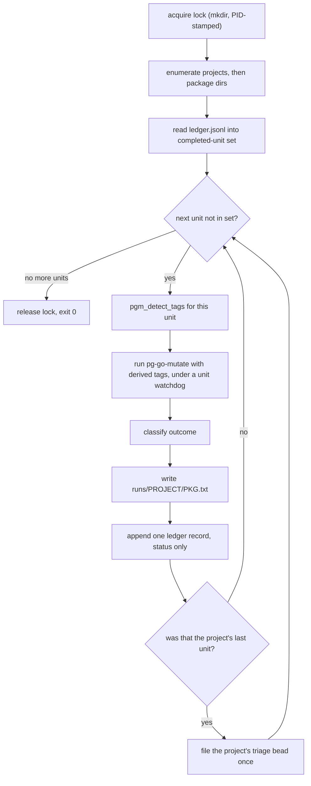

# pg-go-mutate-sweep — resumable unattended mutation sweep

Bead: `pg2-l36xv`. Prerequisite: `pg2-un41a`.

Companion to `2026-08-14-pg-go-mutate-design.md`, which specifies the single-target
diagnostic this tool drives. Read that spec's sections 5 (Architecture), 6 (CLI contract)
and 11 (Testing) first; this document does not restate them.

## 1. Problem

`pg-go-mutate` analyses ONE target. Covering a workspace means invoking it once per
package, and the cost per invocation is roughly `mutants x the package's test-suite
runtime` — so the work is long, uneven, and cannot be held in one sitting.

Measured on this workspace 2026-08-17, with all six repos clean on their primary branches:

- `pb` (13 non-test `.go` files, 8 package dirs) took **38 minutes** — its suite runs
  roughly 30s per mutant.
- The large modules are far heavier: `pa-monitor` carries 1099 test functions across 37
  package dirs with 22 `time.Sleep` call sites, `pn` has 90 `exec.Command` call sites in
  its tests, `claude-extended-tool-approver` has 1087 test functions across 38 package
  dirs.

Three failures follow from running that by hand, and all three were observed:

1. **Output is lost.** A full sweep's results were written to a session-scoped scratchpad
   and destroyed when that directory was reclaimed two days later. The analysis had to be
   redone from scratch.
2. **A whole-module invocation is the wrong unit.** The `go-test-gaps` skill states it
   directly: never point the tool at a whole large module. A sweep that does so cannot be
   interrupted usefully, because nothing partial is retained.
3. **Build tags are silently dropped.** `pg-go-mutate` REPORTS unsatisfied custom tags but
   does not apply them, so a package whose tests sit behind `contract` or `hostile` reports
   those mutants as survivors unless the operator remembers `--tags`. A manual sweep across
   16 projects forgets.

## 2. Goals

- **G1** Analyse every Go package in the workspace, one `(project, package)` unit at a
  time, strictly serially.
- **G2** Survive interruption. A re-run MUST resume at the first unit that has no recorded
  outcome, and MUST NOT redo completed units.
- **G3** Persist every unit's worklist somewhere no session teardown can reclaim.
- **G4** Run unattended: no prompt, no babysitting, and a single unit's failure MUST NOT
  abort the sweep.
- **G5** Apply each unit's custom build tags automatically, so a tag-gated package is never
  mis-reported as a gap.
- **G6** On finishing a project, file ONE bead carrying that project's findings plus the
  triage protocol needed to turn them into focused fix beads.

## 3. Non-goals

These are load-bearing prohibitions, not preferences. They restate the `go-test-gaps`
skill's non-goals and the operator ruling recorded in `pg2-xulhg`.

- **N1** The tool MUST NOT record a mutation score, survivor count, percentage, or any
  numeric summary — not in its ledger, not in a bead, not in a commit message. A
  per-package count series is a baseline someone will diff over time, which is forbidden
  outright, and the counts are not reproducible enough to diff: they move by a mutant or
  two between runs on identical source. The ledger records STATUS ONLY.
- **N2** The tool MUST NOT be added to CI, a git hook, or a `checks.*` derivation that
  performs a mutation run. Its own bats suite (hermetic, stubbed) MAY be a `checks.*` entry.
- **N3** The tool MUST NOT gate anything. It is a diagnostic driver.
- **N4** No scheduling. No cron, no launchd timer, no `--watch`. The operator re-runs it.
- **N5** It MUST NOT modify the repositories it analyses. It writes only under its own state
  directory and to beads.

## 4. Architecture

Three collaborators, each independently testable:

| Unit                      | Responsibility                                                                                                                   |
| ------------------------- | -------------------------------------------------------------------------------------------------------------------------------- |
| `pg-go-mutate-sweep.bash` | Enumeration, ledger read/write, lock acquisition, status classification. Pure functions over a filesystem; no engine invocation. |
| `pg-go-mutate-sweep.sh`   | Argument parsing, help, the drive loop, bead emission.                                                                           |
| `pg-go-mutate-lib.bash`   | REUSED, not reimplemented. Supplies tag detection and the target guards.                                                         |

The drive loop is a **Template Method** over the unit list: for each unit, resolve tags,
invoke the engine, classify the outcome, append one ledger record. The ledger is an
**append-only log**, and resume is the idempotent replay of it — the tool holds no other
state, so there is nothing to reconcile after a crash.



## 5. The unit, and how units are discovered

Nothing is hardcoded; a stale list is the defect this avoids.

### 5.1 Projects

Every directory containing a `go.mod` under the workspace root (`PN_WORKSPACE_ROOT`, or
`--root`), excluding `.git`, `vendor`, `.worktrees`, `.workforests`, and any path under a
`fixtures` or `testdata` directory. Fixture modules are deliberately broken in ways that
would be reported as findings.

### 5.2 Packages, and why nested dirs are excluded

A candidate package dir directly contains at least one non-test `.go` file. From that set,
the tool MUST drop any dir that is nested under another candidate dir: `pg-go-mutate` walks
its PATH argument RECURSIVELY, so an ancestor's run already covers its descendants, and
keeping both would analyse the descendant twice.

Measured on this workspace: 233 candidate dirs, 17 of them nested under another, leaving
**216 non-overlapping units** at full coverage with no duplicated work.

The consequence MUST be documented in `--help`: a unit is a directory SUBTREE, so the 17
ancestor units are larger than one package. All 17 are small.

### 5.3 Ordering

Projects ascending by candidate-dir count, then by name; packages lexicographic. Cheap
projects finish first, so findings arrive early, and the order is deterministic — which is
what makes resume stable across invocations.

### 5.4 Build tags — reuse, do not reimplement

The tool MUST obtain tags by calling `pgm_detect_tags` from `pg-go-mutate-lib`, and MUST
NOT scan `//go:build` lines itself. That function's own header records why a naive scan is
wrong: it fires on `linux`, `darwin`, `cgo` and `go1.24`, which the build context already
satisfies. A tag is custom-and-unsatisfied exactly when it appears in a `//go:build` line
of a file `go list` does NOT see, matched on full path rather than basename.

Its output is passed straight to `--tags`. This is the sweep's main advantage over manual
use: `pg-go-mutate` only WARNS about unapplied tags, so deriving and applying them per unit
removes the failure mode entirely.

## 6. Durable state

Root: `${XDG_STATE_HOME:-$HOME/.local/state}/pg-go-mutate-sweep/`, matching the workspace's
existing XDG state convention. Outside any session-scoped directory — G3 exists because a
scratchpad reclaim destroyed a full sweep.

```text
ledger.jsonl                     append-only, one record per COMPLETED unit
runs/<project>/<pkg-slug>.txt    the unit's raw worklist, verbatim
lock/                            PID-stamped lock directory
```

`<pkg-slug>` is the package dir relative to its project with `/` replaced by `__`, so the
tree stays flat and shell-safe.

### 6.1 Ledger records

One JSON object per line, discriminated by `kind`. Two kinds only. Note what is absent from
both: no counts, no score (N1).

A **unit** record, appended once per completed unit:

```json
{
  "kind": "unit",
  "unit": "pb/internal__gate",
  "project": "pb",
  "pkg": "internal/gate",
  "status": "done",
  "exit": 0,
  "tags": "contract,smoke",
  "finished": "2026-08-17T11:17:03-04:00",
  "report": "runs/pb/internal__gate.txt"
}
```

A **bead** record, appended once per project immediately after its triage bead is filed.
This record IS the idempotency key of section 10 — it is why a resumed sweep that re-reaches
a project's end does not file a second bead:

```json
{
  "kind": "bead",
  "project": "pb",
  "bead": "pg2-3udx3",
  "finished": "2026-08-17T11:20:11-04:00"
}
```

`tags` is retained on unit records because it changes what the run MEANS — a unit analysed
without its `contract` tag is not comparable to one analysed with it, and a reader of the
worklist needs to know which happened. It is provenance, not a metric.

A reader MUST filter on `kind` rather than assume every line is a unit; an implementation
that builds its completed-unit set from unfiltered lines would trip over bead records.

### 6.2 Resume semantics

Resume reads `ledger.jsonl` line by line into a set of completed `unit` keys and skips those
units. Two requirements follow from append-only:

- A trailing partial line, from a `kill -9` mid-write, MUST be tolerated: parse per line and
  ignore an unparseable final line rather than aborting.
- A record MUST be appended only AFTER the unit's report file is written, so a unit is never
  marked complete with no artifact behind it.

`--redo <unit>` appends nothing and instead re-runs one named unit, for verifying a fix.
Per the `go-test-gaps` skill, that verification is per-mutant on `file:line:type` — never a
comparison of totals.

### 6.3 Locking

`flock(1)` is ABSENT on darwin (verified on this machine), so the tool MUST use a portable
atomic `mkdir` lock, stamping the holder's PID inside. On a failed acquisition it reads the
PID and, if that process is gone, reclaims the lock as stale; otherwise it exits non-zero
reporting the live holder. This keeps G1's serial guarantee across concurrent invocations.

## 7. Status taxonomy

Derived from `pg-go-mutate-lib`'s existing guards rather than invented. The lib's
`pgm_has_tests` is deliberately three-valued and its header explains why collapsing the
cases misleads a reader — "sends the reader off to write a test that is not the problem" —
so the sweep MUST preserve the distinction.

| Status           | Meaning                                                                                                      | Bead-worthy?                                                                                                                                    |
| ---------------- | ------------------------------------------------------------------------------------------------------------ | ----------------------------------------------------------------------------------------------------------------------------------------------- |
| `done`           | Analysis completed. Worklist captured.                                                                       | Yes, the worklist is the finding.                                                                                                               |
| `no-tests`       | Loadable module, zero test files (`pgm_has_tests` = 1).                                                      | Yes, and it is NOT a mutation finding: with no tests every mutant trivially survives, so the worklist would be meaningless. Write a test first. |
| `not-enumerable` | `go list` could not enumerate (`pgm_has_tests` = 2) — not a Go module, module does not load, unreadable dir. | Yes, as an infrastructure defect, not a test gap.                                                                                               |
| `unhealthy`      | Target does not `go vet` cleanly, or its tests already fail on UNMUTATED source (`pgm_tests_healthy` fails). | Yes, and urgently: gomu reads any non-zero `go test` as KILLED, so this state would otherwise report as flawless.                               |
| `failed`         | Any other non-zero exit.                                                                                     | Yes, operational.                                                                                                                               |
| `timeout`        | Exceeded `--unit-timeout` wall clock.                                                                        | Yes, note the unit needs narrowing or a raised timeout.                                                                                         |

`not-enumerable` and `unhealthy` are exactly what a real run hits: `pg-pr-zr` reported
`the target does not vet cleanly on unmutated source` because a `replace` directive's target
was absent (bead `pg2-01nc5`). A sweep MUST record that distinctly rather than as "no gaps".

Every status is terminal for the unit and the loop continues (G4). A non-zero engine exit is
an operational failure, never a finding.

## 8. CLI contract

```text
pg-go-mutate-sweep [OPTIONS]

  --root <dir>          Workspace root. Default: PN_WORKSPACE_ROOT, else cwd.
  --only <project>      Restrict to one project (repeatable).
  --unit-timeout <sec>  Per-unit wall-clock cap. Default 3600.
  --workers <n>         Passed through to pg-go-mutate. Default 2.
  --redo <unit>         Re-run one named unit; does not append a ledger record.
  --dry-run             Print the unit plan and resume position. Runs nothing.
  --no-beads            Analyse and record, but file no beads.
  -h, --help            Show help.
  -v, --version         Injected by the builder. Never hand-written.
```

Exit status: `0` when the sweep completed or had nothing left to do; `2` for a usage or
guard error, matching `pg-go-mutate`'s convention; `3` when another sweep holds the lock.
Per-unit failures do NOT affect the exit status — they are ledger records.

`--dry-run` is the reviewability affordance: it answers "what will this do, and where will
it resume" without cost.

## 9. Engine acquisition

The tool MUST resolve `pg-go-mutate` from `PATH` and MUST NOT depend on the unwrapped
`packages.pg-go-mutate` derivation. Only the home-manager-wrapped binary binds the engine by
store path (W9) and asserts the pinned engine version (E1); the unwrapped script silently
accepts whatever `gomu` is on `PATH`, including an unattributable `gomu version dev` build.
That is bead `pg2-afk4p`.

`pg2-un41a` is therefore a hard prerequisite, wired as a blocking edge: no consumer currently
imports `homeModules.pg-go-mutate`, so the command does not exist on this machine.

> Operator ruling, 2026-08-17: asked whether this section should instead be written
> indifferently, so that `pg2-afk4p`'s parked work making the UNWRAPPED package self-assert
> would satisfy it too, the operator ruled **"Spec assumes the wrapper only"** — keep PATH
> resolution of the wrapped binary and keep `pg2-un41a` as a hard prerequisite including the
> apply, accepting that the prerequisite may later prove unnecessary. This is an EXECUTED
> DECISION; do not re-derive it from `pg2-afk4p`'s existence.

`bd` is likewise resolved from `PATH` and MUST NOT be added as a nixpkgs `runtimeDep`, so it
remains the machine wrapper carrying `BEADS_DOLT_AUTO_START=0`. A bare `bd` from an unmanaged
environment can spawn a competing dolt server on port 25252.

## 10. The per-project triage bead

On a project's last unit, the tool files exactly ONE bead for that project — 16 across the
workspace. It MUST be idempotent: a resumed sweep that re-reaches a project's end MUST NOT
file a second bead. The idempotency key is the `"kind":"bead"` ledger record of section 6.1,
which MUST be checked before creation and appended immediately after. A crash in the window
between the two re-files the bead on resume; that is the accepted failure mode, and it is
preferred over the reverse order, which would silently lose a project's findings entirely.

- Type `task`, priority `P3`, labels `go-test-gaps` plus the project's repo label.
- NEVER an epic: an open epic sits in `bd ready` permanently.
- Body: the durable artifact paths, the per-status unit summary, and the triage protocol.
- Acceptance: focused fix beads exist for the worthwhile clusters, and this bead can close.

The body MUST carry the protocol, because the bead's purpose is to be handed to a later
session that has none of this context:

1. Start with error paths. Across a sixteen-module measurement `err != nil` mutated to
   `false` survived 70 times and `error_nilify` survived 44 of 48 completed cases.
2. Prefer DUPLICATED unasserted code. The two highest-value findings of the manual campaign
   were both extraction opportunities rather than missing tests: a 64KB-overflow scanner
   buffer duplicated at six sites in `claude-transcript` where no test read a line over 64KB
   (`pg2-j54i7`), and a `newFileLogger` duplicated in two support-apps binaries with zero
   test references (`pg2-70l4r`). One test against one extracted helper kills mutants at
   every site.
3. Cite `file:line:operator` concretely. A bead that says "add more tests" is not actionable.
4. Deprioritise explicitly. The `==` to `<=`/`>=` family applied to STRING equality is a
   weak mutant: killing it needs an input differing only in lexicographic order. Record the
   judgement instead of chasing it.
5. Verify per mutant on `file:line:type`. Survivor totals move by a mutant or two between
   runs on identical source, so a count that drops by one is indistinguishable from noise.
6. Record no scores anywhere (N1).

## 11. Nix wiring

A new command directory inside the EXISTING module, wired through its existing
`scripts.nix` — this is not a new module.

```text
modules/pg-go-mutate/
├── lib/                          # unchanged, now a dependency of two scripts
├── pg-go-mutate/                 # unchanged
├── pg-go-mutate-sweep/
│   ├── default.nix               # mkBashScript, libraries = [ pg-go-mutate-lib ]
│   ├── pg-go-mutate-sweep.sh
│   ├── pg-go-mutate-sweep.bash
│   ├── pg-go-mutate-sweep.md     # tldr page
│   ├── completions/{pg-go-mutate-sweep.bash,_pg-go-mutate-sweep}
│   └── tests/{test-pg-go-mutate-sweep.bats,test-pg-go-mutate-sweep-lib.bats}
└── scripts.nix                   # += the new script, its check, its tldr
```

`runtimeDeps` covers only what the script itself shells out to for enumeration and
bookkeeping — `go`, `jq`, `findutils`, `coreutils`. NOT `pg-go-mutate` and NOT `bd`, per
section 9. The home-manager module gains the new command through the same `packages` list.

Source files follow the framework: no shebang, no `set -euo pipefail`, opening
`# shellcheck shell=bash`, and no hand-written `--version`.

## 12. Testing

Hermetic and runnable as `bats tests/` with no nix build, per the framework.

**Library unit tests** (`test-pg-go-mutate-sweep-lib.bats`) over a fixture tree:

- Project discovery excludes `.git`, `vendor`, `.worktrees`, `.workforests`, `fixtures`,
  `testdata`.
- Package discovery excludes dirs nested under another candidate dir, and a dir holding only
  `_test.go` files is not a candidate.
- Ordering is deterministic and cheap-project-first.
- Ledger: resume skips recorded units; a truncated final line is tolerated; a record is
  never written before its report file.
- Slug generation is collision-free for nested paths.
- Lock: acquisition, refusal against a live PID, reclaim of a stale PID.
- Status classification maps each guard outcome to the right status.

**Script integration tests** (`test-pg-go-mutate-sweep.bats`) with **Test Doubles** for
`pg-go-mutate` and `bd` on `PATH`:

- Unit order matches the plan, and `--dry-run` runs nothing.
- A stub exiting non-zero yields `failed` and the sweep CONTINUES to the next unit (G4).
- A stub emitting the no-test guard yields `no-tests`, not `done`.
- Killing the run mid-sweep and re-invoking resumes at the right unit and redoes nothing.
- The `bd` stub is invoked exactly once per project, and NOT again after a resume.
- `--no-beads` never invokes the `bd` stub.
- Derived tags reach the engine stub as `--tags`.

Mocks live in a `mktemp -d` OUTSIDE any git working tree, and `HOME` is overridden so the
real state directory is never touched. No test asserts `--version`.

## 13. Risks

| Risk                                                                 | Mitigation                                                                                                    |
| -------------------------------------------------------------------- | ------------------------------------------------------------------------------------------------------------- |
| A single unit runs unboundedly and stalls the sweep.                 | `--unit-timeout`, default 3600, recorded as `timeout` and skipped.                                            |
| The ledger becomes a de facto score baseline (N1).                   | Status-only schema; no counts are written, so there is nothing to diff.                                       |
| The 17 ancestor units are larger than one package.                   | Documented in `--help`; all 17 are small. Narrow with `--only` if one bites.                                  |
| Analysing a dirty worktree yields findings against uncommitted code. | The tool reports the analysed path; it does not police branch state. Operators run it on the canonical clone. |
| 16 triage beads swamp `bd ready`.                                    | P3, one shared label, never epics, and each closes as soon as its fix beads are filed.                        |

## 14. Rejected alternatives

- **A nix `checks.*` entry per package.** Forbidden by N2 and by the `pg2-xulhg` ruling:
  too slow, and not reproducible enough to gate on.
- **Parallel units.** Defeats G1 and makes the load unpredictable on a machine that already
  runs peer agent sessions. `pg-go-mutate`'s own `--workers` already parallelises WITHIN a
  unit.
- **A naive `//go:build` scan for tags.** Wrong for the reasons `pgm_detect_tags` documents;
  reimplementing it would also duplicate logic the module already owns (section 5.4).
- **State in the repo.** Would commit machine-local progress, and the artifacts are
  regenerable. XDG state is the right home.
- **One rolling bead for the whole sweep.** A permanently-open catch-all that cannot be
  worked or closed per project. Operator chose 16 beads, 2026-08-17.
- **A markdown handoff file instead of beads.** The workspace tracks work in beads; a
  markdown TODO list is prohibited.

## 15. Landing order

1. `pg2-un41a` — import `homeModules.pg-go-mutate`, set `enable = true`, operator applies.
   Until this lands the command does not exist and the sweep cannot run.
2. This tool, in one branch: library, script, artifacts, tests, `scripts.nix` wiring.
3. Verify: `bats tests/` in the command dir, then `nix flake check`, then a `--dry-run`
   against the real workspace to confirm the 216-unit plan.
4. First real sweep, unattended.

## 16. Open items for implementation

- The exact `bd create` invocation, including how the body file is produced and cleaned up.
- Whether `--only` should accept a package path as well as a project name.
- Whether a `no-tests` unit should file its own bead immediately or be aggregated into the
  project's triage bead. Aggregating is the current intent.
