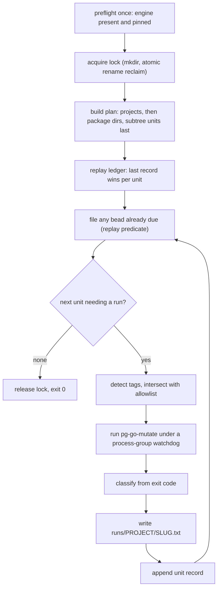

# pg-go-mutate-sweep — resumable unattended mutation sweep

Bead: `pg2-l36xv`. Prerequisite: `pg2-un41a`.

Companion to `2026-08-14-pg-go-mutate-design.md`, which specifies the single-target
diagnostic this tool drives. Read that spec's sections 5 (Architecture), 6 (CLI contract)
and 11 (Testing) first; this document does not restate them. This work AMENDS that spec's
exit-status contract — see section 7.1.

## 1. Problem

`pg-go-mutate` analyses ONE target. Covering a workspace means invoking it once per
package, and the cost per invocation is roughly `mutants x the package's test-suite
runtime` — so the work is long, uneven, and cannot be held in one sitting.

Measured on this workspace 2026-08-17, with all six repos clean on their primary branches:

- `pb` (13 non-test `.go` files, 8 package dirs) took **38 minutes** — its suite runs
  roughly 30s per mutant.
- The large modules are far heavier: `pa-monitor` carries 1099 test functions across 37
  package dirs with 22 `time.Sleep` call sites, `pn` has 90 `exec.Command` call sites in
  its tests, `claude-extended-tool-approver` has 1087 test functions across 38 package
  dirs.

Three failures follow from running that by hand, and all three were observed:

1. **Output is lost.** A full sweep's results were written to a session-scoped scratchpad
   and destroyed when that directory was reclaimed two days later. The analysis had to be
   redone from scratch.
2. **A whole-module invocation is the wrong unit.** The `go-test-gaps` skill states it
   directly: never point the tool at a whole large module. A sweep that does so cannot be
   interrupted usefully, because nothing partial is retained.
3. **Build tags are handled wrongly in both directions.** `pg-go-mutate` REPORTS
   unsatisfied custom tags but does not apply them, so a `contract`-gated package reports
   its mutants as survivors unless the operator remembers `--tags`. Conversely, blanket
   application is dangerous: ADR 0024 records that `smoke` and `hostile` suites are
   tag-guarded precisely because they are sandbox-hostile, so applying them per mutant is
   not an improvement (section 5.5).

## 2. Goals

- **G1** Analyse every Go package in the workspace, one `(project, package)` unit at a
  time, strictly serially.
- **G2** Survive interruption AND correction. A re-run MUST make forward progress, and a
  unit whose recorded outcome was transient MUST be re-attemptable without hand-editing
  state.
- **G3** Persist every unit's worklist somewhere no session teardown can reclaim.
- **G4** Run unattended: no prompt, and a single unit's failure MUST NOT abort the sweep.
- **G5** Apply each unit's custom build tags **when it is safe to do so**, so a
  `contract`-gated package is not mis-reported as a gap, without silently running
  sandbox-hostile suites.
- **G6** On finishing a project, file ONE bead carrying that project's findings plus the
  triage protocol needed to turn them into focused fix beads.

## 3. Non-goals

Load-bearing prohibitions, not preferences. They restate the `go-test-gaps` skill's
non-goals and the operator ruling recorded in `pg2-xulhg`.

- **N1** The tool MUST NOT record any mutant or survivor COUNT derived from one of its own
  runs into the ledger or into a bead, and MUST NOT accumulate a time series of such
  counts. This is the score prohibition, scoped to what it actually protects. Explicitly
  PERMITTED, because none of these can form a series: the raw worklist in `runs/`, which is
  overwritten in place and never versioned, timestamped, or rotated (section 6.4); a tally
  of UNITS by status, which counts units and not mutants; and the `go-test-gaps` skill's own
  published prior-art figures quoted as prose in a bead body.
- **N2** The tool MUST NOT be added to CI, a git hook, or a `checks.*` derivation that
  performs a mutation run. Its own bats suite (hermetic, stubbed) MAY be a `checks.*` entry.
- **N3** The tool MUST NOT gate anything. It is a diagnostic driver.
- **N4** No scheduling. No cron, no launchd timer, no `--watch`. The operator re-runs it.
- **N5** The tool itself MUST NOT modify the repositories it analyses; it writes only under
  its own state directory and to beads. This is NOT an absolute claim about the ENGINE:
  gomu drops a compile artifact named after the directory INTO the target tree for every
  `main` package, and `pg-go-mutate` removes only those it created, keyed on a pre-run
  snapshot. Two consequences MUST be documented: a hard kill leaks those artifacts, and a
  binary built by a human or peer agent DURING a unit is absent from the snapshot and will
  be deleted. Do not run the sweep concurrently with builds in the same tree.

## 4. Architecture

Three collaborators, each independently testable:

| Unit                      | Responsibility                                                                                                                                                            |
| ------------------------- | ------------------------------------------------------------------------------------------------------------------------------------------------------------------------- |
| `pg-go-mutate-sweep.bash` | Plan enumeration, ledger read/append, lock acquisition/reclaim, status classification, bead-due predicate. Filesystem-effecting helpers, testable with no engine present. |
| `pg-go-mutate-sweep.sh`   | Argument parsing, help, preflight, the drive loop, bead emission.                                                                                                         |
| `pg-go-mutate-lib.bash`   | REUSED, not reimplemented. Supplies tag detection.                                                                                                                        |

The ledger is an **append-only log** and all resumable state is derived by **replaying** it
— last record wins per unit key. The tool holds no other state, so there is nothing to
reconcile after a crash. Both the skip decision and the bead-due decision are replay
PREDICATES, never in-loop events; section 6.3 explains why that distinction is the
difference between a correct resume and a lost project.

The drive loop MUST capture the engine's exit status without tripping the
builder-injected `set -euo pipefail` — `rc=0; pg-go-mutate … || rc=$?` — because G4 requires
a failing unit to continue the sweep. The library's own comments flag errexit as the
recurring trap in this codebase.



## 5. The unit, and how units are discovered

Nothing is hardcoded; a stale list is the defect this avoids.

### 5.1 Projects

Every directory containing a `go.mod` under the workspace root (`PN_WORKSPACE_ROOT`, or
`--root`), excluding `.git`, `vendor`, `.worktrees`, `.workforests`, and any path under a
`fixtures` or `testdata` directory. Each exclusion is load-bearing: without the `fixtures`
prune the count rises from 16 projects to 19 deliberately-broken fixture modules, and
`.workforests/` holds full duplicate checkouts of every repo.

### 5.2 Packages

A candidate package dir directly contains at least one non-test `.go` file. The SAME
exclusion set as 5.1 applies — a dir under `testdata/` or `vendor/` is never a candidate.
It makes no difference to today's count, but the first `.go` file added under a `testdata/`
dir would otherwise become a unit that `go list` refuses to enumerate.

From that set, the tool MUST drop any dir nested under another candidate dir: `pg-go-mutate`
walks its PATH argument RECURSIVELY, so an ancestor's run already covers its descendants,
and keeping both would analyse the descendant twice. Measured: 233 candidate dirs, 17
nested, leaving **216 units**.

### 5.3 Subtree units are not all small, and one is pathological

A non-leaf unit is a directory SUBTREE, not one package. This MUST be documented in
`--help`, and the sizes MUST NOT be asserted without measurement. Measured 2026-08-17, the
largest by far is `modules/pn/internal/workspace`: **62 non-test `.go` files, 10,937
non-test LOC, 615 test functions**, and it swallows `internal/workspace/smoke/` — the 44
end-to-end scenarios that drive the real `pn` binary (ADR 0024). For scale, `modules/jira`
at 849 non-test LOC produced roughly 443 mutants, so this target is an order of magnitude
larger and is EXPECTED to exhaust any reasonable `--unit-timeout`.

The design does not pretend otherwise:

- Subtree units are ordered LAST within their project (section 5.4), so the cheap leaves
  produce findings first and an interrupted sweep has already banked most of the value.
- A unit that exhausts the watchdog records `timeout` and the sweep moves on (G4).
- `timeout` is a RETRYABLE status (section 6.3), so it is not a permanent verdict. The
  operator handles the pathological case deliberately with
  `--redo modules/pn/internal__workspace --unit-timeout <large>`, which is what "never point
  it at a whole large module" implies for a target of that size.

Adding an automatic size threshold is rejected: it is another number to rot, and the
measured facts plus a retryable status already give the operator what a threshold would.

### 5.4 Ordering

Projects ascending by candidate-dir count, then by name. Within a project, leaf units
lexicographically, then subtree units lexicographically. Cheap work finishes first and the
order is deterministic, which is what makes resume stable.

### 5.5 Build tags — reuse detection, gate application

Detection MUST use `pgm_detect_tags` from `pg-go-mutate-lib`; the tool MUST NOT scan
`//go:build` itself. That function's header records why a naive scan is wrong: it fires on
`linux`, `darwin`, `cgo` and `go1.24`, which the build context already satisfies. A tag is
custom-and-unsatisfied exactly when it appears in a `//go:build` line of a file `go list`
does NOT see.

Three requirements the function's implementation imposes:

- **The path MUST be absolute and `cd`-normalised.** The function compares
  `find "$target"` output against `go list`'s `.Dir`-prefixed ABSOLUTE paths with
  `grep -qxF`. A relative target makes every comparison unequal, so every file is treated
  as invisible and the function returns the union of ALL `//go:build` tokens — including the
  satisfied ones it exists to exclude. `pg-go-mutate.sh` avoids this only because it runs
  `target="$(cd "$target" && pwd)"` before calling. The sweep MUST do the same.
- **Empty output is the normal case and MUST NOT be passed on.** The function prints nothing
  when it finds no custom tags, and `pg-go-mutate` rejects an empty `--tags` with `exit 2`
  (its validator's `case` matches `''`). `--tags` MUST be appended only when the value to
  apply is non-empty.
- **A detected tag failing `[A-Za-z0-9_][A-Za-z0-9_,.]*` MUST be reported, not passed** —
  `pg-go-mutate` would reject it as a usage error, which the sweep treats as its own bug.

Application is GATED BY AN ALLOWLIST, defaulting to `contract` only. The applied set is
`detected ∩ allowlist`; the rest is WITHHELD. `--auto-tags <list>` replaces the allowlist and
`--no-auto-tags` empties it.

The default exists because the only custom tags in this workspace are `contract`, `hostile`
and `smoke`, and ADR 0024 is explicit that the latter two mark suites which are
sandbox-hostile — daemon-spawning, socket-binding, PID-recycling, or driving the real `pn`
binary — and which therefore need a named, deliberate gate. Applying them would run those
suites once for the healthy precheck plus once per mutant, thousands of times, unattended,
on the operator's machine. That is not a diagnostic; it is a fork bomb with good intentions.

Both sets are recorded on the unit record as provenance (section 6.2). A consequence MUST be
documented: because a withheld tag is also invisible to `pg-go-mutate`'s guards, a package
whose tests are ENTIRELY behind a withheld tag will legitimately classify as `no-tests` or
`unhealthy`. That is correct reporting, not a defect.

## 6. Durable state

Root: `${XDG_STATE_HOME:-$HOME/.local/state}/pg-go-mutate-sweep/`, matching the workspace's
existing XDG state convention. Outside any session-scoped directory — G3 exists because a
scratchpad reclaim destroyed a full sweep.

```text
ledger.jsonl                  append-only, one record per attempt
runs/<project>/<slug>.txt     the unit's raw worklist, overwritten in place
lock/                         lock directory, stamped with PID and start time
```

### 6.1 Slugs

`<slug>` is the package dir relative to its project with `/` replaced by `__`. That is not
injective, so the tool MUST detect slug collisions at PLAN time and abort with `exit 2`
naming both paths, rather than silently overwriting one unit's report with another's. No
collision exists in this workspace today; the check is what keeps that true.

### 6.2 Records

One JSON object per line, discriminated by `kind`.

A **unit** record, appended once per ATTEMPT — not once per unit, because a retry appends
another:

```json
{
  "kind": "unit",
  "unit": "pb/internal__gate",
  "project": "pb",
  "pkg": "internal/gate",
  "status": "done",
  "exit": 0,
  "tags_applied": "contract",
  "tags_withheld": "",
  "finished": "2026-08-17T11:17:03-04:00",
  "report": "runs/pb/internal__gate.txt"
}
```

A **bead** record, appended once per project immediately after its triage bead is filed:

```json
{
  "kind": "bead",
  "project": "pb",
  "bead": "pg2-3udx3",
  "finished": "2026-08-17T11:20:11-04:00"
}
```

`tags_applied` and `tags_withheld` are provenance, not metrics (N1): a unit analysed without
its `contract` tag is not comparable to one analysed with it, and a reader of the worklist
needs to know which happened. No count of mutants appears on either record.

A reader MUST filter on `kind`; building the unit set from unfiltered lines would trip over
bead records. A truncated trailing line, from a `kill -9` mid-write, MUST be tolerated:
parse per line and ignore an unparseable final line.

### 6.3 Replay: last record wins, and two predicates

Replay reads the ledger and, for each unit key, keeps the LAST record. Set-membership
replay is specifically rejected: with terminal statuses it makes one transient failure a
permanent verdict, because the unit is skipped by every future run and nothing can supersede
its record.

**Predicate 1 — does this unit need a run?** By default, NO if it has any record: a re-run
always makes forward progress and never loops on a broken unit. `--retry <status>[,...]`
re-attempts units whose LAST record carries one of those statuses. `--redo <unit>`
re-attempts one named unit. Both APPEND a new record, which supersedes the old one.

**Predicate 2 — is a project's bead due?** YES when every unit of that project has a record
AND no `{"kind":"bead"}` record exists for it. It MUST be evaluated by replay — at startup
and after each unit record is appended — and MUST NOT be an in-loop "was that the last
unit?" event. The event form is wrong in the case that matters: if the process dies after
the last unit's record is appended but before `bd create` runs, a resumed sweep runs zero
units for that project, never reaches the event, and the project's findings are never filed.
The predicate form files it on the next invocation with no units left to run.

Ordering within bead filing is check, then `bd create`, then append the bead record. A crash
in that window re-files the bead on the next run, which is a visible duplicate; the reverse
order would silently lose a project's findings, which is not.

`--redo` and `--retry` do NOT amend a bead that has already been filed. The bead points at
the `runs/` artifacts, which the retry overwrites in place, so the artifacts stay current
even when the bead body does not.

### 6.4 Report files

`runs/<project>/<slug>.txt` is overwritten in place on every attempt and is never versioned,
timestamped, rotated, or accumulated. This is what keeps N1 true in substance: the worklist
text DOES contain `pg-go-mutate`'s own headline and bucket lines, so a directory of
per-attempt snapshots would be a workspace-wide count series one `grep` away. A single
current file per unit cannot form a series.

The record is appended only AFTER its report file is written, so a unit is never marked
complete with no artifact behind it.

### 6.5 Locking

`flock(1)` is absent on darwin (verified), so the lock is a directory created with `mkdir`,
which is atomic on APFS. It is stamped with the holder's PID and start time.

Stale reclaim MUST be atomic, by rename: `mv lock lock.stale.$$` and proceed only if the
rename succeeded, since exactly one racer can win an atomic `rename(2)`. Read-then-act
reclaim is rejected — two sweeps starting together would both read the same dead PID, both
conclude stale, and both proceed, defeating G1 and pointing two engines at one target tree.

Because PIDs are recycled on a machine that runs long-lived agent sessions, a live-looking
PID MUST NOT be the only escape: `--force-unlock` is required. A refused acquisition exits
`3` and names the holder.

## 7. Status taxonomy

### 7.1 This work amends pg-go-mutate's exit contract

The statuses below are NOT observable today. `pg-go-mutate` collapses every guard failure
into `exit 1` — `pgm_require_go`, `pgm_require_engine`, both `pgm_has_tests` arms and
`pgm_tests_healthy` all exit 1 — and reserves `2` for usage errors. Classifying by
string-matching another script's interpolated prose was considered and rejected as
unversioned coupling.

Operator ruling, 2026-08-17: **allocate distinguishing exit codes in `pg-go-mutate`.** This
work therefore includes amending the tool it drives:

| Code | Meaning                                                                             |
| ---- | ----------------------------------------------------------------------------------- |
| `0`  | Analysis completed. Unchanged.                                                      |
| `1`  | Operational failure not covered below. Unchanged.                                   |
| `2`  | Usage or flag error. Unchanged.                                                     |
| `10` | Target has no test files (`pgm_has_tests` = 1).                                     |
| `11` | Target not enumerable (`pgm_has_tests` = 2).                                        |
| `12` | Target unhealthy: does not vet, or tests already fail on unmutated source.          |
| `13` | Environment precondition failed: `go` or the pinned engine is absent or mismatched. |

This is compatible with the companion spec's contract that non-zero means the run itself
failed; it only makes the reason machine-readable. That spec's section 6 exit-status
paragraph, `pg-go-mutate.md`'s exit contract, and the affected bats cases MUST be amended in
the same change.

Code `13` is separated for the sweep's benefit: a missing or mismatched engine fails
IDENTICALLY for all 216 units, so the sweep MUST treat `13` as fatal and abort rather than
record 216 failures. The one-time preflight in section 8 exists for the same reason.

### 7.2 Statuses

| Status           | Source                                                            | Resume default | Notes                                                                                                 |
| ---------------- | ----------------------------------------------------------------- | -------------- | ----------------------------------------------------------------------------------------------------- |
| `done`           | exit 0                                                            | complete       | The worklist is the finding.                                                                          |
| `no-tests`       | exit 10                                                           | complete       | NOT a mutation finding: with no tests every mutant trivially survives. Write a test first.            |
| `not-enumerable` | exit 11                                                           | complete       | Infrastructure defect, not a test gap.                                                                |
| `unhealthy`      | exit 12                                                           | complete       | Urgent: gomu reads any failing `go test` as KILLED, so this state would otherwise report as flawless. |
| `inconclusive`   | exit 0, but the report's timed-out fraction exceeds the threshold | complete       | See 7.3.                                                                                              |
| `timeout`        | watchdog: 124, or 137 after escalation                            | complete       | Unit exceeded `--unit-timeout`.                                                                       |
| `failed`         | exit 1 or any other unexpected code                               | complete       | Operational.                                                                                          |

"Complete" means only that a re-run does not repeat it by default (predicate 1). Every
status is re-attemptable via `--retry` or `--redo`; none is a permanent verdict. `exit 2`
from the engine is a SWEEP BUG — it means the sweep built an invalid invocation — and MUST
abort rather than record a status.

`not-enumerable` and `unhealthy` are what a real run hits: `pg-pr-zr` reported
`the target does not vet cleanly on unmutated source` because a `replace` directive's target
was absent (bead `pg2-01nc5`). A sweep MUST record that distinctly rather than as "no gaps".

### 7.3 The all-timed-out false clean

A slow suite produces the worst possible outcome without this: `pg-go-mutate`'s per-mutant
test timeout defaults to **60s**, and `pb`'s suite already runs ~30s per mutant. When every
mutant times out, the report still passes `pgm_report_sane` — `totalMutants > 0` holds, the
not-viable fraction is low, and the all-killed trap does not fire because `killed` is 0 — so
the CLI exits 0 and the worklist reads "0 surviving mutants". That is indistinguishable from
a genuinely well-tested package.

Two requirements follow. The sweep MUST expose `--mutant-timeout <sec>` as a passthrough to
`pg-go-mutate --timeout`. And it MUST classify a run whose timed-out fraction exceeds a
stated threshold as `inconclusive` rather than `done`, reading `statistics.timedOut` from the
engine's JSON output, which `pgm_worklist_json` already retains. A count used transiently to
classify one unit is not a recorded score (N1); the fraction MUST NOT be written to the
ledger.

### 7.4 The watchdog

`--unit-timeout` MUST be enforced by `timeout --foreground --kill-after=<grace>` with the
child in its own process group, so the whole subtree dies. Two reasons this must be
specified rather than left to the implementer:

- `pg-go-mutate` installs INT/TERM/HUP handlers only while inside `pgm_run_engine`. A TERM
  arriving during `pgm_tests_healthy`'s `go test -count=1 ./...` — where a slow unit spends
  much of its wall clock — hits no handler, so the wrapper dies and its `go` children
  survive. Across 216 unattended units that is a process leak.
- When TERM does land inside `pgm_run_engine`, the handler returns rather than exiting, and
  the CLI reports `the engine produced no report (exit 143)` and exits 1 — byte-identical to
  a genuine engine failure. The sweep MUST therefore classify `timeout` from `timeout(1)`'s
  own 124/137, never from the child's message.

## 8. CLI contract

```text
pg-go-mutate-sweep [OPTIONS]

  --root <dir>            Workspace root. Default: PN_WORKSPACE_ROOT, else cwd.
  --only <project>        Restrict to one project (repeatable).
  --unit-timeout <sec>    Per-unit wall-clock cap. Default 3600.
  --mutant-timeout <sec>  Passed to pg-go-mutate --timeout. Default 60.
  --workers <n>           Passed to pg-go-mutate --workers. Default 2.
  --auto-tags <list>      Tags eligible for automatic application. Default: contract.
  --no-auto-tags          Apply no detected tags.
  --retry <status>[,...]  Re-attempt units whose last record has one of these statuses.
  --redo <unit>           Re-attempt one unit, keyed as <project>/<slug>.
  --dry-run               Print the plan, the resume position and any bead due. Runs nothing.
  --no-beads              Analyse and record, but file no beads.
  --force-unlock          Break a lock whose holder is gone or wedged.
  -h, --help              Show help.
  -v, --version           Injected by the builder. Never hand-written.
```

`--redo`'s key format is `<project>/<slug>`, matching the `unit` field, so completions can
offer it from the ledger.

Before the loop the tool MUST preflight once: `pg-go-mutate` and `bd` resolvable, and the
engine present and pinned. A failure here aborts with a single clear message instead of 216
identical records.

Exit status: `0` when the sweep completed or had nothing left to do; `2` for a usage error
or a plan-time defect such as a slug collision; `3` when another sweep holds the lock. Note
`2` is deliberately narrower than "usage or guard error" — `pg-go-mutate` uses `2` for flag
errors only, and every guard failure is a per-unit status, not a sweep exit. Per-unit
failures never affect the sweep's exit status (G4).

## 9. Engine and bd acquisition

Both `pg-go-mutate` and `bd` MUST be resolved from `PATH` and MUST NOT be added as
`runtimeDeps`.

The mechanism matters and is easy to state backwards. `mkBashScript` appends `runtimeDeps`
with `--suffix PATH`, i.e. as a FALLBACK after the caller's PATH, so an ambient tool already
wins — listing them could not displace the machine's wrapper. The real hazard is the
opposite: a `runtimeDeps` entry would provide a SILENT FALLBACK to an unwrapped
`pg-go-mutate` or an unmanaged `bd` when the wrapped one is absent. The unwrapped script
accepts whatever `gomu` is on `PATH`, including an unattributable `gomu version dev` build
(bead `pg2-afk4p`), and a `bd` from outside the machine wrapper loses
`BEADS_DOLT_AUTO_START=0` and can spawn a competing dolt server on port 25252. With no
fallback, the preflight fails loudly instead.

`pg2-un41a` is therefore a hard prerequisite, wired as a blocking edge: no consumer
currently imports `homeModules.pg-go-mutate`, so the command does not exist on this machine.

> Operator ruling, 2026-08-17: asked whether this section should instead be written
> indifferently, so that `pg2-afk4p`'s parked work making the UNWRAPPED package self-assert
> would satisfy it too, the operator ruled **"Spec assumes the wrapper only"** — keep PATH
> resolution of the wrapped binary and keep `pg2-un41a` as a hard prerequisite including the
> apply, accepting that the prerequisite may later prove unnecessary. This is an EXECUTED
> DECISION; do not re-derive it from `pg2-afk4p`'s existence.

## 10. The per-project triage bead

Filed when predicate 2 (section 6.3) says it is due — exactly ONE per project, 16 across the
workspace.

- Type `task`, priority `P3`, labels `go-test-gaps` plus the project's repo label.
- NEVER an epic: an open epic sits in `bd ready` permanently.
- Body: the durable artifact paths, a tally of that project's units by status, the applied
  and withheld tag sets, and the triage protocol below.
- Acceptance: focused fix beads exist for the worthwhile clusters, and this bead can close.

The body MUST carry the protocol, because the bead's purpose is to be handed to a later
session that has none of this context:

1. Start with error paths. The `go-test-gaps` skill records that across a sixteen-module
   measurement `err != nil` mutated to `false` survived 70 times and `error_nilify` survived
   44 of 48 completed cases. Quoting the skill's own published figures as prose is permitted
   by N1; deriving new counts from this sweep's runs is not.
2. Prefer DUPLICATED unasserted code. The two highest-value findings of the manual campaign
   were both extraction opportunities rather than missing tests: a 64KB-overflow scanner
   buffer duplicated at six sites in `claude-transcript` where no test read a line over 64KB
   (`pg2-j54i7`), and a `newFileLogger` duplicated in two support-apps binaries with zero
   test references (`pg2-70l4r`). One test against one extracted helper kills mutants at
   every site.
3. Cite `file:line:operator` concretely. A bead that says "add more tests" is not actionable.
4. Deprioritise explicitly. The `==` to `<=`/`>=` family applied to STRING equality is a
   weak mutant: killing it needs an input differing only in lexicographic order. Record the
   judgement instead of chasing it.
5. Verify per mutant on `file:line:type`. Survivor totals move by a mutant or two between
   runs on identical source, so a count that drops by one is indistinguishable from noise.
6. Check the unit's `tags_withheld`. A package whose tests sit behind a withheld tag has not
   been fully analysed, and its survivors MUST NOT be read as real gaps until re-run with
   `--auto-tags` widened deliberately.

## 11. Nix wiring

A new PUBLIC command inside the EXISTING module, wired through its existing `scripts.nix`.
This is not a new module.

```text
modules/pg-go-mutate/
├── lib/                          # unchanged; now consumed by two scripts
├── pg-go-mutate/                 # AMENDED: exit codes (section 7.1)
├── pg-go-mutate-sweep/
│   ├── default.nix               # mkBashScript, libraries = [ pg-go-mutate-lib ]
│   ├── pg-go-mutate-sweep.sh
│   ├── pg-go-mutate-sweep.bash
│   ├── pg-go-mutate-sweep.md     # tldr page
│   ├── completions/{pg-go-mutate-sweep.bash,_pg-go-mutate-sweep}
│   └── tests/{test-pg-go-mutate-sweep.bats,test-pg-go-mutate-sweep-lib.bats}
└── scripts.nix                   # += script, check, tldr
```

`runtimeDeps` MUST mirror the sibling command's declared set, because both consume the same
library and a divergence is latent breakage: `jq findutils gnused gnugrep coreutils`, plus
`go`. `pgm_detect_tags` uses `sed`, `grep -qxF`, `tr` and `paste`; `pgm_has_tests` uses
`awk`, so `gawk` MUST be added to BOTH commands — its absence from the sibling today is a
pre-existing latent bug, not something this work introduces. NOT `pg-go-mutate`, NOT `bd`
(section 9).

Four wiring sites, all required:

1. `modules/pg-go-mutate/scripts.nix` — `callPackage`, the `allScripts` list, the check.
2. `flake.nix` `packages` — `pg-go-mutate-sweep = pgGoMutateScripts.pg-go-mutate-sweep.script;`
3. `flake.nix` `overlays.default` — add to the `inherit` list, or `mkPackageOption pkgs
"pg-go-mutate-sweep"` is unresolvable in a consumer.
4. `home/pg-go-mutate/default.nix` — a second `mkPackageOption`, its own `home.packages`
   entry, AND its own `programs.tldr.customPages.pg-go-mutate-sweep`. That module currently
   holds `home.packages = [ wrapped ]` where `wrapped` is a `symlinkJoin` over ONE package
   whose `postBuild` hard-codes `wrapProgram $out/bin/pg-go-mutate`; there is no `packages`
   list to extend. The sweep needs no wrapper (section 9), so it is added alongside `wrapped`
   rather than inside it. Omitting the tldr entry means the page is built into the store and
   reaches nobody, which the module's own comment calls out.

Source files follow the framework: no shebang, no `set -euo pipefail`, opening
`# shellcheck shell=bash`, no hand-written `--version`, no `excludeShellChecks`.

## 12. Testing

Hermetic and runnable as `bats tests/` with no nix build.

**Library unit tests** over a fixture tree:

- Project and package discovery honour every exclusion in 5.1/5.2, including `testdata`.
- Nesting exclusion drops descendants; a dir holding only `_test.go` files is not a candidate.
- Ordering is deterministic, cheap-project-first, subtree units last.
- Slug collision is DETECTED and aborts, using a fixture with `a/b__c` and `a__b/c`.
- Replay is last-record-wins, not set membership: a `failed` record followed by a `done`
  record for the same unit resolves to `done`.
- A truncated final ledger line is tolerated.
- Bead-due predicate: true when all units recorded and no bead record; false once a bead
  record exists; TRUE on a fresh invocation that runs zero units — the F1 regression test.
- Tag gating: applied set is `detected ∩ allowlist`; `hostile`/`smoke` are withheld by
  default and recorded; an empty applied set yields NO `--tags` argument.
- `pgm_detect_tags` is called with an absolute path — a relative unit path yields the same
  tag set as its absolute form.
- Lock: acquisition, refusal against a live PID, atomic rename reclaim of a stale one, and
  two simultaneous reclaimers where exactly one wins.
- Classification maps each of 0/1/2/10/11/12/13/124/137 to the right status or abort.

**Script integration tests** with **Test Doubles** for `pg-go-mutate` and `bd` on `PATH`:

- Unit order matches the plan; `--dry-run` runs nothing and reports the resume position.
- A stub exiting non-zero yields the right status and the sweep CONTINUES (G4) — the
  errexit regression test.
- A stub exiting 13 ABORTS the sweep; a stub exiting 2 aborts as a sweep bug.
- A stub whose JSON reports a high timed-out fraction yields `inconclusive`, not `done`.
- Killing the run mid-sweep and re-invoking resumes correctly and redoes nothing.
- The `bd` stub is invoked exactly once per project, NOT again after a resume, and IS
  invoked by a resumed run that has no units left — the F1 regression test at script level.
- `--no-beads` never invokes the `bd` stub; `--retry failed` re-attempts only those units.
- Derived tags reach the engine stub as `--tags` only when non-empty.

Mocks live in a `mktemp -d` OUTSIDE any git working tree, and `HOME` is overridden so the
real state directory is never touched. No test asserts `--version`.

## 13. Risks

| Risk                                                             | Mitigation                                                                                                                                      |
| ---------------------------------------------------------------- | ----------------------------------------------------------------------------------------------------------------------------------------------- |
| A unit runs unboundedly.                                         | Process-group watchdog (7.4); `timeout` status is retryable.                                                                                    |
| A slow suite reports a false clean.                              | `--mutant-timeout` plus the `inconclusive` status (7.3).                                                                                        |
| The `runs/` tree becomes a count series (N1).                    | Reports are overwritten in place and never versioned, timestamped or rotated (6.4), so no series can form. The LEDGER carries no counts at all. |
| Auto-applied tags run sandbox-hostile suites.                    | Allowlist defaults to `contract`; `hostile`/`smoke` withheld and recorded (5.5).                                                                |
| The `modules/pn/internal/workspace` subtree unit is intractable. | Measured and named (5.3); ordered last; retryable; handled by an explicit `--redo` with a raised timeout.                                       |
| Engine artifacts leak into an analysed tree on a hard kill.      | Documented in N5; do not run concurrently with builds in the same tree.                                                                         |
| Two sweeps race.                                                 | Atomic-rename lock with `--force-unlock` (6.5).                                                                                                 |
| 16 triage beads swamp `bd ready`.                                | P3, one shared label, never epics, each closes once its fix beads are filed.                                                                    |

## 14. Rejected alternatives

- **A nix `checks.*` entry per package.** Forbidden by N2 and the `pg2-xulhg` ruling.
- **Parallel units.** Defeats G1 and makes load unpredictable on a machine running peer
  agent sessions. `--workers` already parallelises WITHIN a unit.
- **A naive `//go:build` scan for tags.** Wrong for the reasons `pgm_detect_tags` documents.
- **Blanket application of detected tags.** Runs sandbox-hostile suites per mutant (5.5).
- **Classifying by string-matching pg-go-mutate's stderr.** Unversioned coupling to
  interpolated prose; a wording edit would silently reclassify units. Superseded by 7.1.
- **The sweep calling `pgm_has_tests`/`pgm_tests_healthy` itself to see real return codes.**
  `pgm_tests_healthy` runs `go vet ./...` AND `go test -count=1 ./...`, so this doubles the
  most expensive guard across all 216 units.
- **Set-membership replay with terminal statuses.** Makes one transient failure permanent
  (6.3).
- **An automatic oversized-unit threshold.** Another number to rot (5.3).
- **State in the repo.** Commits machine-local progress; the artifacts are regenerable.
- **One rolling bead for the whole sweep.** A permanently-open catch-all. Operator chose 16.
- **A markdown handoff file instead of beads.** The workspace tracks work in beads.

## 15. Landing order

1. `pg2-un41a` — import `homeModules.pg-go-mutate`, set `enable = true`, operator applies.
   Until this lands the command does not exist and the sweep cannot run.
2. The `pg-go-mutate` exit-code amendment (7.1): `pg-go-mutate.sh`, its bats cases,
   `pg-go-mutate.md`'s exit contract, and the companion spec's exit-status paragraph.
3. The sweep itself: library, script, artifacts, tests, and all four wiring sites (11).
4. Amend this repo's `CLAUDE.md`. Its "Mutation testing" section currently states the tool
   "records nothing" and always exits 0 on a completed analysis; both change here.
5. File an ADR for the state-root layout and ledger schema. It is a compatibility surface
   every future reader of `ledger.jsonl` depends on, and "one triage bead per project, never
   an epic" is a workflow rule other tooling will be expected to honour. The section 9
   operator ruling is already recorded as an executed decision and needs no ADR.
6. Verify: `bats tests/`, then `nix flake check`, then `--dry-run` against the real
   workspace to confirm the 216-unit plan and the slug-collision check.
7. First real sweep, unattended.

## 16. Open items for implementation

- The `inconclusive` timed-out fraction threshold. A starting point is >50% of viable
  mutants, mirroring `pgm_report_sane`'s existing not-viable heuristic, but it should be
  chosen against one real slow module rather than picked here.
- The exact `bd create` invocation, including how the body file is produced and cleaned up.
- Whether `--only` should accept a package path as well as a project name.
- Whether a `no-tests` or `unhealthy` unit should file its own bead immediately rather than
  waiting for the project's triage bead. Aggregating is the current intent.
