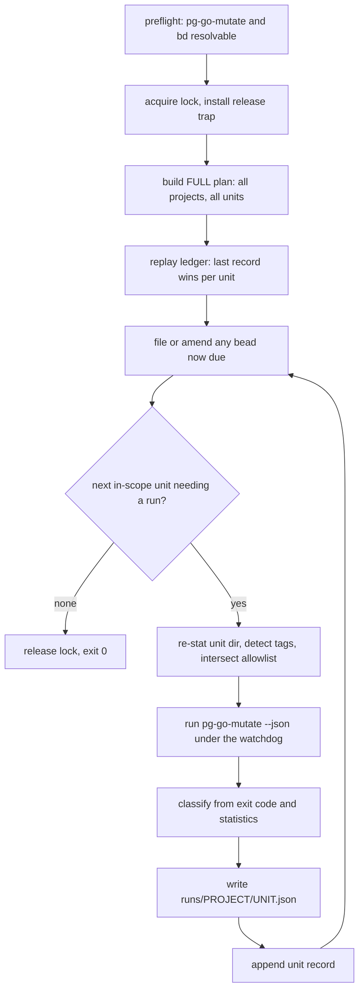

# pg-go-mutate-sweep — resumable unattended mutation sweep

Bead: `pg2-l36xv`. Prerequisite: `pg2-un41a`.

Companion to `2026-08-14-pg-go-mutate-design.md`, which specifies the single-target
diagnostic this tool drives. Read that spec's sections 5 (Architecture), 6 (CLI contract)
and 11 (Testing) first; this document does not restate them. This work EXTENDS that spec's
exit-status contract additively — see section 7.1.

## 1. Problem

`pg-go-mutate` analyses ONE target. Covering a workspace means invoking it once per
package, and the cost per invocation is roughly `mutants x the package's test-suite
runtime` — so the work is long, uneven, and cannot be held in one sitting.

Measured on this workspace 2026-08-17, with all six repos clean on their primary branches:

- `pb` (13 non-test `.go` files, 8 package dirs) took **38 minutes** — its suite runs
  roughly 30s per mutant.
- The large modules are far heavier: `pa-monitor` carries 1099 test functions across 37
  package dirs with 22 `time.Sleep` call sites, `pn` has 90 `exec.Command` call sites in
  its tests, `claude-extended-tool-approver` has 1087 test functions across 38 package
  dirs.

Three failures follow from running that by hand, and all three were observed:

1. **Output is lost.** A full sweep's results were written to a session-scoped scratchpad
   and destroyed when that directory was reclaimed two days later. The analysis had to be
   redone from scratch.
2. **A whole-module invocation is the wrong unit.** The `go-test-gaps` skill states it
   directly: never point the tool at a whole large module. A sweep that does so cannot be
   interrupted usefully, because nothing partial is retained.
3. **Tag-gated packages are silently mis-reported.** `pg-go-mutate` REPORTS unsatisfied
   custom tags but does not apply them, so mutants covered only by a tag-gated test appear
   as survivors. Across 16 projects an operator forgets which packages those are. The fix
   is to RECORD the withheld set per unit, not to apply tags blindly — see section 5.5.

## 2. Goals

- **G1** Analyse every Go package in the workspace, one `(project, package)` unit at a
  time, strictly serially.
- **G2** Survive interruption AND correction. A re-run MUST make forward progress, and a
  unit whose recorded outcome was transient MUST be re-attemptable without hand-editing
  state.
- **G3** Persist every unit's worklist somewhere no session teardown can reclaim.
- **G4** Run unattended: no prompt, and a unit's RECORDED failure MUST NOT abort the sweep.
- **G5** Never let a tag-gated package masquerade as a clean one: detect each unit's
  unsatisfied custom tags and RECORD them, so the triage step knows which survivors are
  unanalysed. Applying a tag is opt-in (5.5).
- **G6** On finishing a project, file ONE bead carrying that project's findings plus the
  triage protocol needed to turn them into focused fix beads.

## 3. Non-goals

Load-bearing prohibitions, not preferences. They restate the `go-test-gaps` skill's
non-goals and the operator ruling recorded in `pg2-xulhg`.

- **N1** The tool MUST NOT record any mutant or survivor COUNT into the LEDGER or into a
  BEAD, and MUST NOT create a time series of such counts. This is the score prohibition,
  scoped to what it protects. Explicitly PERMITTED: the per-unit report artifact, which is
  overwritten in place and never versioned, timestamped or rotated (6.4); a tally of UNITS
  by status, which counts units and not mutants; and the `go-test-gaps` skill's own
  published prior-art figures quoted as prose. The claim is that THE TOOL creates no
  series — a user-level backup of the state root is outside its control.
  Note the engine's own JSON renderer already deletes `mutationScore`, so the score is not
  in the artifact either.
- **N2** The tool MUST NOT be added to CI, a git hook, or a `checks.*` derivation that
  performs a mutation run. Its own bats suite (hermetic, stubbed) MAY be a `checks.*` entry.
- **N3** The tool MUST NOT gate anything. It is a diagnostic driver.
- **N4** No scheduling. No cron, no launchd timer, no `--watch`. The operator re-runs it.
- **N5** The tool itself MUST NOT modify the repositories it analyses; it writes only under
  its own state directory and to beads. This is NOT an absolute claim about the ENGINE:
  gomu drops a compile artifact named after the directory INTO the target tree for every
  `main` package, and `pg-go-mutate` removes only those it created, keyed on a pre-run
  snapshot. Two consequences MUST be documented: a hard kill leaks those artifacts, and a
  binary built by a human or peer agent DURING a unit is absent from the snapshot and will
  be deleted. Do not run the sweep concurrently with builds in the same tree.

## 4. Architecture

| Unit                      | Responsibility                                                                                                                                                            |
| ------------------------- | ------------------------------------------------------------------------------------------------------------------------------------------------------------------------- |
| `pg-go-mutate-sweep.bash` | Plan enumeration, ledger read/append, lock acquisition/reclaim, status classification, bead-due predicate. Filesystem-effecting helpers, testable with no engine present. |
| `pg-go-mutate-sweep.sh`   | Argument parsing, help, preflight, the drive loop, bead emission.                                                                                                         |
| `pg-go-mutate-lib.bash`   | REUSED, not reimplemented. Supplies tag detection.                                                                                                                        |

The ledger is an **append-only log** and all resumable state is derived by **replaying** it
— last record wins per unit key. The tool holds no other state, so there is nothing to
reconcile after a crash. Both the skip decision and the bead-due decision are replay
PREDICATES, never in-loop events; 6.3 explains why that distinction is the difference
between a correct resume and a lost project.

The drive loop MUST capture the engine's exit status without tripping the builder-injected
`set -euo pipefail` — `rc=0; pg-go-mutate … || rc=$?` — because G4 requires a failing unit
to continue. The library's own comments flag errexit as the recurring trap here.



## 5. The unit, and how units are discovered

Nothing is hardcoded; a stale list is the defect this avoids.

### 5.1 Projects and the project key

A project is a directory containing a `go.mod`, found under the workspace root
(`PN_WORKSPACE_ROOT`, or `--root`), excluding `.git`, `vendor`, `node_modules`,
`.worktrees`, `.workforests`, and any path under `fixtures` or `testdata`.

Each exclusion is load-bearing: without the `fixtures` prune the count rises from 16
projects to 19 deliberately-broken fixture modules; `.workforests/` holds full duplicate
checkouts of every repo; and `packages/jsonl-log-parser/node_modules/…/golang/pkg/flatted`
contains a `.go` file that is harmless today only because no `go.mod` sits above it.

**The project key is the workspace-root-relative path** — e.g.
`phillipgreenii-nix-agent-support/packages/pb`, not the basename `pb`. A basename is not
unique across six repos. The key's slug (5.6) names its `runs/` subdirectory, and the repo
label used on its bead (section 10) is the key's FIRST path component.

### 5.2 Packages

Candidates are scoped to their project's subtree. A candidate dir directly contains at
least one non-test `.go` file, and the SAME exclusion set as 5.1 applies — a dir under
`testdata/`, `vendor/` or `node_modules/` is never a candidate. That makes no difference to
today's count, but the first `.go` file added under a `testdata/` dir would otherwise become
a unit `go list` refuses to enumerate.

From that set, the tool MUST drop any dir nested under another candidate dir:
`pg-go-mutate` walks its PATH argument RECURSIVELY, so an ancestor's run already covers its
descendants. Measured: 233 candidate dirs, 17 nested, leaving **216 units**.

### 5.3 Subtree units, and the one pathological case

A non-leaf unit is a directory SUBTREE, not one package. This MUST be documented in
`--help`, and sizes MUST NOT be asserted without measurement. Measured 2026-08-17, the
largest is `phillipg-nix-repo-base/modules/pn/internal/workspace`: **62 non-test `.go`
files, 10,937 non-test LOC, 615 test functions** — next largest is 5,507 LOC. For scale,
`modules/jira` at 849 non-test LOC produced roughly 443 mutants.

**More wall clock cannot make this unit meaningful, and the spec must not pretend it can.**
The subtree contains `internal/workspace/smoke/`, where all six files carry
`//go:build smoke` — including three NON-test files. A `./...` pattern silently SKIPS a
package with no buildable files rather than failing, so the parent unit passes both guards
while those three files are mutated with no test visibility at all. That yields unkillable
"survivors", which is the false-gap class this tool exists to prevent.

So the disposition is explicit rather than aspirational:

- Subtree units are ordered LAST within their project (5.4), so cheap leaves bank findings
  first.
- A unit exhausting the watchdog records `timeout`, which is in the transient retry cohort
  (7.2), so it is never a permanent verdict.
- This particular unit needs the `smoke` tag applied, not more time. It is therefore
  operator work: `--redo <key> --auto-tags smoke --unit-timeout <large>`, run deliberately.
  Its `tags_withheld` record is what tells the triage step not to trust it meanwhile.

An automatic size threshold is rejected: another number to rot, and the measured facts plus
a transient status already give the operator what it would.

### 5.4 Ordering

Projects ascending by candidate-dir count, then by key. Within a project, leaf units
lexicographically, then subtree units lexicographically. Deterministic, which is what makes
resume stable.

Note the limit of "cheap first": three projects (`claude-transcript`, `pg-pr-zr`,
`pa-monitor-decorator-scope`) have exactly one candidate dir, so their single unit IS the
whole module and sorts first globally. Their measured sizes are modest (1181 / 533 / 211
non-test LOC), so this is a scoping caveat, not a risk.

### 5.5 Build tags — detect and record; apply only on request

Detection MUST use `pgm_detect_tags` from `pg-go-mutate-lib`; the tool MUST NOT scan
`//go:build` itself. That function's header records why a naive scan is wrong: it fires on
`linux`, `darwin`, `cgo` and `go1.24`, which the build context already satisfies. A tag is
custom-and-unsatisfied exactly when it appears in a `//go:build` line of a file `go list`
does NOT see.

Three requirements its implementation imposes:

- **The path MUST be absolute and `cd`-normalised.** The function compares `find "$target"`
  output against `go list`'s `.Dir`-prefixed ABSOLUTE paths with `grep -qxF`. A relative
  target makes every comparison unequal, so every file counts as invisible and the function
  returns the union of ALL `//go:build` tokens — including the satisfied ones it exists to
  exclude. `pg-go-mutate.sh` avoids this only via `target="$(cd "$target" && pwd)"`.
- **Empty output is the normal case and MUST NOT be passed on.** The function prints nothing
  when there are no custom tags, and `pg-go-mutate` rejects an empty `--tags` with `exit 2`.
  `--tags` is appended only when the value to apply is non-empty.
- **`--auto-tags` MUST be validated at parse time** against `[A-Za-z0-9_][A-Za-z0-9_,.]*`,
  exiting 2. This is the only path by which an invalid tag can reach the engine, since the
  applied set is `detected ∩ allowlist`.

**The allowlist is EMPTY by default.** `--auto-tags <list>` opts in; there is no
`--no-auto-tags` because that is the default. The applied set is `detected ∩ allowlist`;
everything else is recorded in `tags_withheld`.

The reason is cost and gate-parity, NOT sandbox-hostility — an earlier draft of this spec
mis-cited ADR 0024 for the latter, and ADR 0024 says the opposite: the smoke suite's
tagged-out reason "turned out not to survive contact with measurement", its needs are modest
(~17s), and 43 of its 44 scenarios now run inside the build sandbox as the `pn-smoke-tests`
check. The `hostile` sanction traces to ADR 0021, not 0024.

The actual argument is arithmetic. A tag-gated suite runs once for the healthy precheck and
then ONCE PER MUTANT. At ~17s and a few hundred mutants that is hours for one unit, and the
suites in question drive real external state: `pb`'s `contract` tests "drive real bd/git
(and optionally pn)", `ccpool`'s `contract` harness needs `tmux`/`claude`/`sqlite3` and
builds-and-execs the binary — which gomu's `-overlay` never reaches, so its mutants are
meaningless anyway — and `pa-monitor`'s `hostile` suites spawn daemons, bind sockets and
recycle PIDs. No unattended gate sets any of these tags, and neither should this tool
without being asked. That reasoning applies equally to `contract`, which is why it is not a
default either.

Consequences that MUST be documented, because they differ by unit shape:

- **Leaf unit, all tests behind a withheld tag** — `pg-go-mutate`'s guards see no test files
  (GOFLAGS is exported before them), so the unit classifies `no-tests` or `unhealthy`. That
  is correct reporting.
- **Subtree unit containing a fully-gated package** — the guards pass and the gated files are
  mutated with no test visibility, producing unkillable survivors (5.3). This is NOT correct
  reporting, so the unit record MUST carry the withheld set and the triage protocol MUST
  treat its survivors as unanalysed (section 10, item 6).

## 6. Durable state

Root: `${XDG_STATE_HOME:-$HOME/.local/state}/pg-go-mutate-sweep/`, matching the workspace's
existing XDG convention. Outside any session-scoped directory — G3 exists because a
scratchpad reclaim destroyed a full sweep.

```text
ledger.jsonl                          append-only, one record per attempt
runs/<project-slug>/<pkg-slug>.json   the unit's worklist, overwritten in place
lock/                                 lock directory, stamped with PID and start time
```

### 6.1 Keys and slugs

The **unit key** is `<project-key>#<pkg-path>` — e.g.
`phillipgreenii-nix-agent-support/packages/pb#internal/gate`. `#` is the separator because
it cannot occur in either component, so the key parses unambiguously even though both halves
contain `/`. `--redo` takes this key verbatim.

A **slug** is its component with `/` replaced by `__`, used only for filesystem paths. Slugs
are not injective, so the tool MUST detect slug collisions at PLAN time and abort with
`exit 2` naming both paths, rather than overwrite one unit's report with another's. The
check covers project slugs and package slugs. No collision exists today; the check keeps it
that way.

### 6.2 Records

One JSON object per line, discriminated by `kind`. A **unit** record is appended per
ATTEMPT, not per unit — a retry appends another:

```json
{
  "kind": "unit",
  "unit": "…/packages/pb#internal/gate",
  "project": "…/packages/pb",
  "pkg": "internal/gate",
  "status": "done",
  "exit": 0,
  "tags_applied": "",
  "tags_withheld": "contract",
  "finished": "2026-08-17T11:17:03-04:00",
  "report": "runs/…__packages__pb/internal__gate.json"
}
```

A **bead** record is appended immediately after its bead is filed or amended:

```json
{
  "kind": "bead",
  "project": "…/packages/pb",
  "bead": "pg2-3udx3",
  "action": "filed",
  "finished": "2026-08-17T11:20:11-04:00"
}
```

`tags_applied` / `tags_withheld` are provenance, not metrics (N1): a unit analysed without
its `contract` tag is not comparable to one analysed with it. No mutant count appears on
either record.

A reader MUST filter on `kind`; building the unit set from unfiltered lines would trip over
bead records. A truncated trailing line from a `kill -9` MUST be tolerated — parse per line,
ignore an unparseable final line.

### 6.3 Replay: last record wins, and two predicates

Replay keeps the LAST record per unit key. Set-membership replay is rejected: with terminal
statuses it makes one transient failure a permanent verdict.

**The FULL plan is always enumerated**, and `--only` filters the RUN list, never the plan.
Predicate 2 needs each project's complete unit set, so a scoped run must still be able to
notice that an out-of-scope project was completed by an earlier crashed run.

**Predicate 1 — does this unit need a run?** By default NO if it has any record, so a re-run
always makes forward progress and never loops on a broken unit. `--retry <status>[,...]`
re-attempts units whose last record carries one of those statuses; `--retry transient` is
shorthand for the transient cohort (7.2). `--redo <key>` re-attempts one unit. All append.

**Predicate 2 — is a project's bead due?** YES when every unit of that project has a record
AND either no `{"kind":"bead"}` record exists for it, or some unit record for it is NEWER
than the latest bead record. Evaluated by replay — at startup and after each unit record —
never as an in-loop "was that the last unit?" event.

Both halves matter:

- The event form loses a project. If the process dies after the last unit's record is
  appended but before `bd create`, a resumed sweep runs zero units for that project, never
  reaches the event, and the findings are never filed. The predicate form files it on the
  next invocation with no units left to run.
- The newer-record clause makes a filed bead AMENDABLE. Without it, a project whose units
  all failed gets a bead full of failures, and the worklists a later `--retry` produces can
  never reach any bead. On the second firing the tool adds a `bd comment` recording what
  changed rather than filing a duplicate bead, and appends a bead record with
  `"action":"amended"`.

Ordering is check, then `bd create`/`bd comment`, then append the bead record. A crash in
that window re-files or re-comments on the next run — a visible duplicate. The reverse order
would silently lose a project's findings, which is not visible.

A bead-filing failure is LOGGED and does NOT abort the sweep (G4); the bead record is
appended only on success, so the next run retries it. The bead id MUST be captured
machine-readably (`bd create --silent` prints the id alone).

`--no-beads` MUST record a `{"kind":"bead","action":"suppressed"}` marker per completed
project. Without it, a `--no-beads` sweep leaves predicate 2 true for all 16 projects and
the next ordinary invocation files 16 beads at once against artifacts of arbitrary age.

A project with ZERO units satisfies predicate 2 vacuously. None exists today (minimum is 1),
but the tool MUST skip a zero-unit project rather than file an empty bead.

### 6.4 The report artifact: one JSON per unit

The sweep MUST invoke `pg-go-mutate --json` and store the result at
`runs/<project-slug>/<pkg-slug>.json`.

This is forced, not stylistic. `pg-go-mutate` emits the human worklist OR the JSON one, never
both, and its `trap 'rm -f -- "$report"' EXIT` deletes the harvested engine report — so a
single invocation cannot yield both a human worklist and the statistics section, and running
twice would double the cost of the most expensive operation in the tool. JSON is the correct
choice of the two: it carries `survivors` (the actionable worklist, per file/line/operator),
`statistics` (which 7.3 needs), and `buildTagsNotRun`, and its renderer already deletes
`mutationScore`. Scraping counts out of the human renderer's prose is the coupling section 14
rejects.

The file is overwritten in place on every attempt and never versioned, timestamped, rotated
or accumulated. That is what keeps N1 true in substance: a directory of per-attempt
snapshots would be a count series, whereas one current file per unit cannot form one.

The record is appended only AFTER the report is written, so a unit is never marked complete
with no artifact behind it.

### 6.5 Locking

`flock(1)` is absent on darwin (verified), so the lock is a directory created with `mkdir`,
atomic on APFS, stamped with the holder's PID and start time.

Stale reclaim MUST be atomic and MUST NOT be a plain `mv`: with a leftover
`lock.stale.<pid>` directory from an earlier reclaim, `mv lock lock.stale.$$` moves `lock`
INSIDE it and still returns 0, so "proceed only if the rename succeeded" stops meaning what
it says. Use `mv -T` (coreutils is a runtimeDep) against a `mktemp -d`-unique destination.
Exactly one racer can win an atomic `rename(2)`; the losers see ENOENT and refuse.
Read-then-act reclaim is rejected — two sweeps would both read the same dead PID and both
proceed, defeating G1.

The reclaimed directory MUST be removed after a successful reclaim; nothing else would ever
clean it up, and its accumulation is what creates the `mv` collision above.

The lock MUST be released on EVERY exit path via an EXIT/INT/TERM trap, not only the happy
one. The lock is taken before the plan is built, so a slug-collision `exit 2`, a fatal
abort, or a signal would otherwise leave it held and force `--force-unlock`.

Because PIDs are recycled on a machine running long-lived agent sessions, a live-looking PID
MUST NOT be the only escape: `--force-unlock` is required. A refused acquisition exits `3`
and names the holder.

## 7. Status taxonomy

### 7.1 This work extends pg-go-mutate's exit contract

The statuses below are not observable today: `pg-go-mutate` collapses every guard failure
into `exit 1` and reserves `2` for usage errors. Classifying by string-matching another
script's interpolated prose was considered and rejected as unversioned coupling.

Operator ruling, 2026-08-17: **allocate distinguishing exit codes in `pg-go-mutate`.**

| Code | Meaning                                                                          |
| ---- | -------------------------------------------------------------------------------- |
| `0`  | Analysis completed. Unchanged.                                                   |
| `1`  | Operational failure not covered below. Unchanged.                                |
| `2`  | Usage or flag error. Unchanged.                                                  |
| `10` | Target has no test files (`pgm_has_tests` = 1).                                  |
| `11` | Target not enumerable (`pgm_has_tests` = 2).                                     |
| `12` | Target unhealthy: does not vet, or tests already fail on unmutated source.       |
| `13` | Environment precondition failed: `go` or the pinned engine absent or mismatched. |
| `14` | Target path is absent or not a directory.                                        |

The change is strictly ADDITIVE: 10–14 are unused today, and every existing consumer asserts
only the 0/non-zero dichotomy — all guard-failure bats cases use `-ne 0`, the only `-eq 2`
cases are `--tags` flag errors, and `pg-go-mutate.md`, the `go-test-gaps` skill and the
companion spec's C2/C3 all pin only "non-zero means the run failed". So nothing breaks.

What IS required, and what an earlier draft got backwards, is that there are no "affected"
cases to amend — there are MISSING ones to add. New bats cases MUST assert `-eq 10/11/12/13/14`
for those arms, tightening the existing `-ne 0` assertions. Without them nothing in the repo
pins the codes this sweep's entire taxonomy reads. `pg-go-mutate.md`'s exit contract and the
companion spec's exit-status paragraph MUST be amended in the same change.

Codes `13` and `14` exist for the sweep specifically:

- `13` fails IDENTICALLY for all 216 units, so the sweep MUST abort rather than record 216
  failures.
- `14` separates "the target vanished" from "the sweep built a malformed invocation".
  `pg-go-mutate` currently exits `2` for "is not a directory", which over a multi-hour
  unattended sweep in a live workspace — where N5 already warns about concurrent activity —
  would let one branch switch abort everything. The sweep MUST additionally re-stat the unit
  directory immediately before invoking.

### 7.2 Statuses and the retry cohorts

| Status           | Source                                          | Cohort    |
| ---------------- | ----------------------------------------------- | --------- |
| `done`           | exit 0, timed-out fraction under threshold      | settled   |
| `no-tests`       | exit 10                                         | settled   |
| `not-enumerable` | exit 11                                         | transient |
| `unhealthy`      | exit 12                                         | transient |
| `vanished`       | exit 14, or the pre-invocation re-stat failing  | transient |
| `inconclusive`   | exit 0, timed-out fraction over threshold (7.3) | transient |
| `timeout`        | watchdog 124                                    | transient |
| `failed`         | exit 1, or any other unexpected code            | transient |

The cohort partitions what `--retry transient` re-attempts. It is a real partition, unlike an
earlier draft's "resume default" column in which every row read the same and therefore carried
no information — and on which 5.3 and 13 both leaned as if it distinguished `timeout` from
`done`.

By default NO status is re-attempted (predicate 1); the cohort only names what
`--retry transient` selects. `settled` means a re-attempt is unlikely to differ, not that the
verdict is permanent — `--retry` and `--redo` reach every status.

`not-enumerable` and `unhealthy` are what a real run hits: `pg-pr-zr` reported `the target
does not vet cleanly on unmutated source` because a `replace` target was absent (bead
`pg2-01nc5`). Recording that distinctly, rather than as "no gaps", is the point.

An engine `exit 2` is a SWEEP BUG — a malformed invocation — and MUST abort with the fatal
code (section 8), not record a status.

### 7.3 The all-timed-out false clean

Without this the worst outcome is silent. `pg-go-mutate`'s per-mutant test timeout defaults
to 60s and `pb`'s suite already runs ~30s per mutant. When every mutant times out the report
still passes `pgm_report_sane` — `totalMutants > 0` holds, the not-viable fraction is low, and
the all-killed trap does not fire because `killed` is 0 — so the CLI exits 0 and the worklist
is empty. That is indistinguishable from a well-tested package.

So: `--mutant-timeout <sec>` passes through to `pg-go-mutate --timeout`, and a run whose
timed-out fraction exceeds the threshold classifies `inconclusive`, not `done`.

The fraction is computed from the `--json` artifact (6.4) as
`timedOut / (killed + survived + notViable + timedOut + errors)`. The denominator is summed
from the buckets because `pgm_worklist_json` does not carry a total. The value is used
transiently to classify one unit and MUST NOT be written to the ledger (N1).

### 7.4 The watchdog

`--unit-timeout` MUST be enforced by `timeout --kill-after=<grace> <sec> …`, WITHOUT
`--foreground`, and `--unit-kill-grace` MUST exist to set the grace.

`--foreground` is specifically wrong here: it exists so a command run from a shell prompt can
read the TTY, and in that mode `timeout` does not put the child in its own process group, so
children of the command are NOT timed out. An earlier draft specified it while asking for a
subtree kill — the opposite of what it does, and it would have re-opened the very leak the
watchdog exists to close. Default (non-foreground) behaviour signals the child's process
group, which is what is wanted.

The leak is real. `pg-go-mutate` installs INT/TERM/HUP handlers only inside `pgm_run_engine`.
A TERM during `pgm_tests_healthy`'s `go vet ./...` / `go test -count=1 ./...` — where a slow
unit spends much of its wall clock — hits no handler, so the wrapper dies and its `go`
children survive. Across 216 unattended units that is a process leak, not a curiosity.

Classification MUST key on `timeout(1)`'s own **124**, never the child's message: when TERM
lands inside `pgm_run_engine` the handler's cleanup removes the workdir, so `wait` yields 143,
the report is gone, and the CLI reports `the engine produced no report (exit 143)` and exits 1
— byte-identical to a genuine failure. Note **137 is NOT a timeout**: `timeout` returns 124
whether or not it escalated to KILL, and 137 means `timeout` itself was killed (e.g. OOM), so
137 MUST classify `failed`.

The sweep MUST also install its own INT/TERM handler that kills the child's process group, so
an operator Ctrl-C propagates rather than orphaning the engine.

## 8. CLI contract

```text
pg-go-mutate-sweep [OPTIONS]

  --root <dir>            Workspace root. Default: PN_WORKSPACE_ROOT, else cwd.
  --only <project>        Restrict the RUN list to one project (repeatable). Plan is always full.
  --unit-timeout <sec>    Per-unit wall-clock cap. Default 3600.
  --unit-kill-grace <sec> Grace before escalating to KILL. Default 60.
  --mutant-timeout <sec>  Passed to pg-go-mutate --timeout. Default 60.
  --workers <n>           Passed to pg-go-mutate --workers. Default 2.
  --auto-tags <list>      Tags eligible for automatic application. Default: none.
  --retry <spec>          Re-attempt units by status, or 'transient' for the cohort.
  --redo <key>            Re-attempt one unit, keyed <project-key>#<pkg-path>.
  --dry-run               Print the plan, resume position and any bead due. Runs nothing.
  --no-beads              Analyse and record; file no beads (records a suppressed marker).
  --force-unlock          Break a lock whose holder is gone or wedged.
  -h, --help              Show help.
  -v, --version           Injected by the builder. Never hand-written.
```

**Preflight** is `command -v pg-go-mutate` and `command -v bd`, and nothing more. It
deliberately does NOT verify the engine pin: `PG_GO_MUTATE_GOMU` and
`PG_GO_MUTATE_GOMU_VERSION` are set only inside `pg-go-mutate`'s own wrapper, and `gomu` is
not on PATH, so a sweep-side engine check would resolve a bare `gomu`, fail always, and check
the wrong binary. The pin is delegated to the first unit's `13` abort, which is what code 13
is for.

Exit status:

| Code | Meaning                                                               |
| ---- | --------------------------------------------------------------------- |
| `0`  | Sweep completed, or had nothing left to run.                          |
| `2`  | Usage error, or a plan-time defect such as a slug collision.          |
| `3`  | Another sweep holds the lock.                                         |
| `4`  | Fatal abort mid-sweep: engine `13`, engine `2`, or preflight failure. |

`2` is deliberately narrower than "usage or guard error" — `pg-go-mutate` uses `2` for flag
errors only, and its guard failures are per-unit statuses, not sweep exits. A unit's RECORDED
failure never affects the sweep's exit status (G4); a FATAL abort does, via `4`.

## 9. Engine and bd acquisition

Both `pg-go-mutate` and `bd` MUST be resolved from `PATH` and MUST NOT be `runtimeDeps`.

The mechanism is easy to state backwards. `mkBashScript` appends `runtimeDeps` with
`--suffix PATH`, i.e. as a FALLBACK after the caller's PATH, so an ambient tool already wins
— listing them could not displace the machine's wrapper. The real hazard is the opposite: a
`runtimeDeps` entry would provide a SILENT FALLBACK to an unwrapped `pg-go-mutate` or an
unmanaged `bd` when the wrapped one is absent. The unwrapped script accepts whatever `gomu`
is on PATH, including an unattributable `gomu version dev` build (bead `pg2-afk4p`), and a
`bd` from outside the machine wrapper loses `BEADS_DOLT_AUTO_START=0` and can spawn a
competing dolt server on port 25252. With no fallback, the preflight fails loudly instead.

`pg2-un41a` is therefore a hard prerequisite, wired as a blocking edge: no consumer currently
imports `homeModules.pg-go-mutate`, so the command does not exist on this machine.

> Operator ruling, 2026-08-17: asked whether this section should instead be written
> indifferently, so that `pg2-afk4p`'s parked work making the UNWRAPPED package self-assert
> would satisfy it too, the operator ruled **"Spec assumes the wrapper only"** — keep PATH
> resolution of the wrapped binary and keep `pg2-un41a` as a hard prerequisite including the
> apply, accepting that the prerequisite may later prove unnecessary. This is an EXECUTED
> DECISION; do not re-derive it from `pg2-afk4p`'s existence.

## 10. The per-project triage bead

Filed — or amended — when predicate 2 (6.3) says it is due. One per project, 16 total.

- Type `task`, priority `P3`, labels `go-test-gaps` plus the repo label, which is the first
  path component of the project key (5.1).
- NEVER an epic: an open epic sits in `bd ready` permanently.
- Body: the `runs/<project-slug>/` artifact paths, a tally of that project's units by status,
  the applied and withheld tag sets, and the protocol below.
- Acceptance: focused fix beads exist for the worthwhile clusters, and this bead can close.

The body MUST carry the protocol, because the bead will be handed to a session with none of
this context:

1. Start with error paths. The `go-test-gaps` skill records that across a sixteen-module
   measurement `err != nil` mutated to `false` survived 70 times and `error_nilify` survived
   44 of 48 completed cases. Quoting the skill's published figures as prose is permitted by
   N1; deriving new counts from this sweep's runs is not.
2. Prefer DUPLICATED unasserted code. The two highest-value findings of the manual campaign
   were extraction opportunities, not missing tests: a 64KB-overflow scanner buffer duplicated
   at six sites in `claude-transcript` where no test read a line over 64KB (`pg2-j54i7`), and
   a `newFileLogger` duplicated in two support-apps binaries with zero test references
   (`pg2-70l4r`). One test against one extracted helper kills mutants at every site.
3. Cite `file:line:operator` concretely. "Add more tests" is not actionable.
4. Deprioritise explicitly. The `==` to `<=`/`>=` family on STRING equality is a weak mutant:
   killing it needs an input differing only in lexicographic order. Record the judgement.
5. Verify per mutant on `file:line:type`. Survivor totals move by a mutant or two between runs
   on identical source, so a count dropping by one is indistinguishable from noise.
6. Check `tags_withheld` FIRST. A leaf unit whose tests are all behind a withheld tag will
   read as `no-tests`/`unhealthy`; a SUBTREE unit containing a fully-gated package passes the
   guards and yields unkillable survivors (5.3). In both cases those survivors are UNANALYSED
   and MUST NOT be filed as gaps until re-run with `--auto-tags` widened deliberately.

## 11. Nix wiring

A new PUBLIC command inside the EXISTING module. Not a new module.

```text
modules/pg-go-mutate/
├── lib/                          # unchanged; now consumed by two scripts
├── pg-go-mutate/                 # AMENDED: exit codes (7.1)
├── pg-go-mutate-sweep/
│   ├── default.nix               # mkBashScript, libraries = [ pg-go-mutate-lib ]
│   ├── pg-go-mutate-sweep.sh
│   ├── pg-go-mutate-sweep.bash
│   ├── pg-go-mutate-sweep.md     # tldr page
│   ├── completions/{pg-go-mutate-sweep.bash,_pg-go-mutate-sweep}
│   └── tests/{test-pg-go-mutate-sweep.bats,test-pg-go-mutate-sweep-lib.bats}
└── scripts.nix                   # += callPackage, inherit, allScripts, check
```

`runtimeDeps` = `jq findutils gnused gnugrep coreutils`, mirroring the sibling command
because both consume the same library. Three deliberate exclusions:

- **NOT `gawk`.** `awk` is used by `pgm_has_tests`, which the sweep does not call (14). The
  sibling's missing `gawk` is a real pre-existing gap for `pg-go-mutate` itself, but fixing it
  there is a separate concern and MUST NOT be smuggled in as a claim about this command.
- **`go` belongs in `testDeps`, not `runtimeDeps`**, matching the sibling, which requires an
  ambient toolchain via `pgm_require_go`. In `runtimeDeps` it is inert today, but if it ever
  won it would run `pgm_detect_tags` under a different toolchain than the analysis, changing
  which `go1.NN`-gated files are visible.
- **NOT `pg-go-mutate`, NOT `bd`** (section 9).

Five wiring sites, all required:

1. `modules/pg-go-mutate/scripts.nix` — `callPackage`, **the `inherit` list** (currently
   `inherit pg-go-mutate-lib pg-go-mutate;`; site 2 reads
   `pgGoMutateScripts.pg-go-mutate-sweep`, which does not exist until it is added there), the
   `allScripts` list, and the check. `packages`/`tldr`/flake `checks` then flow automatically.
2. `flake.nix` `packages` — `pg-go-mutate-sweep = pgGoMutateScripts.pg-go-mutate-sweep.script;`
3. `flake.nix` `overlays.default` — add to the `inherit` list, or
   `mkPackageOption pkgs "pg-go-mutate-sweep"` is unresolvable in a consumer.
4. `home/pg-go-mutate/default.nix` — a second `mkPackageOption`, its own `home.packages`
   entry, AND its own `programs.tldr.customPages.pg-go-mutate-sweep`. That module holds
   `home.packages = [ wrapped ]` where `wrapped` is a `symlinkJoin` over ONE package whose
   `postBuild` hard-codes `wrapProgram $out/bin/pg-go-mutate`; there is no `packages` list to
   extend. The sweep needs no wrapper (9), so it goes alongside `wrapped`, not inside it.
   Omitting the tldr entry means the page reaches nobody, as that module's own comment warns.
5. The `pg-go-mutate` exit-code amendment (7.1), including its new bats cases.

Source files follow the framework: no shebang, no `set -euo pipefail`, opening
`# shellcheck shell=bash`, no hand-written `--version`, no `excludeShellChecks`.

## 12. Testing

Hermetic and runnable as `bats tests/` with no nix build.

**Isolation is not just `HOME`.** `XDG_STATE_HOME` is EXPORTED in this environment
(`/Users/phillipg/.local/state`), and the state root reads it first (6), so a test overriding
only `HOME` would append to the operator's real `ledger.jsonl` and contend for the real lock.
Every test MUST set `XDG_STATE_HOME` and `HOME` into its `mktemp -d`, and one test MUST assert
the tool honours `XDG_STATE_HOME`. There is in-workspace precedent for this exact trap
(`pa-monitor/cmd/pa-monitor/wait_test.go` notes setting all three is load-bearing).

**Library unit tests:**

- Discovery honours every 5.1/5.2 exclusion including `testdata` and `node_modules`, and
  candidates are scoped to a project subtree.
- Nesting exclusion drops descendants; a dir with only `_test.go` files is not a candidate.
- Ordering is deterministic, cheap-project-first, subtree units last.
- Unit keys round-trip: `<project>#<pkg>` parses back to both halves when both contain `/`.
- Slug collision is DETECTED and aborts, fixtured with `a/b__c` and `a__b/c`, for project
  slugs as well as package slugs.
- Replay is last-record-wins: a `failed` record followed by `done` for the same unit resolves
  to `done`. A truncated final line is tolerated.
- Predicate 2: true when all units recorded with no bead record; false once a bead record
  exists; TRUE again when a unit record is newer than the bead record (the amend path); TRUE
  on a fresh invocation that runs zero units (the lost-project regression); evaluated for a
  project excluded by `--only`; a `suppressed` marker keeps it false.
- Tag gating: applied set is `detected ∩ allowlist`, empty by default; an empty applied set
  yields NO `--tags` argument; an invalid `--auto-tags` exits 2.
- `pgm_detect_tags` receives an absolute path. The fixture MUST contain a file with a
  SATISFIED constraint (`//go:build darwin`) beside a custom-tag file, because the defect is
  that the relative form returns EXTRA tags — without that file the test passes either way.
- Lock: acquisition; refusal against a live PID; atomic reclaim of a stale one; a leftover
  `lock.stale.*` does not corrupt the reclaim (the `mv -T` case); the reclaimed dir is removed;
  the loser of a reclaim race refuses.
- Classification maps 0/1/2/10/11/12/13/14/124/137 to the right status or fatal abort, with
  137 mapping to `failed` and NOT `timeout`.

**Script integration tests** with Test Doubles for `pg-go-mutate` and `bd` on `PATH`:

- Unit order matches the plan; `--dry-run` runs nothing and reports the resume position.
- A stub exiting non-zero records a status and the sweep CONTINUES (the errexit regression).
- A stub exiting 13 or 2 aborts with exit 4; a stub exiting 14 records `vanished` and continues.
- A stub whose JSON reports a high timed-out fraction yields `inconclusive`, not `done`.
- The watchdog kills the SUBTREE: a stub that spawns a grandchild outliving it must leave no
  grandchild alive once the unit times out. This is the test that would have caught
  `--foreground`.
- Killing the run mid-sweep and re-invoking resumes correctly and redoes nothing.
- The `bd` stub is invoked once per project, not again after a resume, IS invoked by a resumed
  run with no units left, and is invoked as `bd comment` after a `--retry` produces a newer
  record.
- A failing `bd` stub does not abort the sweep and leaves no bead record.
- `--no-beads` files nothing and records a suppressed marker.
- The lock is released after a slug-collision `exit 2` and after a fatal abort.

Mocks live in a `mktemp -d` OUTSIDE any git working tree. No test asserts `--version`.

## 13. Risks

| Risk                                                                             | Mitigation                                                                                                                                                    |
| -------------------------------------------------------------------------------- | ------------------------------------------------------------------------------------------------------------------------------------------------------------- |
| A unit runs unboundedly.                                                         | Process-group watchdog without `--foreground` (7.4); `timeout` is in the transient cohort.                                                                    |
| A slow suite reports a false clean.                                              | `--mutant-timeout` plus `inconclusive` from the JSON statistics (7.3).                                                                                        |
| Artifacts become a count series (N1).                                            | One JSON per unit, overwritten in place, never versioned or rotated (6.4); the ledger carries no counts; the engine's renderer already drops `mutationScore`. |
| A tag-gated suite runs per mutant.                                               | Allowlist empty by default; withheld set recorded and surfaced in the bead (5.5).                                                                             |
| The `modules/pn/internal/workspace` subtree unit is meaningless without `smoke`. | Measured and named (5.3); ordered last; transient status; explicit operator `--redo` with `--auto-tags smoke`.                                                |
| Engine artifacts leak into an analysed tree on a hard kill.                      | Documented in N5; do not run concurrently with builds in the same tree.                                                                                       |
| A package directory vanishes mid-sweep.                                          | Pre-invocation re-stat plus exit code 14 → `vanished`, not a sweep abort (7.1).                                                                               |
| Two sweeps race.                                                                 | Atomic `mv -T` reclaim, release trap on all paths, `--force-unlock` (6.5).                                                                                    |
| 16 triage beads swamp `bd ready`.                                                | P3, one shared label, never epics, each closes once its fix beads are filed.                                                                                  |

## 14. Rejected alternatives

- **A nix `checks.*` entry per package.** Forbidden by N2 and the `pg2-xulhg` ruling.
- **Parallel units.** Defeats G1 and makes load unpredictable on a machine running peer agent
  sessions. `--workers` already parallelises WITHIN a unit.
- **A naive `//go:build` scan for tags.** Wrong for the reasons `pgm_detect_tags` documents.
- **Applying detected tags by default.** Runs suites driving real bd/git/tmux/daemons once per
  mutant (5.5).
- **Classifying by string-matching pg-go-mutate's stderr.** Unversioned coupling to
  interpolated prose. Superseded by 7.1.
- **The sweep calling `pgm_has_tests`/`pgm_tests_healthy` itself** to see real return codes.
  `pgm_tests_healthy` runs `go vet ./...` AND `go test -count=1 ./...`, doubling the most
  expensive guard across all 216 units.
- **Storing the human worklist, or storing both renderings.** The CLI emits one or the other
  and deletes the harvested report, so "both" means running twice (6.4).
- **Set-membership replay with terminal statuses.** Makes one transient failure permanent (6.3).
- **An in-loop "last unit" bead trigger.** Loses a project's findings on resume (6.3).
- **`timeout --foreground`.** Does not group-kill; would guarantee the leak it was meant to
  prevent (7.4).
- **An automatic oversized-unit threshold.** Another number to rot (5.3).
- **State in the repo.** Commits machine-local progress; the artifacts are regenerable.
- **One rolling bead for the whole sweep.** A permanently-open catch-all. Operator chose 16.
- **A markdown handoff file instead of beads.** The workspace tracks work in beads.

## 15. Landing order

1. **ADR first.** Record the state-root layout, the ledger schema and unit-key format, the
   "one triage bead per project, never an epic" workflow rule, and the exit-code reallocation
   of a shipped public command. All four are compatibility surfaces, and this repo's own rule
   is to record an ADR before changing the area it covers. The section 9 operator ruling is
   already an executed decision and needs no ADR.
2. `pg2-un41a` — import `homeModules.pg-go-mutate`, set `enable = true`, **operator applies**.
   Until this lands the command does not exist and the sweep cannot run.
3. The `pg-go-mutate` exit-code amendment (7.1): `pg-go-mutate.sh`, NEW bats cases pinning
   10–14, `pg-go-mutate.md`'s exit contract, and the companion spec's exit-status paragraph.
4. The sweep itself: library, script, artifacts, tests, and all five wiring sites (11).
5. **A second operator apply.** Steps 3 and 4 change the installed `pg-go-mutate` and add a
   new command, and section 9 forbids `runtimeDeps` fallbacks — so nothing in step 7 can run
   until the amended tool and the sweep are both on PATH. This step is easy to forget and the
   sweep fails its preflight without it.
6. Amend this repo's `CLAUDE.md`. Its "Mutation testing" section is not wrong about exit 0 or
   about `pg-go-mutate` recording nothing — both remain true — but it now needs to describe the
   failure taxonomy and the existence of a recording sibling.
7. Verify: `bats tests/`, then `nix flake check`, then `--dry-run` against the real workspace
   to confirm the 216-unit plan and the slug-collision check.
8. First real sweep, unattended.

## 16. Open items for implementation

- The `inconclusive` threshold. A starting point is >50% of the summed buckets, mirroring
  `pgm_report_sane`'s not-viable heuristic, but it should be chosen against one real slow
  module rather than picked here.
- The exact `bd create` / `bd comment` invocations and body-file lifecycle. `--silent` gives
  the id; the amend path needs a comment body that says what changed since the last bead
  record.
- Whether `--only` should accept a unit key as well as a project key.
- Whether a `no-tests` or `unhealthy` unit should file its own bead immediately rather than
  waiting for the project's triage bead. Aggregating is the current intent.
