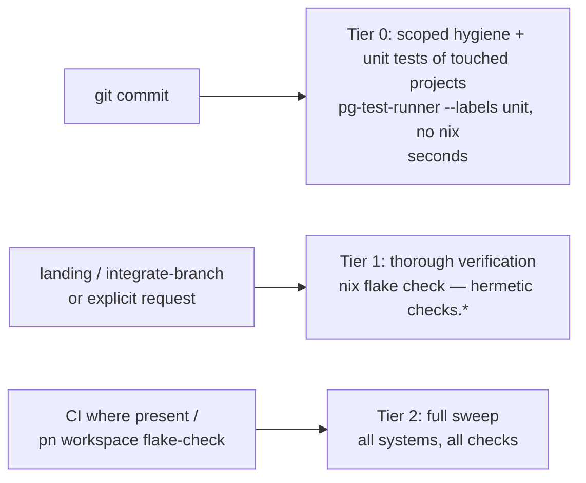

# pg-test-runner — Label-Driven Direct Test Runner

- **Date:** 2026-08-24
- **Motivating context:** the workspace git-hook speed evaluation
  (`~/phillipg_mbp/docs/2026-08-24-git-hook-speed-evaluation.md`) found that all commit/push
  slowness comes from hooks that run test suites as `nix build`s of whole-suite derivations.
  Operator direction (Phillip, 2026-08-24, this design session): pre-commit hooks MUST NOT invoke
  nix; each project MUST have a way to run its unit tests directly and quickly; smoke/integration
  tests are excluded from pre-commit; nix-managed tools MUST be available without running nix
  builds per commit. This design supersedes the evaluation doc's HK-2 blanket ban for the
  label-`unit` tier (see "Relationship to the evaluation doc" below).
- **Verified feasibility (2026-08-24):** a repo-base `mkBashScript` bats suite
  (`modules/ul/determine-ul-lib-dir/tests/`) passes when run directly against source with no nix
  invocation (~0.6s CPU for 6 tests). The bash-scripting skill already states the core principle
  "tests MUST work without nix build". bats 1.12 supports `--filter-tags` with `!` negation.
  No bats file in any of the six repos carries a tag today.

## 1. Test-kind definitions (normative, all languages)

These definitions classify by STRUCTURE (what a test needs), never by a stopwatch. A reader MUST
be able to classify a test by inspection.

- **`unit`** — exercises one unit of the project: a function, class, or script-function boundary.
  Collaborators are mocked or faked to isolate the unit under test. No shared context between
  tests, therefore parallel-safe and order-independent. Expected to be very fast. Strives for high
  completeness of the unit's behavior.
- **`integration`** — exercises interaction between higher-level components. MAY use shared
  fixtures, real collaborators, or require a specific ordering.
- **`smoke`** — end-to-end sanity of the assembled artifact.
- **`contract`** — drives real external systems (live Claude/bd/git/PagerDuty and similar; costs
  tokens, credentials, or money).

A test without a label MUST be treated as `unit`. This default is a safety net, not a steady
state: every suite SHOULD carry an explicit label (workstream 2). The vocabulary above is the
COMMON set — new labeling SHOULD use it for consistency — but it is not mechanically closed: the
runner treats labels as OPAQUE strings and passes unknown labels through to the per-language
selection mechanisms (section 2.1). A repo-specific label (e.g. the pre-existing Go build tag
`hostile`) therefore works without any runner change. The one obligation: every non-unit label
actually in use MUST be registered in the configuration's `nonUnitLabels` set, so the unit tier's
exclusion stays correct where the mechanism needs an enumerated negation (bats). In Go, any build
tag already disqualifies mechanically, registered or not.

Parallelism is a DERIVED property: because `unit` tests have no shared context by definition, the
runner MAY always parallelize the unit tier, and MUST NOT assume parallel safety for any other
kind (non-unit kinds run serially unless a suite declares otherwise).

## 2. The runner

`pg-test-runner` is a repo-base module (`mkBashScript`-built, bats-tested), installed on PATH via
the home-manager profile. The tool is nix-managed but nix-free at runtime.

### 2.1 Configuration (nix-generated JSON)

The runner contains NO hardcoded language knowledge. It is a data-driven engine over a
configuration file — a registry of language strategies. Adding a language, changing a command, or
registering a label is a configuration change, never a code change.

- **Declared in nix, rendered to JSON.** A repo-base module option
  (`phillipgreenii.pg-test-runner.config`, an attrset) is rendered via `pkgs.formats.json` and
  baked into the installed wrapper as the default configuration. Consumers extend or override the
  attrset in nix; the JSON is always generated, never hand-written.
- **Resolution precedence:** `--config <path>` flag, else `PG_TEST_RUNNER_CONFIG` env var, else
  the baked-in default.
- **Schema (version 1), illustrated with the Go entry:**

```json
{
  "version": 1,
  "nonUnitLabels": ["integration", "smoke", "contract", "hostile"],
  "languages": [
    {
      "name": "go",
      "markers": ["go.mod"],
      "tools": ["go"],
      "run": {
        "unit": ["go", "test", "-race", "-run", "^(Test|Example)", "./..."],
        "labels": ["go", "test", "-tags", "{labels}", "./..."],
        "all": ["go", "test", "./..."]
      }
    }
  ]
}
```

- `nonUnitLabels` — every non-unit label in use anywhere in the workspace. Where a language's
  unit selection needs an enumerated negation (bats `--filter-tags`), it is generated from this
  list — never hardcoded in a command template.
- `languages[]` — ORDERED: during project discovery, marker precedence is array order.
- `markers` — glob patterns evaluated relative to a candidate project root (e.g. `go.mod`,
  `tests/*.bats`).
- `tools` — commands that MUST resolve from PATH before the entry runs (exit `11` otherwise).
- `run.unit` / `run.all` — argv templates for the two RESERVED selection modes.
- `run.labels` — argv template for every other selection. Placeholders: `{labels}` expands to the
  requested labels joined in the language's native form; `{label}` instead repeats the invocation
  once per requested label (directory-style languages like python use this); `{unitExclusion}`
  expands to the negation list derived from `nonUnitLabels` (with the entry's optional
  `labelPrefix`, e.g. `type:` for bats); `{jobs}` expands to the parallelism width. The exact
  placeholder set is part of the config `version` contract. Unknown labels are NOT validated —
  they pass through these templates verbatim.

### 2.2 CLI

```bash
pg-test-runner [--labels <csv>] --files <file>...   # prek mode: staged files in, touched projects' tests run
pg-test-runner [--labels <csv>] <project-dir>...    # ad hoc: run named projects
pg-test-runner [--labels <csv>] --all               # every project under the repo
```

- `--labels` takes a comma-separated label list, or `all` (no filtering). Omitted, it defaults to
  `unit`. Values are NOT validated against the common vocabulary — unknown labels pass through to
  the language strategies (section 2.1). Only `unit` and `all` carry reserved semantics.
- `--config <path>` overrides the configuration; normally the baked-in default is used.
- The prek hook passes `--labels unit` explicitly for self-documentation.

### 2.3 Project discovery

For each input file, walk up to the nearest ancestor directory holding a recognized project
marker, stopping at the git toplevel; nearest marker wins. The marker set and its within-directory
precedence come from the configuration's `languages[]` order (defaults: `go.mod`,
`pyproject.toml`, `package.json`, `tests/*.bats`). Projects are deduplicated; deleted files map by
path string. A file matching no project contributes nothing. Paths under generated/vendored trees
(e.g. `_sources/`) are ignored.

### 2.4 Per-language execution (Strategy pattern: one selection semantics, per-ecosystem strategies)

Run from the project root in every case. The table below is the DEFAULT configuration content —
the shipped nix attrset renders exactly these strategies (section 2.1). Unit selection uses
NEGATION (exclude the registered non-unit labels) so the unlabeled-means-unit default holds
mechanically; the bats negation list shown is the rendering of the default `nonUnitLabels`, not a
hardcoded string.

| Language | Label mechanism                                                                                                                      | `--labels unit` command                                                                             | Notes                                                                                                                                                                                   |
| -------- | ------------------------------------------------------------------------------------------------------------------------------------ | --------------------------------------------------------------------------------------------------- | --------------------------------------------------------------------------------------------------------------------------------------------------------------------------------------- |
| bats     | `# bats file_tags=type:<label>` per file; `# bats test_tags=type:<label>` per-test override                                          | `bats --jobs <N> --filter-tags '!type:integration,!type:smoke,!type:contract,!type:hostile' tests/` | `--jobs` always on for the unit tier (requires GNU `parallel`)                                                                                                                          |
| Go       | build tags on non-unit test files; untagged = unit (the Go idiom — unit cannot be positively tagged without breaking default builds) | `go test -race -run '^(Test\|Example)' ./...`                                                       | `-race` is part of the unit contract (it checks the parallel-safety claim). `Fuzz*` targets are excluded entirely — no seed-corpus replay in the unit tier, and `-fuzz` is never passed |
| Python   | directory is the label: `tests/unit/` = unit, `tests/<label>/` = that label; files directly under `tests/` = unlabeled ⇒ unit        | `uv run pytest tests/unit` plus any root-level `tests/*.py`                                         | Uses the project's committed `uv.lock`; no nix                                                                                                                                          |
| JS/TS    | package-script split                                                                                                                 | `npm run test:unit` when the script is declared; absent script = no unit tier                       | vitest defaults                                                                                                                                                                         |

For non-unit labels the same strategies invert the selection (e.g. bats
`--filter-tags 'type:integration'`, Go `-tags integration`, pytest `tests/integration`). The
runner only RUNS them; providing the fixtures/credentials such tests need is out of scope.

### 2.5 Environment guarantees

- The runner MUST NOT invoke `nix build`, `nix develop`, `nix run`, or any flake evaluation.
- The runner sets no test environment. A unit test MUST self-resolve its source under test (the
  `SCRIPTS_DIR`-unset fallback the bash test helper already provides). This is what makes the
  same test runnable in and out of nix.
- Tools (each language entry's `tools` list — by default `bats`, `parallel`, `go`, `uv`, `npm`)
  resolve from PATH only. A missing tool is a distinct failure naming the tool and the
  provisioning fix (add to the HM profile) — never a silent skip, never a nix fallback.
- **Parity requirement:** a `unit` test MUST pass both via this runner from the working tree and
  inside its project's nix `checks.*` derivation. The hermetic `checks.*` tier remains the
  authoritative thorough tier; this runner never replaces it.

### 2.6 Exit codes

Per workspace policy, exit 1 stays generic and branchable meanings are >= 2:

- `0` — all selected tests passed, including the vacuous cases (no project touched, or nothing
  matches the label selection)
- `1` — generic/unexpected error (never given a specific meaning)
- `2` — usage error
- `10` — test failures
- `11` — required tool missing from PATH
- `12` — an explicitly named directory is not a recognizable project
- `13` — configuration missing, unreadable, or invalid (bad JSON, unsupported `version`, unknown
  placeholder)

### 2.7 Output

One summary line per project run: project path, language, pass/fail counts, duration. Silent on
vacuous prek runs.

## 3. prek integration

One hook per repo in `phillipgreenii.pre-commit.extraHooks`:

```nix
run-unit-tests = {
  enable = true;
  name = "unit tests (changed projects)";
  # entry is a small wrapper script: if pg-test-runner is on PATH, exec
  # `pg-test-runner --labels unit --files "$@"`; otherwise print a skip notice
  # and exit 0 (sandbox/CI guard).
  entry = "...";
  pass_filenames = true;
};
```

- `pass_filenames = true` — prek's staged-file list drives which projects run; the runner never
  introspects git.
- The wrapper MUST skip (exit 0 with a notice) when `pg-test-runner` is absent from PATH — i.e.
  inside the sandboxed `checks.pre-commit` and CI, where the hermetic tier already covers
  everything. Same guard pattern as the existing per-repo hooks.
- This one hook replaces all 17 per-project `nix build` test hooks across the six repos.

### Tier model after this design



## 4. Non-goals

- Never runs integration/smoke/contract kinds in the commit path.
- No git introspection (the caller supplies files or project dirs).
- No per-project in-tree configuration file; the runner's configuration (section 2.1) is
  nix-owned and generated, never hand-written or carried by individual projects.
- Not a replacement for the hermetic `checks.*` tier or for the evaluation doc's Phase-3
  affected-scope landing gate (this runner is a natural seed for that gate, but the gate is a
  separate design).

## 5. Relationship to the evaluation doc

The evaluation doc's ruling line and HK-2 ("NO git hook may perform thorough verification") are
AMENDED by this design, with operator approval pending on this spec: a git hook MAY run
label-`unit` tests directly via `pg-test-runner`; a git hook MUST NOT invoke nix (build, develop,
run, or flake evaluation) or run any non-unit test kind. HK-1's scoping requirement and the rest
of the evaluation doc (Phase 2 thorough-tier completeness, Phase 3 fast-verification work) stand
unchanged. The evaluation doc MUST be updated in the same change set that lands this spec (S-1
discipline: supersede in place, cite this file).

## 6. Workstreams

1. **Runner + provisioning (repo-base, size M):** build `pg-test-runner` as a data-driven engine
   plus the nix module option that renders the default configuration JSON (section 2.1); add
   `bats` and `parallel` to the HM profile (`go`, `uv` already present).
2. **Bats labeling pass (all six repos, size M):** every bats suite gets an explicit
   `# bats file_tags=type:<label>`, unit included — classification by inspection per section 1.
   Priority: labeling everything avoids confusion even though unlabeled defaults to unit.
3. **Go audit (size S):** every non-unit Go test file carries a build tag; confirm no `Fuzz*`
   target leaks into unit runs.
4. **Language-instruction updates (size S):** bash-scripting skill gains the label vocabulary,
   the unit-vs-all commands, and renames its "integration tests" wording (script-run-as-subprocess
   tests, which are unit-tier under section 1) to "script-level tests" to avoid colliding with the
   `integration` label; equivalent sections for Go and Python docs.
5. **prek rewiring (per repo, size S each):** remove the nix-build test hooks, add the runner
   hook, update the evaluation doc per section 5. The two flagged coverage additions from the
   evaluation doc (a `pg-pr-zr-golangci` check; landing-path ownership for no-CI repos) ride
   with their respective repos' changes.
6. **Ziprecruiter `Scripts` migration (size M):** its `testScriptsWithBats` suites test nix-built
   artifacts by command name, violating the run-without-nix principle; migrate them to
   source-runnable. Until migrated they are labeled `type:integration`/`type:smoke` and stay out
   of the commit tier (hygiene hooks and the hermetic tier still cover them).

Workstreams 1–4 are independent of 5; 5 depends on 1 (the hook needs the runner on PATH); 6 can
proceed any time and simply upgrades which suites qualify for the commit tier.

## 7. Provenance

Derived 2026-08-24 in a design session with Phillip, on top of the git-hook speed evaluation of
the same date. Facts verified against source during the session: repo-base
`flake-modules/pre-commit.nix` @ `766eef4` (base hook set, extraHooks seam),
`lib/bash-builders.nix` (`SCRIPTS_DIR` convention, `batsJobs`), ziprecruiter `nix/checks.nix`
(`testScriptsWithBats` artifact coupling) and `flake.nix` (13 `mkTestHook` hooks; tests dual-wired
as `packages.test-*` and `checks.test-*`), the bash-scripting skill (`claude-marketplace/
bash-scripting/skills/bash-scripting/SKILL.md`, "tests MUST work without nix build"), bats 1.12.0
`--filter-tags` semantics, and a direct no-nix run of
`modules/ul/determine-ul-lib-dir/tests/test-determine-ul-lib-dir.bats` (6/6 pass).
