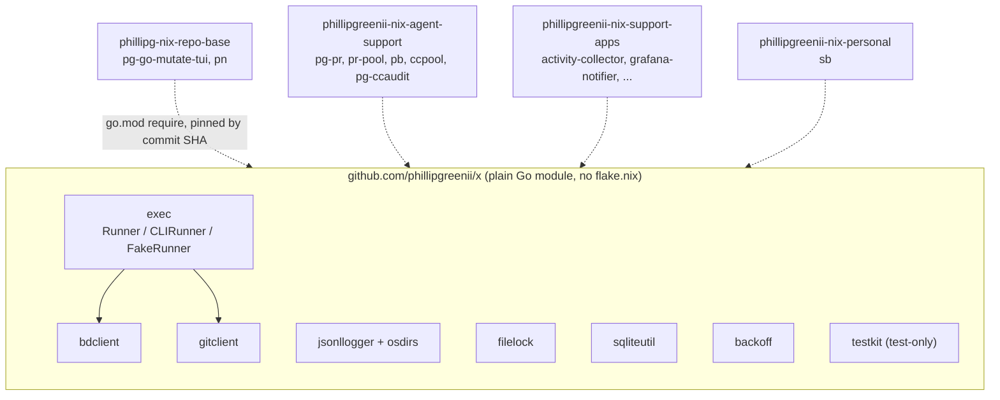
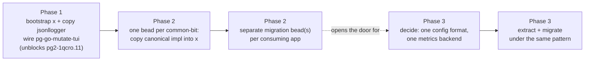

# `x` (`github.com/phillipgreenii/x`) — a shared Go library for this workspace's own tools

## 1. Problem

`pg-go-mutate-tui` (`phillipg-nix-repo-base`, `modules/pg-go-mutate/pg-go-mutate-tui`, bead
`pg2-1qcro.11`, Task 11 of its implementation plan) needs structured JSONL logging via the
workspace's ADR-0038 logger bootstrap. That bootstrap exists today as
`phillipgreenii-nix-support-apps/packages/jsonl-logger` — a same-repo "Pattern B" internal module
consumed only via a relative `go.mod` `replace` directive by four sibling binaries in that same
repo (`grafana-notifier`, `swap-stats-exporter`, `fsmonitor-daemon-exporter`,
`launchd-health-exporter`, each `go.mod:11`). `pg-go-mutate-tui` cannot reach it: a Pattern-B
rooted fileset only sees paths inside its own flake's source tree, and promoting a private copy
into `repo-base` is explicitly ruled out by `support-apps`' own `CLAUDE.md`, which cites a prior
data-loss bug (`pg2-70l4r`) caused by exactly that kind of copy-pasted duplication.

Investigating this surfaced a wider pattern: this workspace has no repo positioned to hold Go code
shared **across** flakes. Same-repo Pattern-B `replace` sharing works well within one flake
(`jsonl-logger` → 4 consumers in `support-apps`; `claude-transcript` → `ccpool`/`pa-monitor`/
`pr-pool` in `agent-support`), but the one existing cross-repo case —
`phillipg-nix-ziprecruiter`'s `modules/pg-pr-zr` replacing
`github.com/phillipgreenii/phillipgreenii-nix-agent-support/packages/pg-pr` — works around the gap
with a gitignored, untracked dev-time symlink into the sibling checkout plus an automated
nix-build-time copy into the sandbox (`build.nix`) — not a manually-synced vendor copy, and not
sharing live via an ordinary Go module dependency either.

A deeper survey (of all ~17 canonical Go modules across `phillipg-nix-repo-base`,
`phillipgreenii-nix-agent-support`, `phillipgreenii-nix-support-apps`, `phillipgreenii-nix-personal`,
and `phillipg-nix-ziprecruiter`) found this absence has real cost beyond `jsonl-logger`:

| Concern                                                               | Independent implementations                                        | Evidence                                                                                                                                                                                                                                                                                                                                                                                                                                                                                                                                                                                                                                                                                                                                                                                                                                                                                                            |
| --------------------------------------------------------------------- | ------------------------------------------------------------------ | ------------------------------------------------------------------------------------------------------------------------------------------------------------------------------------------------------------------------------------------------------------------------------------------------------------------------------------------------------------------------------------------------------------------------------------------------------------------------------------------------------------------------------------------------------------------------------------------------------------------------------------------------------------------------------------------------------------------------------------------------------------------------------------------------------------------------------------------------------------------------------------------------------------------- |
| Generic process Runner + fake for tests                               | 2, near-identical                                                  | `repo-base/modules/pn/internal/exec/{exec,fake}.go`; `agent-support/packages/pb/internal/run/{runner,fake}.go`                                                                                                                                                                                                                                                                                                                                                                                                                                                                                                                                                                                                                                                                                                                                                                                                      |
| `bd` CLI client (shell out, capture, wrap, parse envelope)            | 3 full implementations, across 3 repos, + 1 partial + 1 empty seam | `agent-support/packages/pg-pr/pkg/beads/runner.go` (70 lines, shell+capture; envelope parsing lives in sibling `mergerequest.go`/`deptree.go` in the same package); `agent-support/packages/pr-pool/internal/beads/runner.go` (73 lines, same split — its own header states it "copies pg-pr's Runner/CLIRunner pattern rather than importing pg-pr's heavy module"); `agent-support/packages/pb/internal/bd/bd.go` (120 lines, self-contained shell+parse). Partial: `support-apps/packages/activity-collector/internal/collector/beads/beads.go` (151 lines) shells out but parses a bare JSON array, not the `{data:[...], schema_version:N}` envelope. Not an implementation: `repo-base/modules/pg-go-mutate/pg-go-mutate-tui/internal/beads/beads.go` (27 lines) is a `BdClient` interface + bead-filing logic with no concrete implementation at all — a ready seam for Phase 2, not a duplicate to migrate. |
| `git` CLI wrapping (shell out + parse `log`/`diff`/`rev-parse`)       | 3, across 2 repos                                                  | `agent-support/packages/pg-pr/internal/gitlocal/gitlocal.go` (own Runner, `git log`/`git diff --numstat` parsing); `agent-support/packages/ccpool/internal/gitfacet/gitfacet.go` (rev-parse trio, soft-fail); `support-apps/packages/activity-collector/internal/collector/git/git.go` (direct inline `exec.CommandContext` calls, no Runner abstraction; differently-delimited `git log` parsing)                                                                                                                                                                                                                                                                                                                                                                                                                                                                                                                  |
| ADR-0038 JSONL logging bootstrap                                      | 1 shared + 1 blocked consumer                                      | `support-apps/packages/jsonl-logger/logger.go` (4 consumers); `repo-base`'s `pg-go-mutate-tui` Task 11 (blocked, the trigger for this doc)                                                                                                                                                                                                                                                                                                                                                                                                                                                                                                                                                                                                                                                                                                                                                                          |
| Advisory cross-process file lock                                      | 3                                                                  | `agent-support/packages/pg-pr/internal/prlock/prlock.go` (176 lines, bespoke timeout+poll); `agent-support/packages/ccpool/internal/lock/flock.go` (29 lines, wraps `gofrs/flock`); `agent-support/packages/pg-ccaudit/internal/lock/lock.go` (71 lines, also wraps `gofrs/flock`)                                                                                                                                                                                                                                                                                                                                                                                                                                                                                                                                                                                                                                  |
| SQLite WAL + `busy_timeout`, schema versioning (two competing idioms) | 4 confirmed, split 2/2                                             | WAL+`busy_timeout` is shared by all four. Versioning splits: `PRAGMA user_version` — `agent-support/packages/pg-pr/internal/store/{store,migrate}.go`, `agent-support/packages/pg-ccaudit/internal/store/store.go`. `schema_migrations` table (embedded numbered `.sql` files) — `agent-support/packages/ccpool/internal/store/{store,schema}.go`, `agent-support/packages/pa-monitor/internal/store/sqlite/{sqlite,migrations}.go`. `pr-pool` has no SQL store of its own (its durable queue is JSON-lines).                                                                                                                                                                                                                                                                                                                                                                                                       |
| Sandboxed CLI contract-test harness                                   | 2, different APIs and different scope                              | `agent-support/packages/pb/cmd/pb/contract_test.go` (isolates `$HOME`, but drives _pb's external dependencies_ — real `bd`/`git`/`pn` — never builds or execs a `pb` binary); `agent-support/packages/ccpool/cmd/ccpool/contract_harness_test.go` (builds+execs the `ccpool` binary itself, capturing exit code; deliberately preserves real `$HOME`, isolating only the XDG dirs, for OAuth). Same general idea (sandboxed CLI integration testing), but these are two different kinds of harness, not one pattern with two APIs.                                                                                                                                                                                                                                                                                                                                                                                  |
| Exponential backoff                                                   | 1 generic type + 2 more ad-hoc reimplementations                   | `agent-support/packages/pr-pool/internal/backoff/backoff.go` (the only shared, generic `Policy{Initial, Factor, Max}` type). The doubling-with-cap idiom itself is independently re-implemented, not shared: `agent-support/packages/pa-monitor/internal/rpcclient/streaming_poller.go` (hardcoded 1s/5s constants); `agent-support/packages/ccpool/cmd/ccpool/retry.go` (`base * 2^retryCount`, capped by attempt count not wall-clock).                                                                                                                                                                                                                                                                                                                                                                                                                                                                           |

The operator's own tools, all owned and developed by the same person — there is no reason for
multiple independent ways of doing config loading, metrics emission, or any of the above.

## 2. Goals

- MUST give this workspace one home for Go code shared across its own CLI tools/daemons,
  consumable the same way any third-party Go dependency already is: `go.mod` `require` + `go.sum`,
  refreshed via `go mod tidy && nix run github:nix-community/gomod2nix -- generate`.
- MUST unblock `pg2-1qcro.11` with the smallest defensible first cut (§6, Phase 1).
- MUST establish a repeatable **extract-then-migrate** pattern (copy the shared code out first;
  migrate each existing consumer onto it as a separate, later, independently-revertible step) so
  the remaining convergence work can proceed bead-by-bead rather than as one big-bang migration.

## 3. Non-goals

- This is NOT a nix flake. It MUST NOT gain a `flake.nix` and MUST NOT be added to
  `pn-workspace.toml` — it is not built, checked, or applied by `pn workspace` tooling; it is
  resolved purely as a Go module dependency.
- This is NOT a place for app-specific domain modeling. `pg-pr`'s rich beads modeling
  (`pkg/beads`: `mergerequest.go`, `deptree.go`, `adjudication.go`, …) stays in `pg-pr` — only the
  generic plumbing and verbs common to every consumer move here.
- This doc does NOT decide the config-loading format (`BurntSushi/toml` vs. the YAML
  `activity-collector` uses) or the metrics backend (Prometheus vs. OTel) convergence. Both are
  real, evidence-backed candidates for convergence, but each needs its own decision before there is
  anything to extract — deferred to Phase 3 (§6).
- Phase 1 (§6) does NOT migrate any existing consumer. Extraction and adoption are deliberately
  decoupled: nothing that already works today changes until its replacement is proven out, as a
  separate bead.

## 4. Repository shape

- **Name/org**: `github.com/phillipgreenii/x`, local checkout `phillipgreenii-x` (matching the
  existing convention of prefixing the owner onto the local directory name while the GitHub repo
  name itself stays bare, e.g. `phillipgreenii-nix-agent-support` → `nix-agent-support`). Public —
  everything in scope (§5) is generic infra with nothing ZipRecruiter-specific, the same posture as
  `phillipgreenii-nix-agent-support`.
- **Versioning**: no release tags. Consumers pin `x` by commit SHA via Go's pseudo-version
  mechanism (`go get github.com/phillipgreenii/x@<sha>`), refreshed the same way any third-party
  dependency already is in this workspace. A version bump is an ordinary one-line `go.mod` diff per
  consumer, reviewed like any other dependency bump — no separate release process to maintain.
- **Go version**: `go 1.25.x`, matching every other `go.mod` in this workspace (`pn`: 1.25.9,
  `pg-pr`: 1.25.0, `jsonl-logger`: 1.25.0).
- **CI**: a GitHub Actions workflow running `go test -race ./...` and `go vet` on every push —
  `x` has no `flake.nix`, so `nix flake check` cannot cover it; this is its only gate. (Consumers
  still gate on their own `nix flake check`, which builds `x` via `gomod2nix`'s ordinary
  git-rev+hash vendoring — no `proxy.golang.org` dependency.)
- **Docs**: a `docs/adr/` directory following the same ADR convention used by every other repo in
  this workspace (starting fresh at `0000-use-architecture-decision-records.md`), for durable
  decisions made while implementing (e.g. which `filelock` implementation became canonical).
- **Cross-org note**: `phillipgreenii-nix-support-apps` and `phillipg-nix-ziprecruiter` are hosted
  under a different GitHub org (`phillipgziprecruiter`) than `phillipgreenii`. This is not a new
  risk: `support-apps`' own `flake.nix` already takes `phillipgreenii-nix-base` (`repo-base`) as a
  cross-org input today, so a `support-apps` binary depending on a `phillipgreenii`-hosted Go module
  is the same boundary crossing that already exists at the flake-input layer.

## 5. Package layout

- **`exec`** — the Runner/CLIRunner/FakeRunner foundation, converging `pn`'s and `pb`'s
  independently-identical designs (interface + real subprocess runner + a FIFO-scripted fake
  double for tests, "unscripted call fails loudly"). Zero business logic; every other package here
  is built on it.
- **`bdclient`** — the `bd` CLI client, built on `exec`: CLIRunner shape, the env-scrub
  (`BEADS_DIR`/`WORKSPACE_ROOT`, from `pr-pool`'s version), JSON-envelope (`{data:[...],
schema_version:N}`) parsing, and the common verbs the three full implementations (`pg-pr`,
  `pr-pool`, `pb`) already call identically (`show`, `list`, `comment`, `update`).
  `activity-collector`'s own client parses a bare JSON array rather than the envelope — worth
  reconciling when it migrates, not assumed identical. `pg-go-mutate-tui`'s `internal/beads`
  package is a `BdClient` interface with no implementation yet, so it costs nothing to migrate:
  it just adopts `bdclient` directly instead of ever having its own. App-specific domain modeling
  (`pg-pr`'s mergerequest/deptree/adjudication types) stays local — that is business logic layered
  on top, not plumbing.
- **`gitclient`** — the `git` CLI client, built on `exec`: `Log` (generalizing `gitlocal`'s and
  `activity-collector`'s two differently-delimited custom log formats into one options struct),
  `ChangedFiles` (`git diff --numstat` parsing), and `Locate` (the `rev-parse`
  toplevel/common-dir/branch trio, soft-fail like `gitfacet`). App-specific policy (`pg-pr`'s
  worktree/branch lifecycle rules, `activity-collector`'s day-window aggregation into `Activity`
  records) stays local.
- **`jsonllogger`** — the ADR-0038 bootstrap, relocated as-is from `support-apps`
  (`New(app) (*slog.Logger, error)`, appends to `${XDG_STATE_HOME}/<app>/<app>.jsonl`, normalizes
  level/time via `ReplaceAttr`), plus the small XDG state/config-dir-with-`$HOME`-fallback helper
  (independently re-derived in ~10 packages) folded in as `osdirs.StateDir(app)` /
  `osdirs.ConfigDir(app)`.
- **`filelock`** — one canonical advisory cross-process file lock. The exact implementation to
  standardize on (`pg-pr`'s bespoke `golang.org/x/sys/unix`-based timeout+poll version vs. the
  `gofrs/flock`-wrapping shape `ccpool`/`pg-ccaudit` both independently chose) is an **open item**
  (§10), decided when that bead is implemented, not here.
- **`sqliteutil`** — the WAL + `busy_timeout` DSN idiom, shared by all four SQLite stores
  (`pg-pr`, `pg-ccaudit`, `ccpool`, `pa-monitor`) — but schema-versioning itself splits into two
  competing idioms, not one: `PRAGMA user_version` (`pg-pr`, `pg-ccaudit`) vs. an embedded
  numbered-`.sql`-file `schema_migrations` table (`ccpool`, `pa-monitor`). Which becomes canonical
  is an **open item** (§10); `pr-pool` has no SQL store of its own, so it drops out of this
  decision entirely.
- **`backoff`** — `pr-pool`'s existing generic `Policy{Initial, Factor, Max}` retry policy, moved
  as-is. The specific typed abstraction is unduplicated, but the underlying doubling-with-cap
  _idiom_ is independently hand-rolled at least twice more (`pa-monitor`, `ccpool`) — real
  migration targets for a later Phase 2 bead, not evidence this move is unnecessary.
- **`testkit`** — the sandboxed CLI-integration-test harness idea, but `pb`'s and `ccpool`'s
  existing scaffolding are two different KINDS of harness, not one pattern with two APIs: `pb`'s
  isolates `$HOME` and drives `pb`'s real external dependencies (`bd`/`git`/`pn`), never building
  or execing a `pb` binary; `ccpool`'s builds+execs the `ccpool` binary itself and deliberately
  preserves real `$HOME` (for OAuth), isolating only the XDG dirs. Whether `testkit` should serve
  both shapes, or only one, is folded into the open item (§10) alongside the module-boundary
  question — imported only from `_test.go` files, never shipped in a production binary.

Config-loading scaffolding and metrics emission are explicitly **not** packages here yet (§3, §6
Phase 3).

## 6. Phased rollout

- **Phase 1 (this work — unblocks `pg2-1qcro.11`).** Bootstrap `x` (`go.mod`, `README.md`, the CI
  workflow, `docs/adr/0000`); **copy** `jsonllogger` and the `osdirs` helper into it —
  `support-apps`' existing copy is left untouched; wire `pg-go-mutate-tui`'s Task 11 `obslog`
  package onto `x/jsonllogger`. Nothing else changes. This alone resolves the bead: `pg-go-mutate-
tui` gets a real dependency to build Task 11 against.
- **Phase 2 (separate beads, one extract-then-migrate cycle per common-bit).** For each of `exec`,
  `bdclient`, `gitclient`, `filelock`, `sqliteutil`, `backoff`, `testkit`: one bead copies the
  canonical implementation into `x`; separate migration bead(s) per consuming app move that app
  onto `x` and delete its local duplicate. The `jsonllogger` migration (moving `support-apps`' 4
  existing consumers off their local `../jsonl-logger` `replace` onto `x/jsonllogger`, then deleting
  the now-dead local package) follows the same pattern and is itself a Phase 2 bead, not part of
  Phase 1. Each of these beads is filed individually as work proceeds, not designed line-by-line in
  this document.
- **Phase 3 (needs its own decision first).** Pick one config-loading format and one metrics
  backend (candidates and trade-offs are real — 3 of 4 config-loading apps already use
  `BurntSushi/toml`; `pr-pool`'s own docs already call OTel its "default emission transport", and
  this workspace's observability stack already runs an `otelcol` — but committing to either is a
  separate decision, not made in this doc). Once decided, extract the converged scaffolding into
  `x` and migrate under the same pattern as Phase 2.

## 7. Testing

- **`x` itself**: `go test -race ./...` and `go vet` in CI (§4) is the only gate — there is no
  `nix flake check` for a non-flake repo. Each package's own unit tests move with it: `jsonllogger`
  already has coverage in `support-apps` (XDG path, `$HOME` fallback, the append-vs-truncate
  behavior pg2-70l4r exists because of); that suite MUST move with the code, not be rewritten from
  scratch.
- **Phase 1 acceptance**: `x`'s CI green; `pg-go-mutate-tui`'s Task 11 test
  (`TestNewWritesToXDGStateHome`, per its own plan) passes against `x/jsonllogger`; `support-apps`'
  existing 4 consumers and their tests are untouched and still pass (nothing there changed).
  Repo-base's own `nix flake check` (via `gomod2nix` vendoring `x`) becomes the integration gate for
  the new dependency.
  Since Phase 1 is a same-package COPY (support-apps' `jsonl-logger` source duplicated verbatim into
  `x`, not rewritten), its own existing test file moves unchanged with it — there is no new
  behavior in Phase 1 to write new tests for.
- **Phase 2+ migrations**: each migration bead's acceptance criterion is behavior-preserving —
  the migrated consumer's existing test suite MUST still pass unchanged (mechanically the same
  contract, different import), plus removal of the now-dead local duplicate is part of that same
  bead, not left dangling.

## 8. Risks

- **Version drift.** Consumers pin `x` at different commits; unlike the current same-repo
  `replace` (always-HEAD), staying in sync now requires an active bump. Mitigated by the bump being
  a normal, reviewable one-line `go.mod` diff — the same cost already paid for every third-party
  dependency in this workspace.
- **Premature convergence on `filelock`/`sqliteutil`.** Picking a canonical shape too early, before
  a real consumer needs it, risks designing in the abstract. Mitigated by explicitly leaving both
  decisions open (§5, §10) until their own Phase 2 bead is actually implemented.
- **`testkit`'s different consumption pattern** (test-only, never shipped in a production binary)
  may argue for a separate module so production consumers never pull in test-only transitive
  dependencies. Left open (§10) rather than decided speculatively.

## 9. Rejected alternatives

- **Promote `jsonl-logger`'s source into `repo-base`.** Rejected: this is exactly the
  copy-pasted-duplication shape `support-apps`' own `CLAUDE.md` prohibits, citing the data-loss bug
  (`pg2-70l4r`) that motivated extracting it into a shared package in the first place.
- **Move `pg-go-mutate-tui` out of `repo-base`.** Rejected: the epic (`pg2-1qcro`) states
  `pg-go-mutate-tui` directly extends `pg-go-mutate` itself (per-package guard cache, concurrency
  semaphore), which already lives in `repo-base` as a workspace-wide home-manager capability. Moving
  the TUI elsewhere trades the `jsonl-logger` seam for a worse one — splitting the TUI from the
  library it shares internals with — and does not even resolve the original problem, since the
  underlying "how does a Go module outside `support-apps` reach `jsonl-logger`" question is
  unchanged by where the _consumer_ lives.
- **Accept the duplication (do nothing).** Rejected by the operator directly: these are all tools
  the operator owns and develops; there is no reason for multiple independent implementations of
  the same concern.
- **Multiple small themed repos instead of one `x`.** Rejected: nothing found in the survey (§1)
  justifies repo-per-concern fragmentation — every candidate is small, and most consuming binaries
  need several of them together (e.g. `pg-pr` wants `bdclient`, `gitclient`, `filelock`, and
  `sqliteutil` all at once).

## 10. Open items for implementation

- **`filelock`**: which implementation becomes canonical — `pg-pr`'s bespoke timeout+poll version
  (no third-party dependency) or the `gofrs/flock`-wrapping shape `ccpool`/`pg-ccaudit` already
  share — decided within that Phase 2 bead, recorded as an ADR in `x`.
- **`sqliteutil`**: an independent review (2026-08-25) confirmed `pa-monitor` has a relevant store
  and `pr-pool` does not (JSON-lines queue, no SQL). That store lands on the `schema_migrations`-
  table variant like `ccpool`, not the `PRAGMA user_version` variant `pg-pr`/`pg-ccaudit` share —
  so the real open decision is which of the TWO existing versioning idioms (2 stores each) becomes
  canonical, not "verify unknown stores" as originally framed — decided within that Phase 2 bead,
  recorded as an ADR in `x`.
- **`testkit`**: decide whether it ships inside the `x` module (as a package imported only from
  `_test.go` files) or as its own separate module, given its different consumption pattern (§8).
  Also decide (informed by the same 2026-08-25 review) whether `testkit` covers ONE harness shape
  or both of the two genuinely different kinds found — "drive real external CLI dependencies
  against drift" (`pb`'s pattern) vs. "build+exec the binary under test" (`ccpool`'s pattern) —
  since collapsing both into one API may not be the right design; splitting into two small
  packages is a legitimate alternative to decide within that Phase 2 bead.
- **Phase 3** (config-loading format, metrics backend) requires its own brainstorm and decision
  before any bead can be filed for it — not an implementation detail to resolve inside this plan.
