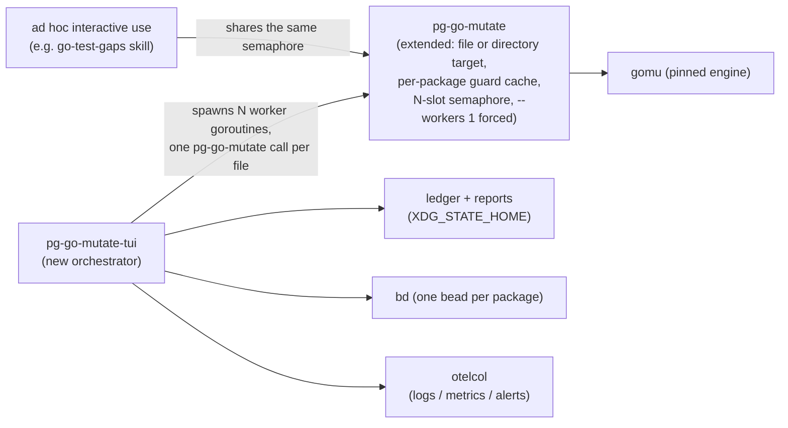

# pg-go-mutate-tui — interactive, file-granular resumable mutation-testing orchestrator

## 1. Problem

`pg-go-mutate` (the single-target mutation-testing diagnostic) and `pg-go-mutate-sweep` (the
resumable, unattended, package-granular workspace sweep) already exist — design:
`2026-08-14-pg-go-mutate-design.md`, `2026-08-17-pg-go-mutate-sweep-design.md`, ADR-0026. They
solve "a full sweep must survive interruption and outlive a session," but not the problem
recorded on **pg2-mfduf**: a sweep over a _single_ package (`packages/pg-pr/pkg/beads`) produced
zero output twice — once after 30+ minutes under contention, once against a clean 20-minute
`timeout`. `pg-go-mutate`'s own cost model is `mutants × that package's test-suite runtime`, and
its scope is **directory-only** (it walks a target recursively; a directory containing further
packages becomes one large subtree unit, ordered last for exactly that reason). When a single
package is big enough, the unit itself — not the sweep around it — cannot finish in any reasonable
bound, and a kill loses the entire unit's progress: `gomu` writes its report once, at the end,
or not at all.

This document is the redesign: move the unit of work from **package** to **file**, and replace
the unattended batch sweep with an **interactively-controlled TUI** the operator starts, watches,
and steers. `pg-go-mutate-sweep` is retired — its use case is fully subsumed, and there is no
plan to run it standalone going forward.

**What file granularity actually buys, stated precisely.** Total mutation-testing cost
(`mutants × suite-runtime`) is invariant to how the work is grouped — splitting a package's
mutants across many file-scoped invocations does not shrink the sum. What it buys is
**checkpointing**: a killed run now loses only the in-flight file's progress, turning pg2-mfduf's
"zero output after 20 minutes" into "partial output, durably recorded." The actual lever on
wall-clock is **concurrency** (§5, §7) — the same win is available today by raising `--workers` on
a single whole-package call, without any file-splitting. File granularity's distinct value is
bounding the size of a single checkpoint and enabling per-file recency prioritization (§8) — not
reducing total cost. Splitting also _adds_ a cost that has to be paid for deliberately: `pg-go-
mutate`'s health guard is package-scoped, so naively invoking it once per file reruns that guard
once per file. §5 addresses this directly with a per-package guard cache, rather than leaving it
as an unpriced tax.

## 2. Goals

- File-granular units for checkpointing, so a kill loses one file's progress, not a whole
  package's (the direct fix for pg2-mfduf's "zero output" failure mode — see the cost-model note
  in §1; the _size_ of the underlying problem is unchanged, only how much of it can be lost at
  once).
- Operator-driven start/stop: pause/resume within a live session; resumable across full process
  restarts via durable state, extending the sweep's existing durability principle down to files.
- Configurable concurrency with a real, enforced core-usage bound, shared between the TUI's own
  workers and ad hoc `pg-go-mutate` invocations elsewhere (e.g. the `go-test-gaps` skill) —
  this, not file granularity, is what actually reduces wall-clock time.
- A dynamic, recency-prioritized queue instead of a full upfront workspace enumeration.
- Live visibility: which projects/packages are in scope, what's actively running, what's queued,
  what ran recently, and what beads have been filed.
- One triage bead per Go **package** (finer than the sweep's one-per-project).
- Standard workspace observability: JSONL logs, Prometheus metrics, a Grafana dashboard, and
  alerts — operational signals only, never a mutation score.

## 3. Non-goals

- **No mutation-score / survivor-count tracking**, in metrics, dashboards, or beads, ever. This
  was directly reconsidered and re-affirmed during this design's discussion (not merely inherited
  unexamined): a raw survivor count is measurably noisy even on byte-identical source (gomu's own
  behavior — see §6), is not normalized (a package's count rises simply as it grows), and a
  visible trended number invites optimizing the number itself over the actual gaps it's meant to
  surface. This carries forward the sweep design's own non-goal (N1) and the `pg2-xulhg` operator
  ruling ("no score tracking, no baseline file, no regression detection, no threshold... record NO
  scores anywhere") unchanged. Note the `files_by_status` coverage gauge in §12 is a deliberate,
  narrower exception, not a loophole: it counts sweep _progress_ (done/pending/failed), never a
  survivor/kill number, but it is acknowledged here as a milder version of the same "visible number
  invites chasing it" risk — accepted because coverage, unlike a kill score, is exactly what an
  operator needs to know "is this package's diagnostic even current."
- **No continuous unattended daemon, cron, or launchd timer.** This carries forward the sweep
  design's N4 unchanged. The tool only does anything because an operator launched the TUI; the
  queue's low-water-mark refill loop and its retry backoff (§8) are internal to an already-running
  session, not a background service that starts itself.
- **No worktree lifecycle management by this tool.** It consumes a root path (`--root`, same
  convention as the sweep's `PN_WORKSPACE_ROOT`/`--root`) exactly as given. Creating or
  keeping an isolated checkout in sync is an operator concern, using this workspace's existing
  worktree tooling — not something this tool grows.
- **No test-impact / import-graph analysis.** Precisely identifying which tests exercise a given
  file (across package boundaries, via imports) was considered and rejected as too complex for the
  value it would add. Package-scoped content hashing (§6) is the deliberate, coarser, cheap
  substitute.
- **No reliance on gomu's own `--incremental` / `.gomu_history.json`.** Empirically shown unsafe
  when enabled and useless when disabled — see §6's spike findings. All staleness tracking is
  this tool's own.

## 4. Architecture



Three tools, each with one job:

- **gomu** — unchanged, pinned engine.
- **pg-go-mutate** — extended (§5) to accept a single file, cache its package-level guard result,
  and draw from a shared concurrency budget instead of an exclusive lock.
- **pg-go-mutate-tui** — new; the sole orchestrator. Owns file/project discovery, the hash
  ledger, the dynamic queue, per-run worker goroutines, the TUI itself, per-package bead filing,
  and the tool's own logs/metrics.

`pg-go-mutate-sweep` does not appear above — it is retired (§13).

## 5. `pg-go-mutate`: file targets, the guard-repetition tax, and concurrency

### 5.1 Accepting a file target

Today, `pg-go-mutate` rejects a non-directory target outright (exit `14`), because its health
guard `cd`s into the target and runs `go list`/`go vet`/`go test` — inherently package-level
operations; a lone `.go` file cannot be vetted or tested in isolation from its package.

Spiked directly against the pinned engine (`gomu-0.2.1`): `gomu run ./a.go` **works** —
`Processing 1 file(s)... a.go (3 mutants) -> 3/3 killed`. So the change is bounded, not a rewrite:

- **MUST** accept either a directory or a single `.go` file as `<target>`.
- When given a file, **MUST** resolve the file's containing package directory and run the guard
  against that package directory (subject to the caching in §5.2), then **MUST** invoke
  `gomu run <file>` (not the directory) for the mutation step itself.
- The exit-code contract (`0`/`1`/`2`/`10`–`14`) is unchanged in meaning — every code now
  evaluated against the file's containing package where the guard applies.

### 5.2 The guard-repetition tax, and why it must be capped per package, not per file

Naively rerunning the full guard (`go vet ./...` + `go test -count=1 ./...` over the whole
package) on every file invocation multiplies a cost that used to be paid once. For the sweep
design's own measured worst case — `pn/internal/workspace`, 62 non-test files, 615 test functions
— that is 62 full-suite guard reruns before mutation testing even starts, and if several workers
concurrently pick up files from the same package, they redundantly rerun the _identical_ guard in
parallel, each burning a semaphore slot (§5.3) on pure duplicate work.

- `pg-go-mutate` **MUST** cache a package's guard result, keyed on that package's current content
  hash (the same `package_hash` computed by `pg-go-mutate-tui`'s ledger, §6.2 — reusing it here
  rather than a second, independent hash keeps the two layers' notion of "this package changed"
  identical).
- The **first** file dispatched against a given `(package, package_hash)` pair **MUST** run the
  full guard and cache `PASS`/`FAIL` for that pair. Every subsequent file dispatched while the
  package's hash is unchanged **MUST** skip the guard and reuse the cached result.
- If the package's hash changes (a sibling file edited) while files from the old hash are still
  queued or in flight, in-flight runs **MUST** be allowed to finish — their result is still valid
  for the hash they were dispatched against (§6.3 resolves this precisely) — but the **next** file
  dispatched under the new hash **MUST** re-run the guard, invalidating the stale cache entry.
- This caps the tax at one guard run per package per actual change, not per file — turning the
  62-file worst case into 1 guard run plus 61 file-only invocations.

### 5.3 Concurrency

- The single exclusive lock (`pgm_lock_acquire`) **MUST** become an **N-slot counting semaphore**,
  generalizing the same mechanism the mutex already uses (PID-stamped slot directories, atomic
  `mv -T` stale reclaim, `--force-unlock`) rather than inventing a new primitive — each of the N
  slots is one such directory, independently reclaimable if its holder is gone.
- The semaphore is shared machine-wide between ad hoc invocations and the TUI's own workers, so a
  bystander interactive run draws from the same budget the TUI configured — the original "never
  stomp the machine" property is preserved, just generalized from 1 slot to N.
- **The semaphore's total slot count MUST be read from the static nix-managed config (§11) on
  every acquisition, never treated as runtime-mutable shared state.** A TUI session's live
  concurrency control (§9) may only choose to use _up to_ that many slots for its own workers —
  it cannot inflate the total, and it cannot leave an elevated value "sticky" for an unrelated
  caller after the session exits. This resolves a real backward-compatibility gap: without this
  rule, a session that configured concurrency=8 and exited could leave that capacity in effect for
  the next ad hoc `pg-go-mutate` call, which has no way to know or override it.
- **Every semaphore-dispatched `gomu` invocation MUST force `--workers 1`.** gomu's own
  `--workers` flag parallelizes mutants _within_ one invocation; letting it stack multiplicatively
  with the outer N-slot semaphore reproduces a documented past incident from this tool's own
  history — six concurrent runs at 2 internal workers each drove load average to 89 on an
  11-core machine and exhausted swap. The semaphore's N slots are the _only_ concurrency
  dimension; per-mutant parallelism within a slot stays off, which is also consistent with the
  existing finding that `--workers` above 1 makes per-mutant verdicts non-reproducible.
- Each acquired slot's subprocess **MUST** run with `GOMAXPROCS = max(1, floor(available_cores /
configured_concurrency))` — `go build`/`go test` otherwise default to using every core per
  process, so raw slot count would not otherwise bound real core usage. At the default
  concurrency of 1 this evaluates to all available cores, matching today's uncapped default.

## 6. Hashing and the ledger — this tool's own tracking, not gomu's

### 6.1 Why gomu's own incremental mode is not used

Spiked directly (throwaway repo, `gomu-0.2.1`, both files committed once, no branch divergence):

- **`--incremental=true` (the default)** decides "needs testing" via **git diff against
  `--base-branch main`**, not content hashing. With no divergence from `main` — the normal case
  for a workspace sweep, since canonical clones live on `main` per this workspace's own git
  discipline — it reported `Summary: 0 files need testing, 0 files skipped` and silently skipped
  a file that had **never once been tested**. Unsafe: a real false-skip, not a hypothetical.
- **`--incremental=false`** is safe (it never wrongly skipped in the spike) but provides **no
  savings**: three consecutive reruns on byte-identical content each reprocessed every file
  (`Related test files changed`, `2 files need testing, 0 files skipped`) despite the file's own
  stored `fileHash`/`testHash` in `.gomu_history.json` being provably stable and unchanged across
  those reruns.

There is no setting where gomu's own skip decision is both safe and actually saves time. The skip
decision **MUST** live in this tool's own ledger; gomu **MUST** always be invoked stateless (a
disposable execution context, matching today's throwaway-tmpdir practice) regardless of granularity.

### 6.2 Ledger schema

One record per file: `{file_path, package_hash, timestamp, status, report_path}`.

- **`package_hash`** — a single content hash over every source and test file in the target file's
  containing Go package directory. **MUST NOT** be scoped to the coarser repo-relative "project"
  (this workspace's own term for the unit one level up — e.g. `packages/pb`): a project can span
  three dozen package directories (ADR-0026's own measurement, on this workspace, of its two
  heaviest modules), so project-scoped hashing would re-queue every file in every one of those
  packages on any single unrelated edit — exactly the re-verification storm this design exists to
  avoid. Package-scoping still catches what actually matters: the target file's own changes,
  sibling-file changes, and test-file changes in the same package (a file-only hash would miss
  "only the test changed," which is precisely a case that must trigger a re-run — Go's own
  convention already colocates a package's tests with its code, so package-scoping captures this
  without any import-graph analysis). This is the same hash `pg-go-mutate`'s guard cache keys on
  (§5.2) — one computation, shared by both layers.
- **`status`** — reuses `pg-go-mutate-sweep`'s existing vocabulary unchanged: `done`, `no-tests`,
  `not-enumerable`, `unhealthy`, `timeout`, `vanished`, `inconclusive`, `failed`. An
  environment-precondition failure (`pg-go-mutate` exit `13`) **MUST** still abort the whole run
  rather than being recorded per file — it would hit every file identically, so recording it
  thousands of times is noise, not signal (unchanged from the sweep's fatal-abort behavior).
- **`report_path`** — one JSON per file, written into a tree mirroring
  `<project>/<package>/<file>.json` under `XDG_STATE_HOME` — extending the sweep's existing
  `runs/<project-slug>/<pkg-slug>.json` pattern down one level. This is this tool's own schema,
  never gomu's internal report/history files.
- Every report **MUST** also stamp the git commit hash (`git rev-parse HEAD`) of the `--root` it
  ran against, for provenance — the root may be an isolated checkout kept apart from a live
  editing session specifically so a concurrent edit cannot corrupt an in-flight run; the tool
  records what it saw without managing that checkout's lifecycle (§3).
- **Append atomicity**: carrying forward the sweep design's own established tolerance, a
  truncated trailing line from a hard kill (`SIGKILL` landing mid-append, not just mid-run) **MUST
  be tolerated** — parse the ledger per line, and ignore an unparseable final line. This matters
  more here than in the sweep: a file-granular ledger appends far more often per unit time than
  the package-granular one did.

### 6.3 Resume, staleness, and the in-flight-edit race

On launch, and on every queue refill (§8), the tool recomputes each candidate file's current
`package_hash` and compares it against the ledger. No record, or a changed hash, means the file
needs a run.

**The hash a completed run's record carries is the one captured at dispatch time — when the file
is pulled off the queue and handed to a worker — never recomputed at completion.** This is
deliberate and load-bearing: if the package is edited while a dispatched file is still running,
stamping the _post-edit_ hash at completion would falsely claim the file was validated against
code the run never actually saw. Stamping at dispatch means the record honestly reflects what was
analyzed; the _next_ refill's comparison against the now-current hash will differ and correctly
re-queue the file — the system self-heals on the following cycle rather than lying about the one
just written. In-flight runs are never killed early because their package's hash changed
underneath them; they finish, their result is recorded against the hash they actually ran
against, and it is the next refill — not this run — that reconciles the discrepancy.

## 7. Process model

- **Stop semantics**: pause/resume within a live session. Toggling pause halts dequeuing only —
  in-flight worker goroutines finish under the TUI's own supervision, and the TUI stays up to show
  their completion. Quitting the program is a **hard stop**: in-flight runs are killed, and the
  next launch resumes purely from the ledger — a killed run simply leaves that file un-recorded
  (the ledger record is appended only after its report is written, matching the sweep's existing
  "never marked complete with no artifact behind it" invariant), never corrupted.
- No detached/background execution survives a full quit. That would require a separate,
  long-lived worker process and real IPC (a socket or control files, with no `setsid` on macOS to
  lean on) — the daemon-shaped plumbing this design deliberately sets aside (§3).
- **Goroutines**: queue discovery/refill runs in its own goroutine, isolated from both the UI
  render loop and the per-run worker goroutines (one goroutine per active run, up to the
  configured concurrency).

## 8. The dynamic queue

- **MUST NOT** enumerate the whole workspace upfront. The tool maintains a high and a low
  watermark (both configurable). When queue depth drops below the low mark — or on a manual
  force-reload — it searches for more candidates.
- Candidates are ranked by recency of change **at package granularity first**: rank packages by
  how recently they changed, then pull a package's remaining not-yet-done files together, rather
  than scattering individual files across many unrelated packages. This is what makes per-package
  bead filing (§10) prompt — a package empties out as a unit instead of thinning out across the
  whole workspace with nothing ever finishing — and it's also what makes the guard cache (§5.2)
  effective, since a package's files are dispatched close together in time, before its hash is
  likely to change again.
- If a search still leaves the queue below the low mark, the tool waits a configurable duration
  (default 5 minutes) before searching again. This wait is **edge-triggered** by the low-mark
  crossing and an empty search result — it is not a standing countdown, and it **MUST NOT** be
  displayed or running while the queue is at or above the low mark.
- Every refresh re-derives **both** the project list (from the configured scan paths — projects
  can appear or disappear) **and** the file candidates within them, not just files inside an
  already-fixed project set.
- Toggling a project's inclusion (§9) triggers a queue update, **debounced** with a short cooldown
  so rapid toggling doesn't cause a flurry of reload activity.

## 9. TUI

One primary screen plus three popups.

**Primary** — project/package tree (pkg/file/test counts, toggle-to-select) plus active runs:

```
┌─ pg-go-mutate-tui ── root: phillipgreenii-nix-agent-support ── HEAD a1b2c3d ── ▶ RUNNING ──┐
│ concurrency 3/3 active   queue 47 pending (low 20 / high 80)                                │
├───────────────────────────────────────────────────────────────────────────────────────────────┤
│ PROJECTS                                                               pkgs  files  tests    │
│  ▾ ☑ phillipgreenii-nix-agent-support                                    12    143    118    │
│      ☑ pb                                                                 6     58     51    │
│      ☑ jira                                                               3     27     22    │
│      ☐ pnwf                                                               3     58     45    │
│  ▾ ☑ phillipg-nix-repo-base                                                9     91     70    │
│      ☑ pg-go-mutate                                                        2     14     11    │
│      ☐ pn                                                                  3     38     29    │
│  ▸ ☐ phillipgreenii-nix-support-apps                                      14    166    140    │
│  ▸ ☐ phillipg-nix-ziprecruiter                                             8     94     77    │
├───────────────────────────────────────────────────────────────────────────────────────────────┤
│ ACTIVE (3/3)                                                                                   │
│  ▸ pb/internal/gate/handler.go                                      00:42 elapsed              │
│  ▸ pb/internal/gate/router.go                                       00:38 elapsed              │
│  ▸ jira/pkg/pjira/adf.go                                            00:11 elapsed              │
├───────────────────────────────────────────────────────────────────────────────────────────────┤
│ [↑↓] navigate  [tab] expand/collapse  [space] toggle selection  [R] force reload               │
│ [Q] queue  [H] history  [B] beads  [p] pause/resume  [c] concurrency  [q] quit                 │
└───────────────────────────────────────────────────────────────────────────────────────────────┘
```

Header queue line when below the low mark (edge-triggered, per §8 — never shown otherwise):

```
queue 14 pending (low 20 / high 80) — searching for more...
queue 14 pending (low 20 / high 80) — nothing found, retrying in 04:12
```

**Queue popup** `[Q]`:

```
┌─ QUEUE (47 pending) ────────────────────────────────────────── [esc] close ────┐
│ grouped by package, most-recently-changed package first                        │
│  pb/internal/gate            2 running · 4 queued           last changed 2h ago│
│      session.go   config.go   middleware.go   errors.go                       │
│  jira/pkg/pjira               1 running · 3 queued           last changed 5h ago│
│      client.go   issue.go   search.go                                          │
│  … (12 more packages)                                                          │
│ [↑↓] scroll   [/] filter   [esc] close                                        │
└─────────────────────────────────────────────────────────────────────────────────┘
```

**History popup** `[H]` — per-file kill/survived counts for a specific completed run, exactly
matching `pg-go-mutate`'s own existing console output. This is local, ephemeral, and actionable
(the tool's actual point) — it is **not** exported as a metric and **not** trended (§12):

```
┌─ HISTORY (last 200) ────────────────────────────────────────── [esc] close ───┐
│ status      file                                   result               elapsed│
│ ✓ done      pb/internal/gate/auth.go               killed 9  survived 2   2m14s│
│ ✓ no-tests  pb/internal/gate/doc.go                —                       0s │
│ ✗ timeout   jira/pkg/pjira/webhook.go              —                     10m0s│
│ ⚠ unhealthy support-apps/cache/lru.go               tests fail unmutated    0s │
│ … (196 more — [/] to search)                                                   │
│ [enter] survivor detail for selected row   [/] filter   [esc] close           │
└─────────────────────────────────────────────────────────────────────────────────┘
```

**Beads popup** `[B]`:

```
┌─ BEADS FILED THIS SESSION (3) ─────────────────────────────── [esc] close ────┐
│  pg2-a1b2c   pb/internal/gate            go-test-gaps triage: pb/internal/gate │
│  pg2-d3e4f   jira/pkg/pjira              go-test-gaps triage: jira/pkg/pjira   │
│  pg2-g5h6i   claude-transcript/scanner   go-test-gaps triage: .../scanner      │
│ [enter] bd show   [esc] close                                                 │
└─────────────────────────────────────────────────────────────────────────────────┘
```

Project selection state (which nodes are toggled on) persists to `XDG_STATE_HOME` (§11) —
tool-owned, not the nix-managed config.

## 10. Bead filing

One triage bead per Go **package** (finer than the sweep's one-per-project), filed once every file
in that package has a recorded status. Same status-tally-only protocol as the sweep's existing bead
body (never a survivor count). Every bead filed is also written to the tool's JSONL log (§12) and
visible in the Beads popup.

**Repo label resolution.** Each repo in this workspace declares its own canonical bead label,
which does not always match its checkout directory name (e.g. `phillipg-nix-repo-base` → `base`,
`phillipgreenii-nix-support-apps` → `support-apps`, `phillipgreenii-nix-agent-support` →
`agent-support`). Per-package bead filing **MUST** resolve and use each repo's canonical label per
that repo's own `CLAUDE.md` convention — **MUST NOT** derive the label generically from the
workspace-relative project key's first path component, which would silently mislabel every repo
whose canonical label differs from its directory name.

**Volume, sized honestly.** Moving from one bead per project to one bead per package is not a
small change in scale: ADR-0026 measured three dozen package directories in just the two heaviest
modules workspace-wide, so a realistic estimate is 150–250+ leaf packages in total — roughly an
order of magnitude more triage beads than the sweep's ~16-per-project figure. The sweep design's
own mitigation for its smaller number carries forward unchanged and at the larger scale: filed at
**P3**, carrying **one shared label** (never promoted to an epic — an open epic never leaves `bd
ready`), and each bead closes once focused fix beads exist for its worthwhile clusters. If this
volume proves unmanageable in practice once real numbers are observed, the fallback is batching
multiple packages' findings into one bead per queue-refill cycle rather than reverting to
per-project granularity — not decided here, flagged for implementation to watch.

## 11. Configuration

Split by mutability and ownership — a single file cannot serve both roles, since a nix-rendered
file is regenerated (and would silently discard runtime state) on every `pn workspace apply`:

- **Static, nix-managed** (`XDG_CONFIG_HOME`), rendered by `phillipg-nix-ziprecruiter` — the
  terminal repo that already knows this machine's actual checked-out project paths, following the
  exact precedent set by `pa-monitor`'s own `settings` option
  (`phillipgreenii.programs.pa-monitor.settings` → a rendered, regenerated-on-apply config file).
  Carries: scan paths, default concurrency (the semaphore's total slot count, per §5.3 — not
  independently settable at runtime), high/low watermark, refill retry duration (default `5m`).
  Unknown keys **MUST** be ignored, with a warn-level log line — forward-compatible parsing, not a
  hard failure.
- **Dynamic, tool-owned** (`XDG_STATE_HOME`, alongside the ledger): current project
  include/exclude selection. The tool writes this directly and it **MUST NOT** live in the
  nix-rendered file.

## 12. Observability

Registers with this workspace's existing observability stack
(`phillipgreenii-nix-support-apps/darwin/modules/observability/`) — no new infrastructure, only
registration. Note the precedent this follows (`pa-monitor`) is a continuously-running daemon,
which this tool deliberately is not (§3, N4); the `/metrics` endpoint and JSONL log only exist
while an operator has a session open, so long idle gaps between sessions are the expected normal
state, not a signal of anything wrong.

- **Logs** — structured JSONL (`time`/`level`/`msg`, lowercase level) to
  `${XDG_STATE_HOME}/pg-go-mutate-tui/*.jsonl`, via the shared `jsonl-logger` library (`Go` apps in
  this workspace **MUST** use it rather than hand-roll the bootstrap — a copy-pasted bootstrap
  caused a real data-loss bug, `pg2-70l4r`). Declared via
  `phillipgreenii.observability.logSources.pg-go-mutate-tui`.
- **Metrics** — a local Prometheus `/metrics` endpoint, declared via
  `phillipgreenii.observability.metricsTargets.pg-go-mutate-tui`. Two families, kept deliberately
  separate because they answer different questions:
  - `pg_go_mutate_tui_command_execution_total{outcome="succeeded|error"}` — did invoking
    `pg-go-mutate` even execute as an operation (harness health: binary present, no crash, no
    unrecognized exit code).
  - `pg_go_mutate_tui_run_result_total{status=...}` — given the command executed fine, its
    diagnostic classification (the §6.2 status vocabulary).
  - `pg_go_mutate_tui_run_duration_seconds` (histogram).
  - `pg_go_mutate_tui_files_by_status{project,package,status}` (gauge) — coverage/progress of the
    sweep itself (how much of the codebase has been analyzed), **not** a mutation score (see the
    explicit trade-off note in §3).
  - **Explicitly excluded**: any survivor/kill-count metric, in any form. Reconsidered directly
    during this design's discussion and re-affirmed (§3, §9) — a raw count is measurably noisy on
    identical source, unnormalized against package growth, and a visible trended number invites
    optimizing the number instead of the gaps it represents.
- **Alerts** — a Grafana unified-alerting rule YAML contributed via
  `phillipgreenii.observability.alertRuleFiles`, built only against the operational metrics above
  (e.g. a burst of `command_execution{outcome="error"}`, or a burst of `unhealthy` results
  indicating broken package builds) — **MUST NOT** alert on anything score-shaped. Rules **MUST**
  configure "no data" as **OK**, not **Alerting** — an idle period with no TUI session running is
  normal and must not page anyone.
- **Dashboard** — two sections: tool health (command-execution success rate, run-result status
  breakdown, duration) and go-project state (files-by-status coverage/progress, staleness by
  package) — no survivor/kill panel.

## 13. Retirement of `pg-go-mutate-sweep`

Fully superseded, not kept running alongside. Its bash script, its package-granular ledger
schema, and its bats tests are removed. The `phillipg-nix-repo-base` `CLAUDE.md` mutation-testing
section (a living doc, not a historical record) is rewritten to describe `pg-go-mutate-tui` in its
place. **ADR-0026 is not rewritten** — per this repo's own ADR process
(`docs/adr/0000-use-architecture-decision-records.md`'s stated convention that superseded ADRs
remain as historical record, and the observed `0007` → `0008` pattern of leaving the old ADR's
body untouched and only changing its status line): a new ADR is authored for `pg-go-mutate-tui`'s
own contract (ledger schema, file-hash granularity, the semaphore, the per-package bead rule), and
ADR-0026 is marked `Superseded by [that new ADR]`, its body left intact — it still documents why
the exit-code allocation (10–14) exists, which this design continues to rely on unchanged (§5.1).

No migration of the old `~/.local/state/pg-go-mutate-sweep/` ledger is needed — this state is
diagnostic and derivable, not authoritative history (the sweep design applied the same reasoning
to its own ledger).

## 14. Risks

- **Package-hash false invalidation**: any change anywhere in a package (including an unrelated
  file within it) re-queues every file in that package. Accepted deliberately (§6.2) as the
  simplest safe substitute for import-graph analysis, scoped narrowly enough (package, not
  project) to avoid the re-verification storm a coarser scope would cause.
- **Bead volume**: per-package filing is roughly an order of magnitude more beads than the
  sweep's per-project figure. Mitigation carried forward from the sweep design at the larger
  scale — see §10.
- **Concurrency oversubscription** is the risk the semaphore-plus-forced-`--workers-1` design
  (§5.3) exists specifically to prevent, given it reproduces a documented past incident's
  preconditions almost exactly (many concurrent test-suite runs, each internally parallel). It
  still **MUST** be verified empirically once built — the design closes the two ways the original
  incident could recur (double concurrency dimensions, a sticky elevated slot count) but a real
  measurement on a real machine is the only way to confirm no third path exists.
- **Isolated-root staleness**: since this tool doesn't manage the root's lifecycle, an operator who
  never refreshes their isolated checkout will keep analyzing old code. Acceptable — the stamped
  git hash on every report makes this observable, and management was deliberately kept out of
  scope (§3).
- **Guard-cache correctness under concurrent dispatch**: the cache (§5.2) must be safe against
  two workers racing to be "first" for the same `(package, package_hash)` pair — the design intends
  the second racer to observe the first's cached result rather than redundantly also running the
  guard, but the exact synchronization primitive is an implementation detail, not resolved here.

## 15. Rejected alternatives

- **A continuous, throttled background daemon.** Directly proposed and set aside this session in
  favor of an operator-launched, pause/resumable TUI — see §3, §7. Not reversed; if ever revisited,
  it would need to explicitly supersede this document's §3 and the sweep design's N4, not be
  layered on top of them.
- **Trusting gomu's own `--incremental`/history mechanism** instead of an external ledger — see
  §6.1's spike findings. Unsafe when on, useless when off.
- **Whole-project-scoped invalidation hash** instead of package-scoped — see §6.2. Rejected once
  the actual project sizes in this workspace (three dozen packages in the two heaviest modules)
  were considered.
- **A tracked mutation score / survivor-count trend**, in any form (ledger, bead, metric, or
  dashboard) — directly proposed, argued through, and rejected this session. See §3, §9, §12.
- **Batching multiple files into one `pg-go-mutate` invocation** instead of a per-package guard
  cache, as a different way to amortize guard cost. Not chosen: batching walks back the
  per-file checkpointing that is this design's actual point (§1) — a killed batch loses every
  file in it, not just one. The guard cache (§5.2) gets the same amortization without giving up
  checkpoint granularity.

## 16. Open items for implementation

- Exact Prometheus metric/label cardinality budget (per-file labels would be far too high-
  cardinality; §12's metrics are scoped to project/package, never per-file).
- Exact package-hash algorithm (content hash of sorted file list — deterministic ordering is
  load-bearing), and the exact synchronization primitive for the guard cache under concurrent
  dispatch (§14).
- Whether the semaphore implementation for §5.3's N-slot concurrency lives in `pg-go-mutate` itself
  or a small shared helper library also used by `pg-go-mutate-tui`'s own worker dispatch.
- `pg2-lys68`'s specific verification (claude-transcript scanner mutants) is now unblocked by this
  tool's existence and should be re-run once `pg-go-mutate`'s file-target extension lands.
- `pg2-4dz88.6.5`'s specific target (`pg-pr`'s `--force-reload` + cross-process locking area) is
  in scope for automatic rediscovery once the tool exists and its queue reaches that package —
  no separate action needed beyond what this design already does.
