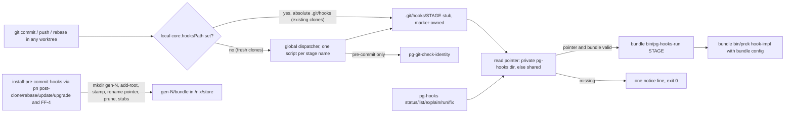
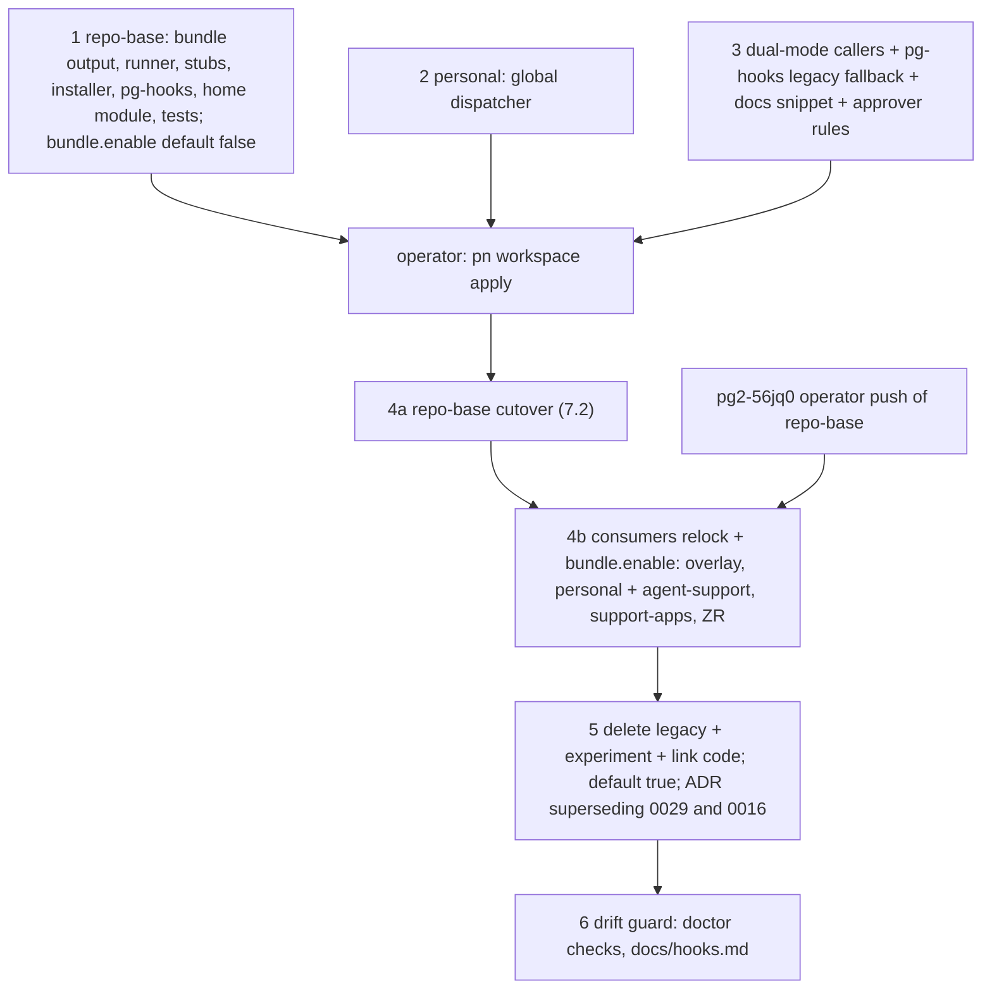

# Per-clone hook bundle and `pg-hooks`: design

Status: DRAFT 2 for operator review (2026-10-01). Revised after two independent read-only reviews
(completeness/correctness; UX/test coverage). Program: bead `pg2-pla9d`, Phase 2. Resume pointer:
`pg2-ofy4g`. Author: session phillipg-mbp-f0 (a1043272). Related: `pg2-3i12x` (tiering plan,
rulings R1-R4), the hook-shim experiment (`docs/superpowers/plans/2026-10-01-commit-time-hook-shim-experiment.md`,
ADR 0029, `docs/superpowers/plans/2026-10-01-commit-time-hook-shim-pilot-verification.md`).

The key words MUST, MUST NOT, SHOULD, SHOULD NOT and MAY are used as in RFC 2119.

## 1. Why

Operator mandate (2026-08-24, verbatim): "there has been too much turnover and toil when it comes
to how best to handle the config of the hooks. sometimes it git sometimes its prek or pre-commit.
i'm tired of seeing issues related to it. there needs to be a deep dive on how best to handle hooks
and prek in our setup. no more quick wins or stacked patches. lets figure out the proper way things
should be configured, do it and then document it and have a rule/skill to ensure it stays."

Root causes:

- The prek config is a per-worktree, gitignored symlink into `/nix/store` (`.pre-commit-config.yaml`,
  ADR 0016). Fresh worktrees lack it, GC breaks it, and every tool that creates a worktree re-links
  it (drain isolate, `wtnew`, pn `linkPreCommitConfig`, the workspace `CLAUDE.md` fix). Operator,
  2026-10-01: "trying to copy or symlink to other worktrees didn't seem to work".
- `core.hooksPath` is fragile: git-hooks.nix relativizes it (disables hooks in linked worktrees); a
  global value (home-manager, `phillipgreenii-nix-personal` `home/programs/git/default.nix`) shadows
  `.git/hooks` unless each clone sets a local absolute value; agents may not write that key
  (`pg2-szadj`, `pg2-3zgcf`).
- Installing from a linked worktree rewrites the SHARED hooks with that worktree's config
  (`absolutizeHookConfigPath`; pn `installSetHooks`).
- The commit-time shim experiment (ADR 0029) runs `nix run` in every hook: an HK-2 exception, a nix
  evaluation per hook (pilot: 14-29 s warm, 92 s cold at load 100+, inflated; prototype median
  1.72 s vs 0.66 s legacy), `nix` needed on every hook caller's PATH (the ZR auto-commit daemon has
  none), and a branch without `.githooks/` is silently ungated.

## 2. Goals and non-goals

Goals (agreed 2026-10-01):

1. A repo declares in ONE place what runs at each stage: its `flake.nix`, via the shared
   `phillipgreenii.pre-commit.*` options.
2. Hooks behave the same in the canonical clone, plain worktrees and workforest sets; nothing is
   placed into any working tree.
3. One command runs any stage directly.
4. No nix at hook time (HK-2 holds as written); per-hook overhead within about 0.1-0.2 s of calling
   prek directly.
5. Quiet on success, noisy on any problem.

Non-goals: the ZR monorepo (`/Volumes/gitrepos/ziprecruiter/pristine`; its own `zm-install-hooks`);
`post-land` runners (`pg2-na2nr`); CI; changing HK-2; deadnix; slow nix work in any hook; making
PATH-resolved hook entries (e.g. `run-unit-tests` calling `pg-test-runner`) PATH-independent.

## 3. Rulings

| Ruling                                                                             | Source                                                                                                                                                                                              |
| ---------------------------------------------------------------------------------- | --------------------------------------------------------------------------------------------------------------------------------------------------------------------------------------------------- |
| HK-2 unchanged: a git hook MUST NOT invoke nix                                     | operator, 2026-10-01 (`pg2-z19ad`)                                                                                                                                                                  |
| Approach B                                                                         | "lets try B"                                                                                                                                                                                        |
| Section 1 (bundle) approved                                                        | "section 1 is fine."                                                                                                                                                                                |
| Missing bundle at hook time and at land: one notice line, no stop, no auto-install | "emit the line, it is rare, lets keep it simple we can add more later if there si ap roblem"                                                                                                        |
| No config: the hook does nothing                                                   | "if there is no config file, then the pre-hook should do nothing"                                                                                                                                   |
| Command name                                                                       | "use pg-hooks to be consistent with other names."                                                                                                                                                   |
| Noise policy                                                                       | `pg2-3i12x` section 16: silent on success, at most one progress line after about 3 s, noisy on ANY problem (every file, the tool's own output, the exact next command, no caps)                     |
| `pre-commit-fix` scope                                                             | `pg2-ocro2` ruling 6: treefmt, trailing-whitespace, end-of-file-fixer, sort-claude-permissions, statix; ruff `check --fix` and eslint `--fix` trials; golangci-lint `--fix` spike; deadnix deferred |
| Agents MUST NOT write `core.hooksPath`; MUST NOT push                              | `pg2-szadj`/`pg2-3zgcf`; U-5                                                                                                                                                                        |

Decisions taken in draft 2 to resolve review findings (operator MAY override; see section 10):
D1 transition is dual-mode per repo; D2 the stamp covers hook inputs only and warns once per stamp;
D3 explicit `pg-hooks` invocations report "no bundle" with exit 13 while hooks and FF-1b keep the
ruling's exit-0 notice; D4 pg-test-runner-style exit codes; D5 the canonical bundle is refreshed at
land when the landed diff touches hook inputs; D6 the global dispatcher is kept but only matters for
clones without a local `core.hooksPath`.

## 4. Architecture



### 4.1 Hook resolution and the global dispatcher

Today (verified 2026-10-01) every clone in this workspace has a LOCAL `core.hooksPath`:
agent-support, support-apps, personal, phillipg-nix-ziprecruiter and overlay have the absolute
`<clone>/.git/hooks`; repo-base has the relative `.githooks` (the experiment). A local value
shadows the global one, so in these clones git runs `.git/hooks/<stage>` directly and the global
identity hook does not run (the base prek hook `check-git-identity` covers that).

- The installer MUST work in both configurations: local absolute `<common-dir>/hooks`, or no local
  value plus the global dispatcher. It MUST NOT write `core.hooksPath`.
- The global dispatcher (personal `home/programs/git`) exists so that FRESH clones (no local value)
  reach `.git/hooks` without any config write:
  - ONE script, installed under every client-side hook name git documents
    (`git help githooks`), except `fsmonitor-watchman`, `push-to-checkout`, `sendemail-validate`,
    `reference-transaction` and `pre-auto-gc`. It derives the stage from `basename "$0"`.
  - It calls git by absolute store path (`${pkgs.git}/bin/git`), not PATH.
  - For `pre-commit` it runs `pg-git-check-identity` first and stops on its failure.
  - It then `exec`s `"$(git rev-parse --path-format=absolute --git-common-dir)/hooks/<stage>" "$@"`
    when that file exists and is executable (stdin and arguments preserved); otherwise it exits 0.
    If `git rev-parse` fails (bare repo, outside a repo) it exits 0. It MUST NOT use `set -e`
    around the lookup.
  - Cost (spike, load 100-250): about 50 ms on the exit-0 path, +50-100 ms when chaining; it runs
    on every hook git fires, including `post-checkout` during `git worktree add`.
  - Before the apply that ships it, the operator SHOULD list executable non-sample files under
    `.git/hooks` of every repo on the machine, because the dispatcher makes such files fire in
    clones without a local `core.hooksPath` (where today they are shadowed). Record the list in the
    step-2 bead.
- Doctor: a local `core.hooksPath` equal to the absolute `<common-dir>/hooks`, or unset with the
  dispatcher installed globally, is `ok`; a relative, nonexistent or other value is an `error`
  whose fix line is for the operator only.
- Repo-base's relative `.githooks` MUST be reset by the operator during its cutover (section 7.2).
- The ZR monorepo is out of scope. Observed: its local `core.hooksPath`
  (`/Volumes/ziprecruiter/monorepo/.git/hooks`) does not exist on this machine, so its
  `zm-install-hooks` hooks are likely not firing today (INFERRED). This program MUST NOT reset it;
  report it separately.

### 4.2 Bundle

Flake output (shared module, when `bundle.enable`): `packages.<system>.pg-hooks-bundle`, a
`runCommand` containing:

- `bin/prek`: the repo's locked prek.
- `bin/pg-hooks-run`: the stage runner (section 4.3) and `lib/pg-hooks-lib.bash`: the library
  shared with the `pg-hooks` command (bundle resolution, stamp, overrides check, messages, exit
  codes).
- `prek-config.json`: copy of `preCommit.config.configFile`. Its text embeds the hook entry store
  paths, so the GC root keeps their closure (spike: verified with `nix-store -q --references` and
  `--roots`).
- `fixers.json` (section 5.2) and `stages.json`: `default_stages` union per-hook `stages` (the jq
  already used by `pre-commit-githooks-wired`), with hook ids and one-line reasons taken from each
  hook's `description`, falling back to its id.

The fixer tools' closures come in through `fixers.json` text, the same way.

Per clone, in the git common dir:

```
<common-dir>/pg-hooks/
  current            regular file, one line matching ^gen-[0-9]+$ (no path separators)
  reinstall          regular file, one line: the exact command that rebuilds this bundle
  gen-7/bundle   ->  /nix/store/...-pg-hooks-bundle   (nix indirect GC root, never moved)
  gen-7/source.json  { stamp, overrides, clone_path, built_at }
  gen-6/...          previous generation
```

A private bundle (section 4.6) has the same layout under `$(git rev-parse --absolute-git-dir)/pg-hooks`.

Rules:

- `current` MUST be a regular file replaced by `rename(2)` from a temp file in the same directory.
  A symlink swap is NOT atomic for concurrent readers on APFS (spike: about 50 misses per 130 swaps
  for every symlink variant; 0 in 2166 swaps for a regular file). BSD `mv -f` onto a
  symlink-to-directory silently fails; the installer MUST NOT use it.
- Readers MUST read `current` once, validate it against `^gen-[0-9]+$`, and resolve everything
  under that one generation.
- Generation numbering: N = 1 + the largest existing `gen-*`; the installer claims it with
  `mkdir gen-N` (atomic) and retries with N+1 on EEXIST.
- Generation directories MUST NOT be moved after `nix-store --add-root --indirect`: the
  `/nix/var/nix/gcroots/auto` entry names the out-link PATH.
- Pruning keeps the generation named by `current` and the highest-numbered one below it, deletes
  the rest, and MUST NOT delete the target of `current`.
- All git paths MUST use `--path-format=absolute` (the canonical clone otherwise yields `.git`).
- `clone_path` records the absolute common dir at install time; a mismatch means the clone was
  moved or copied (its GC root names the old path), reported as `relocated`.

### 4.3 Stubs and the stage runner

A stub at `<common-dir>/hooks/<stage>` is static POSIX sh with no store paths. Its first line after
the shebang is `# managed-by: pg-hooks`. It does only this:

1. Choose the bundle dir: the private one if it has a `current` file, else the shared one.
2. Read and validate `current`. If the pointer or `gen-N/bundle/bin/pg-hooks-run` is missing, print
   the no-bundle notice (section 5.4) to stderr and exit 0.
3. `exec "$B/bin/pg-hooks-run" <stage> "$@"`.

The notice text is the only text duplicated between stub and library; a test asserts they match.

`pg-hooks-run` (in the bundle):

- Advisory staleness check (section 4.5).
- Runs `"$B/bin/prek" hook-impl --config "$B/prek-config.json" --hook-type <stage> --hook-dir <common-dir>/hooks -- "$@"`
  as a CHILD (not `exec`), passing stdin and arguments through and returning prek's exit status
  unchanged. The `--hook-dir` is the hooks directory, as prek's own generated shim passes it; the
  implementer MUST match any `--script-version` the pinned prek's own shim passes.
- Passes prek's quiet option if the pinned prek has one that suppresses per-hook "Passed" lines
  (implementer verifies; if none exists, "quiet on success" is scoped to `pg-hooks` and the
  verified behavior is recorded in `docs/hooks.md`).
- On a nonzero prek status it prints, after prek's own output:
  `pg-hooks: <stage> hooks failed in <repo>. Auto-fixable formatting: run 'pg-hooks fix', then git add and commit again. Other failures: fix by hand.`
- If `bin/prek` is not executable: print the broken-bundle message (section 5.4) and exit 12.

Stubs are written only for stages that have at least one configured prek hook (from `stages.json`).

### 4.4 Installer (`install-pre-commit-hooks`, rewritten when `bundle.enable`)

- The package keeps its name: `pn-workspace.toml` runs `{nix_run install-pre-commit-hooks}` on
  post-clone, post-rebase, post-update and post-upgrade.
- Its script text embeds `${pg-hooks-bundle}`, so `nix run [--override-input ...] .#install-pre-commit-hooks`
  realises the bundle with the same overrides. It then runs
  `nix-store --add-root <gen-N>/bundle --indirect --realise ${bundle}`. It MUST NOT call
  `nix build` itself.
- Canonical clone (`--absolute-git-dir` equals the absolute `--git-common-dir`): claim `gen-N`,
  add the root, write `gen-N/source.json`, write and rename `current`, write `reinstall`, prune,
  then write or refresh the stubs.
- Linked worktree: refuse (exit 2) unless `--private` is given, printing
  `pg-hooks: install refused in a linked worktree; the shared bundle belongs to <canonical>. Run there: (cd <canonical> && nix run .#install-pre-commit-hooks), or add --private for a worktree-only bundle.`
  With `--private` it writes the layout under the worktree's private git dir and never touches the
  shared bundle or stubs, except as in the next bullet.
- `--private` MAY write a stub for a stage that has no stub yet and no foreign file, so a set's new
  stage works; it MUST NOT rewrite an existing stub.
- Stubs: replace a file carrying `# managed-by: pg-hooks` or the legacy prek marker
  (`File generated by prek`); remove own stubs for stages that no longer have hooks; REFUSE (exit 2)
  when a foreign file occupies a needed stage:
  `pg-hooks: install refused: <path> is not managed by pg-hooks (first line: <line>). Move it aside or chain it yourself, then rerun: <reinstall>`.
- `--override name=path` (repeatable): recorded in `source.json` with the path's HEAD and dirty
  state. pn passes the same pins it gives `--override-input`.
- With `bundle.enable` the installer MUST NOT run `shimWireHooksPath`, the shim config `ln -sfn`,
  the legacy installer fragments, or any `core.hooksPath` write.
- The devShell MUST NOT install anything.
- Concurrent installs: each claims its own `gen-N`; the pointer rename is atomic; last writer wins.
- `reinstall` content: canonical `(cd <canonical> && nix run .#install-pre-commit-hooks)`; private
  `(cd <worktree> && nix run <same --override-input pins> .#install-pre-commit-hooks -- --private <same --override pins>)`.

pn changes (repo-base `modules/pn`):

- `installSetHooks` and set-rooted post-rebase/post-update hooks append `--private` and the
  override pins whenever the hook directory is a linked worktree.
- The "already installed" gate (`nix_hooks.go` ~279, today `preCommitConfigLive` and
  `shimHooksPathWired`) is rekeyed: pointer valid, bundle live, stamp matching, and every recorded
  override's HEAD and dirty state equal to now.

### 4.5 Staleness

- `stamp = $(git ls-files -s -- <stamp inputs> | git hash-object --stdin)` (one pipeline, no
  sha256 tool needed). It reads the index (staged edits count; during `git commit <path>` git uses
  a temporary index, which then reflects the pending commit).
- Stamp inputs: `flake.lock`, `flake.nix`, and `phillipgreenii.pre-commit.stampPaths` (default:
  in repo-base `flake-modules/pre-commit.nix` and `modules/pg-git-check-identity`; elsewhere empty,
  because consumers' hook definitions arrive through `flake.lock`).
- The bundle reflects the WORKING TREE at install time and the stamp reflects the INDEX; an
  unstaged edit at install time is in the bundle but not the stamp. Documented, accepted.
- `pg-hooks-run` warns only on `pre-commit` and `pre-push`, and at most once per (checkout,
  stamp): it writes a marker `stale-warned-<stamp>` under the checkout's private git dir. Messages:
  - canonical or private bundle: `pg-hooks: hook bundle is stale for <repo> (built <built_at>). Rebuild: <reinstall>`
  - plain worktree on the shared bundle whose own stamp inputs differ:
    `pg-hooks: this worktree's hook definitions differ from the shared bundle; the old hooks ran. To test your hook changes: <private reinstall command>`
  - a recorded override whose HEAD differs or was dirty adds `(override <name> changed)`.
- No `flake.lock` and no stamp inputs tracked: stamp is unknown; no warning.
- FF-4 refresh (D5): after a successful ff-merge in the canonical clone, the ff-merge-to-main
  handler runs `<canonical>/.git/pg-hooks/reinstall` in the background (bgrun) when the landed
  diff touches any stamp input. A failure is reported in the land outcome, never fails the land.

### 4.6 Workforest sets

Set members are git worktrees of the canonical clones. By default they use the shared bundle (the
locked producer). pn's set setup builds a private bundle with the set's pins after the worktree
exists, so a set that changes a producer tests that change in its hooks (replaces `pg2-ytkax`).
After the agent edits the producer, the private bundle is stale and the stale line names the
private reinstall command.

## 5. Stages and `pg-hooks`

### 5.1 Configuration surface

Each repo's `flake.nix`, through `phillipgreenii.pre-commit`:

- `extraHooks`, `excludes`: unchanged; each hook's `stages` decides where it runs.
- `fixers` (new): list of `{ name, command, includes ? [glob], excludes ? [glob], after ? name, before ? name }`;
  defaults from the shared module, with `after`/`before` anchors so a repo inserts a fixer (ZR:
  `sort-claude-permissions`) into the shared order.
- `stampPaths` (new, section 4.5).
- `bundle.enable` (new, default false until step 5).

Evaluation-time assertions: `bundle.enable` and `commitTimeShim.enable` MUST NOT both be true; a
fixer MUST NOT be attached to any prek stage; no prek hook's `entry` may invoke `pg-hooks fix` or
`pre-commit-fix`; an unknown stage name is rejected. Nothing else configures hooks (no
`.pre-commit-fix.toml`, no git config keys, no per-worktree file).

| Stage                        | Configured by                               | Triggered by                                                              | Run directly                                                                                           |
| ---------------------------- | ------------------------------------------- | ------------------------------------------------------------------------- | ------------------------------------------------------------------------------------------------------ |
| `pre-commit`                 | hooks with stage `pre-commit`               | `git commit`                                                              | `pg-hooks run pre-commit` (staged files), `pg-hooks run pre-commit --all-files`, or files as arguments |
| `pre-rebase` (agent-support) | hooks with stage `pre-rebase`               | `git rebase`                                                              | `pg-hooks run pre-rebase -- <prek args>`                                                               |
| `pre-push`                   | none today (HK-2)                           | `git push`                                                                | `pg-hooks run pre-push -- <prek args>`                                                                 |
| `pre-commit-fix`             | `fixers`                                    | agent or operator after `git add`, before `git commit`; never from a hook | `pg-hooks fix`                                                                                         |
| `pre-land`                   | the `pre-commit` hooks over the branch diff | ff-merge-to-main FF-1b                                                    | `pg-hooks run pre-land [<ref>]`                                                                        |
| `post-land`                  | deferred (`pg2-na2nr`)                      | none                                                                      | none                                                                                                   |

`pg-hooks run <stage>`: bare arguments are file paths; `--all-files` passes through; `--` forwards
raw prek flags. It `cd`s to `git rev-parse --show-toplevel` and runs
`<bundle>/bin/prek run -c <bundle>/prek-config.json --hook-stage <stage> ...`.

`pre-land`: `<ref>` defaults to `HEAD`; it MUST refuse (exit 2) unless `<ref>` is the commit checked
out in the current worktree (prek reads working-tree files). It runs the `pre-commit` stage over
`--from-ref <primary> --to-ref <ref>`, where `<primary>` resolves as
`pgii-integrate-branch.primaryBranch`, then `git symbolic-ref refs/remotes/origin/HEAD`, then
`main`.

### 5.2 `pg-hooks fix` (pre-commit-fix)

- `pre-commit-fix` is a second name for `pg-hooks fix`, delivered as its own tiny wrapper on PATH
  (agents and tool approvers match commands by exact name).
- Operates on the STAGED files of the current checkout; restages only those; MUST NOT stage
  untracked or unstaged files; refuses (exit 2) during a merge, rebase or cherry-pick in progress.
- A file with both staged and unstaged changes is skipped untouched; the run exits 11 after
  listing EVERY skipped file:
  `pg-hooks: fix skipped <file>: it has staged and unstaged changes. Run: git add <file> && pg-hooks fix (or git restore --staged <file>)`.
- Calls the fixer tools directly (not `prek run`, whose hooks are check-mode), from the bundle, in
  the order from `fixers.json`. Default order: treefmt, statix (once per staged `*.nix` file;
  `statix fix` takes one target), treefmt again, trailing-whitespace, end-of-file-fixer; repos
  insert more by anchor. treefmt runs to convergence (prettier markdown can need 2+ passes, capped
  at 5). ruff MUST NOT get `--unsafe-fixes`.
- Excludes: the repo `excludes` are prek regexes and are applied with `grep -E`; fixer
  `includes`/`excludes` are globs. File lists are batched (at most 200 paths per invocation).
- Fixer failure: exit 10 after
  `pg-hooks: fixer <name> failed on <files> (exit <n>); its output follows:` then the tool's full
  output, then `Fix by hand, git add the file(s), then rerun pg-hooks fix.`
- Appends one JSON line per fixer per run to
  `${XDG_STATE_HOME:-$HOME/.local/state}/pg-hooks/timings.jsonl` (`tool, files, seconds, exit`); an
  unwritable state dir MUST NOT fail the run. A fixer whose median exceeds 10 s SHOULD be removed
  or made opt-in.

### 5.3 Command surface and exit codes

```
pg-hooks                     usage plus a common-tasks block
pg-hooks status [--porcelain]
pg-hooks list
pg-hooks explain <stage>
pg-hooks run <stage> [files...|--all-files] [-- prek-args]
pg-hooks fix                 (also: pre-commit-fix)
```

`pg-hooks` with no arguments prints usage and:

```
before committing:  git add <files>; pg-hooks fix; git commit
before landing:     pg-hooks run pre-land
diagnose:           pg-hooks status
```

Exit codes (pg-test-runner convention: `1` is never given a branchable meaning):

| Code | Meaning                                                                                                                          |
| ---- | -------------------------------------------------------------------------------------------------------------------------------- |
| 0    | success or nothing to do                                                                                                         |
| 1    | generic failure (no branchable meaning)                                                                                          |
| 2    | usage error, unknown stage, refused operation, or not in a git repo                                                              |
| 10   | a hook or fixer failed                                                                                                           |
| 11   | file(s) skipped (staged and unstaged changes)                                                                                    |
| 12   | bundle broken (pointer invalid or `bin/prek` not runnable)                                                                       |
| 13   | no bundle                                                                                                                        |
| 14   | `status` only: bundle stale                                                                                                      |
| 15   | `status` only: hooks unreachable (`core.hooksPath` does not resolve to `<common-dir>/hooks` and the dispatcher is not installed) |
| 16   | `status` only: clone relocated (`clone_path` differs)                                                                            |

- Hooks (stubs) exit 0 on "no bundle" (ruling). Explicit `pg-hooks run`/`fix` exit 13 with the
  notice (D3). FF-1b treats 13 as the ruling says: record the notice line in the land outcome and
  continue.
- `status --porcelain` prints `state=<present|stale|missing|broken|unreachable|relocated|legacy>`,
  `bundle=`, `generation=`, `stages=`, `reinstall=` lines; callers parse this, never prose.
- `127` (pg-hooks not on PATH): callers MUST treat it as
  `pg-hooks not installed on this machine; ask the operator to run pn workspace apply`; FF-1b
  records that line and continues. Stubs do not depend on PATH.
- Delivery: `modules/pg-hooks` (mkBashScript) with a tldr page `pg-hooks.md` (exit-code table) and
  completions; `home/pg-hooks/default.nix`; overlay entry `pg-hooks`; `homeModules.pg-hooks`;
  enabled in `phillipg-nix-ziprecruiter` `machines/phillipg-mbp-02` with the import in
  `darwin/system/default.nix` (the `pg-test-runner` pattern). Tool-approver rules for `pg-hooks`
  and `pre-commit-fix` (claude-extended-tool-approver) ship with step 3.
- Noise policy: silent on success; at most one progress line on stderr after
  `PG_HOOKS_PROGRESS_AFTER_S` seconds (default 3); on any problem, every failing or skipped file,
  the tool's own output, and the exact next command, with no caps. All messages start with
  `pg-hooks:` and go to stderr; stdout carries only requested output (`status`, `list`,
  `explain`).

### 5.4 Messages

| Situation                                   | Text (stderr)                                                                                                                                                         |
| ------------------------------------------- | --------------------------------------------------------------------------------------------------------------------------------------------------------------------- |
| no bundle, canonical or no `reinstall` file | `pg-hooks: no hook bundle for <repo>; <stage> hooks not run. Fix: (cd <canonical> && nix run .#install-pre-commit-hooks)`                                             |
| no bundle, plain worktree                   | `pg-hooks: no hook bundle for <repo> (shared bundle lives in <canonical>); <stage> hooks not run. Fix: (cd <canonical> && nix run .#install-pre-commit-hooks)`        |
| no private bundle, set member               | same, with the private `reinstall` line                                                                                                                               |
| broken bundle                               | `pg-hooks: hook bundle for <repo> is broken (<reason>). Rebuild: <reinstall>`                                                                                         |
| unreachable hooks                           | `pg-hooks: git does not run hooks from <common-dir>/hooks (core.hooksPath=<value> from <origin>). Operator: git -C <canonical> config --local --unset core.hooksPath` |
| relocated clone                             | `pg-hooks: this clone moved from <clone_path>; its bundle is no longer GC-rooted. Rebuild: <reinstall>`                                                               |

A rebuild is a nix build: agents run it through `bgrun` and check it with `bgcheck`.

## 6. Failure modes

| Situation                                                                            | Behavior                                                                                            |
| ------------------------------------------------------------------------------------ | --------------------------------------------------------------------------------------------------- |
| no bundle (non-pn clone, failed first install, deleted dir, repo newly adding hooks) | hooks: notice, exit 0; FF-1b: notice recorded, land continues; explicit `pg-hooks`: notice, exit 13 |
| stale                                                                                | one warning per (checkout, stamp) on pre-commit/pre-push; hooks run                                 |
| broken bundle                                                                        | stub/runner exit 12 with the rebuild line (a broken install is not "no config")                     |
| install in a linked worktree without `--private`                                     | refused, names the canonical clone                                                                  |
| foreign hook at a needed stage                                                       | install refused, names the file                                                                     |
| concurrent installs                                                                  | each claims its own generation; last writer wins                                                    |
| hook during a swap                                                                   | pointer read once; previous generation still rooted                                                 |
| initial commit, detached HEAD                                                        | stamp from the index; works                                                                         |
| ZR auto-commit launchd daemon (no nix on PATH)                                       | works: stubs need sh and git; the runner uses the bundle's prek                                     |
| moved or copied clone                                                                | `status` reports `relocated` (16) before GC and `missing` after; rebuild fixes                      |
| local `core.hooksPath` pointing elsewhere                                            | `status` reports `unreachable` (15); doctor error                                                   |
| submodule                                                                            | no bundle in its git dir; dispatcher exits 0; no notice                                             |

## 7. Rollout

Each step is a bead under `pg2-pla9d`, labels `faster-checks` plus the repo labels, wired with real
`bd dep` edges, and every pair of beads editing the same file wired with a `blocks` edge.

### 7.1 Order



Dual mode (D1): until step 5, every caller works for both kinds of repo, and step 3 MUST NOT make
any repo's fresh worktree worse than today.

- `pg-hooks status` reports `legacy` when there is no bundle but a usable legacy config exists (the
  worktree's `.pre-commit-config.yaml`, else the canonical clone's, read in place and never
  linked). `pg-hooks run <stage>` then runs prek with that config.
- FF-1b uses `pg-hooks run pre-land "$FB"` in every repo, so legacy repos keep their prek gate.
- drain isolate, `wtnew` and pn's worktree updates keep their existing link step ONLY when
  `pg-hooks status` says `legacy`; with a bundle they skip it. The link code is deleted in step 5.

### 7.2 Repo-base cutover

The canonical clone's `.git/hooks/pre-commit` is a stale legacy prek shim with an absolute store
config path; it MUST be replaced by the installer BEFORE git is pointed at `.git/hooks` again.

1. Step 1 lands with `commitTimeShim.enable = true` unchanged and `bundle.enable = false`;
   `.#git-hook` and `.githooks/` stay.
2. One cutover commit sets `bundle.enable = true` and `commitTimeShim.enable = false` and deletes
   `.githooks/`; it lands normally.
3. In the canonical clone: `nix run .#install-pre-commit-hooks` (builds the bundle, replaces the
   legacy stub via its marker).
4. Operator: `git -C /Users/phillipg/phillipg_mbp/phillipg-nix-repo-base config --local core.hooksPath /Users/phillipg/phillipg_mbp/phillipg-nix-repo-base/.git/hooks`
   (absolute, matching the other clones).
5. Verify: `pg-hooks status` and a real commit in the canonical clone and in a worktree.

Between steps 2 and 4 the relative `.githooks` points at a directory main no longer has, so
repo-base commits are briefly ungated; steps 2-4 SHOULD run back to back, and older repo-base
worktrees SHOULD be rebased onto main before step 4.

### 7.3 Operator runbook (consolidated)

1. `pn workspace apply` after steps 1-3 land (puts `pg-hooks` on PATH, ships the dispatcher).
2. Repo-base cutover 7.2 step 4.
3. After each repo enables the bundle: `(cd <canonical> && nix run .#install-pre-commit-hooks)`,
   `pg-hooks status`, one real commit.
4. `pn workspace push` (`pg2-56jq0`) before step 4b; consumers relock in the order of 7.1.

### 7.4 Callers to migrate (step 3, dual mode)

| Consumer                        | Location                                                                                                                                                                                                                                                                                                                                                                                                                                                                                                             | Change                                                                                                                                                                                                                                     |
| ------------------------------- | -------------------------------------------------------------------------------------------------------------------------------------------------------------------------------------------------------------------------------------------------------------------------------------------------------------------------------------------------------------------------------------------------------------------------------------------------------------------------------------------------------------------- | ------------------------------------------------------------------------------------------------------------------------------------------------------------------------------------------------------------------------------------------ | ----- | ------ | ------- | ------------------------------------------------- |
| ff-merge-to-main FF-1b          | agent-support `claude-marketplace/integrate-branch/skills/ff-merge-to-main/SKILL.md` 281-330, 457, 521-525 (landed `e9089bd7`)                                                                                                                                                                                                                                                                                                                                                                                       | `pg-hooks run pre-land "$FB"`; keep `stopped:precommit-branch-diff-failed` for exit 10; record notice lines (13, 127) verbatim in the outcome; replace the `FF-1b: no prek config in <wt>, prek not run` text and its grep checks          |
| integrate-branch-support        | `integrate-branch-support.bash` 222-254 (`precommit_state`, `precommit_usable`), `.sh` 71-90 (`--prek-branch-diff`, `exec prek run`), `.md`, bats                                                                                                                                                                                                                                                                                                                                                                    | delegate to `pg-hooks run pre-land`; keep the `PRECOMMIT` facts key, values become `bundle                                                                                                                                                 | stale | legacy | missing | broken`; update SKILL.md 62-66 in the same change |
| drain isolate                   | agent-support `packages/pb/internal/drain/isolate.go` 113, 176-201; `cmd/pb/drain_isolate.go:31`; README:152; tests                                                                                                                                                                                                                                                                                                                                                                                                  | link only when `status` is `legacy`; report status                                                                                                                                                                                         |
| wtnew                           | `packages/wtnew/wtnew/wtnew.bash` 47-110; `wtnew.sh`; bats                                                                                                                                                                                                                                                                                                                                                                                                                                                           | same                                                                                                                                                                                                                                       |
| pn worktree link                | repo-base `modules/pn/internal/workspace/update_worktree.go` 16-33, call 305; `propagate.go:189`; tests                                                                                                                                                                                                                                                                                                                                                                                                              | same                                                                                                                                                                                                                                       |
| pn install gate and sets        | `nix_hooks.go` 95-116, ~279, 310-316; `workforest.go` ~112-150, ~355                                                                                                                                                                                                                                                                                                                                                                                                                                                 | section 4.4                                                                                                                                                                                                                                |
| doctor `pre-commit-hook-live`   | `doctor_checks_precommithook.go` 57-62, 70, 80-100                                                                                                                                                                                                                                                                                                                                                                                                                                                                   | "declared" = the repo's `pn-workspace.toml` entry runs `install-pre-commit-hooks`; for declared repos missing pointer, missing or foreign stubs, dangling bundle and unreachable hooks are errors; checks the marker on every needed stage |
| doctor `ruff-pin`               | `doctor_checks_ruffpin.go` 136, ~152                                                                                                                                                                                                                                                                                                                                                                                                                                                                                 | read `<bundle>/prek-config.json` (legacy: the old file)                                                                                                                                                                                    |
| doctor githooks-shim            | `doctor_checks_githooksshim.go`                                                                                                                                                                                                                                                                                                                                                                                                                                                                                      | delete in step 5; MOVE its helpers `resolvedHooksDir`, `symlinkLiveInNixStore` first                                                                                                                                                       |
| `pn workspace pre-commit-check` | `pre_commit_check.go` ~46 (`pre-commit run --all-files`; `pre-commit` is not on PATH)                                                                                                                                                                                                                                                                                                                                                                                                                                | `pg-hooks run pre-commit --all-files` per clone                                                                                                                                                                                            |
| update-locks                    | `lib/scripts/update-locks-lib.bash` 395-500                                                                                                                                                                                                                                                                                                                                                                                                                                                                          | `pg-hooks status --porcelain`                                                                                                                                                                                                              |
| agent rules                     | agent-support `home/programs/agent-rules/pgii-agent-rules.md:64`, `nix-how-to.md` 26-90                                                                                                                                                                                                                                                                                                                                                                                                                              | `pg-hooks fix` before commit; probe with `pg-hooks status`; 127 fallback                                                                                                                                                                   |
| drain-beads                     | `claude-marketplace/pb/commands/drain-beads.md` 572-592                                                                                                                                                                                                                                                                                                                                                                                                                                                              | same                                                                                                                                                                                                                                       |
| personal shell aliases          | `home/programs/pre-commit/default.nix` 19-30 (`pc`, `pcr`, `pci`, `pcu`)                                                                                                                                                                                                                                                                                                                                                                                                                                             | `pc`/`pcr` become `pg-hooks run ...`; remove `pci` (`prek install` would overwrite stubs)                                                                                                                                                  |
| docs and memory                 | AS `CLAUDE.md` 141, 306; personal `CLAUDE.md`, `.claude/rules.md`, `CONTRIBUTING.md`, `README.md`; RB `CLAUDE.md`, `README.md`, `cli/workspace.go:89`, `testdata/pn-workspace-reference.toml`, `pn-workspace-rules/commands/pn-workspace-update.md:192`; ZR `modules/workspace.nix:162`, `modules/workspace-root-CLAUDE.md.txt` (source of the workspace `CLAUDE.md` "prek / pre-commit in Fresh Worktrees" section), `CLAUDE.md`, `home/ziprecruiter/config/claude-memory/**`; support-apps and overlay `CLAUDE.md` | rewrite for `pg-hooks` and dual mode; the symlink fix text goes in step 5                                                                                                                                                                  |
| comments                        | AS `pg-router/internal/config/config.go:582`; RB `push.go:234`                                                                                                                                                                                                                                                                                                                                                                                                                                                       | wording only                                                                                                                                                                                                                               |

### 7.5 Removed in step 5

In `flake-modules/pre-commit.nix`: `neutralizeHigherScopeHooksPath`, `restoreHigherScopeHooksPath`,
`correctRelativeHooksPath`, `hardenPrePushHook`, `absolutizeHookConfigPath`, `shimLinkConfig`,
`shimWireHooksPath`, `gitHookPackage`, the `commitTimeShim` options, the checks
`pre-commit-hooks-path-worktree-safe`, `pre-commit-hooks-config-path-absolute`, the two
higher-scope checks and `pre-commit-githooks-wired`; repo-base `.githooks/` and its `flake.nix`
enable line; `update-locks-lib.bash` `_ul_shim_*`; pn `shimHooksPathWired`; the dual-mode legacy
branches and all link code; the ADR 0016 `.gitignore` line and its check once no clone has the old
symlink. New ADR supersedes 0029 and 0016.

### 7.6 Existing beads

| Bead                             | Disposition                                       |
| -------------------------------- | ------------------------------------------------- |
| `pg2-z19ad` (umbrella)           | absorbed into `pg2-pla9d` Phase 2                 |
| `pg2-w79z5` (pilot)              | closed 2026-10-01; its evidence feeds this design |
| `pg2-ytkax` (set-aware git-hook) | superseded by section 4.6                         |
| `pg2-uq1km` (consumer waves)     | becomes step 4b                                   |
| `pg2-56jq0` (push)               | unchanged; blocks step 4b                         |
| `pg2-d1ngb` (HK-2 decision)      | closes after step 5: shim abandoned, HK-2 stands  |
| `pg2-bvldq`, `pg2-ff0i`          | re-triaged after step 5                           |

## 8. Testing

Every test lives in the repo that owns the code, organized by subject. Seams:

- Fake nix: `PG_HOOKS_NIX_STORE_BIN` (default `nix-store`) points at a stand-in that records argv
  and materializes a fake store dir (stand-in `bin/prek`, `bin/pg-hooks-run`, json files).
- Progress threshold: `PG_HOOKS_PROGRESS_AFTER_S`.
- Harness caveats: repo-base `lib/scripts/git-fixture-harness.bash` sets a local
  `core.hooksPath=/dev/null` and strips `GIT_CONFIG_GLOBAL`; tests that need hooks MUST unset the
  local value and export `GIT_CONFIG_GLOBAL` AFTER `gfh_setup`. `testBashScripts` supplies only
  bats, git and which; tests needing jq add it via `extraInputs`.
- Workforest sets: `modules/pnwf` fixtures use a mock `pn`; set behavior is tested as a pn Go smoke
  scenario (`modules/pn/internal/workspace/smoke/scenarios`), or with a hand-built
  `.workforests/<branch>/<repo>` tree made by `git worktree add`.
- Stand-in tools prove orchestration; one repo-base flake check runs the real bundle's fixers
  (treefmt idempotency) to prove the tools.

| Unit                  | Test                                                                                                 | Must prove                                                                                                                                                                                                                                                                                                                                                                                                                                                                                                                                                                                                                                                                                                                                                 |
| --------------------- | ---------------------------------------------------------------------------------------------------- | ---------------------------------------------------------------------------------------------------------------------------------------------------------------------------------------------------------------------------------------------------------------------------------------------------------------------------------------------------------------------------------------------------------------------------------------------------------------------------------------------------------------------------------------------------------------------------------------------------------------------------------------------------------------------------------------------------------------------------------------------------------- | ---------------------------------------------------------------------------------------------------------------------------------------------------------------------------------------------------------------------------------------------------------------------------------------------------------------------------------------------- |
| stub                  | bats, stand-in runner logging argv and env                                                           | fires at root, subdir, linked worktree (marker file shows which tree); `commit -a`, `commit <path>`, `--amend`; private dir preferred; no bundle: exact notice text on stderr, stdout empty, exit 0; invalid pointer (`../x`, empty) rejected; stub text has no store path and the marker line; notice text equals the library's; `--no-verify` runs nothing                                                                                                                                                                                                                                                                                                                                                                                               |
| runner                | bats, stand-in prek                                                                                  | exact prek argv (`--config`, `--hook-type`, `--hook-dir <common-dir>/hooks`, `--`); stdin and args passed for pre-push (ref lines, remote name and URL), pre-rebase (`$1 $2`), commit-msg, prepare-commit-msg; prek status returned unchanged; failure hint printed only on nonzero; broken bundle exit 12; bundle prek used even with a decoy `prek` first on PATH; works under `env -i PATH=/usr/bin:/bin` with no HOME; at most 2 `git` invocations per run (PATH git shim counting); `GIT_DIR`, `GIT_WORK_TREE`, `GIT_INDEX_FILE` set as during `commit <path>` and rebase                                                                                                                                                                             |
| staleness             | bats                                                                                                 | stamp equals `ls-files -s                                                                                                                                                                                                                                                                                                                                                                                                                                                                                                                                                                                                                                                                                                                                  | hash-object`of the inputs; staged edit counts; unrelated`.nix` edit outside stamp inputs: no warning; stamp mismatch: exactly one warning across 3 commits and a 3-commit rebase; plain-worktree wording vs canonical wording; changed override HEAD or dirty adds the suffix; no inputs: no warning; warnings only on pre-commit and pre-push |
| installer             | bats with fake nix                                                                                   | canonical writes shared layout; `add-root <gen-N>/bundle --indirect --realise` argv; `mkdir` claim with EEXIST retry; `current` is a regular file (`[ -f ] && [ ! -L ]`) replaced by rename; `reinstall` and `source.json` contents (jq); pruning keeps current and previous; worktree without `--private` refused with the canonical path in the message; `--private` writes private only and may add, never rewrite, stubs; legacy and own markers replaced; foreign file at a needed stage refused with its path; foreign file elsewhere (bd `post-merge`) untouched; stale own stubs removed; repo with zero hooks writes a bundle and no stubs; never writes `core.hooksPath`; two concurrent installs leave a valid `current` and intact generations |
| swap race             | bats, darwin only, 2 readers, 500 swaps                                                              | 0 misses; paired with the structural assertion above on every platform                                                                                                                                                                                                                                                                                                                                                                                                                                                                                                                                                                                                                                                                                     |
| `git worktree remove` | bats                                                                                                 | private dir deleted; shared untouched                                                                                                                                                                                                                                                                                                                                                                                                                                                                                                                                                                                                                                                                                                                      |
| `pg-hooks`            | bats per subcommand                                                                                  | usage block; `status --porcelain` for present, stale, missing, broken, unreachable (local `.githooks`), relocated, legacy, each with its exit code; `list`, `explain`; `run` argument forms; `run pre-land` refuses a ref not checked out, argv `--from-ref/--to-ref`, primary resolution order; `run` from a subdirectory and outside a repo (exit 2); no bundle exit 13 with notice; legacy fallback reads the canonical config without creating any file; paths with spaces and a symlinked prefix                                                                                                                                                                                                                                                      |
| `pg-hooks fix`        | bats, stand-in fixers                                                                                | staged-only, restage-only, untracked untouched; skipped files listed with exit 11; refuses mid-merge (exit 2); order from `fixers.json` incl. an anchored insert; statix once per `*.nix`; no `--unsafe-fixes`; convergence cap; second run is a no-op; regex and glob excludes; batching at 200; fixer failure message and exit 10; tools from the bundle not PATH; `timings.jsonl` schema (jq) and unwritable state dir tolerated; progress line with threshold 0 vs 99                                                                                                                                                                                                                                                                                  |
| nix module            | eval tests (`lib/*-tests.nix`)                                                                       | bundle contents match options; `stages.json` union; `bundle.enable = false` renders nothing new; both-flags assertion; fixer-at-stage and `pg-hooks fix`-entry assertions; unknown stage rejected; devShell shellHook installs nothing; `pg-hooks` enabled in `machines/phillipg-mbp-02` (ZR eval check)                                                                                                                                                                                                                                                                                                                                                                                                                                                   |
| dispatcher            | bats in personal (harness imported or vendored), temp `GIT_CONFIG_GLOBAL`, no local `core.hooksPath` | every listed stage name installed (checked against `git help githooks`); identity first and only on pre-commit; chains with stdin and args; exit 0 when no stub, in a bare repo, outside a repo, in a submodule, during `git worktree add` post-checkout; bd-style `post-merge` chained                                                                                                                                                                                                                                                                                                                                                                                                                                                                    |
| callers               | each repo's harness                                                                                  | FF-1b and integrate-branch-support: exit 10 maps to `stopped:precommit-branch-diff-failed`, 13 and 127 are recorded and the land continues, legacy repos still run prek; drain isolate, wtnew, pn worktree updates link only in `legacy`; pn gate Go tests (stamp, overrides); doctor Go tests (declared vs undeclared, marker, unreachable, relocated); grep checks that nothing probes `.pre-commit-config.yaml` except the dual-mode branch                                                                                                                                                                                                                                                                                                             |
| acceptance matrix     | pn Go smoke scenario                                                                                 | canonical clone, plain worktree, workforest set with a producer change: each acts on its own tree, the set uses its private bundle, nothing is written into any working tree                                                                                                                                                                                                                                                                                                                                                                                                                                                                                                                                                                               |
| drift guard           | grep checks + doctor                                                                                 | no `.githooks`, relative `core.hooksPath`, link code or link text outside an allowlist (after step 5)                                                                                                                                                                                                                                                                                                                                                                                                                                                                                                                                                                                                                                                      |
| not hermetic          | documented manual run after 7.2                                                                      | real commit, rebase and push to a local bare remote; cold and warm latency vs the legacy hook on the same change with load recorded; pass if the hook overhead is within 0.2 s of `prek hook-impl` run directly                                                                                                                                                                                                                                                                                                                                                                                                                                                                                                                                            |

## 9. Open items and risks

- Latency is measured only at load 100-250 (spike); the manual run gives the real number.
- prek's quiet behavior for `hook-impl` is unverified (section 4.3).
- The `pre-commit-fix` trials (ruff, eslint) and spike (golangci-lint `--fix`) are decided per
  fixer by the 10 s rule.
- Tool-guard inconsistency (spike): writes under `.git/` with literal paths were refused while the
  same writes via `$(git rev-parse --absolute-git-dir)` were allowed. A bead SHOULD be filed for
  claude-extended-tool-approver; installer tests that run from an agent session may hit it.
- PATH-dependent hook entries (`run-unit-tests` needs `pg-test-runner` on PATH) stay PATH-dependent;
  GUI clients without the user profile on PATH still fail those hooks loudly (existing behavior).
- Two identity checks run in clones without a local `core.hooksPath` (the dispatcher's and the base
  prek hook `check-git-identity`); harmless, may be deduplicated later.
- The dispatcher adds about 50 ms to every hook git fires in such clones.

## 10. Decisions to confirm (draft 2)

- D1 dual-mode transition (section 7.1) instead of converting all repos at once.
- D2 stamp inputs narrowed to hook inputs with a once-per-stamp warning (section 4.5).
- D3 explicit `pg-hooks run`/`fix` report "no bundle" as exit 13 (hooks and FF-1b keep exit 0 per
  the ruling).
- D4 exit codes per section 5.3.
- D5 the canonical bundle is rebuilt in the background after a land that touches hook inputs.
- D6 the global dispatcher ships, though existing clones keep their local absolute
  `core.hooksPath`; repo-base moves to the absolute value at cutover.
