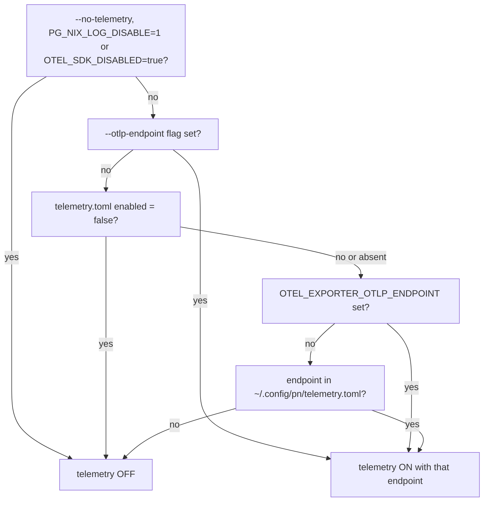

# pn — workspace flake orchestration

`pn` is a Go program that bootstraps and maintains a `pn-workspace.toml` project, coordinating nix flake dependencies across multiple local git repositories.

## Telemetry (always built, switched at run time)

pn is always built to emit OpenTelemetry traces and metrics over OTLP/HTTP to a collector, and to
route long-running nix calls through the `pg-nix-log-wrapped` wrapper (design and rationale: ADR
0028, "Amendment 2026-10-08"). The `pg-nix-log-wrapped` package is installed on every system.
Whether a given system actually emits is a **runtime** setting in `~/.config/pn/telemetry.toml`
(endpoint URL, `enabled`, `wrapper_path`), read on every run, so flipping it needs no rebuild or
re-install. When off, pn creates no exporter, opens no connection, starts no goroutine and writes no
file: its behavior and output are byte-identical to a build without telemetry, and `pn workspace
doctor` raises no finding. When on, pn assumes the collector is there; an unreachable collector is
tolerated (see below) and a visible error is acceptable.

For a non-root process the decision is, first match wins:



`~/.config/pn/telemetry.toml` is generated by the home-manager module
(`phillipgreenii.pn.telemetry.{enable, endpoint, wrapperPath}`) on every system and has three
optional keys: `enabled` (boolean, the per-system runtime switch; absent means "on iff an endpoint
resolves"), `endpoint` (the OTLP/HTTP URL) and `wrapper_path`. `enable` in the module is the value
written to `enabled`; it is not an install gate. A root process never reads the file. Under `sudo`,
pn runs the wrapper only if `wrapper_path` resolves (after symlinks) into `/nix/store`; there is no
environment override. `enabled = true` with no endpoint anywhere leaves telemetry off, and doctor
warns about it.

When telemetry is on and `wrapper_path` is an executable file, the long-running nix calls
(`build`, `apply`, `flake-check`, `format`, `nix`, the propagate step of `update`, and `tree`'s lock
call) run as `pg-nix-log-wrapped --traceparent TP --otlp-endpoint URL --log-dir DIR -- <command>`
(`sudo <wrapper> ... -- <command>` for the exact `sudo darwin-rebuild|nixos-rebuild|nix` form, without
`--log-dir`). Probes, `sudo nix-store`, any other `sudo` form and a `build_command` such as `sh -c ...`
run unwrapped, as does everything when the wrapper is missing or telemetry is off. The command's own
arguments, including every `--override-input`, reach it unchanged, and `--show-nix-commands-only`
prints the unwrapped command (ADR 0028).

With telemetry on, hooks and `update-locks.sh` additionally get `TRACEPARENT` (the `pn.exec` span of
their own call) in their environment, so nix they run nests under the `pn.verb` trace; their argv is
never rewritten and with telemetry off their environment is untouched (ADR 0028).

### Escape hatches

| Control                            | Effect                                                                                                             |
| ---------------------------------- | ------------------------------------------------------------------------------------------------------------------ |
| `telemetry.toml` `enabled = false` | Off for the system, no rebuild (module: `phillipgreenii.pn.telemetry.enable = false`; the wrapper stays installed) |
| `pn --no-telemetry`                | Off for one pn run                                                                                                 |
| `PG_NIX_LOG_DISABLE=1`             | Off for pn; the wrapper execs its command unmodified (the pre-wrapper behavior)                                    |
| `pg-nix-log-wrapped --check`       | Prints the resolved endpoint, whether it is reachable, and whether the log directory is writable                   |
| `OTEL_SDK_DISABLED=true`           | Both binaries off                                                                                                  |
| `PG_NIX_LOG_DEBUG=1`               | The wrapper prints diagnostics to stderr (it is otherwise silent when it fails open)                               |

The same table is printed by `pn --help`.

### Finding a run's trace

stdout never changes. Two stderr/file affordances exist:

- `trace: <trace_id>` is printed to **stderr** at the end of a run only under `-v`/`--verbose` or
  `PN_TRACE_HINT=1`.
- `pn workspace update` writes the same id as `trace_id` on its `run_start` and `run_end` records in
  `${XDG_STATE_HOME}/pn/events.jsonl`, so it can be found from Loki or the file.

When telemetry is enabled, pn probes the collector with one bounded TCP connect. If it does not
answer, pn runs with telemetry off for that run; under `-v` it prints
`telemetry disabled: collector unreachable (<endpoint>)` to stderr, otherwise it is silent. If the
collector answers the probe but a later export fails, the OpenTelemetry SDK's own error line may
appear on stderr; that visible error is accepted, and `enabled = false` is the remedy for a system
with no collector.

`-v`/`--verbose` is a global flag. (`pn -v` used to print the version via cobra's default shorthand;
use `pn --version`.) `pn workspace nix` forwards everything after `nix` to nix untouched, so a `-v`
there is nix's.

`pn workspace doctor` has a `telemetry` check: when telemetry is on it runs `pg-nix-log-wrapped --check`
and reports a missing wrapper or a failing check as a warning (never an error); a configured-on
system whose collector is unreachable, and `enabled = true` with no endpoint, are warnings too. It is
silent when telemetry is off.

## pn workspace doctor

`pn workspace doctor` audits a pn workspace against the build-equality invariant and (with `--fix`) repairs the safe drifts.

**The Invariant (one sentence):** If `doctor` reports no errors, a local override build (`--override-input git+file://<clone>` for each workspace dependency) and a pure-remote build (a plain nix build that uses each repo's committed `flake.lock`, no local overrides) produce the same output.

### Modes

- **Primary mode**: Compares local checkouts against the remote default branch (obtained via `git ls-remote` on the canonical URL).
- **Worktree mode**: Relaxes to branch-name uniformity across the set and drops remote checks; dirty trees become warnings instead of errors.

### Flags

- `--fix` — Apply safe, auto-fixable repairs (respects dependency order).
- `--dry-run` — Print the fix plan without applying changes (requires `--fix`).
- `--offline` — Skip remote-dependent checks; reported as skipped, never silently ok.
- `--json` — Machine-readable output (on stdout only; no banner or progress).
- `--strict` — Treat warnings as errors for the exit code.

### Exit Codes

- `0` — No errors (and, under `--strict`, no warnings). Local and remote builds will match.
- `1` — Errors present (or any finding under `--strict`).
- `2` — Doctor itself failed (e.g., `ls-remote` unreachable without `--offline`).

### Important Note: flake-lock-fresh Fix

The `flake-lock-fresh` fix delegates to `pn workspace update`, which is the only fix that pushes. It relocks affected repos, commits the new lock, and pushes to remote — the one auto-fix that modifies remote state. It is always gated behind `--fix` and shown in `--dry-run`.

### Important Note: ruff-pin (single-ruff-version invariant)

A uv Python package's `ruff` dependency and the nixpkgs `ruff` that the hook bundle's hooks (`prek-config.json`) execute format the SAME files. They are pinned independently — the uv one by `pyproject.toml`, the nixpkgs one by the flake's `nixpkgs` input — so unless they name the same version they can disagree, and a mutating pre-commit formatter then trips pre-commit's "files were modified by this hook" rule mid-commit.

The `ruff-pin` check asserts they agree:

- `ruff-pin-drift` (ERROR) — the package is exact-pinned, but to a different version than the hooks run. This is what a nixpkgs ruff bump produces, and surfacing it is the point: the pin must be bumped in the same change.
- `ruff-pin-floating` (WARN) — the package's spec is not an exact pin (`>=`, `~=`, `==x.y.*`, a range, or unbounded), so a `uv lock` can float it across a formatter-behaviour boundary.
- `ruff-pin` (SKIP) — the hook bundle's `prek-config.json` exists only once the hooks are installed (ADR 0032), so it is absent in a fresh clone until then. The nixpkgs side is then unknown and nothing is asserted; run `nix run .#install-pre-commit-hooks` and re-run doctor.

The check is read-only and **not** auto-fixable: the remedy is a pin edit plus a `uv lock` relock plus, across a formatter boundary, a reformat of the affected sources. Each finding carries that sequence as its `Manual` hint. Repos that declare no `ruff` dependency, or whose generated config runs no nixpkgs ruff hook, produce no findings.

### Example: Clean Run

```
$ pn workspace doctor
workspace doctor — primary checkouts (origin/main is the baseline)

=== workspace ===

=== phillipg-nix-repo-base ===

=== phillipgreenii-nix-support-apps ===

workspace doctor: no errors (0 warnings). local and remote builds will match.
```

### Example: Run with Findings

```
$ pn workspace doctor --fix --dry-run
workspace doctor — primary checkouts (origin/<branch> is the baseline)

=== dep ===
  ERROR branch-current        repo "dep" is not on its default branch "main" (on "feature") [manual]
          ↳ git -C /workspace/dep switch main
  WARN  repos-extra            git repo "stray" is on disk but not in pn-workspace.toml [fixable]

=== lib ===
  ERROR flake-lock-fresh      flake.lock input "dep" (→ "dep") pins abc1234 but "dep" is at def5678 [would fix]
  SKIP  branch-synced         remote comparison skipped [—]

workspace doctor: 1 errors, 1 warnings.
```
