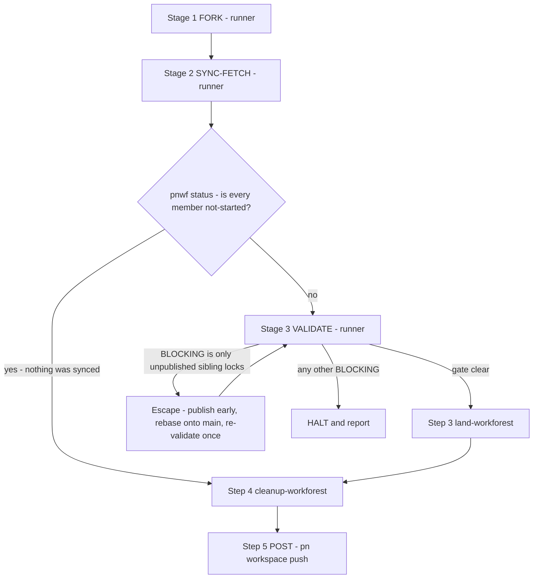

# /pn-workspace-sync

You are running the **sync** consumer of the workforest work-cycle. It fetches
each repo's remote changes and rebases the workspace onto them in an isolated
coordinated set, validates and lands that set onto the local primary branches,
tears the set down, then publishes.

## Announce first (MUST)

Open by telling the user plainly, in one line, what this will do:

> This will fetch + rebase every repo in the workspace in an isolated workforest,
> land it onto local `main`, and — on success — **push every repo to
> `origin/main`**. You invoked `/pn-workspace-sync`; that invocation is the
> authorization to push. I will not ask again.

Do **not** add a second approval gate. A human ran this command; that IS the
authorization. (If a repo's `integrate-branch` strategy turns out to be
`pull-request`, landing will stop-and-report at that repo per `land-workforest`
— that is expected, not a failure to work around.)

## The pipeline

The read/build-heavy prefix (fork → sync-fetch → validate) runs in an isolated
subagent; the main session then lands, cleans up, and publishes. Stop and report
if any stage halts.



1. **Dispatch the runner.** Dispatch the subagent
   `pn-workspace-rules:pnwf-runner` via the Task tool with NO model override (its
   frontmatter pins Sonnet), passing the absolute `CANONICAL_ROOT`,
   `BRANCH = pn-workspace-sync`, and any caveats the user gave this session. The
   runner does fork → sync-fetch → validate in isolation and returns a single
   strict-JSON status line.

   **The brief MUST NOT offer the runner `run_in_background` (MUST).** The
   standing long-command guidance — "set an explicit timeout **or** run with
   `run_in_background` and watch it with Monitor" — is written for THIS session,
   which survives to receive the completion notification. A subagent does not, so
   a backgrounded stage is torn down mid-write: no JSON status line, prose in its
   place, and a part-rebased set someone must disposition (bd `pg2-es5nn`,
   observed on the sibling `pnwf-update-runner`). Forward the **timeout half
   only**; the runner's own R2 pins `600000` ms for its long steps. If the brief
   restates the long-command rule, it MUST state that the background option is
   withheld for a subagent.

2. **Handle the runner's JSON status.**
   - **`gate` / `fork` / `resume-vs-discard`** → decide WITH the user per
     `fork-workforest` step 3 (resume the existing set, or discard + re-fork),
     then continue the SAME runner (send it the decision) — its context is
     preserved.
   - **`gate` / `sync-fetch` / `rebase-conflict`** → conflicts are the EXPECTED
     case for sync. Resolve the conflict WITH the user in the reported worktree,
     run `git -C <path> rebase --continue`, then continue the SAME runner (it
     re-runs `pnwf sync-fetch`).
   - **`gate` / `sync-fetch` / `worktree-dirty`** → the reported member had
     UNCOMMITTED CHANGES, so `pnwf sync-fetch` (exit 6) attempted nothing there —
     no fetch, no rebase. Do NOT treat this as a `rebase-conflict` and do NOT run
     `git rebase --continue` or `--abort`: nothing was started, so there is
     nothing to continue or abort and either command fails. Show the user
     `git -C <path> status`, decide WITH them whether that work is committed or
     stashed, then continue the SAME runner (it re-runs `pnwf sync-fetch`, which
     fetches and rebases that member for the first time). Expect this gate
     whenever a member is left deliberately dirty; `pnwf` checks it itself
     because with `rebase.autoStash` on git would NOT refuse — it would stash,
     rebase and pop, reporting success even when the pop conflicts, so the run
     would look clean while that worktree sat at `UU <file>` (bd `pg2-lgzcg`).
     Same condition and same disposition as `integrate-branch`'s FF-0b
     `stopped:worktree-dirty` at land time, deliberately sharing its name.
   - **`gate` / `sync-fetch` / `rebase-refused`** → `git rebase` was REFUSED in
     the reported worktree and NEVER STARTED (`pnwf sync-fetch` exit 4), so
     NOTHING there is mid-rebase. Do NOT treat this as a `rebase-conflict` and do
     NOT run `git rebase --continue` — there is no rebase to continue and the
     command fails. This is NOT the dirty-worktree case (that is `worktree-dirty`
     above, and `pnwf` confirmed this tree CLEAN before rebasing): the cause is
     git's own refusal — an `origin/<primary>` that does not resolve, or a
     `pre-rebase` hook veto. Relay `pnwf`'s verbatim stderr and git's message,
     fix the cause WITH the user, then continue the SAME runner (it re-runs
     `pnwf sync-fetch`).
   - **`halt`** → surface the reason and STOP; do NOT work around a canonical
     anomaly (R-3/R-8) or a broken validate. Reasons are `fetch-failed`,
     `rebase-indeterminate`, `dirtiness-indeterminate`,
     `sync-fetch-unrecognised`, `incomplete-sync`,
     `validate-failed`, or a `fork` reason line. The ONE
     exception is a `validate-failed` whose every `BLOCKING` line is an
     unpublished-sibling-lock `flake-lock-fresh` finding — see
     [the documented escape](#escape-validate-blocks-only-on-unpublished-sibling-locks).
     Every other `validate-failed` is a hard stop.
   - **`halt` / `sync-fetch` / `incomplete-sync`** → the runner's turn ended
     before the fetch+rebase finished. The halt carries a `dirty` array (read it
     as `.dirty // []`) naming each dirty or `mid_rebase` member and its file
     paths; surface those verbatim and name the recovery the user can then
     authorize — disposition the named residue, then re-run
     `pnwf sync-fetch --set` in the set (THIS session may background that; it
     survives to receive the notification). Treat it as `incomplete-sync`, NOT as
     a `rebase-conflict` gate: no conflict was observed, so `rebase --continue` is
     not automatically the right move. A missing/prose response where the JSON
     line belongs is the same class of failure — probe the set rather than
     assuming the stage finished.
   - **`noop`** → `origin` had nothing new for any member, so the set is identical
     to the workspace it was forked from: there is nothing to validate and nothing
     to land. You MUST skip step 3 (`land-workforest`) and go straight to step 4
     (`cleanup-workforest`) and then step 5 (POST) — see
     [the no-op short-circuit](#the-no-op-short-circuit).
   - **`done`** → proceed to the main-session landing stages below.
   - If `model_env` is not `unset`/`sonnet`, WARN the user before continuing
     (silent-Opus guard: an env override may have forced a non-Sonnet model).
3. **`land-workforest`** — invoke the Skill in the main session (cwd persists
   here, so `integrate-branch` works as authored). It lands each repo in topo
   order, stop-on-blocked; handle its outcomes per that skill (`landed` / nothing
   to land / `pr-opened`/`pr-updated` / `stopped:<reason>` → stop-and-report as
   it specifies). **SKIPPED on the `noop` path** — every member is already an
   ancestor of its primary, so there is nothing to land.
4. **`cleanup-workforest`** — invoke the Skill in the main session. This step runs
   on EVERY path that reached a set, `noop` included: going "straight to POST"
   MUST NOT leave the set orphaned. Invoke it with NO force flag — the default is
   safe (it keeps anything un-landed), and on the `noop` path every member's
   branch is provably an ancestor of its primary, so the default path removes all
   of them and the set directory losslessly.
5. **POST — publish (main session):**
   - `pn workspace push` — the ONE publish step. It walks the repos in topological
     order and, per repo, relocks that repo's workspace-sibling flake inputs
     against their upstreams' current remote tips (committing any bump), then
     pushes. Because dependencies are pushed first, a consumer relocks onto the
     tips just published in this same run — which is why publishing and relocking
     are interleaved in one command rather than split across two (ADR 0023).
   - There is **no** `pn workspace update --siblings-only` step here any more.
     `update` is local-only and does not push, so it can no longer publish
     anything (ADR 0023, beads pg2-j2f8f / pg2-x42j3). Do not re-add it.
   - If a repo has uncommitted changes, `push` refuses to relock it and STOPS
     (the relock ends in a commit). Report the named repo; the user then commits or
     stashes, or authorizes `pn workspace push --no-siblings` to publish without
     propagating locks.
   - **This step is what discharges validate's `flake-lock-fresh` warnings.**
     `sync-fetch` advances sibling HEADs, so consumer locks go stale by
     construction; validate warns rather than halting on exactly that drift
     (`validate-workforest` step 5, bd `pg2-1i1ev`) because only a published rev can
     be pinned and nothing in-set can converge it. The relaxation is therefore
     CONDITIONAL on this step running: if publishing is ever removed, reordered
     before validate, or routinely run as `--no-siblings`, that carve-out becomes a
     silent hole and MUST be revisited with it.
   - **The escape's early publish does NOT breach that condition** — hold onto the
     distinction. What the carve-out depends on is that a publish FOLLOWS validate
     and land, so the drift it downgraded actually gets converged.
     [The escape](#escape-validate-blocks-only-on-unpublished-sibling-locks) ADDS an
     earlier publish of the already-landed backlog and still reaches this step at the
     end (E-5), so the condition holds. What WOULD open the hole is REPLACING the
     final publish with the early one: a run MUST NOT end after the escape's publish
     without reaching this step again.

## The no-op short-circuit

**When it fires.** After a clean Stage 2 the runner classifies the set with
`pnwf status <BRANCH>` and returns `noop` when EVERY member is `not-started` — no
member ahead of its primary, none dirty, none with its worktree already removed.
That is what `origin` carrying nothing new for any repo looks like: every rebase
was a no-op, so each member's branch still sits exactly on its canonical primary.

**Why it exists.** "Workspace ahead of `origin`, `origin` with nothing new" is the
NORMAL steady state after any `/drain-beads` run, because drain lands locally and
never pushes. In that state this pipeline used to DEAD-END (bd `pg2-6gjcy`):
validate ran `pn workspace doctor` in the set, where `flake-lock-fresh` compares
each consumer's pin against the target member's committed HEAD, and while local
primary is ahead of `origin/<primary>` every such pin is stale BY CONSTRUCTION.
Nothing was un-landed, so no target appeared in `pnwf land-plan` and
`validate-workforest` step 5's exemption did not apply — the findings stayed
`BLOCKING`. Doctor's hint named `pn workspace update --siblings-only`, but the only
step that can converge those pins is the POST publish below, which runs AFTER
validate. Validate could never pass until the commits were published, and
publishing was gated behind validate; so the batch-publish path was blocked exactly
when it was most needed.

**Why this fix and not a wider one.** The short-circuit does NOT weaken the
validate gate — it recognises that there is NOTHING TO VALIDATE. Validate exists to
prove the REBASE did not break the assembled workspace; on this path no rebase
happened, and the set is identical to the local primaries it was forked from, which
is state this run did not produce. The wider alternative — broadening step 5's
carve-out to also exempt `flake-lock-fresh` findings whose target has NO un-landed
commits — is REJECTED and MUST NOT be done here: that carve-out's own text warns it
"becomes a silent hole" if the conditions around it shift, and widening it would
waive the check on genuinely stale pins too. Step 5 is left exactly as authored.

**What the path MUST do.**

- You MUST skip step 3. Every member's branch is already an ancestor of its
  primary, so `land-workforest` has nothing to integrate.
- You MUST still run step 4 (`cleanup-workforest`), with NO force flag. Going
  "straight to POST" MUST NOT orphan the set.
- You MUST then run step 5 (POST) unchanged. The publish IS the fix: it walks the
  repos in topological order, pushes each one's already-landed local commits, and
  relocks each consumer's sibling inputs onto the tips just published — which is
  precisely the convergence the stale pins were waiting on.
- Authorization is UNCHANGED. The short-circuit MUST NOT make publishing any more
  automatic than it already is: the "Announce first" statement above already told
  the user this run pushes every repo to `origin/main`, and that announcement plus
  their invocation is the authorization. You MUST NOT add an approval gate here,
  and MUST NOT publish anything the normal path would not have published.
- You MUST report, in one line, that you took the short-circuit and why (`origin`
  had nothing new for any member, quoting the runner's `pnwf status` table), so the
  absence of land output is explained rather than looking like a skipped stage.
- After POST you SHOULD run `pn workspace doctor` READ-ONLY from the canonical root
  as the close-out: it MUST now report no `flake-lock-fresh` finding, which is the
  observable proof the deadlock is cleared. You MUST NOT pass `--fix` — its
  `branch-synced` plan mutates the canonical clone and cannot publish an ahead-only
  divergence anyway.

**What this path deliberately does not prove.** No `pn workspace build` runs, so
the state being published is local primary EXACTLY as this run found it. That is
not a gap this command opened: on the no-op path the only thing an in-set build
could have built IS local primary, and each commit on it was gated by whatever
landed it. If you want a pre-publish build anyway, run the Completion-Gate tier on
the canonical primary BEFORE step 5 — it is a MAY, not a requirement.

**Why the set is forked at all.** Whether `origin` has anything new is only knowable
after a fetch, and the fetch belongs in the set (that is what keeps a rebase away
from the canonical clones). So the set is created, found empty of work, and torn
down. Detecting the no-op is cheap; skipping the fork is not, and is not attempted.

## Escape: validate blocks only on unpublished sibling locks

The short-circuit above covers the case where NOTHING was synced. The residual case
is MIXED: `origin` had new commits for some repo, so Stage 2 really did rebase and
the run is not a no-op, while a DIFFERENT repo's primary either still carries
locally landed but unpublished commits, or is already fully published while a
consumer's pin still lags it — e.g. left behind by an earlier `pn workspace push`
that was rejected non-fast-forward partway through (bd `pg2-olk6c`). Either way the
target is absent from `pnwf land-plan` (it is an ancestor of its primary — nothing
to land), so step 5's exemption correctly does not apply and validate halts. When
the target itself is unpublished, only the POST publish converges the pin (E-2's
first case); when the target is already published, only POST's relock half does
(E-2's second case).

This is the ONE sanctioned deviation from "do not work around a broken validate",
and it is bounded:

- **E-1** It applies ONLY when EVERY `BLOCKING` line in the runner's
  `validate-failed` detail has `check == flake-lock-fresh`. One `BLOCKING` line
  from any other check, or a `pn workspace build` failure, and there is NO escape —
  HALT and report.
- **E-2** For each such finding's TARGET you MUST prove the drift is
  convergeable by what remains of this run, and MUST record the readings:

  ```bash
  cd <CANONICAL_ROOT> && export PN_WORKSPACE_ROOT="$PWD" && pn workspace doctor --json |
    jq -r '.findings[] | select(.check == "branch-synced") | "\(.repo)\t\(.message)"'
  ```

  Two shapes are admissible. Either the target's `branch-synced` line carries
  `ahead N` with `N > 0` and no `behind` — the UNPUBLISHED-LOCAL case: the primary
  holds commits `origin` has not seen, and E-4's early publish is what converges
  the pin. Or the target has NO `branch-synced` line at all — the FULLY-SYNCED
  case (bd `pg2-olk6c`): `doctor` only emits this check when local HEAD differs
  from the resolved remote ref, so a target absent from the output is `ahead 0`,
  `behind 0`, already published. E-4's early publish has nothing new to push for
  that target, but step 5's PUBLISH step always performs its relock half for
  every repo in topological order regardless of whether that repo itself needed a
  fresh push (see step 5's description above) — so the stale consumer pin still
  converges, onto the tip the target already has. What converges it there is that
  relock, not a publish.

  Any other shape is NOT admissible — there is NO escape, HALT. In particular a
  `behind M` line, whether or not paired with an `ahead`, MUST HALT: an
  ahead-and-behind target is a separate, genuinely unhandled hazard elsewhere in
  this pipeline (`land-workforest`/ff-merge-to-main, bd `pg2-xl9ez`), so its
  `ahead` half MUST NOT be treated as the unpublished-local case above. A plain
  `behind` (no `ahead`), a `Skipped` line (remote comparison skipped / remote rev
  unresolved), or any other shape is the same: nothing here converges it.
  (`branch-synced` is primary-mode only, so this MUST be run from the canonical
  root, not from the set. It is READ-ONLY: you MUST NOT pass `--fix`.)

- **E-3** You MUST announce the escape in one line before acting — naming that
  step 5 runs EARLY, which repos' unpublished commits it publishes, and which
  already-published targets (E-2's fully-synced case) it is relying on step 5's
  relock to converge instead. This is an announcement, NOT a new approval gate:
  the repos, the remote and the push are the ones the invocation already
  authorized, and only the ORDER changes.
- **E-4** The sequence is publish, re-sync, re-validate:
  1. Run step 5 (POST) now, from the canonical root. It publishes the already-landed
     backlog and relocks each consumer's sibling inputs against the newly published
     tips, committing the bumps on the canonical primaries.
  2. Rebase the set onto the now-bumped primaries — the relock commits landed on the
     CANONICAL primaries, and the set's members will not see them otherwise, so
     without this the re-validate re-reads the same stale locks and fails
     identically:

     ```bash
     cd <SETDIR> && export PN_WORKSPACE_ROOT="$PWD" && pn workspace rebase main
     ```

     The export is load-bearing: `pn` honors an inherited `PN_WORKSPACE_ROOT` over
     cwd, so without it this rebases the CANONICAL clones.

  3. Re-run validate (continue the runner at Stage 3, or invoke
     `validate-workforest` in the set).

- **E-5** If validate is now clear, resume the pipeline at step 3 and run step 5
  again at the end — that second publish is what publishes THIS run's landed work.
  If a `BLOCKING` line remains, HALT: the drift was not the unpublished-local kind
  after all.
- **E-6** The escape MUST be taken at most ONCE per run. A second `validate-failed`
  with the same shape means the premise in E-2 is wrong, not that another publish is
  needed; HALT and report rather than looping.

Publishing early is safe in one specific sense worth stating: it publishes only
commits ALREADY on the canonical primaries, so if the run later halts, `origin`
holds a strict prefix of the intended end state and never a partially-landed set.

## Notes

- **Prefix vs. main session.** The `pnwf-runner` subagent offloads only the
  read/build-heavy prefix (fork → sync-fetch → validate). Land, cleanup, and
  publish stay in the main session because they are shell-state-sensitive
  (`integrate-branch` needs a persistent cwd + shell vars) and irreversible — a
  subagent's Bash calls do not persist cwd/env between calls, and a subagent
  cannot await its own background job across the end of its turn (only this
  session receives that notification), which is why the runner runs every stage in
  the foreground.
- The spine (fork → sync-fetch → validate → land → cleanup) performs no remote
  writes on the `ff-merge-to-main` path; the POST step is the deliberate,
  invocation-authorized push. Your invocation of `/pn-workspace-sync` is itself
  the authorization — do NOT re-ask before publishing.
- If any stage stops (e.g. a `pull-request` repo, an unresolved conflict, or a
  canonical anomaly), stop the whole run and report per that stage's guidance —
  do not push a partially-landed workspace. The single documented deviation is
  [the escape](#escape-validate-blocks-only-on-unpublished-sibling-locks), whose
  early publish carries only commits already on the canonical primaries and so
  never publishes a partially-landed set.
- **Neither new path is a relaxation of `validate-workforest` step 5.** The
  short-circuit skips validate because the set holds nothing to validate; the escape
  runs validate again and requires it CLEAR before landing. Step 5's classifier and
  its "target absent → stays an ERROR" rule are untouched, and a future change here
  MUST keep them that way — the deadlock this command solves is a PIPELINE-ORDER
  problem, not a reason to downgrade a check (bd `pg2-6gjcy`).
