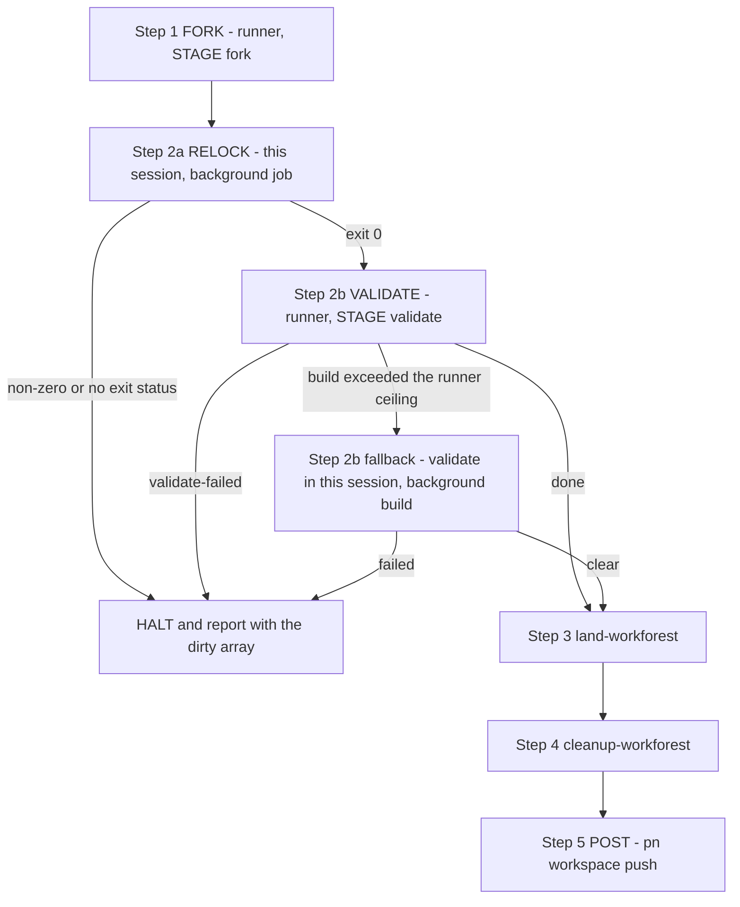

# /pn-workspace-update

You are running the **update** consumer of the workforest work-cycle. It relocks
every repo's flake inputs (nixpkgs + third-party + workspace siblings) in an
isolated coordinated set, validates and lands that set onto the local primary
branches, tears the set down, then publishes.

## Announce first (MUST)

Open by telling the user plainly, in one line, what this will do:

> This will relock every repo's flake inputs (nixpkgs + third-party + workspace
> siblings) in an isolated workforest, land it onto local `main`, and — on
> success — **push every repo to `origin/main`**. You invoked
> `/pn-workspace-update`; that invocation is the authorization to push. I will not
> ask again.

Do **not** add a second approval gate. A human ran this command; that IS the
authorization. (If a repo's `integrate-branch` strategy turns out to be
`pull-request`, landing will stop-and-report at that repo per `land-workforest`
— that is expected, not a failure to work around.)

## The pipeline

The two short, read/build-heavy stages that bracket the relock (fork, validate) run
in isolated runner subagents. The relock itself — the one stage that can outlast a
subagent's foreground ceiling — runs in THIS session as a background job, because
only this session survives to receive its completion notification. Land, cleanup,
and publish also stay here. Stop and report if any stage halts.



1. **Fork — dispatch the runner with `STAGE = fork`.** Dispatch the subagent
   `pn-workspace-rules:pnwf-update-runner` via the Task tool with NO model
   override (its frontmatter pins Sonnet), passing `STAGE = fork`, the absolute
   `CANONICAL_ROOT`, `BRANCH = pn-workspace-update`, and any caveats the user gave
   this session. It forks the set and returns a single strict-JSON status line.
   It does NOT relock.

   **The brief MUST NOT offer the runner `run_in_background` (MUST).** The
   standing long-command guidance — "set an explicit timeout **or** run with
   `run_in_background` and watch it with Monitor" — is written for THIS session,
   which survives to receive the completion notification. A subagent does not, so
   a backgrounded stage is torn down mid-write: no JSON status line, prose in its
   place (bd `pg2-es5nn`). Forward the **timeout half only**; the runner's own R2
   pins `600000` ms for its one long step (the validate build). If the brief
   restates the long-command rule, it MUST state that the background option is
   withheld for a subagent. The brief MUST NOT ask the runner to relock either
   (its R4 forbids it): the relock is step 2a, and is yours.

   Handle the runner's JSON status:
   - **`gate` / `fork` / `resume-vs-discard`** → decide WITH the user per
     `fork-workforest` step 3 (resume the existing set, or discard + re-fork),
     then continue the SAME runner (send it the decision) — its context is
     preserved. It re-confirms the set and returns `forked`.
   - **`halt`** → surface the reason and STOP; do NOT work around it. At this
     stage that is a `pnwf fork-preflight` reason line (a canonical anomaly,
     R-3/R-8) or `missing-stage` (a defect in YOUR brief: you omitted `STAGE`).
   - **`forked`** → the set exists and nothing is relocked yet; go to step 2.
   - If `model_env` is not `unset`/`sonnet`, WARN the user before continuing
     (silent-Opus guard: an env override may have forced a non-Sonnet model).
   - A missing/prose response where the JSON line belongs is a failure of that
     stage, not a success: re-derive state yourself (`cd <SETDIR> && pnwf resolve
--set`) before deciding anything. `<SETDIR>` is
     `<CANONICAL_ROOT>/.workforests/pn-workspace-update`.

2. **Relock, then validate.**

   **2a. Relock — in THIS session, as a background job (MUST).** Run, with the
   Bash tool's `run_in_background: true`:

   ```bash
   cd <SETDIR> && pnwf update-relock --set
   ```

   You MUST NOT run it in the foreground and MUST NOT delegate it to the runner.
   `update-relock` relocks EVERY member of the set (a `nix flake update` plus each
   repo's `update-locks.sh`), and this fleet's own scheduled updater budgets 60
   minutes for a SINGLE repo; the Bash tool's 600000 ms foreground maximum cannot
   hold that, which is the failure a runner-owned relock produced (bd
   `pg2-fy8wq`: a healthy relock halted `incomplete-update` at the ten-minute
   mark). Your running time is not the runner's: this session survives to receive
   the completion notification, so a long relock simply completes.

   Wait for the completion notification — it carries the payload's TRUE exit
   status; never infer success from a quiet log or a launcher exit code. If you
   need an active wait, use Monitor with an until-loop, never a `sleep`-then-check
   pair.

   Handle the outcome. Everything that follows is YOURS now: the runner no longer
   emits `update-failed` / `incomplete-update`, and no longer produces the `dirty`
   array.
   - **Exit 0** → go to 2b.
   - **Non-zero exit (`update-failed`) or the job ended with NO exit status
     (killed, stopped, torn down — `incomplete-update`)** → STOP and report. First
     make the residue READABLE: run the deterministic probe yourself,

     ```bash
     cd <SETDIR> && pnwf residue --set
     ```

     It prints a JSON array of `{repo, paths, mid_rebase}`, one entry per dirty
     member (`mid_rebase` is always `false` here; a clean set prints `[]`). That
     array IS the `dirty` array of this halt. Surface those paths verbatim in your
     stop-and-report, with the verbatim tail of the relock's output, and name the
     recovery the user can then authorize: disposition the named residue (a relock
     leaves regenerated lock churn, but that is only knowable after inspection),
     then re-run `pnwf update-relock --set` in the set. You MUST NOT go on to
     validate first: the residue is un-inspected work and dispositioning it is the
     user's decision. Do NOT justify that with "the pre-flight would refuse it
     anyway" — `pnwf residue` reports the REPORTING definition of dirty
     (untracked counts) while `update-relock`'s pre-flight applies `pn`'s
     narrower GATE one (tracked only), so a member whose only residue is
     UNTRACKED files is named in the array and would be relocked without
     complaint (bd `pg2-xc9b7`). TRACKED residue is what the pre-flight refuses.

   - **The probe's own FAILURE is not a finding of "clean".** If
     `pnwf residue --set` itself exits non-zero, `pnwf` could not classify some
     member: quote its stderr verbatim, name the residue as UNREAD rather than
     absent, and MUST NOT report `[]` (bd `pg2-deonn`).
   - **No exit status: check for a survivor first.** A job can lose its exit
     status while its process tree is still working. Run
     `lsof -a -d cwd +D <SETDIR>` (recursive; empty output means nothing is
     anchored there). If it shows a live process, wait for it to exit — Monitor
     with an until-loop — and only then run the residue probe above. Either way
     the status is still unknown, so the recovery is the same one: disposition,
     then re-run the relock. That re-run is safe over a set whose relock did
     finish: it only rewrites locks (it never merges), and its pre-flight still
     guards against a member with an upstream, tracked changes, or unreadable
     state.
   - **A genuinely dead relock** (process gone, residue present) therefore still
     halts, with the `dirty` array, exactly as before; only the HEALTHY-but-slow
     relock changed outcome (it now completes).
   - **The recovery above applies only when the failure NAMES dirty residue.**
     `update-relock`'s pre-flight also refuses a member whose git state it
     **could not read** — its message says `could NOT be determined`, and it
     refuses precisely because that guard prevents a remote write and so fails
     CLOSED (bd `pg2-deonn`). For that failure there may be no residue to
     disposition and the array may legitimately be `[]`: report the named path and
     the verbatim refusal, and have the user INSPECT that path (e.g. it exists
     but is not a git worktree). You MUST NOT call such a member dirty, MUST NOT
     read `[]` on a relock failure as "nothing to look at", and MUST NOT re-run
     the relock before the path is dispositioned — it will refuse identically.
     The pre-flight has three distinct refusals (a member with an upstream, a
     member with tracked changes, a member that `could NOT be determined`) and
     only its own line separates them, so quote that line verbatim rather than
     paraphrasing it.

   **2b. Validate — dispatch a FRESH runner with `STAGE = validate`.** The runner
   from step 1 has finished; a new dispatch re-derives everything from disk, which
   is what it is built to do. Same rules as step 1: Sonnet by frontmatter, no
   model override, `CANONICAL_ROOT` and `BRANCH`, the caveats, and the brief MUST
   NOT offer it `run_in_background` (restate that the option is withheld if the
   brief restates the long-command rule). Handle the status:
   - **`done`** → proceed to the main-session landing stages below.
   - **`halt` / `validate`** (`validate-failed`) → surface the reason and STOP; do
     NOT work around it. **Exception — the build outran the runner's ceiling.** If
     `detail` says the `pn workspace build` exceeded the foreground ceiling ("did
     not prove the set green"), that is validate UNPROVEN, not a broken build:
     invoke the `validate-workforest` skill in THIS session instead, and run its
     `pn workspace build` step as a background job (`run_in_background: true`),
     awaiting the completion notification as in 2a. Treat its verdict as the
     validate verdict. Any other `validate-failed` — a failing build, or a
     `BLOCKING` doctor line — is a hard stop.
   - If `model_env` is not `unset`/`sonnet`, WARN the user before continuing.
   - Unlike `/pn-workspace-sync`, there is **NO** `sync-fetch` stage and therefore
     none of its gates — not `rebase-conflict`, not `rebase-refused`, and not
     `worktree-dirty`: `/pn-workspace-update` relocks rather than fetch+rebase, so
     no runner ever rebases anything or emits any of them. The only gate is
     `fork` / `resume-vs-discard` in step 1. A dirty member is still refused in
     this flow, but by `pnwf update-relock`'s OWN pre-flight (step 2a).

3. **`land-workforest`** — invoke the Skill in the main session (cwd persists
   here, so `integrate-branch` works as authored). It lands each repo in topo
   order, stop-on-blocked; handle its outcomes per that skill (`landed` / nothing
   to land / `pr-opened`/`pr-updated` / `stopped:<reason>` → stop-and-report as
   it specifies).
4. **`cleanup-workforest`** — invoke the Skill in the main session.
5. **POST — publish (main session):**
   - `pn workspace push` — the ONE publish step. It walks the repos in topological
     order and, per repo, relocks that repo's workspace-sibling flake inputs
     against their upstreams' current remote tips (committing any bump), then
     pushes. Because dependencies are pushed first, a consumer relocks onto the
     tips just published in this same run — which is why publishing and relocking
     are interleaved in one command rather than split across two (ADR 0023).
   - There is **no** `pn workspace update --siblings-only` step here any more.
     `update` is local-only and does not push, so it can no longer publish
     anything (ADR 0023, beads pg2-j2f8f / pg2-x42j3). Do not re-add it.
   - If a repo has uncommitted changes, `push` refuses to relock it and STOPS
     (the relock ends in a commit). Report the named repo; the user then commits or
     stashes, or authorizes `pn workspace push --no-siblings` to publish without
     propagating locks.
   - **This step is what discharges validate's `flake-lock-fresh` warnings.**
     `update-relock` commits a lock bump per member, so consumer locks go stale by
     construction; validate warns rather than halting on exactly that drift
     (`validate-workforest` step 5, bd `pg2-1i1ev`) because only a published rev can
     be pinned and nothing in-set can converge it. The relaxation is therefore
     CONDITIONAL on this step running: if publishing is ever removed, reordered
     before validate, or routinely run as `--no-siblings`, that carve-out becomes a
     silent hole and MUST be revisited with it.

## Notes

- **Runner vs. main session (bd `pg2-fy8wq`).** The `pnwf-update-runner` subagent
  offloads only the two SHORT stages that bracket the relock — fork and validate,
  each a separate `STAGE` dispatch. The relock (`pnwf update-relock --set`) runs in
  THIS session as a background job, and so do land, cleanup, and publish. The split
  follows who can await what: a subagent cannot await its own background job across
  the end of its turn (only this session receives that notification), so every
  runner stage is foreground under the Bash tool's 600000 ms maximum, and a stage
  that can legitimately outrun that maximum — the whole-set relock — cannot live in
  the runner. Land, cleanup, and publish additionally stay here because they are
  shell-state-sensitive (`integrate-branch` needs a persistent cwd + shell vars) and
  irreversible; a subagent's Bash calls do not persist cwd/env between calls.
- The spine (fork → relock → validate → land → cleanup) performs no remote
  writes on the `ff-merge-to-main` path; the POST step is the deliberate,
  invocation-authorized push. `pnwf update-relock` itself refuses if any member
  branch has an upstream, so the in-set relock cannot write to a remote. Your
  invocation of `/pn-workspace-update` is itself the authorization — do NOT re-ask
  before publishing.
- If any stage stops (e.g. a `pull-request` repo or a canonical anomaly), stop the
  whole run and report per that stage's guidance — do not push a partially-landed
  workspace.
- **Ordering precondition.** `/pn-workspace-update` does NOT fetch or rebase onto
  `origin` first — it only relocks. It assumes `origin/main` is fast-forwardable
  from local `main`. Run `/pn-workspace-sync` FIRST to converge with `origin`. If
  the POST `pn workspace push` is rejected (non-fast-forward — `origin` advanced),
  STOP AND REPORT: the relock has already landed on local `main` but publish is
  deferred; recovery is to run `/pn-workspace-sync`, then re-publish. You MUST NOT
  force-push.
- **Why sibling convergence only happens in the POST step.** The in-set relock
  cannot converge sibling flake inputs to pushed tips — nothing is pushed in-set
  (the set validates via `--override-input`), so no sibling has a published tip to
  relock against. Nor can the post-land `pn workspace update` do it: a lock can
  only pin a rev that is already on the remote, and update no longer pushes. So
  `pn workspace push` is the only step that can converge them, and it does —
  push a repo, relock its consumers onto that new tip, push those, in topological
  order (ADR 0023, beads pg2-j2f8f / pg2-x42j3).
- **In-set update-phase hooks.** `pn workspace update --in-place` (which
  `pnwf update-relock` runs inside the set) fires each repo's `post-update` hooks
  (e.g. install-pre-commit-hooks). These warn-but-do-not-abort and write nothing
  into a working tree: each repo gets a private hook bundle under the worktree's
  git dir (`--private`), so they are a safe no-op for landing. See
  `docs/hooks.md`.
- **Known limitation.** An ADR-0020 "silently transient" relock step can leave a
  repo green while an update was skipped; this run reports `done` regardless
  (inherited from `pn workspace update`).
