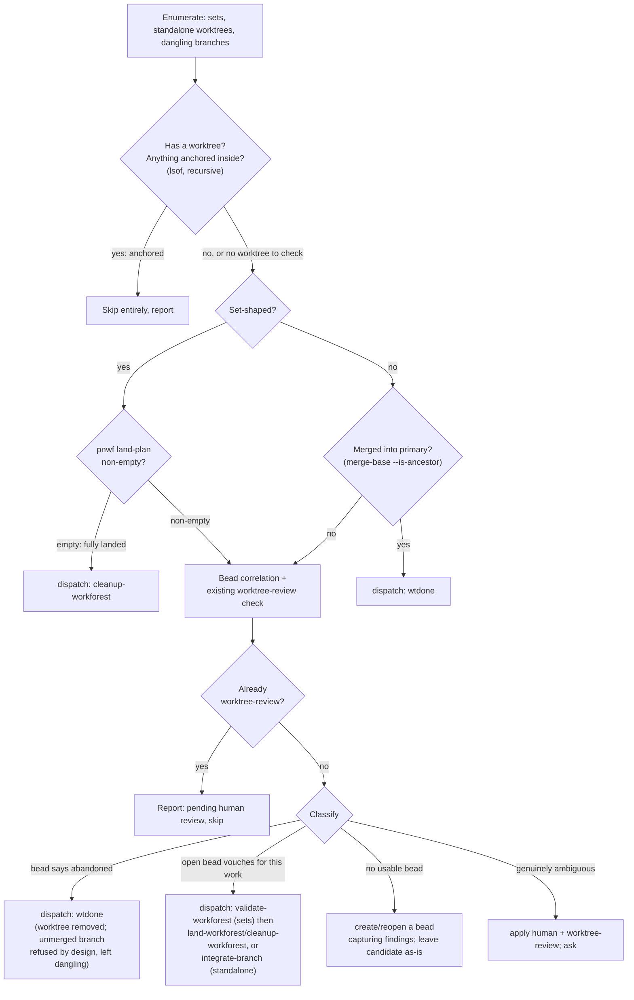

# audit-worktrees

**RUN FROM: the canonical pn-workspace root.** Confirm with `pn workspace discover`; a non-zero
exit or "no workspace found" means this skill does not apply here — halt and report. This skill
is scoped to the repos the workspace declares, not to arbitrary git repos on the machine.

## Purpose

A **Facade** over existing primitives (`pa-monitor`, `wtdone`, `integrate-branch`,
`validate-workforest`, `land-workforest`, `cleanup-workforest`, `bd`) that answers one question,
workspace-wide, for every branch and worktree that exists but is not the canonical checkout of a
repo's primary branch: **is anything still using this, and if not, what disposes of it?** It adds
no new git or landing mechanics of its own beyond the classification logic — every mutating
action it takes is executed by a skill or tool that already implements that action correctly.

## Disambiguation

- **Not a single-target tool.** For one already-identified branch or set, call `integrate-branch`,
  `land-workforest`, or `cleanup-workforest` directly — this skill's only job is the workspace-wide
  sweep and the classification that decides which of those to invoke, on what.
- **Not a bead-quality pass.** It reads and writes beads only to record disposition and hand off
  unfinished work; it does not groom titles/acceptance-criteria (`bead-grooming`'s job).
- **Never finishes the underlying work itself.** This skill MUST NOT write, edit, or complete any
  code toward a branch's own goal. The **orchestrator** — this skill's own execution — takes only
  three kinds of direct action: read-only research, bead bookkeeping (create/reopen/close/
  annotate), and applying/checking the `human`/`worktree-review` labels. Every action that
  mutates a candidate's git state (landing it or removing it) is delegated to a **dispatched
  action subagent** (Command pattern: the orchestrator decides _which_ disposition applies, the
  subagent executes it). The action subagent itself invokes the highest-level existing mechanism
  that does the job — `wtdone`, `integrate-branch`, `land-workforest`/`cleanup-workforest` — and
  MAY fall through to direct git plumbing (`git worktree add`, `git worktree remove`) only as
  that mechanism's own documented low-level step, never as a substitute for it (see Step 3's
  "no force-delete" policy below for the one place this matters).

## Safety contract (MUST)

- MUST run the liveness check (Step 2a) before any research or action on a candidate that has a
  worktree. MUST NOT act on, or write a bead about, a candidate a live process is anchored in.
- MUST check a correlated bead's **existing** labels before classifying it (Step 2c/3b). A bead
  already carrying `worktree-review` is, per `beads-lifecycle` W-3/W-4, **not to be re-labeled,
  re-promoted, or re-classified** — it stays exactly as a prior pass left it until a person
  records a verdict. Report it as "already pending human review" and move on.
- MUST NOT act on a candidate whose disposition is genuinely ambiguous — apply
  `human`+`worktree-review` and move on to the next candidate instead.
- MUST invoke the `beads-lifecycle` skill before any `bd create`/`update`/`close`, and before
  applying or removing the `human`/`worktree-review` labels, per its always-on tripwire.
- MUST run every `bd` lookup/write for a candidate from inside that candidate's own repo (its
  canonical clone or worktree), never from an unrelated cwd — `bd` resolves its database by
  filesystem walk-up, and a token extracted from a branch name resolved against the wrong
  tracker context could coincidentally hit an unrelated bead. Prefer the `bd search`/`bd list
--label <repo-label>` fallback's title match to corroborate a bare id-token hit.
- MUST NOT force-delete a branch (`git branch -D`) anywhere in this skill, even when a bead
  confirms the work is abandoned. `wtdone` deliberately only ever does a plain `-d` (refuses an
  unmerged branch) — see Step 3's removal policy. This skill does not reintroduce a force path
  `wtdone` itself declined to provide.
- MUST serialize action-subagent dispatches (land/remove) within a single repo — at most one
  in-flight per repo — but MAY run them concurrently across different repos. Research
  (read-only) MAY be parallelized freely across candidates.
- MUST NOT use `subagent_type: "fork"` for any dispatch if this skill itself is running inside an
  already-dispatched subagent (FK-1) — use `general-purpose` there instead.
- When self-triggered opportunistically (noticing clutter mid unrelated task, rather than an
  explicit "audit worktrees" ask), MUST say one line up front — what triggered it and roughly how
  many candidates were found — before taking any action. This is a courtesy heads-up, not an
  approval gate: the dispositions below still proceed without waiting for a reply.

## Step 1 — Enumerate candidates (read-only)

1. **Coordinated sets:** `pn workspace workforest list`.
2. **Standalone worktrees:** per repo, `git worktree list --porcelain`, excluding that repo's own
   canonical entry and anything under `.workforests/` (already covered by step 1).
3. **Dangling branches:** per repo, every `refs/heads/*` that is neither the primary branch nor
   checked out in any worktree found above.

Every candidate is one of: **set**, **standalone worktree**, or **dangling branch**.



## Step 2 — Per-candidate gates and set handling

**2a. Liveness check (MUST run first, before any research, for anything with a worktree).**
`pa-monitor`'s `path:` selector is an **exact string match** on a session's cwd
(`sv.Cwd == t.Path` in the daemon), so it does **not** catch a session cwd'd into a subdirectory
of the worktree — do not rely on it as the primary signal. Instead run the same recursive check
`wtdone` itself uses: `lsof -a -d cwd +D <worktree-path>` (empty output = nothing anchored,
non-zero exit is expected/normal and not itself a failure). This catches any live process —
Claude session, shell, editor — anchored anywhere under the tree, which is the correct, broader
reading of "actively working" here. Treat `pa-monitor status`/`info path:<worktree-path>` as a
**secondary, informational** signal only (useful for naming _which_ session it is in the report),
never as the sole gate. A dangling branch has no worktree to check — skip straight to
classification for it.

Residual gap, disclosed rather than solved: for the **landing** disposition (Step 3's
"open bead vouches" path), `integrate-branch`'s own liveness guard (inside `ff-merge-to-main`'s
FF-4) only runs _after_ the rebase and fast-forward merge have already happened — a session that
starts in the worktree after this check but before FF-4 would have its branch merged out from
under it, with only the final worktree/branch deletion blocked. This is the same window every
other `integrate-branch` invocation in this workspace already accepts; this skill does not widen
it, and does not attempt to close it.

**2b. Set-shaped candidate — same four-way classification as a standalone branch, gated by a
fast path.** Do not skip straight to landing.

1. `pnwf land-plan <branch>`. **Empty** (every member already an ancestor of its primary, or its
   worktree already gone) → this set is fully landed with nothing left to do — dispatch an action
   subagent to run `cleanup-workforest` alone. **No approval, no bead needed** beyond closing one
   if it was already open for this set.
2. **Non-empty** → real unlanded work exists. Run the same bead-correlation-and-classification as
   Step 3b/3c below (branch-id extraction from the set's branch name, existing-`worktree-review`
   short-circuit, abandoned/vouched/no-bead/ambiguous). Only on the **vouched** branch does this
   skill dispatch an action subagent to run, in order, `validate-workforest` then
   `land-workforest` then `cleanup-workforest` inside the set (mirroring what
   `/pn-workspace-sync` already does — `validate-workforest` immediately precedes landing per
   its own contract, never skip it). On `stopped:<reason>`/`pr-opened`/`pr-updated` from
   `land-workforest`, handle identically to Step 3c's standalone `stopped` case: refresh the bead,
   do not force anything, do not run `cleanup-workforest` (a partially-landed set must not be torn
   down — `land-workforest`'s own partial-block policy already refuses this). On **abandoned**,
   dispatch `cleanup-workforest` with no force flags — it keeps any member with real unlanded
   commits and reports it, which is the correct, non-destructive outcome (this skill does not pass
   `--force-unlanded-branch-removal`; that flag is reserved for an operator's own explicit call).

## Step 3 — Standalone worktree / dangling branch: classify and act

**3a. Merged check.** `git merge-base --is-ancestor <branch> <primary>` (exit 0), or the branch is
already absent from `git branch --list` (already torn down elsewhere). Either way: dispatch an
action subagent to run `wtdone <branch>` — it is the uniform handler for _every_ removal in this
skill, whether or not a worktree exists (per `wtdone.sh`, a branch with no worktree simply skips
the worktree steps and goes straight to the branch delete). **No approval; no bead write needed**
unless a bead was already open for it, in which case close it with a landed reason.

**3b. Not merged — research (parallelizable across candidates, read-only, run from inside the
candidate's own repo per the Safety contract's `bd`-cwd rule).**

- Extract a bead-id-shaped token from the branch/directory name; validate it with `bd show
<token>` rather than assuming a fixed prefix (this workspace shares one tracker across repos with
  no cross-repo naming guarantee). If nothing matches, fall back to `bd search`/`bd list --label
<repo-label>` (the repo's label per its own `CLAUDE.md` "Beads Labels" section) for a title/body
  match on the branch name.
- If a bead is found, read its full state: `bd show <id> --json` — status, **labels** (check for
  `worktree-review` first — see Safety contract), notes, comments.
- Pull light context regardless of whether a bead was found: `git log <primary>..<branch>`
  (commit messages, last-commit date) and, if present, the worktree's own Claude transcript
  (`~/.claude/projects/<slugified-cwd>/*.jsonl`, the same path convention `pa-monitor` uses) for
  what a prior session said it was doing there.

**3c. Classify from the research and act:**

- **Already `worktree-review`-labeled** → report "pending human review" and stop here. Do not
  re-classify, re-promote, or touch the worktree/branch (W-3/W-4).
- **Bead evidence rules this abandoned** — closed wontfix/moot, or a comment/note explicitly
  deciding against it (in the spirit of `beads-lifecycle`'s `decided-against?` probe, though that
  probe's own runnable form is designed for an absent-artifact check across _all_ beads, not
  strictly this bead's own history — treat this as the same kind of check, not a literal
  citation) — dispatch an action subagent to run `wtdone <branch>`. If the branch turns out to be
  genuinely unmerged, `wtdone` removes the worktree and then refuses the branch delete (exit
  non-zero) **by design** — that is the expected, correct outcome here, not a failure to recover
  from: report "worktree reclaimed, branch `<name>` left dangling (unmerged; not force-deleted per
  policy)." If the bead is still open, close it with that reason first. **No approval.**
- **An open bead already vouches for this exact work** — its title/description plausibly matches
  what's actually in the worktree (not merely present; drifted-and-no-longer-matching counts as
  "no usable bead" below) — dispatch an action subagent to invoke `integrate-branch`. For a
  dangling branch, it creates a throwaway worktree first (`git worktree add`) purely so
  `integrate-branch` has a cwd to run from.
  - `landed` / `pr-opened` / `pr-updated` → close or annotate the bead accordingly. **No
    approval.**
  - `stopped:<reason>`, or `integrate-branch` itself reaches an unresolvable "ask the user" (null
    strategy) — treat both identically: never let the subagent block on a live prompt. Run
    `wtdone <branch>` — its expected outcome here (worktree removed, unmerged branch refused, per
    3a above) is exactly what's wanted: the throwaway worktree is reclaimed and the branch's real
    work is preserved untouched. Refresh the _same_ bead with the concrete stop reason so a
    `/drain-beads` session can pick it up next. **No approval.**
- **No usable bead** — none found, or a found bead is closed as done/landed while the branch is
  provably unmerged (a premise-freshness violation per `beads-lifecycle` F-1's `landed?` probe),
  or a found bead's content has drifted from what's actually in the worktree — create a new bead
  (or reopen the stale one, noting the drift) capturing the research from 3b: what's there, since
  when, what a prior session said. Leave the worktree/branch untouched for a future drain session
  to claim and finish. **No approval.**
- **Genuinely ambiguous** — cannot tell keep vs. discard: no bead and no discernible purpose from
  git log/transcript, or the signals conflict (e.g. a bead says abandoned but the branch has
  commits newer than that ruling) — apply `human`+`worktree-review` per `beads-lifecycle`
  W-1/W-2 (entry marker, priority-promotion record, in the same `bd update`). Leave the
  worktree/branch untouched. **This is the one disposition that asks a person.**

## Step 4 — Report

One end-of-run table, in the same spirit as `session-wrapup:wrap-up-session`'s summary:

```
Audit-worktrees — <N> candidates (<sets>, <standalone worktrees>, <dangling branches>)

| candidate                      | kind      | disposition                | bead                 |
|---------------------------------|-----------|-----------------------------|----------------------|
| feat-x (nix-personal)            | worktree  | removed (merged)            | —                    |
| pg2-9k2ab (repo-base)            | worktree  | landed                      | pg2-9k2ab closed     |
| drain/pg2-4f1qz (support-apps)   | worktree  | stopped (rebase-conflict)   | pg2-4f1qz refreshed  |
| old-spike (personal)             | dangling  | bead created                 | pg2-new1 (P3)        |
| stale-try (personal)             | worktree  | reclaimed (abandoned, unmerged branch left dangling) | pg2-old3 closed |
| mystery-wt (ziprecruiter)        | worktree  | flagged for review          | pg2-new2 (human)     |

Skipped (active/anchored): 1 (feat-y, process anchored in ziprecruiter worktree)
Already pending review: 1 (pg2-oldrev, left untouched)
Degraded detection: pa-monitor unreachable for <repo> — relied on lsof only (no functional loss)
```

A `landed` outcome sits on that repo's local `main`, unpushed — as with `wrap-up-session`, this is
expected and MUST NOT get its own report section; mention it only in the one case it blocks work,
as a single line.

## Frontmatter constraint: never set `disable-model-invocation`

This skill MUST NOT carry `disable-model-invocation` in its frontmatter. Doing so drops it from
the model-visible skill listing and makes it unreachable by the Skill tool — for every sibling
stage skill in this plugin that mistake was made once and reverted (bd `pg2-dytfv`,
`pg2-okzl0`), each reachable afterward only because a pipeline command (`/pn-workspace-sync`)
still dispatched it directly. This skill has no such pipeline fallback: it is meant to be reached
both by an explicit ask and by an agent's own opportunistic noticing, so setting the flag here
would make it unreachable outright, not just less discoverable.

## Command quick reference

| need                                             | command                                                                                       |
| ------------------------------------------------ | --------------------------------------------------------------------------------------------- |
| coordinated sets                                 | `pn workspace workforest list`                                                                |
| standalone worktrees per repo                    | `git worktree list --porcelain`                                                               |
| dangling branches per repo                       | `git for-each-ref --format='%(refname:short)' refs/heads/`, diffed against the above          |
| merged check                                     | `git merge-base --is-ancestor <branch> <primary>`                                             |
| liveness check (primary)                         | `lsof -a -d cwd +D <worktree-path>` (recursive; empty = nothing anchored)                     |
| liveness check (informational only)              | `pa-monitor status` / `info path:<worktree-path>` — exact-match cwd, not subdirectory-aware   |
| set fast path                                    | `pnwf land-plan <branch>` (empty → already fully landed)                                      |
| remove a worktree and/or branch (uniform)        | `wtdone <branch> [--cc <canonical>]` — handles no-worktree case natively, never force-deletes |
| land a standalone branch                         | invoke `integrate-branch:integrate-branch` (Skill tool)                                       |
| validate + land + cleanup a set                  | invoke `validate-workforest`, then `land-workforest`, then `cleanup-workforest` (Skill tool)  |
| bead correlation (run from candidate's own repo) | `bd show <token>`, `bd search`, `bd list --label <repo-label>`                                |
| existing-review short-circuit                    | check `bd show <id> --json`'s labels for `worktree-review` before classifying                 |
| abandoned-ruling probe                           | in the spirit of `beads-lifecycle`'s `decided-against?` (F-9)                                 |
| landed-claim verification                        | `beads-lifecycle`'s `landed?` (F-3)                                                           |
| doubt path                                       | `beads-lifecycle`'s `worktree-review` lifecycle (W-1..W-8)                                    |
