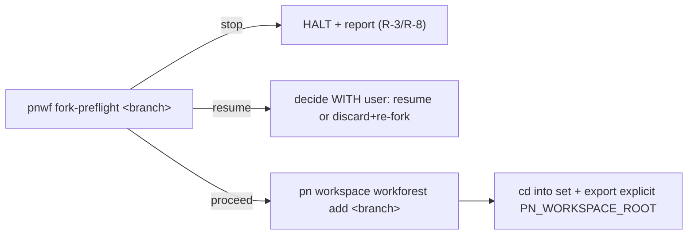

# fork-workforest

**RUN FROM: the canonical workspace root** (`<workspace_root>`, where
`pn-workspace.toml` lives). This stage MUST NOT be invoked from inside an
existing set (v1 forbids nesting).

**Purpose.** Create a coordinated workforest set on `<branch>` from the
canonical workspace, so a cross-repo change is worked in isolation while every
repo's primary branch stays free. This is the FORK stage of the reusable
workforest work-cycle.

**Disambiguation (MUST honor).** This acts on a WHOLE coordinated SET (all the
workspace's repos, or a `--repos` subset), not a single repo. For an isolated
single-repo change, use a plain `git worktree` — not this skill.



## Deterministic logic lives in `pnwf`; this skill owns only judgment

All fixed checks are in `pnwf fork-preflight`. This skill carries only the
runtime judgment: the resume-vs-discard decision, and relaying halts.

## Steps

1. **Preflight (MUST).** Run `pnwf fork-preflight <branch> [--repos a,b,…]`. It
   prints one of `proceed`, `resume`, or `stop` plus a reason line. **Treat any
   non-zero `pnwf` exit as halt-and-report** — do not work around it.
2. **On `stop`** — the canonical clone is off its primary branch or dirty, or you
   are nested inside a set. **HALT and report** the reason to the user (R-3/R-8).
   Do NOT reset, re-checkout, stash, or otherwise "fix" the canonical clone.
3. **On `resume`** — a set directory and/or the `<branch>` already exist
   (`pn workspace workforest add` errors on an existing set dir and would reuse an
   existing branch's stale tip). This is a judgment call: present the situation
   and **decide WITH the user** whether to (a) resume the existing set (just
   `cd` into it and continue the WORK) or (b) discard it
   (`pn workspace workforest remove <branch>` and, if the branch should be reset,
   delete it) and re-fork. Do not silently pick one.
4. **On `proceed`** — from the canonical root run:

   ```bash
   pn workspace workforest add <branch> [--repos a,b,…]
   ```

   This creates a worktree per repo (all repos, or the named subset) on
   `<branch>`, branched from each canonical `HEAD` (= the local primary, v1's
   only base). Then enter the set and pin the workspace root explicitly:

   ```bash
   cd <workspace_root>/.workforests/<branch>
   export PN_WORKSPACE_ROOT="$PWD"
   ```

   Use the **explicit** `PN_WORKSPACE_ROOT=<setdir>` form (a bare `unset` does not
   survive across separate shell/tool invocations, and a stale exported value
   silently redirects `pn` to the canonical workspace). `pnwf resolve` prints the
   exact value to use.

## Branch naming (MUST)

Name `<branch>` a **single path segment** — e.g. `wf-<bead-id>-<slug>` or
`<bead-id>-<slug>`. A slash (e.g. `wf/<id>`) nests the set directory as
`.workforests/wf/<id>` and currently defeats `in_workforest` detection
(tracked: pg2-u1ubb). `/pn-workspace-sync` uses the fixed single-segment name
`pn-workspace-sync`.

## After forking

The set is now an ordinary workspace root; every `pn workspace` verb operates on
its worktrees. Proceed to the WORK (freeform, or a consumer's recipe), then
`validate-workforest`, `land-workforest`, and `cleanup-workforest`.
