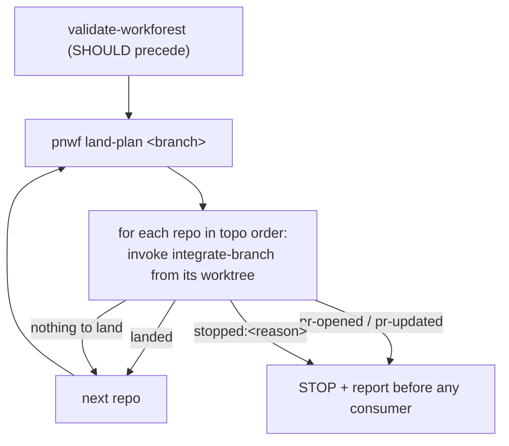

# land-workforest

**RUN FROM: inside the set** (`<workspace_root>/.workforests/<branch>`). Refuse
if `pnwf resolve` reports `in_workforest = false` (or exits non-zero) — **halt
and report**.

**Purpose.** Land the set's per-repo branches onto the local primary branches,
as a **best-effort ordered transaction**. This is a thin orchestrator over the
existing `integrate-branch` skill — it does NOT reimplement rebase, the
fast-forward-race retry cap, or strategy resolution; each repo's landing is
delegated to `integrate-branch`, which decides that repo's method
(`ff-merge-to-main` vs `pull-request`) itself.

**Disambiguation (MUST honor).** This lands a WHOLE coordinated SET — many
repos, in topological order. For a single branch/repo, call the
`integrate-branch` skill directly; this skill only adds the cross-repo **order**
and **stop-on-blocked transaction** semantics on top of it.

## No per-repo subagent fan-out (MUST NOT)

`pnwf` iterates repos in one process and landing is strictly ordered /
stop-on-blocked. Do NOT parallelize per-repo landing across subagents — it would
break the ordered-transaction guarantee and cause shared-build contention.

## Preconditions (MUST)

- No uncommitted changes anywhere in the set (run `validate-workforest` first;
  it SHOULD immediately precede landing).
- For `ff-merge-to-main` repos, the canonical clone MUST be on its primary branch
  and clean — `integrate-branch`'s FF-0 halts otherwise (R-3/R-8). Run
  `pnwf status <branch>` (or `pnwf land-plan`) up front; it pre-flights and
  reports canonical anomalies before you start. (`pull-request` repos do not
  require this — PR-0 surfaces but does not halt.)

## Steps

1. **Location guard + plan.** `pnwf resolve` (require in-set). Then
   `pnwf land-plan <branch>` yields the topo-ordered repos **still needing
   landing** (it uses `[ -e <setdir>/<member> ]` worktree presence, so repos an
   earlier landing already removed are skipped; subset sets enumerate from the
   set's own lock). Any non-zero `pnwf` exit → halt and report.
2. **Land each repo in order (MUST be topological).** For each repo the plan
   lists, `cd` into that repo's worktree and **invoke the `integrate-branch`
   skill** (an agent action via the Skill tool — NOT a shell command). MUST NOT
   land a repo ahead of a dependency it consumes. Handle the full outcome
   vocabulary:
   - **`landed`** → continue to the next repo.
   - **"nothing to land"** (0 commits ahead of primary) → continue.
   - **`pr-opened` / `pr-updated`** → this repo's change is now on a PR, **not**
     on the local primary. Any consumer of it would pin a stale sibling.
     **STOP and report** before landing any consumer.
   - **`stopped:<reason>`** (e.g. `stopped:rebase-conflict`,
     `stopped:ambiguous-remote`, `stopped:no-pr-host`, or a persistent ff-race)
     → **STOP and report**. Do NOT continue to later repos.
3. **Resume.** `integrate-branch`'s `ff-merge-to-main` handler (FF-4) removes a
   landed repo's worktree + branch, so a re-run's `pnwf land-plan` skips it. A
   `pull-request` repo keeps its worktree — re-running is idempotent (PR-2
   updates the existing PR), not skipped.

## Operator report on any stop (MUST)

On any stop, emit `pnwf status <branch>` — a per-repo table (landed / blocked +
reason / kept + why / not-started) — and map each `stopped:<reason>` to a next
action:

- `rebase-conflict` → resolve in `<set>/<repo>`, then re-run land-workforest.
- canonical off-primary/dirty → point the operator at the pn-workspace-rules
  Asymmetric-defer / Tier-R guidance; do **not** tell them to reset the canonical.
- ff-race → re-run once concurrent landings settle.

## Re-validation

`validate-workforest` is a pre-rebase snapshot; `integrate-branch`'s FF-1 rebases
onto the _current_ primary at land time. So validate SHOULD immediately precede
this stage. The post-land recheck is a `pn workspace build` on the canonical
primary (the set is dismantled as repos land).
