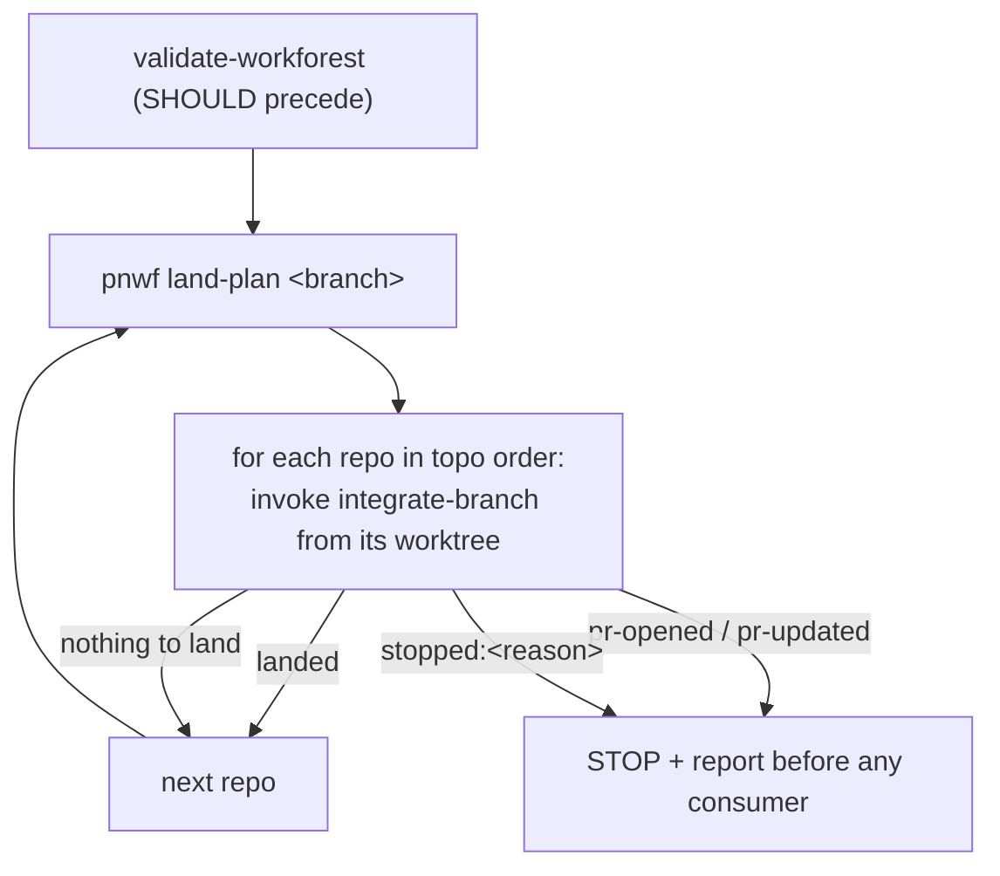

# land-workforest

**RUN FROM: inside the set** (`<workspace_root>/.workforests/<branch>`). Refuse
if `pnwf resolve` reports `in_workforest = false` (or exits non-zero) — **halt
and report**.

**Purpose.** Land the set's per-repo branches onto the local primary branches,
as a **best-effort ordered transaction**. This is a thin orchestrator over the
existing `integrate-branch` skill — it does NOT reimplement rebase, the
fast-forward-race retry cap, or strategy resolution; each repo's landing is
delegated to `integrate-branch`, which decides that repo's method
(`ff-merge-to-main` vs `pull-request`) itself.

**Disambiguation (MUST honor).** This lands a WHOLE coordinated SET — many
repos, in topological order. For a single branch/repo, call the
`integrate-branch` skill directly; this skill only adds the cross-repo **order**
and **stop-on-blocked transaction** semantics on top of it.

```mermaid
flowchart TD
    V["validate-workforest (SHOULD precede)"] --> P["pnwf land-plan &lt;branch&gt;"]
    P --> L["for each repo in topo order:\ninvoke integrate-branch from its worktree"]
    L -->|landed| N["next repo"]
    L -->|nothing to land| N
    L -->|pr-opened / pr-updated| S["STOP + report before any consumer"]
    L -->|stopped:&lt;reason&gt;| S
    N --> P
```

## No per-repo subagent fan-out (MUST NOT)

`pnwf` iterates repos in one process and landing is strictly ordered /
stop-on-blocked. Do NOT parallelize per-repo landing across subagents — it would
break the ordered-transaction guarantee and cause shared-build contention.

## Preconditions (MUST)

- No uncommitted changes anywhere in the set (run `validate-workforest` first;
  it SHOULD immediately precede landing).
- For `ff-merge-to-main` repos, the canonical clone MUST be on its primary branch
  and clean — `integrate-branch`'s FF-0a halts otherwise (R-3/R-8). Run
  `pnwf status <branch>` (or `pnwf land-plan`) up front; it pre-flights and
  reports canonical anomalies before you start. (`pull-request` repos do not
  require this — PR-0a surfaces but does not halt; PR-0b still blocks on a dirty
  `<WT>`, matching `ff-merge-to-main`'s FF-0b, so the no-uncommitted-changes
  precondition above applies to both strategies.)

## Steps

1. **Location guard + plan.** `pnwf resolve` (require in-set). Then
   `pnwf land-plan <branch>` yields the topo-ordered repos **still needing
   landing** (it uses `[ -e <setdir>/<member> ]` worktree presence, so repos an
   earlier landing already removed are skipped; subset sets enumerate from the
   set's own lock). Any non-zero `pnwf` exit → halt and report.
2. **Land each repo in order (MUST be topological).** For each repo the plan
   lists, `cd` into that repo's worktree and **invoke the `integrate-branch`
   skill** (an agent action via the Skill tool — NOT a shell command). MUST NOT
   land a repo ahead of a dependency it consumes. Handle the full outcome
   vocabulary:
   - **`landed`** → continue to the next repo.
   - **"nothing to land"** (0 commits ahead of primary) → continue.
   - **`pr-opened` / `pr-updated`** → this repo's change is now on a PR, **not**
     on the local primary. Any consumer of it would pin a stale sibling.
     **STOP and report** before landing any consumer.
   - **`stopped:<reason>`** (e.g. `stopped:rebase-conflict`,
     `stopped:ambiguous-remote`, `stopped:no-pr-host`, or a persistent ff-race)
     → **STOP and report**. Do NOT continue to later repos.
3. **Resume.** `integrate-branch`'s `ff-merge-to-main` handler (FF-4) removes a
   landed repo's worktree + branch, so a re-run's `pnwf land-plan` skips it. A
   `pull-request` repo keeps its worktree — re-running is idempotent (PR-2
   updates the existing PR), not skipped.

## Operator report on any stop (MUST)

On any stop, emit `pnwf status <branch>` — a per-repo table (landed / blocked +
reason / kept + why / not-started) — and map each `stopped:<reason>` to a next
action:

- `rebase-conflict` → the rebase STARTED and stopped mid-way, so a conflict really
  is there: resolve it in `<set>/<repo>`, then re-run land-workforest.
- `worktree-dirty` → `<set>/<repo>` has uncommitted changes. For `ff-merge-to-main`
  repos this is caught by `integrate-branch`'s FF-0b **before** it rebased; for
  `pull-request` repos it is caught by the `pull-request` handler's PR-0b
  **before** it pushed. Either way nothing is mid-rebase and nothing has been
  pushed, so `git rebase --continue` / `--abort` do **not** apply. Commit or
  stash there, then re-run land-workforest. This is the no-uncommitted-changes
  precondition above, caught at land time rather than by `validate-workforest` —
  expect it whenever a parked bead reaches landing with work deliberately left
  uncommitted.
- `rebase-in-progress` → a rebase was ALREADY running in `<set>/<repo>` before
  landing began — someone else's unfinished rebase, not one this landing caused.
  Finish it or abort it **in that worktree**, then re-run land-workforest.
- `rebase-refused` → `git rebase` exited non-zero having started nothing, for a
  cause FF-0b does not enumerate. There is nothing to resolve and nothing to
  continue; relay the handler's verbatim git message, which names the cause, and let
  the operator disposition it before re-running.
- `rebase-indeterminate` → the rebase failed and the rebase-in-progress observable
  could not be read, so `integrate-branch` asserted no recovery. Surface its quoted
  git and probe output and let the operator inspect `<set>/<repo>`.
- canonical off-primary/dirty → point the operator at the pn-workspace-rules
  Asymmetric-defer / Tier-R guidance; do **not** tell them to reset the canonical.
- ff-race → re-run once concurrent landings settle.
- `push-non-fast-forward` → the `pull-request` handler's PR-1 pushed
  `<set>/<repo>`'s branch and a peer had already advanced the same remote branch
  (the case `/drain-beads` calls TRANSIENT for a shared `drain/<id>` branch).
  PR-1 already retries this itself — rebase onto the updated remote branch,
  re-push with `--force-with-lease` — up to its own cap, so this reason only
  reaches you after the **second** consecutive rejection. Re-run land-workforest
  once the remote settles; a persistent race warrants asking whoever else is
  pushing that branch to stop.
- `push-auth-failed` → PR-1's push was rejected on credentials or access, not on
  ref state, so retrying would not help. Fix credentials/access for
  `<set>/<repo>`'s remote, then re-run land-workforest.
- `push-failed` → an unspecified push failure; the handler deliberately asserts
  no cause (do not invent one on its behalf). Read its quoted git message for
  `<set>/<repo>` and disposition it yourself before re-running land-workforest.

The four non-conflict rebase reasons above MUST NOT be relayed as
`rebase-conflict`. Each has a different next action, and only `rebase-conflict` has
anything to resolve — telling an operator to resolve a conflict that does not exist
sends them hunting, and the `git rebase --continue` it implies exits 128.

## Re-validation

`validate-workforest` is a pre-rebase snapshot; `integrate-branch`'s FF-1 rebases
onto the _current_ primary at land time. So validate SHOULD immediately precede
this stage. The post-land recheck is a `pn workspace build` on the canonical
primary (the set is dismantled as repos land).

## Frontmatter constraint: never set `disable-model-invocation`

This stage MUST NOT carry `disable-model-invocation` in its frontmatter. The flag
is enforced against the `Skill` tool and also drops the entry from the
model-visible skill listing, so setting it makes this stage unreachable by the
two things that actually reach it: the `Fires on:` prose triggers declared in its
own `description` above, and the orchestrators that dispatch it as a pipeline
stage (`/pn-workspace-sync` and `/pn-workspace-update` steps 3-4, and
`/drain-beads` for the fork stage).

It was set here once as an always-on-listing token saving and reverted for
exactly this reason (bd `pg2-dytfv`; the sibling case in `integrate-branch`'s two
landing handlers is bd `pg2-okzl0`). A stage skill earns its listing cost by
being auto-triggerable; if that cost is ever revisited, cut the `description`
down rather than blocking invocation.
