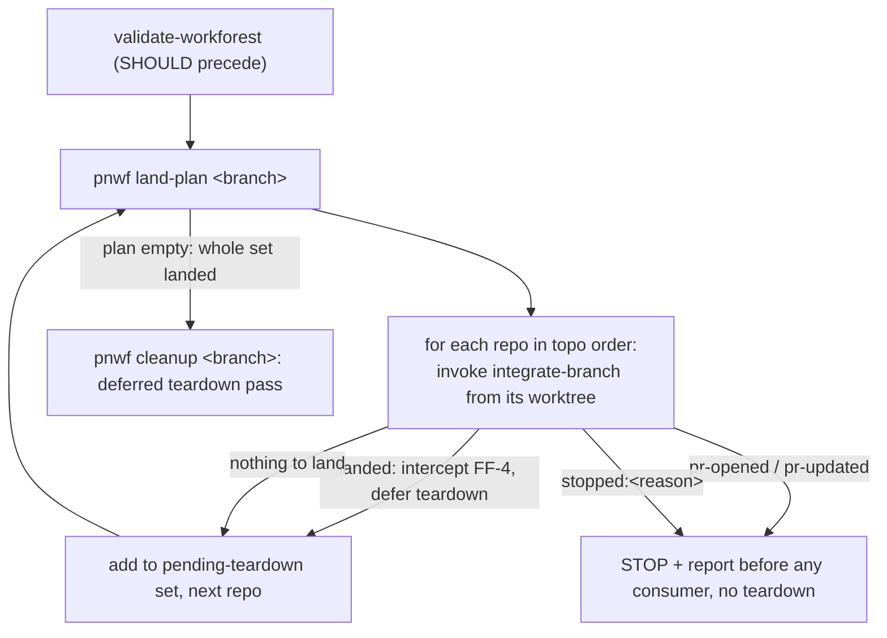

# land-workforest

**RUN FROM: inside the set** (`<workspace_root>/.workforests/<branch>`). Refuse
if `pnwf resolve` reports `in_workforest = false` (or exits non-zero) — **halt
and report**.

**Purpose.** Land the set's per-repo branches onto the local primary branches,
as a **best-effort ordered transaction**, in **two passes**: land + gate every
member first, then tear down what landed only once the whole set has cleared
its own gates. This is a thin orchestrator over the existing `integrate-branch`
skill — it does NOT reimplement rebase, the fast-forward-race retry cap, or
strategy resolution; each repo's landing is delegated to `integrate-branch`,
which decides that repo's method (`ff-merge-to-main` vs `pull-request`) itself.

**Disambiguation (MUST honor).** This lands a WHOLE coordinated SET — many
repos, in topological order. For a single branch/repo, call the
`integrate-branch` skill directly; this skill only adds the cross-repo **order**
and **stop-on-blocked transaction** semantics on top of it.

**Why two passes (MUST — bd `pg2-fxj57`).** `ff-merge-to-main`'s FF-4 tears down
a landed member's worktree + branch **immediately**, inside the same
invocation that merged it — before any later set member's own land-time gate
(FF-1b's `prek` diff-check, or FF-2a's `nix flake check`) has run. A workforest
set can have a cross-repo **filesystem** dependency between members — e.g. a
gitignored dev symlink from one member into a sibling's set-worktree, created
by a `pn-workspace.toml` post-clone/post-rebase hook — that the earlier
member's own FF-4 breaks out from under the not-yet-landed sibling
(`replacement directory ... does not exist`), because FF-4 has no way to know
another member still needs that worktree. Landing in **topological** order
does not fix this: the dependency direction for landing and the filesystem
dependency direction are often the SAME (the producer must land, and be
readable on disk, before the consumer's own gate runs), so by the time the
consumer's real gate runs, the producer's worktree — if torn down immediately —
is already gone. The fix is to separate "land + gate" from "tear down": defer
EVERY teardown until the whole plan is clear, then run it as one final,
best-effort pass.


```mermaid
flowchart TD
    V["validate-workforest (SHOULD precede)"] --> P["pnwf land-plan &lt;branch&gt;"]
    P --> L["for each repo in topo order:\ninvoke integrate-branch from its worktree"]
    L -->|"landed: intercept FF-4, defer teardown"| N["add to pending-teardown set, next repo"]
    L -->|"nothing to land"| N
    L -->|"pr-opened / pr-updated"| S["STOP + report before any consumer, no teardown"]
    L -->|"stopped:&lt;reason&gt;"| S
    N --> P
    P -->|"plan empty: whole set landed"| T["pnwf cleanup &lt;branch&gt;: deferred teardown pass"]
```

## No per-repo subagent fan-out (MUST NOT)

`pnwf` iterates repos in one process and landing is strictly ordered /
stop-on-blocked. Do NOT parallelize per-repo landing across subagents — it would
break the ordered-transaction guarantee and cause shared-build contention.

## Preconditions (MUST)

- No uncommitted changes anywhere in the set (run `validate-workforest` first;
  it SHOULD immediately precede landing).
- For `ff-merge-to-main` repos, the canonical clone MUST be on its primary branch
  and clean — `integrate-branch`'s FF-0a halts otherwise (R-3/R-8). Run
  `pnwf status <branch>` (or `pnwf land-plan`) up front; it pre-flights and
  reports canonical anomalies before you start. (`pull-request` repos do not
  require this — PR-0a surfaces but does not halt; PR-0b still blocks on a dirty
  `<WT>`, matching `ff-merge-to-main`'s FF-0b, so the no-uncommitted-changes
  precondition above applies to both strategies.)

## Steps

1. **Location guard + plan.** `pnwf resolve` (require in-set). Then
   `pnwf land-plan <branch>` yields the topo-ordered repos **still needing
   landing**: a member with an absent worktree is skipped outright (a prior
   `pnwf cleanup`/`cleanup-workforest` already finished it), and every member
   whose worktree IS present is still only included if its branch is **not**
   an ancestor of its primary (`git merge-base --is-ancestor`) — so a
   landed-but-pending-teardown member (worktree present, already merged) is
   correctly excluded too, exactly like a fully-torn-down one; subset sets
   enumerate from the set's own lock. Any non-zero `pnwf` exit → halt and
   report.
2. **Land each repo in order (MUST be topological).** For each repo the plan
   lists, `cd` into that repo's worktree and **invoke the
   `integrate-branch:integrate-branch` skill** (an agent action via the Skill
   tool — NOT a shell command). MUST NOT
   land a repo ahead of a dependency it consumes.

   **FF-4 interception (MUST).** When the resolved strategy for this repo is
   `ff-merge-to-main`, its handler tears down `<WT>`'s worktree and branch
   (FF-4's `wtdone`) unconditionally, immediately after FF-2b's merge succeeds
   — inside this same invocation. **Do not let FF-4 run in this call.** As you
   carry out the invocation, when the handler's flow would reach FF-4 (right
   after a successful FF-2b), stop there instead of executing FF-4's
   `cd`/`wtdone` commands: the merge onto this repo's primary has genuinely
   happened, but `<WT>` and `<FB>` are deliberately left in place. Add the repo
   to a **pending-teardown set** and continue the loop with the next repo.
   (`pull-request` outcomes need no interception — that handler never runs
   FF-4; it already keeps the worktree, and `pnwf cleanup`/`cleanup-workforest`
   already knows to keep it too.)

   Handle the full outcome vocabulary:
   - **`landed`** → add the repo to the pending-teardown set (per the
     interception above), continue to the next repo.
   - **"nothing to land"** (0 commits ahead of primary) → continue. Nothing to
     add: either this repo was never landed in this run, or it was landed in
     an earlier, interrupted run and is already sitting in
     landed-but-pending-teardown state (see Resume below) — either way there
     is nothing further for THIS step to do with it.
   - **`pr-opened` / `pr-updated`** → this repo's change is now on a PR, **not**
     on the local primary. Any consumer of it would pin a stale sibling.
     **STOP and report** before landing any consumer. Do NOT run step 3 (the
     deferred teardown pass) — the transaction did not complete.
   - **`stopped:<reason>`** (e.g. `stopped:rebase-conflict`,
     `stopped:ambiguous-remote`, `stopped:no-pr-host`, or a persistent ff-race)
     → **STOP and report**. Do NOT continue to later repos, and do NOT run
     step 3 — see "Partial-block policy" below.

3. **Deferred teardown pass (MUST run only once the whole plan is clear).**
   Reached only when step 2 processed every repo `pnwf land-plan` listed with
   no `stopped:<reason>` / `pr-opened` / `pr-updated` disposition. Re-run
   `pnwf land-plan <branch>` once more first, to confirm nothing newly needs
   landing (a concurrent peer may have advanced a member mid-loop, per R-7).
   If it now prints nothing, run:

   ```bash
   pnwf cleanup <branch>
   ```

   This is the exact deterministic teardown the `cleanup-workforest` skill
   wraps — its landed-test is "branch absent, OR `git merge-base
--is-ancestor <branch> <primary>` exits 0" (never worktree-absence), so it
   correctly removes a member that is landed but still has its worktree
   present, via the same guarded `wtdone` FF-4 itself would have called. Do
   NOT hand-roll FF-4's `cd`/`wtdone` sequence again here — reuse this
   existing, already-correct, best-effort mechanism instead of reimplementing
   it. It processes every member in the set (not just this run's
   pending-teardown set), so it also sweeps up anything left
   landed-but-pending-teardown by an earlier, interrupted run of this same
   procedure. Report its output; a kept `pull-request` or genuinely-unlanded
   member is expected, not an error (see `cleanup-workforest`).

   If the re-run of `pnwf land-plan` is NOT empty, do not run `pnwf cleanup` —
   return to step 2 and land the newly-listed member(s) first.

4. **Resume.** Because FF-4's teardown is now deferred to step 3, a landed
   repo's worktree and branch are NOT necessarily gone when you resume — they
   persist until step 3 actually runs. `pnwf land-plan`'s re-run still
   correctly SKIPS an already-landed repo on resume regardless: it classifies
   "still needs landing" by `git merge-base --is-ancestor <branch> <primary>`,
   never by worktree presence, so a landed-but-pending-teardown repo (worktree
   present, branch already an ancestor of primary) is excluded from the plan
   exactly like a fully-torn-down one — `integrate-branch`'s own Step 2 would
   likewise report "nothing to land" (`AHEAD == 0`) if invoked on it directly,
   so re-listing it is always a safe no-op even though it isn't expected. A
   `pull-request` repo keeps its worktree — re-running is idempotent (PR-2
   updates the existing PR), not skipped.

## Partial-block policy: defer, don't try to prove independence (MUST)

The decided fix (bd `pg2-fxj57`) allows a finer-grained alternative for a
partially-blocked set: tear down only the members that landed AND have no
still-active sibling depending on their worktree filesystem-wise. This skill
does **not** implement that finer grain — it has no generic signal for "which
sibling depends on which member's worktree filesystem-wise" (that is exactly
the kind of repo-specific, gitignored, dev-convenience symlink this bug was
filed over, and it is not declared anywhere `pnwf` or `integrate-branch` can
read) — so it always takes the conservative branch: while any set member still
needs landing (`pnwf land-plan` non-empty) or the last attempt ended in
`stopped:<reason>` / `pr-opened` / `pr-updated`, **every** already-landed
member's worktree stays exactly as FF-4 interception left it, for as long as
that takes to resolve. Step 3 only ever runs once `pnwf land-plan` reports the
whole plan clear. Do not invoke `cleanup-workforest` (or `pnwf cleanup`)
yourself as a shortcut while the transaction is still blocked — its own
landed-test has the same blind spot (it cannot see cross-member filesystem
dependencies either) and would happily tear down an already-landed member
while a still-blocked sibling depends on it, reintroducing this exact race at
a different call site.

## Operator report on any stop (MUST)

On any stop, emit `pnwf status <branch>` — a per-repo table (landed / blocked +
reason / kept + why / not-started) — and map each `stopped:<reason>` to a next
action:

**Caveat on `not-started` (post-FF-4-interception).** `pnwf status`'s
`not-started` label ("worktree present, clean, no commits ahead of primary
yet") cannot, by itself, distinguish a repo with genuinely no work yet from
one that landed-but-is-pending-teardown from THIS or an earlier run: a
fast-forward merge leaves a branch exactly equal to (an ancestor of) primary,
which is the same zero-commits-ahead signal a never-touched branch shows once
teardown is deferred. Cross-check against `pnwf land-plan`'s output before
reporting: a member `pnwf status` calls `not-started` that is ALSO absent
from `pnwf land-plan`'s list has already landed and is simply waiting on step
3's deferred teardown pass — report it as such, not as "nothing done here
yet."

- `rebase-conflict` → the rebase STARTED and stopped mid-way, so a conflict really
  is there: resolve it in `<set>/<repo>`, then re-run land-workforest.
- `worktree-dirty` → `<set>/<repo>` has uncommitted changes. For `ff-merge-to-main`
  repos this is caught by `integrate-branch`'s FF-0b **before** it rebased; for
  `pull-request` repos it is caught by the `pull-request` handler's PR-0b
  **before** it pushed. Either way nothing is mid-rebase and nothing has been
  pushed, so `git rebase --continue` / `--abort` do **not** apply. Commit or
  stash there, then re-run land-workforest. This is the no-uncommitted-changes
  precondition above, caught at land time rather than by `validate-workforest` —
  expect it whenever a parked bead reaches landing with work deliberately left
  uncommitted.
- `rebase-in-progress` → a rebase was ALREADY running in `<set>/<repo>` before
  landing began — someone else's unfinished rebase, not one this landing caused.
  Finish it or abort it **in that worktree**, then re-run land-workforest.
- `rebase-refused` → `git rebase` exited non-zero having started nothing, for a
  cause FF-0b does not enumerate. There is nothing to resolve and nothing to
  continue; relay the handler's verbatim git message, which names the cause, and let
  the operator disposition it before re-running.
- `rebase-indeterminate` → the rebase failed and the rebase-in-progress observable
  could not be read, so `integrate-branch` asserted no recovery. Surface its quoted
  git and probe output and let the operator inspect `<set>/<repo>`.
- canonical off-primary/dirty → point the operator at the pn-workspace-rules
  Asymmetric-defer / Tier-R guidance; do **not** tell them to reset the canonical.
- ff-race → re-run once concurrent landings settle.
- `push-non-fast-forward` → the `pull-request` handler's PR-1 pushed
  `<set>/<repo>`'s branch and a peer had already advanced the same remote branch
  (the case `/drain-beads` calls TRANSIENT for a shared `drain/<id>` branch).
  PR-1 already retries this itself — rebase onto the updated remote branch,
  re-push with `--force-with-lease` — up to its own cap, so this reason only
  reaches you after the **second** consecutive rejection. Re-run land-workforest
  once the remote settles; a persistent race warrants asking whoever else is
  pushing that branch to stop.
- `push-auth-failed` → PR-1's push was rejected on credentials or access, not on
  ref state, so retrying would not help. Fix credentials/access for
  `<set>/<repo>`'s remote, then re-run land-workforest.
- `push-failed` → an unspecified push failure; the handler deliberately asserts
  no cause (do not invent one on its behalf). Read its quoted git message for
  `<set>/<repo>` and disposition it yourself before re-running land-workforest.

The four non-conflict rebase reasons above MUST NOT be relayed as
`rebase-conflict`. Each has a different next action, and only `rebase-conflict` has
anything to resolve — telling an operator to resolve a conflict that does not exist
sends them hunting, and the `git rebase --continue` it implies exits 128.

## Re-validation

`validate-workforest` is a pre-rebase snapshot; `integrate-branch`'s FF-1 rebases
onto the _current_ primary at land time. So validate SHOULD immediately precede
this stage. The post-land recheck is a `pn workspace build` on the canonical
primary — the merges (FF-2b, per repo) have already landed onto each
canonical primary by the time step 2 finishes, even though the set's
worktrees themselves are not dismantled until step 3's deferred teardown pass
runs (or, if step 2 stopped instead, until a later run finishes the whole
plan and reaches step 3 — see "Partial-block policy" above).

## Frontmatter constraint: never set `disable-model-invocation`

This stage MUST NOT carry `disable-model-invocation` in its frontmatter. The flag
is enforced against the `Skill` tool and also drops the entry from the
model-visible skill listing, so setting it makes this stage unreachable by the
two things that actually reach it: the `Fires on:` prose triggers declared in its
own `description` above, and the orchestrators that dispatch it as a pipeline
stage (`/pn-workspace-sync` and `/pn-workspace-update` steps 3-4, and
`/drain-beads` for the fork stage).

It was set here once as an always-on-listing token saving and reverted for
exactly this reason (bd `pg2-dytfv`; the sibling case in `integrate-branch`'s two
landing handlers is bd `pg2-okzl0`). A stage skill earns its listing cost by
being auto-triggerable; if that cost is ever revisited, cut the `description`
down rather than blocking invocation.
