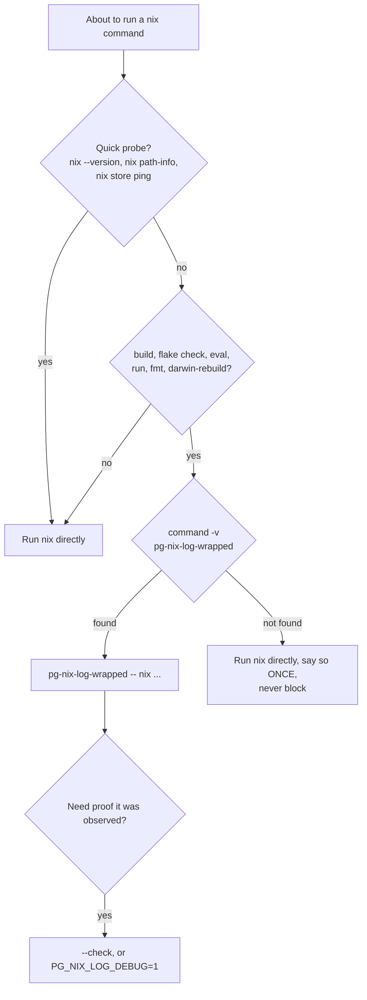

# pg-nix-log-wrapped

`pg-nix-log-wrapped` is a **Proxy** at process level in front of `nix` / `darwin-rebuild`. It runs
the command **unchanged** (inherited stdio, same exit code), tails nix's `--json-log-path` activity
stream, and exports it as OpenTelemetry spans and metrics to the local collector. It is built to
**fail open**: any setup problem, or no endpoint resolved, and it just `exec`s the command, with
nothing extra on stderr. Using it is therefore safe; not using it only loses visibility.

The tool is **always built and installed to emit**; whether a given system emits is a **runtime**
per-system setting in `~/.config/pn/telemetry.toml` (`enabled`, `endpoint`, `wrapper_path`; ADR 0028
"Amendment 2026-10-08"). Telemetry MAY be off on a given system (`enabled = false`): the wrapper is
still installed and still safe to use, it simply execs CMD with no output. Agents do not need to
know which; always use the wrapper when it is on `PATH`.

Reference for the details below: `modules/pg-nix-log-wrapped/README.md` and ADR 0030
(`docs/adr/0030-pg-nix-log-wrapped.md`) in phillipg-nix-repo-base.

## Decision flow



## What to wrap, and what is exempt

| Run through the wrapper (MUST)                                                  | Run directly (MAY)                                                                                              |
| ------------------------------------------------------------------------------- | --------------------------------------------------------------------------------------------------------------- |
| `nix build`, `nix flake check`, `nix eval`, `nix run`, `nix fmt`                | `nix --version`                                                                                                 |
| `darwin-rebuild build` (a build-only run; `switch` is operator-only, see below) | `nix path-info`, `nix store ping` (quick probes)                                                                |
| `nixos-rebuild` on a machine that has it                                        | Any nix command not named in the left column (for example `nix flake show`, `nix-store`, `nix-collect-garbage`) |

- Agents MUST run the left-column commands through the wrapper.
- Quick probes are exempt: they are short, and a span per probe is noise. An agent MUST NOT wrap
  them just to be thorough.
- Agents MUST NOT wrap `pn` or `pnwf` themselves. `pn workspace build|apply|flake-check|...` already
  rewrites its own `nix` / `darwin-rebuild` calls to go through the wrapper and parents them under
  its own trace; wrapping `pn` adds nothing.

## Invocation

```bash
pg-nix-log-wrapped -- nix flake check
pg-nix-log-wrapped -- nix build .#some-package
pg-nix-log-wrapped -- darwin-rebuild build --flake .
```

Synopsis (from `--help`):

```text
pg-nix-log-wrapped [--traceparent TP] [--otlp-endpoint URL] [--log-dir DIR] [--] CMD ARGS...
pg-nix-log-wrapped --check [--otlp-endpoint URL] [--log-dir DIR]
```

- Agents SHOULD put `--` before CMD. Wrapper flags stop at the first `--` or the first non-flag
  argument; everything after is CMD's, untouched. A flag the wrapper does not know, placed before
  CMD, is a usage error (exit 2), not a CMD argument.
- CMD is looked up on `PATH`, skipping the wrapper's own file, so a `PATH` shadow cannot recurse.
  A missing CMD exits 127; a non-executable one exits 126.
- CMD's stdout and stderr are inherited, never copied. Piping the output (`| tail`, `| tee`) behaves
  exactly as without the wrapper. CMD's exit code is the wrapper's exit code (`128+n` when CMD dies
  of signal `n`).
- Timeouts still apply. The wrapper does not make a nix run shorter. A long run MUST still use the
  caller's explicit timeout or `run_in_background`; the wrapper only records it.
- Where the endpoint comes from (non-root): `--otlp-endpoint`; then `enabled = false` in
  `~/.config/pn/telemetry.toml` (off, even if an endpoint is set below); then
  `OTEL_EXPORTER_OTLP_ENDPOINT`; then `endpoint` in that file. Agents SHOULD NOT pass
  `--otlp-endpoint` by hand in the normal case; the home-manager `phillipgreenii.pn.telemetry`
  option renders that file on every system.
- Joining an existing trace: the wrapper reads `--traceparent`, else `TRACEPARENT`. A malformed
  value starts a fresh root trace.

### When the wrapper is absent

The wrapper is installed on every system that applies the repo-base `pn` home-manager module,
telemetry on or off. It can still be absent on a machine that has not yet applied that module. If
`command -v pg-nix-log-wrapped` fails:

- The agent MUST run nix directly, MUST say once in its report or message that the wrapper was
  absent (not once per command), and MUST NOT block, retry, or try to install it.
- A present wrapper with **no endpoint**, or on a system whose `telemetry.toml` says
  `enabled = false`, also does nothing (it execs CMD). That case is not an error either; use
  `--check` to see why.

### Under `sudo`

- Agents MUST NOT use `sudo` (global rule), and `darwin-rebuild switch` is operator-only. This
  section is for the operator or for `pn`, which handles it.
- `sudo` drops the environment. A root wrapper therefore reads **flags only**: no
  `OTEL_EXPORTER_OTLP_ENDPOINT`, no `TRACEPARENT`, never `~/.config/pn/telemetry.toml`. Without an
  explicit `--otlp-endpoint URL` a root run is a plain passthrough.
- A root wrapper ignores `--log-dir` and always logs to `/var/log/pg-nix-log-wrapped` (a
  root-owned, non-symlink directory, mode 0750; otherwise it fails open).
- Use the wrapper's absolute path under `sudo` rather than relying on `PATH` (this machine keeps
  the user `PATH` under `sudo`; others may not), or let `pn` do it. `pn` rewrites
  `sudo darwin-rebuild ...` into `sudo <resolved wrapper> --otlp-endpoint URL -- darwin-rebuild ...`.

## Escape hatches

| Control                       | Effect                                                                      |
| ----------------------------- | --------------------------------------------------------------------------- |
| `PG_NIX_LOG_DISABLE=1`        | exec CMD unmodified (`true` also works)                                     |
| `OTEL_SDK_DISABLED=true`      | exec CMD unmodified                                                         |
| no endpoint resolved          | exec CMD unmodified                                                         |
| `PG_NIX_LOG_DEBUG=1`          | print why the wrapper failed open (and OTel export errors) to stderr        |
| `PG_NIX_LOG_FLUSH_TIMEOUT=2s` | bound on the end-of-run export; a dead collector never costs more           |
| `--check`                     | print endpoint, reachability, log-dir writability; exit 0 only when healthy |
| `--min-substitute-span=250ms` | shortest substitution that still gets a span (they are always counted)      |
| `--help`, `-h`                | print usage, exit 0                                                         |

- Agents MAY set `PG_NIX_LOG_DISABLE=1` when the wrapper itself is the suspect (a run that behaves
  differently with it than without it). That is a bug in the wrapper: report it, do not leave it
  disabled silently.
- A **dead collector never breaks a run**: export is asynchronous (16384-span queue), the final
  flush is bounded, and data is dropped rather than blocking.

## `--check`

```text
$ pg-nix-log-wrapped --check
endpoint: http://127.0.0.1:4318 (from file)
reachable: yes
log-dir: /Users/phillipg/.local/state/pn/nix-logs (writable: yes)
```

- Exit 0 only when telemetry would actually run. Exit 1 for any of: telemetry disabled by env,
  no endpoint resolved, endpoint not reachable (a 2-second TCP dial), or log directory not writable.
- The `(from flag|env|file)` suffix names the source of the endpoint.
- `--check` is the detector for a silent fail-open misconfiguration, because a failed-open run prints
  nothing. Run it when asked "is telemetry working", or after a run that produced no data.
- Reachability is a TCP probe of the OTLP/HTTP port. It does not prove the collector forwards to
  Tempo and Prometheus.

## Where the data goes

Every observed run keeps its raw nix JSONL at `<log-dir>/<utc-ts>-<pid>-<rand>.jsonl` (mode 0600).
Non-root default: `$XDG_STATE_HOME/pn/nix-logs`, else `~/.local/state/pn/nix-logs`. Root:
`/var/log/pg-nix-log-wrapped` (read with `sudo` or as an admin-group member). Each start sweeps its
own directory only: files older than 7 days go first, then oldest-first until under 2 GiB. A file
stops being ingested at 256 MiB (`nix.log.truncated`). A new file appearing in that directory right
after a run is the quickest evidence the wrapper observed it.

| Signal | Name                      | Notes                                                                                                                                                                                      |
| ------ | ------------------------- | ------------------------------------------------------------------------------------------------------------------------------------------------------------------------------------------ |
| span   | `nix.invocation`          | one per wrapped run; `command`, `process.exit.code`, `nix.plan.build`, `nix.plan.fetch`, `nix.tailer.lag`, `nix.log.file`; `error.type = nonzero_exit` and error status on a non-zero exit |
| span   | `nix.build`               | one per derivation; `nix.drv.name`; error status and `error.type` on failure                                                                                                               |
| span   | `nix.substitute`          | `server.address`; only when at least 250 ms (always counted in metrics)                                                                                                                    |
| span   | `nix.build.wait`          | waiting for a lock held by another client                                                                                                                                                  |
| metric | `nix.derivations`         | counter, `outcome` = `built` / `substituted` / `failed`                                                                                                                                    |
| metric | `nix.build.duration`      | histogram, unit seconds, `status` = `ok` / `error`                                                                                                                                         |
| metric | `nix.invocation.duration` | histogram, unit seconds, `command`, `status` = `ok` / `error`                                                                                                                              |

Resource `service.name` is `pg-nix-log-wrapped` (set in code). `pn`'s own spans use `pn`.

Limits that are real and MUST NOT be papered over:

- **Spans appear at the end of the run**, not live. Builds are held until the invocation ends, so
  an in-progress run cannot be inspected in Tempo; read the raw JSONL file for that.
- **Derivation names are span attributes only**, never metric labels. "Which derivation was slow"
  is a Tempo question; Prometheus only answers "how many / how long overall".
- The `built` count includes trivial always-local derivations (wrapper scripts, generations), so it
  over-states "built from source".
- Metrics use **delta** temporality (the process is short-lived and exports once). Use
  `increase()` / `rate()`, never a raw series value or `_count` / `_sum` on their own, because
  accumulated values reset whenever the collector restarts.

## Where to look: Tempo (TraceQL)

Tempo is local (`http://127.0.0.1:3200` on this machine; its search window is 7 days). In Grafana,
use Explore with the Tempo data source and the TraceQL editor. The first two recipes are the
ADR 0028 ones (verified against Tempo 2.10.5); the duration and error filters are standard TraceQL
that this skill's author did NOT run against a live Tempo, so treat them as starting points.

```text
{ resource.service.name = "pg-nix-log-wrapped" && name = "nix.build" }
```

```text
{ name = "pn.verb" } >> { name = "pn.repo" } >> { name = "pn.exec" } >> { name = "nix.invocation" } >> { name = "nix.build" || name = "nix.substitute" }
```

Slow or failed runs (starting points):

```text
{ resource.service.name = "pg-nix-log-wrapped" && name = "nix.invocation" && duration > 5m }
{ resource.service.name = "pg-nix-log-wrapped" && name = "nix.build" && duration > 2m }
{ resource.service.name = "pg-nix-log-wrapped" && name = "nix.invocation" && status = error }
{ resource.service.name = "pg-nix-log-wrapped" && name = "nix.build.wait" }
```

- Open the matching trace and read `nix.build` spans' `nix.drv.name` for which derivation was slow.
- `nix.build.wait` is time lost to a lock held by another client (a concurrent nix run).
- Tempo's search API rejects `spss` above 100 and rejects `| select(span:startTime, span:duration)`
  (a parse error in 2.10.5): the search results already carry start time and duration.

## Where to look: Prometheus (PromQL)

Prometheus receives the metrics through the collector. Names below are the ones the Phase 2 plan
derived from the collector's translation (dots become underscores, no unit suffix, a counter gets
no `_total`). **They were not re-queried against a live Prometheus when this skill was written**;
confirm with the metric browser in Grafana Explore if a query returns nothing.

```promql
# derivations built locally vs substituted from a cache, per hour
increase(nix_derivations{outcome="built"}[1h])
increase(nix_derivations{outcome="substituted"}[1h])

# failed derivations
increase(nix_derivations{outcome="failed"}[1d])

# p95 of a whole wrapped invocation, by command (nix, darwin-rebuild)
histogram_quantile(0.95, sum by (le, command) (rate(nix_invocation_duration_bucket[1h])))

# non-zero invocations
sum by (command) (increase(nix_invocation_duration_count{status="error"}[1d]))

# p95 of a single local derivation build
histogram_quantile(0.95, sum by (le) (rate(nix_build_duration_bucket[1h])))
```

Prometheus answers trends. For the one slow run an agent just made, go to Tempo.

## What this skill does not cover

- A Grafana dashboard for these metrics is built by a separate bead (`pg2-kqrrs.12`). This skill
  does not assume it exists or name its uid; look for it in Grafana rather than citing it.
- The workspace CLAUDE.md rule and the subagent-brief rule (a nix run in a brief gets the wrapper
  and a timeout) are a sibling bead (`pg2-kqrrs.11`), not part of this skill.
- An advisory hook in the tool approver is deferred to Phase 8 findings.
